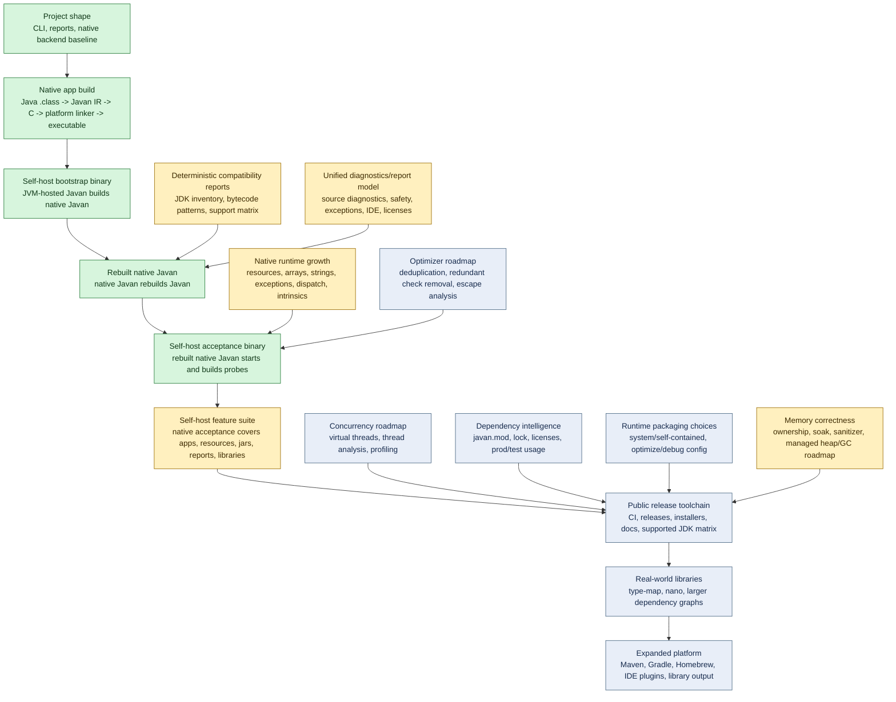

# Javan Roadmap Progress

Last updated: 2026-06-14

This page tracks verified progress toward a standalone native Javan release toolchain.
"Done" means locally verified for the stated scope, not full Java support for the broad
umbrella feature. "Implemented slice" means production behavior exists for the named
scope, with open acceptance criteria still tracked.

## Status Table

| Area | Status | Evidence / next check |
| --- | --- | --- |
| CLI and project detection baseline | Done | Existing CLI can run commands such as `version`, `inspect`, and `build` from the current project shape. |
| Native backend baseline | Done | JVM-hosted Javan can lower supported class files to IR, generate C, call the platform linker, and produce a native executable for a primitive app. |
| Self-host bootstrap binary | Done | JVM-hosted Javan can build a native Javan bootstrap binary. |
| Native bootstrap startup | Done | The native bootstrap binary can print version/toolchain information. |
| Rebuilt native Javan | Done | A native Javan binary can rebuild Javan itself from class files. |
| Self-host acceptance binary | Done | The rebuilt native Javan starts and is used for release acceptance. |
| Calm command surface | Implemented slice | `javan build` defaults to native app output, `--jar` keeps JVM jar output, `--library` builds native library packages, app args pass after `--`, and `--kind` stays as an advanced compatibility surface. Open gates remain for build-plugin configuration and broader artifact layout. |
| Binary-first distribution | Active direction | Core artifact is the standalone `javan` executable beside existing Java tools. Maven, Gradle, Homebrew, and IDE integration are thin consumers of the same binary. The JDK-like SDK wrapper is no longer a first-release target. |
| Maven/Gradle class-output discovery | Implemented slice | Javan now uses shared production class-output discovery and can find nested Maven `target/classes` and Gradle `build/classes/java/main` or Kotlin class outputs after the normal build. Explicit relative `--classes` paths resolve against the CLI working directory. |
| Unified report model | Implemented slice | `javan report` is the one calm report reader over existing `.javan/reports` files and emits Markdown/JSON summaries. Open gates remain for more diagnostic families and IDE-compatible source diagnostics. |
| Dependency and license reports | Missing | Roadmap now tracks `javan.mod`, `javan.lock`, prod/test separation, dependency usage, unused dependencies, licenses, mirrors, auth, and provenance. |
| Resource files in native builds | Implemented slice | Resources are supported as artifacts: jars include them, native app/library builds preserve them beside artifacts, stale generated resources are removed, and resource reports are written. Open gates remain for native Java resource APIs and embedded C resource tables. |
| Jar output beside native library output | Implemented slice | Jar, native app, and native library outputs are distinct supported outputs; library bindings live in language-specific folders while jar output remains first-class. Open gates remain for richer package manifests and cross-target library release details. |
| Memory/runtime correctness | Implemented slice | Runtime reports now state allocation ownership, partial safe-point mark/sweep for generated objects, object arrays, primitive arrays, runtime-owned strings, runtime containers, and owned container storage, heap metadata/accounting, type descriptors, static roots, local/parameter root frames, direct object-return roots, generated expression temporary root frames, panic-expression temporary roots, statement/label safe points, scoped allocator-path GC retry, deterministic allocation failure, export-wrapper byte-array roots, rooted native-library `String`/byte-array return exports, repeated native-library export/free sanitizer stress, heap-limited `string-growth-limit` reclamation, source-container rooting for list/map copy and view helpers, runtime UTF-8 string helper source rooting for substring, replace, char-array construction, copy, concat, StringBuilder append, path helper, array-copy helper, directory-stream helper, and export-copy allocation paths, map-growth publish-after-allocation safety, `realloc` heap-limit growth accounting, hostile receiver/array-load/runtime-string/nested-container/catch/live-root panic allocation stress, deterministic denial probes for string/list/map/path/read-file/directory-stream/process/array-copy/catch allocation families, panic-time root cleanup, panic-time `FILE*`/`DIR*` cleanup, explicit process-result stdout/stderr free ownership, registry growth partial-allocation cleanup, and sanitizer failure-signature rejection. Acceptance includes `memory-soak`, `static-root-inventory`, `string-static-root`, `root-frame-stack`, `gc-generated-object-graph`, `object-registry-gc`, `protected-object-return`, `operand-call-temporary-roots`, `large-arrays`, `primitive-array-gc`, `string-growth-limit`, `runtime-container-live-roots`, `runtime-list-reclaim`, `runtime-map-reclaim`, `runtime-optional-reclaim`, `runtime-iterator-reclaim`, `runtime-stringbuilder-reclaim`, `runtime-list-of-array-gc`, `runtime-list-copy-gc`, `runtime-map-copy-gc`, `runtime-map-values-gc`, `runtime-realloc-growth-fit`, `operand-call-receiver-temporary-root`, `operand-array-load-temporary-root`, `runtime-string-temporary-root`, `runtime-string-substring-source-root`, `runtime-string-replace-source-root`, `runtime-string-from-chars-source-root`, `runtime-string-char-array-copy-gc`, `runtime-stringbuilder-append-source-root`, `runtime-nested-container-reclaim`, `runtime-directory-stream-source-root`, `runtime-directory-stream-result-allocation-limit-panic`, `runtime-directory-stream-child-allocation-limit-panic`, `runtime-process-run-output-allocation-limit-panic`, `runtime-read-string-allocation-limit-panic`, `runtime-read-all-bytes-allocation-limit-panic`, `exception-catch-heap-pressure`, `exception-default-message-null`, `exception-default-panic`, `panic-string-concat-temporary-root`, `heap-limit-live-root-panic`, `allocation-path-gc`, `native-library`, `negative-array-length`, `allocation-limit-panic`, `string-allocation-limit-panic`, `exception-catch-allocation-limit-panic`, `runtime-list-allocation-limit-panic`, `runtime-map-allocation-limit-panic`, `runtime-path-allocation-limit-panic`, and `array-copy-allocation-limit-panic`; direct C runtime-boundary tests cover path/export/array-copy/directory-stream helper roots outside generated Java; full managed heap coverage, full string object/UTF-16 ownership, remaining hostile all-shape allocation stress, full Java exception semantics, thread roots, and Windows/release-footprint sanitizer gates remain open. |
| Runtime feature selection | Implemented reporting slice | Native builds now write runtime-footprint reports with host target, actual target, footprint statuses, and OS/ARCH coverage rows. CI is configured for Linux/macOS x64/aarch64 host-native checks. Open gates remain for self-contained packaging, `runtime.optimize`, debug/profiling selection, disabled modules, Windows, and real cross-linking. |
| Maven and Gradle integrations | Missing | Build plugins must call the installed/downloaded Javan binary after the normal Java build and consume the same reports. |
| JDK-like wrapper / SDK distribution | Deferred | Not a first-release target. Javan remains a standalone binary beside `javac`; optional SDK-style wrapping can be revisited only if plugins/IDE reports are not enough. |
| Supported JDK accounting | In progress | Compatibility docs and support matrix exist; remaining work is complete inventory coverage and explicit supported/rejected accounting per JDK feature. |
| Self-host warning debt | In progress | `javan check target/classes --main javan.Main` passes with 304 warnings after ignoring only unreachable javac-generated enum `valueOf(String)` boilerplate and still rejecting reachable enum `valueOf(String)` as `JAVAN015`. |
| Real-world projects: type-map and nano | Optional local probes | Probe scripts exist and can run when the source checkouts are present locally, but these projects are not release-gated native support yet. |
| CI, release, and installer readiness | In progress | CI and release packaging now define Linux x64, Linux aarch64, macOS aarch64, and macOS x64 host-native rows; old workflow-test artifacts are removed. Remaining work is remote validation, Windows/runtime porting, and installer/Homebrew path. |

## Self-Hosted Milestone Definition

The production milestone is not "Javan exists as a Java program." It is Javan building
Javan through Javan's own native backend:

1. A native Javan bootstrap binary is produced by Javan's own native backend.
2. That native Javan can build and run multiple supported Java test projects.
3. That native Javan can rebuild Javan itself from class files.
4. The rebuilt binary passes the same acceptance gates.
5. The path uses Javan's own bytecode -> IR -> C/native backend.

The core self-host chain is now locally verified. Internal release scripts still use
temporary bootstrap artifact names, but the release output is a single `javan` binary.
The self-host gate covers native app probes, resource distribution, native-library C ABI
smoke, negative test projects, jar output, and `javan report` under the rebuilt binary.

## Near-Term Milestones

| Milestone | Exit criteria |
| --- | --- |
| M1: self-host primitive app | Done: native Javan creates and runs supported app binaries. |
| M2: self-host Javan rebuild | Done: native Javan rebuilds Javan, and the rebuilt binary starts. |
| M3: self-host feature suite | Done locally: rebuilt native Javan covers native app probes, resource distribution, jar output, unified reports, native-library C ABI smoke, and negative test projects. |
| M4: clean user commands | Default commands auto-detect project type, main class, output name, target, resources, and dependencies. |
| M5: release packaging gate | Release workflow runs native self-host checks before packaging; CI currently runs Maven, acceptance, and self-host jar checks. |
