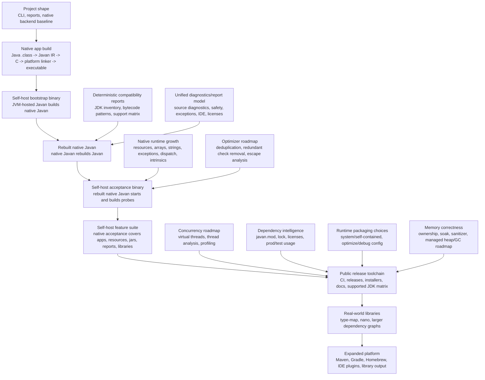

# Javan Roadmap Progress

Last updated: 2026-06-30

This page tracks verified progress toward a standalone native Javan release toolchain.
"Done" means implemented, tested, and release-gated for the stated scope, not full Java
support for the broad umbrella feature. "Partial" means production behavior exists for
the named subset, with unsupported reachable shapes rejected clearly.

## Roadmap Dashboard

Status words are exact. No colors, no mood lighting.

| Status | Meaning |
| --- | --- |
| Done | Implemented, tested, and release-gated for the stated scope. |
| Partial | Useful subset exists; unsupported reachable shapes fail clearly. |
| In progress | Production work is underway, but the release gate is not complete. |
| Planned | Wanted, specified, and not claimed as supported yet. |
| Blocked | Waiting on remote platform/tool validation or an external prerequisite. |
| Dismissed | Deliberately outside the native-support goal, except for narrower future variants. |

## Current Stats

| Measure | Current value | Meaning |
| --- | ---: | --- |
| Self-check reachable classes | 225 | Clean detached branch verification of `java -jar target/javan-2026.6.14.jar check target/classes --main javan.Main` on current branch Javan classes. |
| Self-check reachable methods | 2,563 | Same current-branch self-check. |
| Self-check diagnostics | 0 | Current Javan source shape is clean for reachable native self-build analysis. |
| Scenario ledger done | 108/108 | Named support scenarios with explicit pass/reject status. |
| Scenario ledger left | 0 | No named support scenario rows remain outside `pass`/`rejected`. |
| Exact supported JDK callables | 1032/267886 (0.3%) | Lower-bound callable-member coverage on the scanned JDK 25 image for members that already match the exact native support registry on the current branch baseline. |
| Exact explicit rejected JDK callables | 21215 | Deterministic callable-member rejects currently counted exactly from forbidden APIs, verifier-backed monitor/concurrency members, the deliberate `jdk.jfr.*` owner family, `sun.misc.Unsafe`, the exact `String` regex/formatter/text-normalization plus binary/charset/code-point family, the current exact `StringBuilder`, `StringBuffer`, plus `AbstractStringBuilder` char-sequence/string-buffer/code-point/stream/repeat family, the internal `StringLatin1`, `StringUTF16`, `StringConcatHelper`, plus `StringCoding` owner families including their nested helper classes, the internal `CharacterData*` owner family, the internal `ConditionalSpecialCasing`, `ConditionalSpecialCasing$Entry`, and `String$CaseInsensitiveComparator` owners, the full `java.util.regex.*` owner namespace, the full `java.util.function.*` owner namespace, the full `java.lang.module.*` owner namespace, the full `java.util.stream.*` owner namespace, the full `java.text.*` owner namespace, the full `java.util.zip.*` owner namespace, the full `java.time.format.*` owner namespace, the full `java.math.*` owner namespace, the full `java.nio.charset.*` owner namespace, the full `java.util.concurrent.atomic.*` owner namespace, the full `java.lang.foreign.*` owner namespace, the full `java.lang.invoke.*` owner namespace except the `StringConcatFactory*` bootstrap carve-out and invoke-package platform-throwable owners, the full `java.lang.classfile.*` owner namespace except platform-throwable owners, the full `java.security.*` owner namespace except `java.security.cert.*` and platform-throwable owners, the full `java.security.cert.*` owner namespace except platform-throwable owners, the full `java.time.chrono.*` owner namespace, the full `java.util.logging.*` owner namespace, the full `java.beans.*` owner namespace except platform-throwable owners, plus the full `java.util.concurrent.locks.*` owner namespace. |
| Exact done JDK callables | 22247/267886 (8.3%) | Lower-bound supported-plus-explicitly-rejected callable-member accounting on the scanned JDK 25 image for the current branch baseline. |
| Exact unknown JDK callables | 245639 | Callable members on the scanned JDK 25 image not yet counted as supported or explicitly rejected. |
| Exact supported JDK callables left | 266854 | Callables on the scanned JDK 25 image that are not yet in the exact supported callable ledger. |
| Flow-qualified rejected JDK call shapes | 0 | Separate diagnostic-shape ledger exists now; the current self-check profile has no such diagnostics. |
| Full first-JDK release gate | 0.0% | Inventory and exact supported callable counts exist, but supported/rejected/unknown accounting for the first release-gated JDK is still incomplete. |
| CI package target rows | 4 | Linux x64, Linux aarch64, macOS x64, macOS aarch64 are configured. |
| Remote release validation | 0/4 completed | Local macOS aarch64 passes; remote rows still must prove the same gates. |
| Native network positive support | 7 runtime rows | Address objects, blocking TCP client/server socket state, socket-derived stream I/O, plain HTTP client GET with string body, plain HTTP client POST with headers plus byte-array response handling, and plain HTTP client PUT with byte-array request/response handling are verified; TLS is still not claimed. |
| Native network rejection probes | 3 CLI probes | Unsupported socket/server-side HTTP shapes still fail clearly with runtime-module reports. |

Release accounting rule: a JDK or feature area is not "done" until
`supported + explicitly rejected + dismissed = total known variants`, with `unknown = 0`.

## Coverage Snapshot

| Measure | Done | Total | % | Meaning |
| --- | ---: | ---: | ---: | --- |
| Scenario rows fully passing | 108 | 108 | 100.0% | Named deterministic support scenarios implemented and tested. |
| Scenario rows implemented or scoped | 108 | 108 | 100.0% | Rows with working behavior or an explicit scoped subset. |
| Roadmap rows fully done | 3 | 38 | 7.9% | Big product rows release-gated for their stated scope. |
| Roadmap rows with implementation evidence | 25 | 38 | 65.8% | Rows marked `Done`, `Partial`, `In progress`, or `Blocked`. |
| Remote release rows proven | 0 | 4 | 0.0% | Configured Linux/macOS package rows passed on remote CI. |

## Active JDK Surface

Current active inventory: `JDK 25`

| JDK inventory item | Count | Native support claim today |
| --- | ---: | --- |
| modules | 84 | inventoried, not fully support-accounted |
| classes | 32,482 | inventoried, not fully support-accounted |
| fields | 118,632 | inventoried, not fully support-accounted |
| constructors | 35,209 | inventoried, not fully support-accounted |
| methods | 232,677 | inventoried, not fully support-accounted |

This inventory is complete for the scanned image. Exact supported callable-member
accounting now exists as a lower-bound progress signal, but full native
supported/rejected/unknown accounting is not complete yet.

## Recent Milestones

| Milestone | Status | Verified result |
| --- | --- | --- |
| M50: exact explicit rejection expansion v1 | Done | Added exact `String` regex/formatter/text-normalization rejects. |
| M51: exact explicit rejection expansion v2 | Done | Added exact `String` binary/charset/code-point rejects, moving explicit rejects to `5078`, done to `6110`, unknown to `261776`. |
| M52: exact explicit rejection expansion v3 | Done | Added exact `StringBuilder` char-sequence/string-buffer/code-point/stream/repeat rejects, moving explicit rejects to `5102`, done to `6134`, unknown to `261752`. |
| M53: exact explicit rejection expansion v4 | Done | Added exact `StringBuffer` char-sequence/string-buffer/code-point/stream/repeat rejects, moving explicit rejects to `5128`, done to `6160`, unknown to `261726`. |
| M54: exact explicit rejection expansion v5 | Done | Added exact `AbstractStringBuilder` bridge/code-point/stream/repeat rejects, moving explicit rejects to `5145`, done to `6177`, unknown to `261709`. |
| M55: exact explicit rejection expansion v6 | Done | Added internal `StringLatin1`, `StringUTF16`, `StringConcatHelper`, plus `StringCoding` owner-family rejects including nested helper classes, moving explicit rejects to `5398`, done to `6430`, unknown to `261456`. |
| M56: exact explicit rejection expansion v7 | Done | Added internal `CharacterData*` owner-family rejects, moving explicit rejects to `5660`, done to `6692`, unknown to `261194`. |
| M57: exact explicit rejection expansion v8 | Done | Added internal `ConditionalSpecialCasing` and `String$CaseInsensitiveComparator` owner rejects, moving explicit rejects to `5679`, done to `6711`, unknown to `261175`. |
| M58: exact explicit rejection expansion v9 | Done | Added internal `ConditionalSpecialCasing$Entry` owner rejects, moving explicit rejects to `5685`, done to `6717`, unknown to `261169`. |
| M59: exact explicit rejection expansion v10 | Done | Added `java.util.regex.Pattern*` and `java.util.regex.Matcher*` owner-family rejects, moving explicit rejects to `6031`, done to `7063`, unknown to `260823`. |
| M60: exact explicit rejection expansion v11 | Done | Added the remaining `java.util.regex.*` owner-family rejects, moving explicit rejects to `6145`, done to `7177`, unknown to `260709`. |
| M61: exact explicit rejection expansion v12 | Done | Added the full `java.util.function.*` owner namespace, moving explicit rejects to `6261`, done to `7293`, unknown to `260593`. |
| M62: exact explicit rejection expansion v13 | Done | Added the full `java.lang.module.*` owner namespace, moving explicit rejects to `6518`, done to `7550`, unknown to `260336`. |
| M63: exact explicit rejection expansion v14 | Done | Added the full `java.util.stream.*` owner namespace, moving explicit rejects to `9355`, done to `10387`, unknown to `257499`. |
| M64: exact explicit rejection expansion v15 | Done | Added the full `java.text.*` owner namespace, moving explicit rejects to `10342`, done to `11374`, unknown to `256512`. |
| M65: exact explicit rejection expansion v16 | Done | Added the full `java.util.zip.*` owner namespace, moving explicit rejects to `10820`, done to `11852`, unknown to `256034`. |
| M66: exact explicit rejection expansion v17 | Done | Added the full `java.time.format.*` owner namespace, moving explicit rejects to `11253`, done to `12285`, unknown to `255601`. |
| M67: exact explicit rejection expansion v18 | Done | Added the full `java.math.*` owner namespace, moving explicit rejects to `11739`, done to `12771`, unknown to `255115`. |
| M68: exact explicit rejection expansion v19 | Done | Added the full `java.nio.charset.*` owner namespace, moving explicit rejects to `11868`, done to `12900`, unknown to `254986`. |
| M69: exact explicit rejection expansion v20 | Done | Added the full `java.util.concurrent.atomic.*` owner namespace, moving explicit rejects to `12285`, done to `13317`, unknown to `254569`. |
| M70: exact explicit rejection expansion v21 | Done | Added the full `java.lang.foreign.*` owner namespace, moving explicit rejects to `12632`, done to `13664`, unknown to `254222`. |
| M71: exact explicit rejection expansion v22 | Done | Added the full `java.lang.invoke.*` owner namespace except the `StringConcatFactory*` bootstrap carve-out and invoke-package platform-throwable owners, moving explicit rejects to `15860`, done to `16892`, unknown to `250994`. |
| M72: exact explicit rejection expansion v23 | Done | Added the full `java.lang.classfile.*` owner namespace except platform-throwable owners, moving explicit rejects to `17164`, done to `18196`, unknown to `249690`. |
| M73: exact explicit rejection expansion v24 | Done | Added the full `java.security.*` owner namespace except `java.security.cert.*` and platform-throwable owners, moving explicit rejects to `18271`, done to `19303`, unknown to `248583`. |
| M74: exact explicit rejection expansion v25 | Done | Added the full `java.time.chrono.*` owner namespace, moving explicit rejects to `19147`, done to `20179`, unknown to `247707`. |
| M75: exact explicit rejection expansion v26 | Done | Added the full `java.security.cert.*` owner namespace except platform-throwable owners, moving explicit rejects to `19546`, done to `20578`, unknown to `247308`. |
| M76: exact explicit rejection expansion v27 | Done | Added the full `java.util.logging.*` owner namespace, moving explicit rejects to `19948`, done to `20980`, unknown to `246906`. |
| M77: exact explicit rejection expansion v28 | Done | Added the full `java.beans.*` owner namespace except platform-throwable owners, moving explicit rejects to `20844`, done to `21876`, unknown to `246010`. |
| M78: exact explicit rejection expansion v29 | Done | Added the full `java.util.concurrent.locks.*` owner namespace, moving explicit rejects to `21215`, done to `22247`, unknown to `245639`. |

## Honest Targets Today

| Project shape | Status | What works now | Main blockers left |
| --- | --- | --- | --- |
| Local standalone `javan` CLI surface | Done | CLI command surface, project detection, reports, native build path. | Remote release artifacts still need validation. |
| Small deterministic native apps | Partial | Supported bytecode/JDK subset can lower to C and link host-native binaries, including the current plain HTTP client loopback slices for GET/string, POST+headers/byte[], and PUT byte[]. | Full Java/JDK surface, threads, broader HTTP, TLS, full exception semantics. |
| Native libraries | Partial | C ABI, static/shared package layout, C/Rust/Go/Python bindings for primitives, `String`, `byte[]`, result/error ABI. | Rich object ABI, versioned package polish, cross-OS validation. |
| JVM jar output baseline | Done | `javan build --jar` preserves normal class/resource output and manifest main-class metadata beside native outputs. | Broader package polish. |
| Resources as artifacts | Partial | Resources are copied, packaged, and reported. | Native `ClassLoader.getResource*` and embedded resource tables. |
| Self-build | Partial | Native Javan can rebuild Javan locally and self-check is warning-free. | Remote package/release gate on every supported OS/ARCH. |
| Dependency/license reports | Partial | Classpath usage, local `javan.mod`, local Maven cache, lock, and license evidence. | Transitive/network resolution, GitHub packages, mirrors/auth, policy gates. |

## Critical Path

1. `Platform threads`: interrupted `Thread.sleep(long)` and `Thread.join()` now
   support the entry-interrupted single-thread same-method catch slice, direct
   `Thread.currentThread().start()`, direct `Thread.currentThread().join()`, and
   exact duplicate `Thread.start()` on the same local now fail at build time
   instead of reaching runtime panics, and live thread roots now flow through an
   explicit runtime registry instead of a current-thread special case. Verifier
   thread diagnostics now also write dedicated `threads.json` / `threads.md`
   artifacts and surface through unified `report.json` / `report.md` summaries.
   Current-thread identity, root-frame stacks, and native resource stacks are
   now host-thread-local with explicit `javan_thread_detach_current()` runtime
   cleanup, and runtime probes prove distinct host threads no longer alias one
   process-global current-thread slot. Shared allocation, object-registry,
   thread-root, and GC entry paths now also run behind a recursive runtime lock,
   and hostile runtime probes prove two host threads can attach, collect, and
   detach without leaking registered roots. `Thread.start()` now also bootstraps
   a real host thread, installs the started Java `Thread` object as that host
   thread's current-thread identity, and now returns before worker completion
   while `Thread.join()` waits through explicit completion signaling instead of
   fake inline execution or host-thread-handle leaks. Panic targets,
   source-context stacks, and last-error buffers are now also thread-local, and
   runtime probes prove recovered worker-thread diagnostics do not leak back
   into the main thread. Parent and started-worker runtime probes now also
   allocate and collect concurrently without losing current-thread roots or
   leaking active worker roots after `join()`, and the same parent/worker slice
   now also survives safepoint-triggered GC under `JAVAN_GC_SAFEPOINT_INTERVAL=1`.
   Recovered worker panic/last-error state is now also proven through the real
   `Thread.start()` path without leaking root-frame residue or diagnostics back
   into the main thread. Thread-root-registry growth beyond the initial capacity
   and blocked worker local-root preservation under parent-side collection are
   now both covered by deterministic runtime probes. Reachable direct
   `Thread.sleep(long)` and non-self `Thread.join()` sites now also surface as
   dedicated blocking-wait warnings in CLI output plus `threads.json` /
   `threads.md`, and the same report now counts reachable `Thread.start()`
   sites, reachable methods that start threads, reachable methods that block,
   per-method thread-activity entries, plus direct sleep/join wait shapes
   instead of flattening them into a single generic warning bucket. Those
   method entries now also surface lifecycle-risk, synchronization-risk, and
   concurrency-runtime-risk counts from the existing verifier diagnostics, plus
   a conservative `unknownBlockingMethods` aggregate derived from unsupported
   synchronization and concurrency-runtime shapes, plus an
   `unsupportedThreadTaskMethods` aggregate for methods still blocked by
   lifecycle/synchronization/concurrency-runtime gaps. The next thread-specific
   gate is virtual-thread scheduler/carrier runtime plus the remaining broader
   builder-object flows and profiling coverage, rather than more host-thread
   bootstrap groundwork.
2. `Virtual threads`: `Thread.startVirtualThread(Runnable)` plus the direct
   and exact single-local-alias `Thread.ofVirtual().start(Runnable)` entrypoint
   now lower through the host-thread runtime slice. `Thread.ofVirtual().unstarted(Runnable)`
   plus its exact single-local-alias builder form now also compile natively and
   preserve runnable targets for a later `Thread.start()`. Supported
   `Thread.ofVirtual().name(...)` builder flows now also compile natively for
   both `name(String)` and `name(String,long)`, including exact single-local-alias
   forms, discarded standalone `Thread.ofVirtual()` / `Thread.ofVirtual().name(...)`
   / `Thread.ofVirtual().factory()` expressions, discarded-return builder mutations
   on the same local builder alias,
   same-method prebuilt `Runnable` local aliases for `start(...)`,
   `unstarted(...)`, and `factory().newThread(...)`, reusable builder-name
   counters, deterministic factory snapshot naming, exact static helper
   wrappers around supported builder/factory flows including direct parameter
   pass-through into `name(String)` / `name(String,long)`, and later `Thread.start()`
   / `ThreadFactory.newThread(Runnable)` creation from the same runtime-backed
   builder or factory state. Exact same-method `Object` local alias round-trips
   back into supported builder/factory/executor terminal calls via `checkcast`
   now also compile natively. The same verified builder flows now also work when
   the call site is typed as the bridge owner `Thread.Builder` rather than only
   `Thread.Builder.OfVirtual`, and `Thread.getName()` returns deterministic
   runtime-backed thread names for the current supported slice.
   Returned/current thread objects now report truthful `Thread.isVirtual()`
   state, reachable task roots now flow through the existing thread-start
   ancestry analysis, supported executor APIs compile natively, base
   `ThreadLocal` storage works for the current host-thread-backed slice, and
   `LockSupport.park()/parkNanos(long)/parkUntil(long)/unpark(Thread)` now lower through the same runtime.
   Runtime-backed builder/factory/executor observation through
   `println(Object)`, `toString()`, `hashCode()`, `equals()`, and
   `getClass().getName()` now also compiles natively for the current supported
   slice. Broader introspection beyond the current class-name path still fails
   clearly instead of pretending to work.
   `virtual-threads.*` now also split unsupported builder and executor
   diagnostics into reachable vs unreachable counts so the remaining gap is
   explicit. Native `javan run` now also collects runtime-backed thread
   profiling counters into `runtime-profiling.*` for the current
   host-thread-backed slice. Collected `runtime-profiling.*` now also exposes
   root-registry ownership facts through `registeredThreadRoots`,
   `activeWorkerThreadRoots`, and `currentThreadRootPresent`. The next
   virtual-thread-specific gate is remaining
   builder/factory/executor introspection plus scheduler/carrier and
   blocking-I/O-aware runtime behavior plus broader profiling coverage.
3. `GC` / `Managed heap`: thread-root runtime probes now use atomic coordination,
   time-bounded process capture, and release-gated report-parser edge coverage, so
   `mvn verify` no longer wedges in the GC/thread-root slice. Runtime probes now also
   prove both foreign host-thread attach and bootstrap-main-thread root-frame publication
   survive concurrent GC, and foreign host-thread `ThreadLocal` values survive a
   concurrent collection and detach without leaving extra live thread objects. The same
   `ThreadLocal` retention path is now also proven for both foreign host threads and the
   real `Thread.start()` worker lifecycle when the retained value is a nested runtime
   object graph (`ThreadLocal -> Optional/Map/List -> managed String`) that must survive
   concurrent GC and then disappear cleanly after detach or join. Started-worker runtime
   probes now also pin exact live-allocation baselines for three mutation cases under
   concurrent GC on the real `Thread.start()` path: single-write nested object-graph
   retention, overwrite of the same `ThreadLocal` entry without retaining the previous
   graph, and explicit `ThreadLocal.remove(...)` cleanup without retaining the removed
   graph before `join()`. The same started-worker slice now also proves sibling
   `ThreadLocal` identity is preserved under concurrent GC: removing one local no
   longer aliases or deletes a different local on the same worker, and the retained
   nested object graph stays alive until `join()`. The same retained-sibling
   guarantee is now also proven on foreign attached host threads through detach, so
   the current verified `ThreadLocal` identity slice is no longer worker-only. The
   same runtime now also proves cross-thread isolation for one shared `ThreadLocal`
   key instance: a started worker can store and later remove its own value without
   overwriting or deleting the main thread's distinct retained object graph for the
   same `ThreadLocal`. Heavy native/CLI
   integration classes are now serialized behind a shared JUnit resource lock so
   `mvn verify` stays release-stable instead of timing out under native-build
   saturation. The POSIX runtime now also widens `ThreadLocal` get/set/remove to
   hold the recursive runtime lock across the real storage read/write/remove path,
   not just the profiling counters, so GC can no longer legally scan a half-mutated
   `thread_locals` map on the current verified platform slice. Started-worker probes
   now also prove active `ThreadLocal` mutation under repeated parent-side
   safepoint-triggered GC: repeated overwrite keeps the final retained graph alive,
   and repeated set/remove churn on one local does not corrupt a sibling retained
   graph on the other local. Foreign attached host-thread probes now prove the same
   active-mutation shapes under repeated safepoint-triggered GC: repeated overwrite
   keeps the final retained graph alive, repeated set/remove churn on one local does
   not corrupt a sibling retained graph on the other local, and active `thread_locals`
   map growth past the initial capacity boundary survives repeated safepoint GC and
   detach cleanup on the current POSIX slice. The generated Windows runtime path no
   longer uses a fake depth-only lock for shared heap state: it now emits a real
   process-wide recursive `CRITICAL_SECTION` runtime lock behind `INIT_ONCE`, with
   deterministic source-level assertions covering both Windows and pthread branches.
   The same generated runtime is now also proven to cross-compile into a Windows PE
   binary under local MinGW smoke coverage, the repo now carries a dedicated
   Windows CI smoke job that compiles and executes a real generated-runtime
   probe on a Windows host, runs current-thread detach-cleanup heap probes, and
   now includes dual-path host-thread `ThreadLocal` retention, nested
   object-graph retention, sibling-remove-retains-sibling, overwrite-under-
   repeated-safepoint, repeated remove+retention, and map-growth probes with
   `_beginthreadex`/`Sleep` on Windows and `pthread`/`usleep` on POSIX. The
   Windows process path now also fails explicitly instead of leaking POSIX
   `fork()/waitpid()/kill()` assumptions into the Windows build path, and the
   host-thread distinct-current-thread, concurrent attach/collect/detach, and
   root-frame-publication probes now also have real Windows wait/handle paths
   and are part of the Windows smoke selector beside the earlier started-worker
   nested-object-graph retention, overwrite, remove, sibling-remove,
   repeated-safepoint sibling-remove, repeated parent-side overwrite, repeated
   parent-side remove+retention, cross-thread key-isolation, blocked-worker
   local-root preservation under parent collection, reachable-worker
   nested-object-graph cleanup coverage, and the first platform-thread
   lifecycle bookkeeping probes for current-thread inventory, pre-start target
   retention, finished-thread reclamation, completed-thread target release, and
   completed-worker thread-local cleanup. The next heap gate is now real
   Windows CI results plus whichever follow-on runtime-root semantics we choose
   next, rather than more local wait-path portability work in this worker
   cluster, so self-build and network/service lifetimes do not depend on
   single-thread assumptions, mutation-settled timing, or unexecuted platform
   branches.
4. `HTTP` / `HTTPS/TLS/certificates`: extend from the current plain blocking loopback
   slices to broader client/server coverage and then TLS.
5. `Remote release validation`: prove the same package/self-host/sanitizer gates on the
   configured Linux/macOS release rows.

## Feature Status

| Feature | Status | Evidence now | Next release gate |
| --- | --- | --- | --- |
| Local CLI binary behavior | Done | Standalone command builds/checks/reports from class output. Test subprocess capture now uses a dedicated bounded harness with descendant-tree shutdown and post-exit drain preservation instead of common-pool `readAllBytes()` drains, in-process CLI calls run behind a shared preemptive timeout harness, and the heavyweight CLI integration classes now run in a single lane instead of fake-concurrent native-build contention. | Package validation per OS/ARCH and long-suite sharding/pacing cleanup. |
| Plain source/classes detection | Done | Plain classes/source can be auto-detected without Maven or Gradle. | Larger public showcase projects. |
| Maven output detection | Partial | `target/classes` and multimodule scanning. | Maven plugin calls installed binary after normal build. |
| Gradle output detection | Partial | `build/classes` scanning for Java/Kotlin class outputs. | Gradle plugin calls installed binary after normal build. |
| Self build | Partial | Native Javan rebuilds Javan locally. | Remote release gate proves package-built Javan. |
| GC | Partial | Single-thread safe-point mark/sweep subset. | Complete heap model and thread roots. |
| Managed heap | Partial | Generated objects, arrays, strings, containers, local/static roots, concurrent thread-root publication, and `ThreadLocal`-anchored nested runtime object graphs now survive and clean up across the current verified GC slices, including started-worker single-write, overwrite, remove, sibling-entry identity baselines under concurrent GC, foreign-host-thread retained-sibling survival through detach, repeated safepoint-triggered sibling retention, cross-thread isolation for one shared `ThreadLocal` key instance, POSIX-side locked `ThreadLocal` mutation/read paths during GC, started-worker overwrite/remove churn under repeated parent safepoint GC, foreign-host-thread overwrite/remove churn under repeated parent safepoint GC, active `thread_locals` map growth under repeated safepoint GC, generated Windows runtime-lock parity for shared heap-state code paths, a dedicated Windows-host compile+execute smoke path in CI for the generated runtime, Windows-safe current-thread detach-cleanup heap probes in that CI slice, dual-path Windows/POSIX host-thread probes for distinct current-thread identity, concurrent attach/collect/detach root cleanup, root-frame publication under concurrent GC, `ThreadLocal` value retention, nested object-graph retention, sibling-remove-retains-sibling mutation under concurrent GC, repeated-safepoint overwrite mutation, repeated remove+retention mutation, repeated-safepoint map growth, and started-worker nested-object-graph retention, overwrite, remove, sibling-remove, repeated-safepoint sibling-remove, repeated parent-side overwrite, repeated parent-side remove+retention, cross-thread key-isolation, and reachable-worker nested-object-graph cleanup probes with portable Windows wait paths or platform-neutral coverage. | All Java heap shapes, full string object model, verified Windows CI evidence, and broader runtime-root semantics on Windows. |
| Leak checks | Partial | Counter-backed generated-app, native-library, and self-host sanitizer/soak gates. | Required sanitizer matrix across OS/ARCH. |
| Exceptions | Partial | Source-focused panics and scoped catch support. | Full Java exception semantics and optimized debug mapping. |
| Virtual threads | Partial | `Thread.startVirtualThread(Runnable)`, direct and exact single-local-alias `Thread.ofVirtual().start(Runnable)`, direct and exact single-local-alias `Thread.ofVirtual().unstarted(Runnable)`, supported `Thread.ofVirtual().name(...)` flows for both `name(String)` and `name(String,long)`, discarded standalone `Thread.ofVirtual()` / `Thread.ofVirtual().name(...)` / `Thread.ofVirtual().factory()` expressions, discarded-return builder mutations on the same local builder alias, same-method prebuilt `Runnable` local aliases for `start(...)`, `unstarted(...)`, and `factory().newThread(...)`, exact same-method `Object` local alias round-trips back into supported builder/factory/executor terminal calls via `checkcast`, runtime-backed builder/factory/executor `println(Object)`, `toString()`, `hashCode()`, `equals()`, and `getClass().getName()`, reusable builder-name counters, deterministic factory snapshot naming, exact static helper wrappers around supported builder/factory flows including direct parameter pass-through into `name(String)` / `name(String,long)`, direct and exact single-local-alias `Thread.ofVirtual().factory().newThread(Runnable)`, supported `Executors.newVirtualThreadPerTaskExecutor()`, supported `Executors.newThreadPerTaskExecutor(ThreadFactory)`, supported `Executor.execute(Runnable)`, supported `ExecutorService.shutdown()/close()`, truthful `Thread.isVirtual()` state, deterministic `Thread.getName()` for the supported slice, base `ThreadLocal` storage, `LockSupport.park()/parkNanos(long)/parkUntil(long)/unpark(Thread)`, reachable virtual-thread task-root ancestry analysis, reachable vs unreachable unsupported builder/executor counts in `virtual-threads.*`, and run-collected thread profiling counters in `runtime-profiling.*` are implemented and verified for the current host-thread-backed slice. Broader scheduler/carrier APIs and richer runtime semantics still fail clearly. | Scheduler, carriers, blocking-I/O awareness, and broader profiling coverage. |
| Platform threads | Partial | `Thread()` and `Thread(Runnable)` construction, `Thread.isAlive()`, empty-thread and runnable-target `Thread.start()` / `Thread.join()`, `Thread.currentThread()`, `Thread.interrupt()`, `Thread.isInterrupted()`, `Thread.interrupted()`, uninterrupted `Thread.sleep(long)`, entry-interrupted `Thread.sleep(long)` / `Thread.join()` with same-method `InterruptedException` catch, `LockSupport.park()/parkNanos(long)/parkUntil(long)/unpark(Thread)`, idempotent current-thread bootstrap, strict current-thread root-presence accounting, current-thread GC pressure survival, active `Thread.start()` root-frame ownership, explicit live thread-root registry for current-thread and started-thread lifetimes, pre-start `Thread.target` retention through GC, `Thread.target` GC traversal during `start()`, completed-thread target release after `join()` or post-completion collection, heap-thread lifecycle inventory counters, finished non-current thread reclamation after collection, clear runtime rejection for duplicate `Thread.start()` and `Thread.join(currentThread)`, deterministic build-time rejection for direct or exact local-alias current-thread start/join plus exact duplicate-start-on-same-local patterns, dedicated verifier-driven `threads.json` / `threads.md` plus unified summary surfacing, dedicated blocking-wait warnings for reachable direct `Thread.sleep(long)`, `Thread.join()`, and `LockSupport` park sites, reachable `Thread.start()` / `Thread.startVirtualThread(Runnable)` / direct or exact single-local-alias `Thread.ofVirtual().start(Runnable)` site counts, reachable methods that start threads, reachable lifecycle methods, reachable methods that block, per-method thread-activity report entries, per-method lifecycle-risk, synchronization-risk, and concurrency-runtime-risk counts, a conservative unknown-blocking-method aggregate derived from unsupported synchronization/concurrency-runtime shapes, an unsupported-thread-task-method aggregate for methods still blocked by lifecycle/synchronization/concurrency-runtime gaps, direct sleep/join wait-shape counts in the thread report, call-graph-backed task-root suppression for nested helper methods and starter-to-worker task ancestry so worker runnables do not double-count as separate roots when already anchored by the starter method, conservative per-method task classification (`BLOCKING_WAIT`, `PINNING_RISK`, `CPU_BOUND`, `TINY_CPU_TASK`, `IO_BOUND`, `MIXED`, `UNKNOWN`) backed only by cheap bytecode facts (`estimatedInstructions`, `allocationSites`, `ioCallSites`, `hasLoop`) and existing diagnostics, separate `virtual-threads.*` status reports, separate `runtime-profiling.*` reports with explicit `disabled` / `ready` / `collected` states plus run-collected thread lifecycle and park/thread-local/executor counters and root-registry ownership facts (`registeredThreadRoots`, `activeWorkerThreadRoots`, `currentThreadRootPresent`), host-thread-local current-thread identity, host-thread-local root/native-resource frame stacks, explicit `javan_thread_detach_current()` cleanup, recursive runtime locking over shared allocation/object-registry/thread-root/GC entry paths, hostile runtime probes proving distinct host threads no longer alias a single process-global current-thread slot and can attach/collect/detach without leaking roots, real parallel host-thread bootstrap for `Thread.start()` with explicit completion signaling for `Thread.join()`, thread-local panic/source-context/last-error runtime state so recovered worker diagnostics do not leak into unrelated host threads or back into the main thread through the actual `Thread.start()` path, concurrent parent/started-worker allocation-plus-GC stress that preserves current-thread roots and leaves no leaked active worker roots after `join()`, the same started-worker slice surviving safepoint-triggered GC with `JAVAN_GC_SAFEPOINT_INTERVAL=1`, thread-root-registry growth beyond the initial capacity, and blocked worker local-root preservation under parent-side collection. Broader thread semantics still fail clearly instead of pretending to work. | Virtual-thread scheduler/broader builder runtime support, then broader profiling coverage and broader virtual-thread runtime behavior. |
| Sockets | Partial | `InetAddress.getLoopbackAddress()`, `InetAddress.getHostAddress()`, `InetSocketAddress(String|InetAddress,int)`, `getPort()`, `getHostString()`, `getAddress()`, deterministic `toString()`, blocking `Socket(String,int)` connect, `Socket.isConnected()`, `Socket.isClosed()`, `Socket.getPort()`, `Socket.getLocalPort()`, `Socket.getInetAddress()`, `Socket.getInputStream()`, `Socket.getOutputStream()`, `InputStream.read()/read(byte[])/read(byte[],int,int)/close`, `OutputStream.write(int)/write(byte[])/write(byte[],int,int)/flush/close`, `Socket.close()`, `ServerSocket(int)` bind/listen, `ServerSocket.getLocalPort()`, `ServerSocket.accept()`, and `ServerSocket.close()` now lower to the native runtime for the verified loopback TCP slice, including stored local stream variables. Non-socket `InputStream`/`OutputStream` receivers fail clearly with `JAVAN062`. | Broader hostname resolution, timeouts, socket options, and the HTTP/TLS layers above TCP. |
| HTTP | Partial | Native plain HTTP client GET with `HttpClient.newHttpClient()`, `HttpRequest.newBuilder(URI).GET().build()`, `BodyHandlers.ofString()`, `send(...)`, `statusCode()`, and `body()` is verified against a JVM-hosted loopback server. Native client POST with `Builder.header(...)`, `BodyPublishers.ofString(...)`, `Builder.POST(...)`, and `BodyHandlers.ofByteArray()` is also verified against a JVM-hosted loopback server, including header propagation, request body delivery, and byte-array response handling. Native client PUT with `BodyPublishers.ofByteArray(...)`, `Builder.PUT(...)`, and `BodyHandlers.ofByteArray()` is verified against a JVM-hosted loopback server. Reports expose `network,http`. Unsupported server-side or richer client shapes still fail clearly. | HTTP server APIs, more body publishers/handlers, redirects, async, additional methods, and the TLS layer above it. |
| HTTPS/TLS/certificates | Planned | Certificate/trust-store work is tracked. | TLS runtime and trust-store model after HTTP. |
| Unsupported network diagnostics | Done | Unsupported reachable socket/server-side HTTP shapes still fail with stable diagnostics and write `network/socket/http` runtime-feature reports. | Keep narrowing remaining unsupported network families as positive support lands. |
| Resources | Partial | Artifact copy/package/report. | Runtime Java resource lookup APIs. |
| Native library C ABI | Partial | Static/shared package layout, primitive/`String`/`byte[]` ABI, result/error ABI, and ownership tests. | Rich object ABI, versioned ABI polish, and cross-target release gate. |
| Rust library bindings | Partial | Generated Rust FFI wrapper over the current C ABI and result/error/free helpers. | CI-required compile/smoke on every release target and richer object ABI. |
| Go library bindings | Partial | Generated cgo wrapper over the current C ABI and result/error/free helpers. | CI-required compile/smoke on every release target and richer object ABI. |
| Python library bindings | Partial | Generated `ctypes` wrapper over the current C ABI and result/error/free helpers. | CI-required smoke on every release target and richer object ABI. |
| Go/Rust backends | Planned | Research track only. | Separate translator/backend design; not on first useful release path. |
| Self-contained packaging | Planned | Runtime-footprint reports exist. | Bundled runtime packages and size/perf presets. |
| Containers | In progress | Workflow/spec exists and default image reuses showcase verifier. | Post-release image build from released binaries. |
| Linux libc-free syscall runtime | Planned | Footprint track exists. | Linux raw syscall runtime slice. |
| macOS | Partial | Host-native macOS aarch64 path works locally. | macOS x64 remote gate and notarized release. |
| Linux | Blocked | CI rows configured. | Remote x64/aarch64 package gates must pass. |
| Windows | In progress | Generated GC/runtime lock code now emits a real Windows `CRITICAL_SECTION` + `INIT_ONCE` path, `RuntimeFilesTest` now cross-compiles the generated runtime plus a trivial probe into a Windows PE binary when MinGW is available, Linux workflow rows now install `mingw-w64` so that smoke can run remotely, CI now includes a dedicated Windows-host runtime smoke job for lock/process/source assertions, generated-runtime compile+execute, current-thread detach-cleanup heap probes, dual-path host-thread distinct-current-thread, concurrent attach/collect/detach, root-frame-publication, `ThreadLocal` value-retention, nested-object-graph-retention, sibling-remove mutation, repeated-safepoint overwrite mutation, repeated remove+retention mutation, and map-growth mutation probes, plus platform-thread lifecycle bookkeeping for current-thread inventory, pre-start target retention, finished-thread reclamation, completed-thread target release, completed-worker thread-local cleanup, started-worker nested-object-graph retention, overwrite, remove, sibling-remove, repeated-safepoint sibling-remove, repeated parent-side overwrite, repeated parent-side remove+retention, cross-thread key-isolation, blocked-worker local-root preservation under parent collection, and reachable-worker nested-object-graph cleanup probes, and the remaining POSIX-only process path now fails clearly on Windows with an explicit unsupported result instead of leaking `fork()/waitpid()/kill()` into the build path. | Verified Windows CI results, broader runtime-root GC parity on Windows, and broader native Windows process/runtime coverage beyond the current explicit rejection. |
| JDK 17 | Planned | Not a release-gated row yet. | Inventory/probe/support accounting row. |
| JDK 21 | Planned | First LTS support target. | Inventory/probe/support accounting row. |
| JDK 25 | Partial | Active inventory and support matrix gate. | Unknown JDK API variants reduced to zero by support/reject accounting. |
| Homebrew | Planned | Release distribution target. | Tap formula after stable release artifact. |
| IDE diagnostics | Planned | Machine-readable reports exist. | Javac wrapper/LSP-compatible diagnostics export. |
| Dependency reports | Partial | Local classpath, local Maven cache, lock, license evidence. | Transitive resolver, GitHub packages, mirrors/auth, prod/test proof. |
| Reflection | Dismissed | Arbitrary runtime reflection is rejected for native output. | Optional closed-world metadata reflection only when explicit and reported. |
| Dynamic class loading | Dismissed | Arbitrary runtime class loading is incompatible with static native output. | None for first release; only explicit closed-world metadata may be revisited. |
| JNI/native method loading | Dismissed | Javan native-library output is the supported interop path. | None for first release. |
| TypeMap | Planned | Mini probe exists but matrix row is still `target`. | Real TypeMap native acceptance gate. |
| Nano | Planned | Metric/duration probes exist but matrix row is still `target`. | Nano example app without dev console builds and runs native. |

## Real App Readiness

| Target app shape | Status | Blocking work before it is honest native support |
| --- | --- | --- |
| Tiny CLI/library | Partial | Expand supported JDK subset and remote package gates. |
| File/resource-heavy CLI | Partial | Runtime resource lookup APIs and broader `Files.*` coverage. |
| HTTP service | Planned | TCP sockets, HTTP parser/client/server APIs, threads/event loop, resources. |
| HTTPS service | Planned | HTTP plus TLS, certificate validation, trust-store configuration. |
| Nano app | Planned | Nano dependency graph gate, sockets/HTTP, resources, thread model, reflection/dev-console exclusion. |
| TypeMap library/app | Planned | Real TypeMap jar acceptance instead of mini probe only. |
| General Java app | Planned | Full support accounting for reachable JDK/API/bytecode variants or clear rejection. |

## Nano Native Path

Nano is wanted, not dismissed. Current probes are intentionally small:
`real-probes/nano-metric` and `real-probes/nano-duration`. They prove selected Nano code
can be linked when its dependency is provided, but they do not start a Nano service.

Exit gates for "Nano works":

1. Build `YunaBraska/nano-graalvm-example` without the dev console/reflection-heavy path.
2. Resolve and report production dependencies separately from test dependencies.
3. Run plain HTTP without TLS first: sockets, request parsing, response writing, resources.
4. Add TLS/certificates after the plain HTTP gate is deterministic.
5. Run the native binary under leak/sanitizer/counter stress.
6. Add the Nano app as a release-gated support row, not a local optional probe.

## Status Table

| Area | Status | Evidence / next check |
| --- | --- | --- |
| CLI and project detection baseline | Done | Existing CLI can run commands such as `version`, `inspect`, and `build` from the current project shape. |
| Native backend baseline | Done | JVM-hosted Javan can lower supported class files to IR, generate C, call the platform linker, and produce a native executable for a primitive app. |
| Self-host bootstrap binary | Done | JVM-hosted Javan can build a native Javan bootstrap binary. |
| Native bootstrap startup | Done | The native bootstrap binary can print version/toolchain information. |
| Rebuilt native Javan | Done | A native Javan binary can rebuild Javan itself from class files. |
| Self-host acceptance binary | Done | The rebuilt native Javan starts and is used for release acceptance. |
| Calm command surface | Partial | `javan build` defaults to native app output, `--jar` keeps JVM jar output, `--library` builds native library packages, app args pass after `--`, and `--kind` stays as an advanced compatibility surface. Open gates remain for build-plugin configuration and broader artifact layout. |
| Binary-first distribution | In progress | Core artifact is the standalone `javan` executable beside existing Java tools. Maven, Gradle, Homebrew, and IDE integration are thin consumers of the same binary. The JDK-like SDK wrapper is no longer a first-release target. |
| Maven/Gradle class-output discovery | Partial | Javan now uses shared production class-output discovery and can find nested Maven `target/classes` and Gradle `build/classes/java/main` or Kotlin class outputs after the normal build. Explicit relative `--classes` paths resolve against the CLI working directory. |
| Unified report output | Done | `check`, `build`, `compat`, and `report` refresh `.javan/reports/report.md` and `.javan/reports/report.json` for current report families. `javan report` remains the explicit reader/refresh command. More diagnostic families and IDE-compatible source diagnostics are tracked separately. |
| Human-readable runtime panics | Partial | Generated uncaught `athrow` sites now parse `LineNumberTable`/`SourceFile`, lower to source-mapped `javan_panic_at(...)`, source-line-backed generated runtime helper panics inherit an allocation-free source-context stack, apps print Java-facing code/where/why/fix diagnostics with a source-line `Code:` block when Java source is available, library exports record compact `javan_last_error()` text plus borrowed structured `javan_last_error_*` fields, and `.javan/reports/exceptions.json`, `.javan/reports/exceptions.md`, and `.javan/reports/debug-map.json` are written with source-line fields. Open gates remain for exact expression/range highlighting, reachable call paths, expression-level helper blame, `--debug-native`, and full Java exception semantics. |
| Coverage hard-gate cleanup | Done | JaCoCo now merges child `java ... javan.Main` runs, the stale `javan/codegen/BytecodeToIR*` exclusion is gone, and the real bundle gate currently passes at `97.0556%` line / `90.0050%` branch with `mvn -q verify`. `BytecodeToIR` remains inside the same bundle gate, `JdkCallSupport` stays release-covered, and the latest cleanup first closed the remaining branch debt in the `Thread.ofVirtual().factory().newThread(...)` slice by adding deterministic verifier/reachability/lowering cases for named-factory aliases, slot aliases, malformed receiver producers, missing `dup`, runnable-parameter fallback, missing class metadata, and thread-subclass rejection, then extended the same exact-flow coverage discipline to the new `Thread.ofVirtual().unstarted(...)` slice with direct, alias, named-builder, fallback, subject, and lowering assertions until the hard branch gate passed again. The latest pass then factored the duplicated virtual-thread invoke-shape helpers into a shared utility with direct deterministic tests, added discarded-return builder-mutation coverage, same-method prebuilt `Runnable` local-alias coverage, nested-alias coverage, and parameter-alias rejection coverage until the bundle gate cleared again. The newest pass then added discarded standalone `Thread.ofVirtual()` / `name(...)` / `factory()` verification plus lowering coverage, tightened the verifier so generic builder parameters still reject cleanly, expanded wrapper-shape branch tests in `VirtualThreadInvokePatternsTest`, and added explicit truncated/unsupported modified-UTF-8 cursor cases to close the remaining hard-gate branch deficit without inventing fake runtime behavior. The latest slice then admitted exact same-method `Object` alias round-trips back into supported builder/factory/executor terminal calls via `checkcast`, kept builder/factory printing and other observation paths rejected, and added explicit transparent-producer, malformed non-load receiver, and target-inference rejection tests to recover the branch gate. JUnit parallel execution remains enabled in the current deterministic split: `RuntimeFilesTest` runs concurrently, cheap CLI command/report/toolchain coverage lives in `CliCommandIntegrationTest`, repo-shared-state coverage stays in serial `CliSharedStateIntegrationTest`, and the temp-project native CLI matrix runs concurrently in `CliIntegrationTest` under the fixed four-worker cap. The earlier cleanup slices removed the self-host-breaking String `switch` regression from `BytecodeToIR`, restored the no-side-effects rejection path in `lowerJdkCollectionStaticCall`, deleted dead branch residue from unused iterator helpers plus manual `EntryPoint` duplicate checks, admitted owner-specific `HashMap`/`LinkedHashMap`/`TreeMap` collection calls in `JdkCallSupport`, removed the dead `pushField` static-field default path, added isolated tests for enum `getstatic` lowering plus `java/io/File` special-field descriptor rejection, hardened `invokedynamic` string-concat rejection paths, added direct `Duration.toMillis()` lowering coverage, fixed malformed concat descriptor handling without introducing self-host-breaking exception handlers in compiler code, added guarded-branch mismatch and expressionless merge rejection tests, added guarded multi-merge-jump fallback coverage plus the asymmetric expressionless-target merge rejection, fully covered the `unconditionalJumpBefore(...)` control-shape helper, and added guarded fallback coverage for mismatched value-target offsets, target-block control transfer, target-prefix rebuild, and `tableswitch`-in-prefix control flow. `hasOnlyTargetBranches(...)` is now fully covered. Remaining residue is explicit and currently defensive: `lowerBranchValueSelection` and `lowerGuardedValueSelection` each retain only the `targetValue.expression().isEmpty()` branch, but the current lowering model has no expression-bearing counterpart for the only empty-expression stack kinds (`PRINT_STREAM` and `ERROR_PRINT_STREAM`), so those counters are structurally unreachable through public lowering entrypoints. `branchCondition` still retains the default unsupported-opcode throw path plus its associated range edges, but all public callers gate that helper with `isConditionalBranch(...)`, so that path is likewise defensive rather than missing feature work. |
| Dependency and license reports | Partial | `javan check`, native `build`, and `compat` now write `.javan/reports/dependencies.*` and `.javan/reports/licenses.*` from the resolved classpath, classify present/missing and used/unused dependencies by reachable dependency classes, detect Maven packed coordinates, detect POM/license-file license evidence, attribute `javan.mod` local path and local Maven-cache classpath entries, and report unknown licenses without guessing. Open gates remain for direct/transitive truth, full prod/test reachability, mirrors, auth, provenance, policy blocking, and IDE surfacing. |
| `javan.mod` and `javan.lock` | Partial | Local jar/classes dependencies and direct local Maven-cache coordinates can be declared with `require main/test/tool <path-or-coordinate>`. Main dependencies are available before plain `javac`; test/tool dependencies are recorded but do not enter native app classpath. `javan.lock` records deterministic dependency metadata with scope, status, artifact kind, size, path, and `fnv64` content checksum. Missing local dependencies and missing local-cache coordinates fail clearly. Open gates remain for transitive resolution, network mirrors, auth, stronger checksums, and lock verification mode. |
| Resource files in native builds | Partial | Resources are supported as artifacts: jars include them, native app/library builds preserve them beside artifacts, stale generated resources are removed, and resource reports are written. Open gates remain for native Java resource APIs and embedded C resource tables. |
| Jar output beside native library output | Partial | Jar, native app, and native library outputs are distinct supported outputs; library bindings live in language-specific folders while jar output remains first-class. Open gates remain for richer package manifests and cross-target library release details. |
| Memory/runtime correctness | Partial | Runtime reports now state allocation ownership, partial safe-point mark/sweep for generated objects, object arrays, primitive arrays, runtime-owned strings, runtime containers, and owned container storage, heap metadata/accounting, type descriptors, static roots, local/parameter root frames, CFG-aware local root liveness, direct object-return roots, generated expression temporary root frames, panic-expression temporary roots, statement/label safe points, scoped allocator-path GC retry, deterministic allocation failure, export-wrapper byte-array roots, rooted native-library `String`/byte-array return exports, recovered native-library panic structured last-error ABI, ABI v2 C `javan_try_*` wrappers with owned `JavanResult` diagnostics, Rust/Go/Python result-level wrappers over the C `JavanResult` ABI, retained native-library `String`/byte-array input ownership, repeated native-library export/free sanitizer stress, null `String` ABI input, empty and negative `byte[]` ABI input, heap-limited `string-growth-limit` reclamation, source-container rooting for list/map copy and view helpers, `List.of` vararg element rooting, owned-buffer reference validation for `ArrayList`/`HashMap`/`StringBuilder`, deterministic `StringBuilder.setLength` overflow rejection, runtime UTF-8 string helper source rooting for substring, replace, char-array construction, copy, concat, StringBuilder append, path helper, array-copy helper, directory-stream helper, export-copy allocation paths, explicit live thread-root registry ownership, active `Thread.start()` root-frame ownership, `Thread.target` GC traversal under heap pressure, heap-thread lifecycle inventory counters, and finished non-current thread reclamation after collection, map-growth publish-after-allocation safety, HashMap backing-array realloc publish-before-GC safety, `realloc` heap-limit growth accounting, hostile receiver/array-load/object-compare/field-load/chained-field-load/chained-call/runtime-string/nested-container/catch/live-root panic allocation stress, deterministic denial probes for string/list/map/path/read-file/directory-stream/process/array-copy/catch families, non-ASCII UTF-16-sensitive string operation rejection in check and native lowering, panic-time root cleanup, panic-time `FILE*`/`DIR*` cleanup, explicit process-result stdout/stderr free ownership, registry growth partial-allocation cleanup, counter-backed generated-app no-leak soak, counter-backed C ABI library export/free no-leak smoke, retained ABI input ownership, required CI/release Rust/Go/Python binding ownership smoke, and sanitizer failure-signature rejection. Acceptance includes `memory-soak`, `static-root-inventory`, `string-static-root`, `root-frame-stack`, `local-root-liveness-gc`, `cfg-local-root-liveness-gc`, `gc-generated-object-graph`, `object-registry-gc`, `protected-object-return`, `operand-call-temporary-roots`, `large-arrays`, `primitive-array-gc`, `string-growth-limit`, `runtime-container-live-roots`, `runtime-list-reclaim`, `runtime-map-reclaim`, `runtime-map-realloc-gc`, `runtime-optional-reclaim`, `runtime-iterator-reclaim`, `runtime-stringbuilder-reclaim`, `runtime-list-of-array-gc`, `runtime-list-of-varargs-gc`, `runtime-list-copy-gc`, `runtime-map-copy-gc`, `runtime-map-values-gc`, `runtime-realloc-growth-fit`, `operand-call-receiver-temporary-root`, `operand-array-load-temporary-root`, `operand-object-compare-temporary-root`, `operand-field-load-temporary-root`, `operand-chained-field-load-temporary-root`, `operand-chained-call-receiver-temporary-root`, `runtime-string-temporary-root`, `runtime-string-substring-source-root`, `runtime-string-replace-source-root`, `runtime-string-from-chars-source-root`, `runtime-string-char-array-copy-gc`, `runtime-stringbuilder-append-source-root`, `runtime-nested-container-reclaim`, `runtime-directory-stream-source-root`, `runtime-directory-stream-result-allocation-limit-panic`, `runtime-directory-stream-child-allocation-limit-panic`, `runtime-process-run-output-allocation-limit-panic`, `runtime-read-string-allocation-limit-panic`, `runtime-read-all-bytes-allocation-limit-panic`, `exception-catch-heap-pressure`, `exception-default-message-null`, `exception-default-panic`, `panic-string-concat-temporary-root`, `heap-limit-live-root-panic`, `allocation-path-gc`, `native-library`, `negative-array-length`, `allocation-limit-panic`, `string-allocation-limit-panic`, `exception-catch-allocation-limit-panic`, `runtime-list-allocation-limit-panic`, `runtime-map-allocation-limit-panic`, `runtime-path-allocation-limit-panic`, and `array-copy-allocation-limit-panic`; direct C runtime-boundary tests cover list-varargs/list-realloc/map-realloc/stringbuilder-realloc/path/export/array-copy/directory-stream/helper counter checks plus live thread-root-registry and thread-lifecycle inventory/reclaim checks outside generated Java; full managed heap coverage, full string object/UTF-16 ownership, remaining hostile all-shape allocation stress, full Java exception semantics, real parallel thread roots, and Windows/release-footprint sanitizer gates remain open. |
| Boxed primitive wrapper GC | Partial | `Boolean`, `Integer`, `Long`, `Float`, and `Double` value-of/unbox allocations are now tagged as collectible managed heap objects. Acceptance and sanitizer gates run `boxed-boolean-gc`, `boxed-integer-gc`, `boxed-long-gc`, `boxed-float-gc`, and `boxed-double-gc` with heap limits, `JAVAN_GC_STRESS=1`, and `JAVAN_GC_SAFEPOINT_INTERVAL=1`. This does not claim wrapper cache identity, the full boxed-wrapper API, or full Java heap completion. |
| FileTime runtime object | Partial | `Files.getLastModifiedTime(Path, LinkOption...)` and `FileTime.toMillis()` lower to native `stat`, allocate a managed `FileTime` leaf object, and run `runtime-filetime-gc` under heap limit, `JAVAN_GC_STRESS=1`, and `JAVAN_GC_SAFEPOINT_INTERVAL=1`. This does not claim the rest of `FileTime`, `Instant`, or generic file attribute APIs. |
| Duration runtime object | Partial | `Duration.ofMillis(long)`, `Duration.ofSeconds(long)`, and `Duration.toMillis()` lower to a managed leaf runtime object. Acceptance and sanitizer gates run `runtime-duration-millis-gc` and `runtime-duration-seconds-gc` with heap limits, `JAVAN_GC_STRESS=1`, and `JAVAN_GC_SAFEPOINT_INTERVAL=1`. This does not claim the rest of `java.time`, parsing, arithmetic, formatting, or `Instant`. |
| Exact native substitution contracts | Done | `javan.util.ProcessRunner.run(Path,List)` has one named substitution contract used by reachability, IR lowering, static verification, and runtime reports. The Java fallback body is ignored only when unreachable; reachable ProcessBuilder/Process fallback code still fails clearly. This removes fake ProcessBuilder support and helped reduce self-host diagnostics from 28 to 0. |
| Clean self-host native check profile | Done | `javan check target/classes --main javan.Main` now passes with `diagnostics: 0`. Remaining JVM-host-only implementation conveniences are exact internal contracts ignored only when unreachable: `ClassFileReader.read(InputStream,Path)`, `ClassMetadataReader.read(InputStream,Path)`, `JavanHome.property(Properties)`, `ToolchainMetadataException(String,Throwable)`, and `Cli.run(...)`. `BytecodeSupport` no longer uses `TreeSet`/`Set.add`; it returns read-only opcode lists backed by deterministic sorted opcode arrays. Reachable uses of host-only methods still fail clearly. |
| Counter-backed generated-app no-leak soak | Partial | `.github/scripts/sanitizer-smoke.sh` can wrap the generated app entrypoint when `JAVAN_SANITIZER_COUNTER_CHECK=true`, run final `javan_gc_collect()`, validate heap metadata, assert final live allocations/bytes, assert peak live bytes, and require minimum total/GC/collected allocation counters. It now writes `.javan/reports/sanitizer-proof.json` and `.javan/reports/sanitizer-proof.md` with actual live allocation, live byte, peak byte, total allocation, GC collection, and collected allocation counters. `.github/scripts/sanitizer-suite.sh` asserts the `memory-soak` proof for zero final live heap, peak live bytes capped at 32768, minimum allocation/collection counters, and no sanitizer failure signatures, then runs `javan report` and asserts the unified report exposes the sanitizer-proof family and the same zero-live-heap counters. Scope remains single-threaded and limited to currently collectible allocation shapes. |
| Counter-backed C ABI and binding no-leak smoke | Partial | `.github/scripts/sanitizer-library-smoke.sh` now builds static and shared native-library artifacts, runs a sanitizer counter probe for primitive, `String`, `byte[]`, retained-input, null string input, empty byte-array input, structured last-error, C `javan_try_*` result success/error/free, and last-error clear semantics, frees successful Javan-owned export outputs with `javan_free`, frees owned `JavanResult` diagnostics with `javan_result_free`, runs final `javan_gc_collect()`, validates heap metadata, requires zero final live allocations/bytes, caps peak live bytes, and requires minimum total/GC/collected counters. It writes sanitizer proof reports with actual live heap, peak heap, root-frame depth, frame-root count, and GC counters; the suite asserts the native-library proof for zero final live heap/root residue and no sanitizer failure signatures, then runs `javan report` and asserts the unified report exposes the sanitizer-proof family plus zero-live-heap and zero-open-root counters. A separate failure probe covers null and negative byte-array inputs with final heap/root cleanup. Generated Rust, Go, and Python bindings include explicit free helpers, borrowed structured last-error accessors, and result-level wrappers that copy diagnostics before freeing `JavanResult` and copy `String`/`byte[]` outputs before freeing Javan-owned memory. Local smoke runs language package ownership when the relevant tool exists; CI and release install Go `1.26.4` and Rust `1.96.0`, then run the sanitizer suite with `JAVAN_SANITIZER_REQUIRED=true`, which makes missing Python/Rust/Go binding proof fail. |
| Runtime feature selection | Partial | Native builds now write runtime-footprint reports with host target, actual target, footprint statuses, and OS/ARCH coverage rows. `javan.toml` disabled modules are enforced for reachable runtime families and unused disabled modules report as omitted. CI is configured for Linux/macOS x64/aarch64 host-native checks plus one narrow Windows runtime smoke row. Open gates remain for self-contained packaging, `runtime.optimize`, debug/profiling selection, broader Windows runtime coverage, and real cross-linking. |
| Maven and Gradle integrations | Planned | Build plugins must call the installed/downloaded Javan binary after the normal Java build and consume the same reports. |
| JDK-like wrapper / SDK distribution | Planned | Not a first-release target. Javan remains a standalone binary beside `javac`; optional SDK-style wrapping can be revisited only if plugins/IDE reports are not enough. |
| Supported JDK accounting | In progress | Compatibility docs and support matrix exist; `compatibility-summary.*`, `support-matrix.*`, and `javan report` expose the current scenario ledger (`108` rows, `108` pass, `0` target), an exact supported JDK callable ledger for the current branch JDK 25 baseline (`457` classes with at least one supported callable, `683` supported constructors, `349` supported methods, `1032 / 267886` callables, `0.3%`), and an exact callable accounting baseline widened by deterministic verifier-backed rejects plus deliberate unsupported owner families: `21215` explicit rejected callables, `22247 / 267886` done callables (`8.3%`), and `245639` unknown callables. The current M22, M23, M24, M25, M26, queued M27 parity slice, active M28 callable slice, local M29 object-print slice, local M30 string reverse-search slice, local M31 string-builder capacity slice, local M32 string-builder readback slice, local M33 string-builder search slice, local M34 builder-order slice, local M35 builder-mutation slice, local M36 builder-insert-replace slice, local M37 builder-capacity-mutation slice, local M38 builder-primitive-insert slice, local M39 builder-floating-insert slice, local M40 builder-char-array-append slice, local M41 builder-char-array-insert slice, local M42 builder-capacity-readback slice, local M43 string-repeat slice, local M44 char-array string-factory slice, local M45 char-array string-print slice, local M46 string-copy-constructor slice, local M47 object-string symmetry slice, local M48 direct string instance slice, and local M49 concrete string view slice added exact support for `String.valueOf(int)`, `String.valueOf(Object)`, `String.valueOf(char[])`, `String.valueOf(char[],int,int)`, `String.copyValueOf(char[])`, `String.copyValueOf(char[],int,int)`, `String.<init>()`, `String.<init>(String)`, `String.<init>(StringBuilder)`, `String.<init>(char[])`, `String.toString()`, `String.concat(String)`, `String.subSequence(int,int)`, `Paths.get(String,String...)`, boolean `Arrays.copyOf`, floating `Math.abs(float)` and `Math.abs(double)`, primitive `String.valueOf(long|float|double|boolean|char)`, `PrintStream.print(char|boolean|int|long|float|double|Object|char[])`, `PrintStream.println()`, `PrintStream.println(char|char[])`, `String.repeat(int)`, `StringBuilder.append(float|double)`, `StringBuilder.append(char[])`, `StringBuilder.append(char[],int,int)`, `StringBuilder.insert(int,String)`, `StringBuilder.insert(int,Object)`, `StringBuilder.insert(int,boolean)`, `StringBuilder.insert(int,char)`, `StringBuilder.insert(int,int)`, `StringBuilder.insert(int,long)`, `StringBuilder.insert(int,float)`, `StringBuilder.insert(int,double)`, `StringBuilder.insert(int,char[])`, `StringBuilder.insert(int,char[],int,int)`, `StringBuilder.capacity()`, `String.startsWith(String,int)`, `String.lastIndexOf(String)`, `String.lastIndexOf(String,int)`, `StringBuilder.<init>(int)`, `StringBuilder.charAt(int)`, `StringBuilder.substring(int)`, `StringBuilder.substring(int,int)`, `StringBuilder.indexOf(String)`, `StringBuilder.indexOf(String,int)`, `StringBuilder.lastIndexOf(String)`, `StringBuilder.lastIndexOf(String,int)`, `StringBuilder.subSequence(int,int)`, `StringBuilder.compareTo(StringBuilder)`, `StringBuilder.delete(int,int)`, `StringBuilder.deleteCharAt(int)`, `StringBuilder.reverse()`, `StringBuilder.replace(int,int,String)`, `StringBuilder.ensureCapacity(int)`, `StringBuilder.trimToSize()`, and `StringBuilder.setCharAt(int,char)`, plus the current explicit-throw same-method `try-finally` scenario, all verified through native build or lowering coverage. The M42 slice also tightened runtime capacity semantics so default builders report `16`, string-constructed builders reserve `length + 16`, and `capacity()` now reports the logical Java capacity rather than raw buffer bytes. The M43 slice adds deterministic native string repetition with explicit negative-count failure and overflow protection. The M44 slice reuses the existing `char[] -> String` runtime conversion path and adds no new semantic bluffing beyond the already verified `String.<init>(char[],int,int)` surface. The M45 slice extends that same verified conversion path to direct `String.<init>(char[])` construction plus `PrintStream.print/println(char[])`, including focused native failure coverage for null arrays. The M46 slice completes the next constructor pair with deterministic empty-string construction and checked string-copy construction that still fails clearly on null input instead of silently manufacturing a fake value. The M47 slice closes the obvious object-to-string symmetry gap by routing `String.valueOf(Object)` and `StringBuilder.insert(int,Object)` through the same printable-object runtime path already exercised by `print(Object)` and `append(Object)`, including null-object native parity coverage. The M48 slice closes the direct instance-call gap for exact `String` receivers by lowering `String.toString()` to a null-checked receiver return and `String.concat(String)` to a null-checked two-argument concat expression instead of pretending `null` should stringify. The M49 slice closes the next concrete string-view gap by lowering `String.<init>(StringBuilder)` to a null-checked builder snapshot and `String.subSequence(int,int)` to the existing substring-range runtime path instead of widening support to fake generic `CharSequence` implementations. The M50 slice burned down unknowns by marking the current `String` regex, formatting, case-mapping, and text-normalization surface as exact explicit rejects instead of leaving them unclassified: `matches`, `replaceFirst`, `replaceAll`, both `split` overloads, `splitWithDelimiters`, both static `format` overloads, `formatted`, both `toLowerCase` overloads, both `toUpperCase` overloads, `strip`, `stripLeading`, `stripTrailing`, `isBlank`, `lines`, `indent`, `stripIndent`, and `translateEscapes`. The M51 slice burned down the next `String` binary/charset/code-point family: `String.<init>(StringBuffer)`, the public byte-array and charset constructors, the code-point index/count methods, `getChars`, all public `getBytes` overloads, `chars`, `codePoints`, and `toCharArray` are now exact explicit rejects instead of unknowns. The M62 slice burned down the full `java.lang.module.*` owner namespace, turning that inventory surface into exact explicit rejects instead of leaving it unknown. The M63 slice burned down the full `java.util.stream.*` owner namespace, taking a large unsupported collection/stream surface out of the unknown bucket without pretending those APIs compile natively yet. The M64 slice burned down the full `java.text.*` owner namespace, taking a broad formatting, parsing, collation, and date/text API surface out of the unknown bucket without falsely claiming native support. The M65 slice burned down the full `java.util.zip.*` owner namespace, taking archive, checksum, and compression APIs out of the unknown bucket without falsely claiming native support. The M66 slice burned down the full `java.time.format.*` owner namespace, taking formatter-builder, parser, and localized date/time formatting APIs out of the unknown bucket without falsely claiming native support. The M67 slice burned down the full `java.math.*` owner namespace, taking big-number arithmetic, rounding, and high-precision math APIs out of the unknown bucket without falsely claiming native support. The M68 slice burned down the full `java.nio.charset.*` owner namespace, taking charset lookup, encoder, decoder, coder-result, and standard-charset APIs out of the unknown bucket without falsely claiming native support. The M69 slice burned down the full `java.util.concurrent.atomic.*` owner namespace, taking atomic primitives, arrays, field updaters, and accumulator APIs out of the unknown bucket without falsely claiming native support. The M70 slice burned down the full `java.lang.foreign.*` owner namespace, taking foreign memory, arena, linker, layout, segment, symbol, and downcall/upcall APIs out of the unknown bucket without falsely claiming native support. The M71 slice burned down the full `java.lang.invoke.*` owner namespace except the `StringConcatFactory*` bootstrap carve-out and invoke-package platform-throwable owners, taking call-site, method-type, lambda-metafactory, var-handle, lambda-form, and broader invocation machinery APIs out of the unknown bucket without trampling supported string-concat bootstrap lowering. The M72 slice burns down the full `java.lang.classfile.*` owner namespace except platform-throwable owners, taking the standard classfile builder, transform, attribute, constant-pool, opcode, and code-model APIs out of the unknown bucket without claiming native support for that authoring surface. The M73 slice burns down the full `java.security.*` owner namespace except `java.security.cert.*` and platform-throwable owners, taking provider lookup, policy, signature, key, keystore, permission, and secure-random APIs out of the unknown bucket without claiming native TLS/certificate support. The M74 slice burns down the full `java.time.chrono.*` owner namespace, taking alternate chronology, era, period, and non-ISO calendar APIs out of the unknown bucket without claiming native support for those date-model variants. The M75 slice burns down the full `java.security.cert.*` owner namespace except platform-throwable owners, taking certificate factory, cert path, trust anchor, revocation, extension, and validator APIs out of the unknown bucket without claiming native certificate-chain or TLS support. The M76 slice burns down the full `java.util.logging.*` owner namespace, taking logger, handler, formatter, config, file/syslog, and log-record APIs out of the unknown bucket without claiming native JUL support. The M77 slice burns down the full `java.beans.*` owner namespace except platform-throwable owners, taking introspection, bean-info, property-change, editor, XML-decoder/encoder, and persistence-delegate APIs out of the unknown bucket without claiming desktop-beans runtime support. The M78 slice burns down the full `java.util.concurrent.locks.*` owner namespace, taking explicit lock, stamped-lock, read/write lock, condition, synchronizer, queue synchronizer, and framework helper APIs out of the unknown bucket while preserving the already-supported `LockSupport` park/unpark shapes. The same M29 slice also fixed native `print(Object)` codegen so `null` now prints as `null` instead of silently disappearing. Flow-qualified rejected JDK call shapes are now reported separately from the member denominator with family counts for current-thread lifecycle, thread-builder receiver shape, virtual-thread factory shape, and executor receiver shape; the current self-check profile has `0` such diagnostics. Reachable JDK reports also split current reachable call sites into intrinsic, runtime-registry, supported-direct, and unsupported buckets, and `check` keeps failing reachable unsupported JDK calls while still writing that ledger. `typemap-pair`, `nano-metric`, and `nano-duration` are now promoted from target to pass because the pinned real-probe gate proves exact stdout plus `diagnostics: 0`. Remaining work is broader explicit rejected member coverage and eventual `unknown = 0` for a release-gated JDK. |
| Self-host warning debt | Done | The self-host native check profile is warning-free for current classes. Reachable normal enum `valueOf(String)` call sites now lower natively; only unsupported synthetic/direct helper-entry shapes still reject as `JAVAN015`, and reachable record `ObjectMethods` bootstrap still rejects as `JAVAN030`, so unsupported reachable code remains guarded. |
| Real-world projects: type-map and nano | Partial | Local native acceptance proves `typemap-pair`, `nano-metric`, and `nano-duration` against pinned real external artifacts with auto-discovered defaults and checksum verification, CI/release fetch the exact pinned jars and require the exact native probe stdout, and the current helper probes now pass with `diagnostics: 0`. Broader Nano/TypeMap slices remain outside the current helper proof. |
| CI, release, and installer readiness | In progress | CI and release packaging now define Linux x64, Linux aarch64, macOS aarch64, and macOS x64 host-native rows; each CI row now runs a self-host package smoke that extracts the archive, builds/runs `example` with packaged `bin/javan`, asserts the showcase unified report, clears stale `target/.javan`, runs packaged `check` and `report` on Javan's own class files, uses the packaged binary to build a second native Javan smoke binary that must start with the package version, and runs a package-backed self-host sanitizer proof with nonzero allocation/GC counters plus zero final heap/root residue. The package-backed sanitizer proof now reuses the just-generated self-host C output, and existing `platform-smoke` rows run the narrower `version + tiny-check + tiny-build` probe set instead of repeating the full packaged `check/report target/classes` loop a second time. Deterministic repository tests now also lock the workflow/package surface so required host-native rows, packaged acceptance/sanitizer gates, Windows smoke presence, showcase verification, and packaged self-check/self-build smoke cannot drift silently before the next push. CI also now carries one narrow Windows-host runtime smoke row scoped only to generated-runtime compile/execute proof. Package-backed acceptance and sanitizer/leak suites pass locally on macOS aarch64 and remain release-gated. The post-release default container image reuses the same showcase verifier. Remaining work is remote validation, broader Windows/runtime porting, and installer/Homebrew path. |

## Self-Hosted Milestone Definition

The production milestone is not "Javan exists as a Java program." It is Javan building
Javan through Javan's own native backend:

1. A native Javan bootstrap binary is produced by Javan's own native backend.
2. That native Javan can build and run multiple supported Java test projects.
3. That native Javan can rebuild Javan itself from class files.
4. The rebuilt binary passes the same acceptance gates.
5. The path uses Javan's own bytecode -> IR -> C/native backend.

The core self-host chain is now locally verified. Internal release scripts still use
temporary bootstrap artifact names, but the release output is a single `javan` binary.
The self-host gate covers native app probes, resource distribution, native-library C ABI
smoke, negative test projects, jar output, and `javan report` under the rebuilt binary.

## Near-Term Milestones

| Milestone | Status | Exit criteria |
| --- | --- | --- |
| M1: self-host primitive app | Done | Native Javan creates and runs supported app binaries. |
| M2: self-host Javan rebuild | Done | Native Javan rebuilds Javan, and the rebuilt binary starts. |
| M3: self-host feature suite | Partial | Done locally: rebuilt native Javan covers native app probes, resource distribution, jar output, unified reports, native-library C ABI smoke, and negative test projects. Remote rows remain. |
| M4: clean user commands | Partial | Default commands auto-detect project type, main class, output name, target, resources, and dependencies. Plugins remain planned. |
| M5: release packaging gate | In progress | Release workflow runs native self-host checks before packaging; CI now runs Maven, acceptance, sanitizer, host-target native build, extracted package showcase/report proof, stale-report-resistant packaged self-check/report proof, package-built Javan jar proof, package-built native Javan smoke, package-backed self-host sanitizer proof, and one narrow Windows-host generated-runtime smoke. The package-backed sanitizer path now reuses the generated self-host C output and respects the existing `full` vs `platform-smoke` CI scope instead of rerunning the heaviest self-check loop on the reduced arm64 row. |
| M6: real-probe gates | Done | TypeMap Pair, Nano MetricUpdate, and Nano duration now build natively against pinned real external artifacts with auto-discovered calm defaults, exact stdout verification, `diagnostics: 0`, and checksum-verified CI/release gates. |
| M7: network rejection gates | Done | Unsupported socket and server-side HTTP shapes fail with stable diagnostics and runtime-module reports instead of silently lowering. |
| M8: network reporting | Done | Reachable network code appears in runtime-feature and unified reports as `network`, `socket`, or `http` even before positive support lands. |
| M9: TCP sockets | Partial | Native TCP client/server loopback probes and socket-derived stream I/O pass; broader hostnames, timeouts, and socket options remain. |
| M10: plain HTTP | Partial | Native HTTP GET against loopback passes for the current `HttpClient` + `BodyHandlers.ofString()` slice. Native loopback POST with headers, `BodyPublishers.ofString()`, and `BodyHandlers.ofByteArray()` also passes. Native loopback PUT with `BodyPublishers.ofByteArray()` and `BodyHandlers.ofByteArray()` also passes. Broader client/server semantics and TLS remain. |
| M11: Nano service slice | Planned | `YunaBraska/nano-graalvm-example` without dev console/reflection-heavy path runs native for a deterministic HTTP route. |
| M12: HTTPS/TLS/certificates | Planned | TLS, certificate validation, and trust-store policy are implemented after plain HTTP is deterministic. |
| M13R: remote release-matrix self-host sanitizer proof | Partial | Local package-backed self-host sanitizer proof exists on macOS aarch64, the native stage2 self-host rebuild now finishes and exits under the 90-second guard (`stage2-ok`, `real 88.19s`) on macOS aarch64, the reduced package-backed `platform-smoke` path now completes locally in `8m50s` while still proving zero final heap/root residue with nonzero allocation/GC counters, and deterministic repository tests now lock the release/package workflow surface so required rows and package-backed proof steps cannot drift silently before the next push. Remote release validation remains 0/4 completed across linux-x64, linux-aarch64, macos-aarch64, and macos-x64. |
| M15: exact supported JDK callable ledger | Done | Compatibility reports, `javan report`, and status docs surface exact supported JDK callable classes, constructors, methods, total callables, and lower-bound callable coverage for the scanned JDK image. Full rejected/unknown JDK accounting remains a later milestone. |
| M17: reachable JDK member ledger v1 | Done | `intrinsics.*` and `javan report` now split reachable JDK call sites into intrinsic, runtime-registry, supported-direct, and unsupported buckets; supported runtime calls like `List.of`/`List.getFirst` are classified consistently from the exact registry; `check` still rejects reachable unsupported JDK calls while preserving the ledger reports. |
| M18: rejected/unknown JDK accounting baseline | Done | Compatibility reports, `javan report`, and status docs now surface exact callable accounting beside the supported ledger: supported callables, explicit rejected callables from deterministic forbidden-API rules, done callables, and unknown callables for the scanned JDK image, while keeping the strict release gate incomplete until unknown reaches zero and rejected-member coverage is broader. |
| M19: explicit rejected JDK registry expansion v1 | Done | Exact callable accounting now also counts verifier-backed member rejects that are deterministic at member granularity: `Object.wait/notify/notifyAll`, unsupported `Executors.newSingleThreadExecutor/newCachedThreadPool`, and `InheritableThreadLocal.<init>()`. Focused tests cover the classifier and compatibility report output, and `javan compat target/classes --main javan.Main` plus `javan check target/classes --main javan.Main` both pass on the updated compiler. |
| M20: flow-qualified rejected JDK accounting groundwork | Done | Compatibility reports and `javan report` now expose a separate flow-qualified rejected JDK shape ledger, distinct from the exact member denominator, for deterministic verifier families: current-thread lifecycle, generic thread-builder receiver shape, virtual-thread factory shape, and executor receiver shape. This slice was verified against a clean detached branch worktree with `mvn -q verify`, `javan compat target/classes --main javan.Main`, and `javan check target/classes --main javan.Main`. |
| M21: deliberate owner-family rejection accounting v2 | Done | Exact callable accounting now also counts deliberate unsupported owner families that fit the native profile and already fail deterministically in the branch tests: `jdk.jfr.*` and `sun.misc.Unsafe`. Clean detached branch verification passed `mvn -q verify`, `javan compat target/classes --main javan.Main`, and `javan check target/classes --main javan.Main`, moving exact explicit rejected callables from `1391` to `5035` and exact done callables from `2354` to `5998`. |
| M22: exact supported callable expansion v1 | Done | The first exact supported-call expansion slice is now integrated and verified: `String.valueOf(int)`, `Paths.get(String,String...)`, and boolean `Arrays.copyOf(boolean[],int)` all compile through the native pipeline, with report/ledger tests updated to the new totals. Clean detached branch verification passed `mvn -q verify`, `javan compat target/classes --main javan.Main`, and `javan check target/classes --main javan.Main`, moving exact supported callables from `963` to `966`, exact done callables from `5998` to `6001`, and exact unknown callables from `261888` to `261885`. |
| M23: exact supported callable expansion v2 | Done | The second exact supported-call expansion slice is now integrated and verified: floating `Math.abs(float)` and `Math.abs(double)` both lower through dedicated runtime calls, compile through the native pipeline, and are reflected in report/ledger tests. Clean detached branch verification passed focused intrinsic tests, `mvn -q verify`, `javan compat target/classes --main javan.Main`, and `javan check target/classes --main javan.Main`, moving exact supported callables from `966` to `968`, exact done callables from `6001` to `6003`, and exact unknown callables from `261885` to `261883`. |
| M24: exact supported callable expansion v3 | In progress | The next exact supported-call expansion slice is implemented locally and verified on focused tests plus local self-check: primitive `String.valueOf(long|float|double|boolean|char)` now lowers through the existing runtime helpers and is reflected in local compatibility reports. Local verification moved exact supported callables from `968` to `973`, exact done callables from `6003` to `6008`, and exact unknown callables from `261883` to `261878`. This slice is queued behind the active M13R remote CI run so it does not cancel the release-matrix proof. |
| M25: exact supported callable expansion v4 | In progress | The next local exact supported-call expansion slice is implemented and focused-tested: `PrintStream.print(char|boolean|int|long|float|double)` and `PrintStream.println(char)` now lower through existing string conversion helpers and print-object plumbing. Local verification plus compatibility refresh moved exact supported callables from `973` to `980`, exact done callables from `6008` to `6015`, and exact unknown callables from `261878` to `261871`. This slice is still queued locally behind the active M13R remote CI run so the release-matrix proof is not cancelled again. |
| M26: exact supported callable expansion v5 | In progress | The next local exact supported-call expansion slice is implemented and focused-tested: `StringBuilder.append(float|double)` now lowers through the existing real-format helper family, preserves native output parity, and reuses the same runtime string-builder ownership path already proven by the memory/runtime probes. Local verification plus compatibility refresh moved exact supported callables from `980` to `982`, exact done callables from `6015` to `6017`, and exact unknown callables from `261871` to `261869`. This slice remains local until the active remote CI matrix proves the branch head clean. |
| M27: try-finally scenario closure | In progress | The last named support-matrix target row is now implemented and focused-tested for the current exception model: direct explicit same-method throw plus catch-all finally rethrow now verifies statically, lowers through the native exception-handler jump path, and matches JVM output for nested `try { try { throw ... } finally { ... } } catch (...) { ... }` in one method. This closes the scenario ledger from `107/108` to `108/108`, while broader callee-thrown finally semantics remain outside the current explicit-throw exception surface. This slice remains local until the active remote CI matrix proves the branch head clean. |
| M28: exact supported callable expansion v6 | In progress | The next exact supported-call expansion slice is implemented and locally verified: `String.startsWith(String,int)` now lowers through a dedicated offset-aware runtime helper, matches JVM output for in-range, end-of-string, and negative-offset cases, and raises exact support accounting from `982` to `983`, exact done callables from `6017` to `6018`, and exact unknown callables down from `261869` to `261868`. This slice is intentionally paired with extra lowering/runtime/native tests because the active remote `linux-x64` row is still failing on the JaCoCo gate rather than on functional behavior. |
| M29: exact supported callable expansion v7 | In progress | The next exact supported-call expansion slice is implemented and locally verified: `PrintStream.print(Object)` and `PrintStream.println()` now lower through the native print-object path, object-backed `PrintStream` receivers use the object-aware runtime helper, and native `print(Object)` now preserves JVM `null` output semantics instead of emitting an empty string. Local verification passed focused lowering/runtime/native tests plus a full `mvn -q verify`, and exact support accounting moved from `983` to `985`, exact done callables from `6018` to `6020`, and exact unknown callables from `261868` down to `261866`. Remote CI proof is still pending on the branch head. |
| M30: exact supported callable expansion v8 | In progress | The next exact supported-call expansion slice is implemented and locally verified: `String.lastIndexOf(String)` and `String.lastIndexOf(String,int)` now lower through new reverse substring-search runtime helpers, including the empty-needle/from-index edge semantics verified against the JVM. Local verification passed focused lowering/native parity tests, a full `mvn -q verify`, plus local `javan check` and `javan compat`, and exact support accounting moved from `985` to `987`, exact done callables from `6020` to `6022`, and exact unknown callables from `261866` down to `261864`. Remote CI proof is still pending on the branch head. |
| M31: exact supported callable expansion v9 | In progress | The next exact supported-call expansion slice is implemented and locally verified: `StringBuilder.<init>(int)` now lowers through a real in-place native reserve call on the already allocated builder object instead of replacing object identity, matches JVM output for capacity-backed append flows, and fails clearly at runtime for negative capacity. Local verification passed focused lowering/native parity tests, a full `mvn -q verify`, plus local `javan check` and `javan compat`, and exact support accounting moved from `987` to `988`, exact done callables from `6022` to `6023`, and exact unknown callables from `261864` down to `261863`. Remote CI proof is still pending on the branch head. |
| M32: exact supported callable expansion v10 | In progress | The next exact supported-call expansion slice is implemented and locally verified: `StringBuilder.charAt(int)`, `StringBuilder.substring(int)`, and `StringBuilder.substring(int,int)` now lower through dedicated string-builder readback helpers, preserve JVM output for happy-path native builds, and fail clearly for out-of-bounds `charAt` at runtime. Local verification passed focused lowering/native parity tests, a full `mvn -q verify`, plus local `javan check` and `javan compat`, and exact support accounting moved from `988` to `991`, exact done callables from `6023` to `6026`, and exact unknown callables from `261863` down to `261860`. Remote CI proof is still pending on the branch head. |
| M33: exact supported callable expansion v11 | In progress | The next exact supported-call expansion slice is implemented and locally verified: `StringBuilder.indexOf(String)`, `StringBuilder.indexOf(String,int)`, `StringBuilder.lastIndexOf(String)`, and `StringBuilder.lastIndexOf(String,int)` now lower through the already verified native string-search helpers, preserve JVM output for happy-path native builds, and fail clearly for null-string needles at runtime. Local verification passed focused lowering/native parity tests, a full `mvn -q verify`, plus local `javan check` and `javan compat`, and exact support accounting moved from `991` to `995`, exact done callables from `6026` to `6030`, and exact unknown callables from `261860` down to `261856`. Remote CI proof is still pending on the branch head. |
| M34: exact supported callable expansion v12 | In progress | The next exact supported-call expansion slice is implemented and locally verified: `StringBuilder.subSequence(int,int)` now lowers through the existing string-builder substring path and `StringBuilder.compareTo(StringBuilder)` now lowers through a dedicated native lexicographic builder comparison helper. Local verification passed focused lowering/native parity tests, a full `mvn -q verify`, plus local `javan check` and `javan compat`, and exact support accounting moved from `995` to `997`, exact done callables from `6030` to `6032`, and exact unknown callables from `261856` down to `261854`. Remote CI proof is still pending on the branch head. |
| M35: exact supported callable expansion v13 | In progress | The next exact supported-call expansion slice is implemented and locally verified: `StringBuilder.delete(int,int)`, `StringBuilder.deleteCharAt(int)`, and `StringBuilder.reverse()` now lower through dedicated native builder-mutation helpers, preserve JVM output for happy-path native builds, clamp `delete(..., end)` at builder length like the JDK, and fail clearly for out-of-bounds `deleteCharAt` at runtime. Local verification passed focused lowering/native parity tests, a full `mvn -q verify`, plus local `javan check` and `javan compat`, and exact support accounting moved from `997` to `1000`, exact done callables from `6032` to `6035`, and exact unknown callables from `261854` down to `261851`. Remote CI proof is still pending on the branch head. |
| M36: exact supported callable expansion v14 | In progress | The next exact supported-call expansion slice is implemented and locally verified: `StringBuilder.insert(int,String)`, `StringBuilder.insert(int,char)`, and `StringBuilder.replace(int,int,String)` now lower through dedicated native insert/replace helpers, preserve JVM output for happy-path native builds, clamp `replace(..., end, ...)` at builder length like the JDK, and fail clearly for out-of-bounds insert at runtime. Local verification passed focused lowering/native parity tests, a full `mvn -q verify`, plus local `javan check` and `javan compat`, and exact support accounting moved from `1000` to `1003`, exact done callables from `6035` to `6038`, and exact unknown callables from `261851` down to `261848`. Remote CI proof is still pending on the branch head. |
| M37: exact supported callable expansion v15 | In progress | The next exact supported-call expansion slice is implemented and locally verified: `StringBuilder.ensureCapacity(int)`, `StringBuilder.trimToSize()`, and `StringBuilder.setCharAt(int,char)` now lower through dedicated native builder-capacity and mutation helpers, preserve JVM output for happy-path native builds, and fail clearly for out-of-bounds `setCharAt` at runtime. Local verification passed focused lowering/native parity tests, a full `mvn -q verify`, plus local `javan check` and `javan compat`, and exact support accounting moved from `1003` to `1006`, exact done callables from `6038` to `6041`, and exact unknown callables from `261848` down to `261845`. Remote CI proof is still pending on the branch head. |
| M38: exact supported callable expansion v16 | In progress | The next exact supported-call expansion slice is implemented and locally verified: `StringBuilder.insert(int,boolean)`, `StringBuilder.insert(int,int)`, and `StringBuilder.insert(int,long)` now lower through dedicated native primitive-insert helpers, preserve JVM output for happy-path native builds, and reuse the existing clear out-of-bounds insert runtime path. Local verification passed failing-first focused lowering/native parity tests, a full `mvn -q verify`, plus local `javan check` and `javan compat`, and exact support accounting moved from `1006` to `1009`, exact done callables from `6041` to `6044`, exact unknown callables from `261845` down to `261842`, and local JaCoCo branch coverage rose to `90.037106%`, which directly addresses the current Linux CI gate failure at `89.998143%`. Remote CI proof is still pending on the branch head. |
| M39: exact supported callable expansion v17 | In progress | The next exact supported-call expansion slice is implemented and locally verified: `StringBuilder.insert(int,float)` and `StringBuilder.insert(int,double)` now lower through dedicated native floating-insert helpers that reuse the existing real-format runtime path already proven by `StringBuilder.append(float|double)`. Local verification passed failing-first focused lowering/native parity tests, a full `mvn -q verify`, plus local `javan check` and `javan compat`, and exact support accounting moved from `1009` to `1011`, exact done callables from `6044` to `6046`, exact unknown callables from `261842` down to `261840`, and local JaCoCo coverage now reads `97.241155%` lines and `90.044494%` branches. Remote CI proof is still pending on the branch head. |
| M40: exact supported callable expansion v18 | In progress | The next exact supported-call expansion slice is implemented and locally verified: `StringBuilder.append(char[])` and `StringBuilder.append(char[],int,int)` now lower through dedicated native char-array append helpers that reuse the existing UTF-16-to-UTF-8 string conversion path already proven by `String.<init>(char[],int,int)`. Local verification passed failing-first focused lowering/native parity tests, a full `mvn -q verify`, plus local `javan check` and `javan compat`, and exact support accounting moved from `1011` to `1013`, exact done callables from `6046` to `6048`, exact unknown callables from `261840` down to `261838`, and local JaCoCo coverage now reads `97.236643%` lines and `90.048184%` branches. Remote CI proof is still pending on the branch head. |
| M41: exact supported callable expansion v19 | In progress | The next exact supported-call expansion slice is implemented and locally verified: `StringBuilder.insert(int,char[])` and `StringBuilder.insert(int,char[],int,int)` now lower through dedicated native char-array insert helpers that reuse the existing UTF-16-to-UTF-8 string conversion path already proven by `String.<init>(char[],int,int)` and the existing builder insert-bytes path. Local verification passed failing-first focused lowering/native parity tests, a full `mvn -q verify`, plus local `javan check` and `javan compat`, and exact support accounting moved from `1013` to `1015`, exact done callables from `6048` to `6050`, exact unknown callables from `261838` down to `261836`, and local JaCoCo coverage now reads `97.242945%` lines and `90.055556%` branches. Remote CI proof is still pending on the branch head. |
| M42: exact supported callable expansion v20 | In progress | The next exact supported-call expansion slice is implemented and locally verified: `StringBuilder.capacity()` now lowers through a dedicated native capacity readback helper, and the runtime now tracks logical Java capacity rather than raw buffer bytes so default builders report `16`, string-constructed builders reserve `length + 16`, and `trimToSize()` still reports the contracted logical capacity. Local verification passed failing-first focused lowering/native parity tests, a full `mvn -q verify`, plus local `javan check` and `javan compat`, and exact support accounting moved from `1015` to `1016`, exact done callables from `6050` to `6051`, exact unknown callables from `261836` down to `261835`, and local JaCoCo coverage now reads `97.238286%` lines and `90.049981%` branches. Remote CI proof is still pending on the branch head. |
| M43: exact supported callable expansion v21 | In progress | The next exact supported-call expansion slice is implemented and locally verified: `String.repeat(int)` now lowers through a dedicated native repeat helper with explicit negative-count failure, zero-count empty-string behavior, and overflow protection for oversized repeats. Local verification passed focused lowering/native parity tests, a full `mvn -q verify`, plus local `javan check` and `javan compat`, and exact support accounting moved from `1016` to `1017`, exact done callables from `6051` to `6052`, exact unknown callables from `261835` down to `261834`, and local JaCoCo coverage now reads `97.245030%` lines and `90.046253%` branches. Remote CI proof is still pending on the branch head. |
| M44: exact supported callable expansion v22 | In progress | The next exact supported-call expansion slice is implemented and locally verified: `String.valueOf(char[])`, `String.valueOf(char[],int,int)`, `String.copyValueOf(char[])`, and `String.copyValueOf(char[],int,int)` now lower through the existing verified `javan_string_from_chars` runtime path used by `String.<init>(char[],int,int)`. Local verification passed focused lowering/native parity tests, a full `mvn -q verify`, plus local `javan check` and `javan compat`, and exact support accounting moved from `1017` to `1021`, exact done callables from `6052` to `6056`, exact unknown callables from `261834` down to `261830`, and local JaCoCo coverage now reads `97.244540%` lines and `90.059073%` branches. Remote CI proof is still pending on the branch head. |
| M45: exact supported callable expansion v23 | In progress | The next exact supported-call expansion slice is implemented and locally verified: `String.<init>(char[])`, `PrintStream.print(char[])`, and `PrintStream.println(char[])` now lower through the existing verified `javan_string_from_chars` runtime path. Local verification passed focused lowering/native parity tests, a full `mvn -q verify`, plus local `javan check` and `javan compat`, and exact support accounting moved from `1021` to `1024`, exact done callables from `6056` to `6059`, exact unknown callables from `261830` down to `261827`, and local JaCoCo coverage now reads `97.247360%` lines and `90.068241%` branches. Remote CI proof is still pending on the branch head. |
| M46: exact supported callable expansion v24 | In progress | The next exact supported-call expansion slice is implemented and locally verified: `String.<init>()` and `String.<init>(String)` now lower through the existing runtime string-copy path, with an explicit null guard on the copy constructor so null input still fails clearly instead of silently becoming a fake string. Local verification passed focused lowering/native parity tests, a full `mvn -q verify`, plus local `javan check` and `javan compat`, and exact support accounting moved from `1024` to `1026`, exact done callables from `6059` to `6061`, exact unknown callables from `261827` down to `261825`, and local JaCoCo coverage now reads `97.249139%` lines and `90.062684%` branches. Remote CI proof is still pending on the branch head. |
| M47: exact supported callable expansion v25 | In progress | The next exact supported-call expansion slice is implemented and locally verified: `String.valueOf(Object)` and `StringBuilder.insert(int,Object)` now lower through the existing printable-object runtime path rather than inventing a second object-string mechanism. Local verification passed focused lowering/native parity tests, a full `mvn -q verify`, plus local `javan check` and `javan compat`, and exact support accounting moved from `1026` to `1028`, exact done callables from `6061` to `6063`, exact unknown callables from `261825` down to `261823`, and local JaCoCo coverage now reads `97.250915%` lines and `90.081046%` branches. Remote CI proof is still pending on the branch head. |
| M48: exact supported callable expansion v26 | In progress | The next exact supported-call expansion slice is implemented and locally verified: `String.toString()` now lowers to a null-checked receiver return, and `String.concat(String)` now lowers to a null-checked direct concat expression instead of treating null as the string literal `null`. Local verification passed focused lowering/native parity tests, a full `mvn -q verify`, plus local `javan check` and `javan compat`, and exact support accounting moved from `1028` to `1030`, exact done callables from `6063` to `6065`, exact unknown callables from `261823` down to `261821`, and local JaCoCo coverage now reads `97.254164%` lines and `90.064397%` branches. Remote CI proof is still pending on the branch head. |
| M49: exact supported callable expansion v27 | In progress | The next exact supported-call expansion slice is implemented and locally verified: `String.<init>(StringBuilder)` now lowers to a null-checked builder snapshot through `javan_stringbuilder_to_string`, and `String.subSequence(int,int)` now lowers through the existing substring-range runtime path instead of widening support to fake generic `CharSequence` receivers. Local verification passed focused lowering/native parity tests, a full `mvn -q verify`, plus local `javan check` and `javan compat`, and exact support accounting moved from `1030` to `1032`, exact done callables from `6065` to `6067`, exact unknown callables from `261821` down to `261819`, and local JaCoCo coverage now reads `97.251302%` lines and `90.062511%` branches. Remote CI proof is still pending on the branch head. |
| M50: exact explicit rejection expansion v1 | In progress | The next exact callable-accounting slice is implemented and locally verified: the current unsupported `String` regex, formatting, case-mapping, and text-normalization family is now classified as exact explicit rejects instead of staying unknown. This includes `matches`, `replaceFirst`, `replaceAll`, both `split` overloads, `splitWithDelimiters`, both static `format` overloads, `formatted`, both `toLowerCase` overloads, both `toUpperCase` overloads, `strip`, `stripLeading`, `stripTrailing`, `isBlank`, `lines`, `indent`, `stripIndent`, and `translateEscapes`. Local verification passed focused callable-accounting tests, a full `mvn -q verify`, plus local `javan check` and `javan compat`, and exact explicit rejected callables moved from `5035` to `5056`, exact done callables from `6067` to `6088`, exact unknown callables from `261819` down to `261798`, while supported callables stayed `1032`. Local JaCoCo coverage now reads `97.260641%` lines and `90.080527%` branches. Remote CI proof is still pending on the branch head. |
| M51: exact explicit rejection expansion v2 | In progress | The next exact callable-accounting slice is implemented and locally verified: the current unsupported `String` binary/charset/code-point family is now classified as exact explicit rejects instead of staying unknown. This includes `String.<init>(StringBuffer)`, the public byte-array and charset constructors, `codePointAt`, `codePointBefore`, `codePointCount`, `offsetByCodePoints`, `getChars`, all public `getBytes` overloads, `chars`, `codePoints`, and `toCharArray`. Local verification passed focused callable-accounting tests, a full `mvn -q verify`, plus local `javan check` and `javan compat`, and exact explicit rejected callables moved from `5056` to `5078`, exact done callables from `6088` to `6110`, exact unknown callables from `261798` down to `261776`, while supported callables stayed `1032`. Local JaCoCo coverage now reads `97.264308%` lines and `90.123907%` branches. Remote CI proof is still pending on the branch head. |
