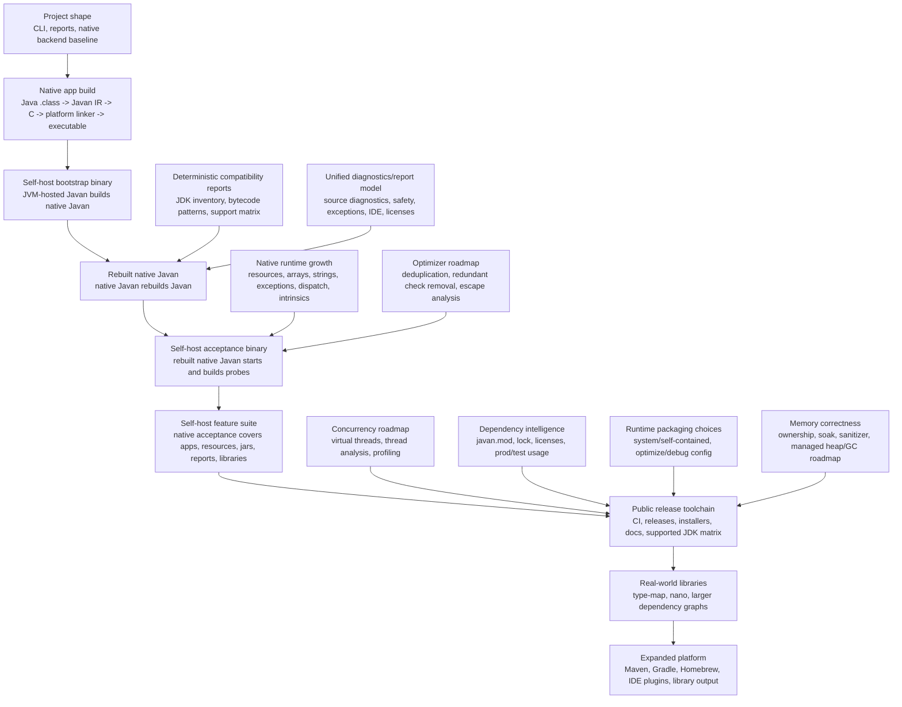

# Javan Roadmap Progress

Last updated: 2026-06-21

This page tracks verified progress toward a standalone native Javan release toolchain.
"Done" means implemented, tested, and release-gated for the stated scope, not full Java
support for the broad umbrella feature. "Partial" means production behavior exists for
the named subset, with unsupported reachable shapes rejected clearly.

## Roadmap Dashboard

Status words are exact. No colors, no mood lighting.

| Status | Meaning |
| --- | --- |
| Done | Implemented, tested, and release-gated for the stated scope. |
| Partial | Useful subset exists; unsupported reachable shapes fail clearly. |
| In progress | Production work is underway, but the release gate is not complete. |
| Planned | Wanted, specified, and not claimed as supported yet. |
| Blocked | Waiting on remote platform/tool validation or an external prerequisite. |
| Dismissed | Deliberately outside the native-support goal, except for narrower future variants. |

## Current Stats

| Measure | Current value | Meaning |
| --- | ---: | --- |
| Self-check reachable classes | 186 | `javan check target/classes --main javan.Main` on current Javan classes. |
| Self-check reachable methods | 2,015 | Same self-check. |
| Self-check diagnostics | 0 | Current Javan source shape is clean for reachable native self-build analysis. |
| CI package target rows | 4 | Linux x64, Linux aarch64, macOS x64, macOS aarch64 are configured. |
| Remote release validation | 0/4 completed | Local macOS aarch64 passes; remote rows still must prove the same gates. |
| Native network positive support | 7 runtime rows | Address objects, blocking TCP client/server socket state, socket-derived stream I/O, plain HTTP client GET with string body, plain HTTP client POST with headers plus byte-array response handling, and plain HTTP client PUT with byte-array request/response handling are verified; TLS is still not claimed. |
| Native network rejection probes | 3 CLI probes | Unsupported socket/server-side HTTP shapes still fail clearly with runtime-module reports. |

Release accounting rule: a JDK or feature area is not "done" until
`supported + explicitly rejected + dismissed = total known variants`, with `unknown = 0`.

## Coverage Snapshot

| Measure | Done | Total | % | Meaning |
| --- | ---: | ---: | ---: | --- |
| Scenario rows fully passing | 76 | 93 | 81.7% | Named deterministic support scenarios implemented and tested. |
| Scenario rows implemented or scoped | 91 | 93 | 97.8% | Rows with working behavior or an explicit scoped subset. |
| Roadmap rows fully done | 4 | 38 | 10.5% | Big product rows release-gated for their stated scope. |
| Roadmap rows with implementation evidence | 23 | 38 | 60.5% | Rows marked `Done`, `Partial`, `In progress`, or `Blocked`. |
| Remote release rows proven | 0 | 4 | 0.0% | Configured Linux/macOS package rows passed on remote CI. |

## Active JDK Surface

Current active inventory: `JDK 25`

| JDK inventory item | Count | Native support claim today |
| --- | ---: | --- |
| modules | 84 | inventoried, not fully support-accounted |
| classes | 32,482 | inventoried, not fully support-accounted |
| fields | 118,632 | inventoried, not fully support-accounted |
| constructors | 35,209 | inventoried, not fully support-accounted |
| methods | 232,677 | inventoried, not fully support-accounted |

This inventory is complete for the scanned image. Native member-by-member accounting is not.

## Honest Targets Today

| Project shape | Status | What works now | Main blockers left |
| --- | --- | --- | --- |
| Local standalone `javan` CLI surface | Done | CLI command surface, project detection, reports, native build path. | Remote release artifacts still need validation. |
| Small deterministic native apps | Partial | Supported bytecode/JDK subset can lower to C and link host-native binaries, including the current plain HTTP client loopback slices for GET/string, POST+headers/byte[], and PUT byte[]. | Full Java/JDK surface, threads, broader HTTP, TLS, full exception semantics. |
| Native libraries | Partial | C ABI, static/shared package layout, C/Rust/Go/Python bindings for primitives, `String`, `byte[]`, result/error ABI. | Rich object ABI, versioned package polish, cross-OS validation. |
| JVM jar output baseline | Done | `javan build --jar` preserves normal class/resource output and manifest main-class metadata beside native outputs. | Broader package polish. |
| Resources as artifacts | Partial | Resources are copied, packaged, and reported. | Native `ClassLoader.getResource*` and embedded resource tables. |
| Self-build | Partial | Native Javan can rebuild Javan locally and self-check is warning-free. | Remote package/release gate on every supported OS/ARCH. |
| Dependency/license reports | Partial | Classpath usage, local `javan.mod`, local Maven cache, lock, and license evidence. | Transitive/network resolution, GitHub packages, mirrors/auth, policy gates. |

## Critical Path

1. `Platform threads`: add `Thread.start()` / `Thread.join(...)` only after per-thread
   runtime state, live-thread root ownership, and GC/thread synchronization are explicit.
2. `GC` / `Managed heap`: finish thread-root-aware heap correctness so self-build and
   network/service lifetimes do not depend on single-thread assumptions.
3. `HTTP` / `HTTPS/TLS/certificates`: extend from the current plain blocking loopback
   slices to broader client/server coverage and then TLS.
4. `Remote release validation`: prove the same package/self-host/sanitizer gates on the
   configured Linux/macOS release rows.

## Feature Status

| Feature | Status | Evidence now | Next release gate |
| --- | --- | --- | --- |
| Local CLI binary behavior | Done | Standalone command builds/checks/reports from class output. | Package validation per OS/ARCH. |
| Plain source/classes detection | Done | Plain classes/source can be auto-detected without Maven or Gradle. | Larger public showcase projects. |
| Maven output detection | Partial | `target/classes` and multimodule scanning. | Maven plugin calls installed binary after normal build. |
| Gradle output detection | Partial | `build/classes` scanning for Java/Kotlin class outputs. | Gradle plugin calls installed binary after normal build. |
| Self build | Partial | Native Javan rebuilds Javan locally. | Remote release gate proves package-built Javan. |
| GC | Partial | Single-thread safe-point mark/sweep subset. | Complete heap model and thread roots. |
| Managed heap | Partial | Generated objects, arrays, strings, containers, local/static roots. | All Java heap shapes and full string object model. |
| Leak checks | Partial | Counter-backed generated-app, native-library, and self-host sanitizer/soak gates. | Required sanitizer matrix across OS/ARCH. |
| Exceptions | Partial | Source-focused panics and scoped catch support. | Full Java exception semantics and optimized debug mapping. |
| Virtual threads | Planned | Spec exists. | Scheduler, carriers, thread roots, diagnostics. |
| Platform threads | Partial | `Thread()` and `Thread(Runnable)` construction, `Thread.currentThread()`, `Thread.interrupt()`, `Thread.isInterrupted()`, `Thread.interrupted()`, and uninterrupted `Thread.sleep(long)` now lower to a deterministic single-thread native runtime object with runtime-feature reporting. Interrupted sleep currently fails clearly instead of pretending to model `InterruptedException`. | `Thread.start()`, `Thread.join(...)`, full sleep interruption semantics, thread roots, blocking analysis, and stress/runtime profiling gates. |
| Sockets | Partial | `InetAddress.getLoopbackAddress()`, `InetAddress.getHostAddress()`, `InetSocketAddress(String|InetAddress,int)`, `getPort()`, `getHostString()`, `getAddress()`, deterministic `toString()`, blocking `Socket(String,int)` connect, `Socket.isConnected()`, `Socket.isClosed()`, `Socket.getPort()`, `Socket.getLocalPort()`, `Socket.getInetAddress()`, `Socket.getInputStream()`, `Socket.getOutputStream()`, `InputStream.read()/read(byte[])/read(byte[],int,int)/close`, `OutputStream.write(int)/write(byte[])/write(byte[],int,int)/flush/close`, `Socket.close()`, `ServerSocket(int)` bind/listen, `ServerSocket.getLocalPort()`, `ServerSocket.accept()`, and `ServerSocket.close()` now lower to the native runtime for the verified loopback TCP slice, including stored local stream variables. Non-socket `InputStream`/`OutputStream` receivers fail clearly with `JAVAN062`. | Broader hostname resolution, timeouts, socket options, and the HTTP/TLS layers above TCP. |
| HTTP | Partial | Native plain HTTP client GET with `HttpClient.newHttpClient()`, `HttpRequest.newBuilder(URI).GET().build()`, `BodyHandlers.ofString()`, `send(...)`, `statusCode()`, and `body()` is verified against a JVM-hosted loopback server. Native client POST with `Builder.header(...)`, `BodyPublishers.ofString(...)`, `Builder.POST(...)`, and `BodyHandlers.ofByteArray()` is also verified against a JVM-hosted loopback server, including header propagation, request body delivery, and byte-array response handling. Native client PUT with `BodyPublishers.ofByteArray(...)`, `Builder.PUT(...)`, and `BodyHandlers.ofByteArray()` is verified against a JVM-hosted loopback server. Reports expose `network,http`. Unsupported server-side or richer client shapes still fail clearly. | HTTP server APIs, more body publishers/handlers, redirects, async, additional methods, and the TLS layer above it. |
| HTTPS/TLS/certificates | Planned | Certificate/trust-store work is tracked. | TLS runtime and trust-store model after HTTP. |
| Unsupported network diagnostics | Done | Unsupported reachable socket/server-side HTTP shapes still fail with stable diagnostics and write `network/socket/http` runtime-feature reports. | Keep narrowing remaining unsupported network families as positive support lands. |
| Resources | Partial | Artifact copy/package/report. | Runtime Java resource lookup APIs. |
| Native library C ABI | Partial | Static/shared package layout, primitive/`String`/`byte[]` ABI, result/error ABI, and ownership tests. | Rich object ABI, versioned ABI polish, and cross-target release gate. |
| Rust library bindings | Partial | Generated Rust FFI wrapper over the current C ABI and result/error/free helpers. | CI-required compile/smoke on every release target and richer object ABI. |
| Go library bindings | Partial | Generated cgo wrapper over the current C ABI and result/error/free helpers. | CI-required compile/smoke on every release target and richer object ABI. |
| Python library bindings | Partial | Generated `ctypes` wrapper over the current C ABI and result/error/free helpers. | CI-required smoke on every release target and richer object ABI. |
| Go/Rust backends | Planned | Research track only. | Separate translator/backend design; not on first useful release path. |
| Self-contained packaging | Planned | Runtime-footprint reports exist. | Bundled runtime packages and size/perf presets. |
| Containers | In progress | Workflow/spec exists and default image reuses showcase verifier. | Post-release image build from released binaries. |
| Linux libc-free syscall runtime | Planned | Footprint track exists. | Linux raw syscall runtime slice. |
| macOS | Partial | Host-native macOS aarch64 path works locally. | macOS x64 remote gate and notarized release. |
| Linux | Blocked | CI rows configured. | Remote x64/aarch64 package gates must pass. |
| Windows | Planned | Runtime/linker port is specified. | PE/COFF link path and Windows CI. |
| JDK 17 | Planned | Not a release-gated row yet. | Inventory/probe/support accounting row. |
| JDK 21 | Planned | First LTS support target. | Inventory/probe/support accounting row. |
| JDK 25 | Partial | Active inventory and support matrix gate. | Unknown JDK API variants reduced to zero by support/reject accounting. |
| Homebrew | Planned | Release distribution target. | Tap formula after stable release artifact. |
| IDE diagnostics | Planned | Machine-readable reports exist. | Javac wrapper/LSP-compatible diagnostics export. |
| Dependency reports | Partial | Local classpath, local Maven cache, lock, license evidence. | Transitive resolver, GitHub packages, mirrors/auth, prod/test proof. |
| Reflection | Dismissed | Arbitrary runtime reflection is rejected for native output. | Optional closed-world metadata reflection only when explicit and reported. |
| Dynamic class loading | Dismissed | Arbitrary runtime class loading is incompatible with static native output. | None for first release; only explicit closed-world metadata may be revisited. |
| JNI/native method loading | Dismissed | Javan native-library output is the supported interop path. | None for first release. |
| TypeMap | Planned | Mini probe exists but matrix row is still `target`. | Real TypeMap native acceptance gate. |
| Nano | Planned | Metric/duration probes exist but matrix row is still `target`. | Nano example app without dev console builds and runs native. |

## Real App Readiness

| Target app shape | Status | Blocking work before it is honest native support |
| --- | --- | --- |
| Tiny CLI/library | Partial | Expand supported JDK subset and remote package gates. |
| File/resource-heavy CLI | Partial | Runtime resource lookup APIs and broader `Files.*` coverage. |
| HTTP service | Planned | TCP sockets, HTTP parser/client/server APIs, threads/event loop, resources. |
| HTTPS service | Planned | HTTP plus TLS, certificate validation, trust-store configuration. |
| Nano app | Planned | Nano dependency graph gate, sockets/HTTP, resources, thread model, reflection/dev-console exclusion. |
| TypeMap library/app | Planned | Real TypeMap jar acceptance instead of mini probe only. |
| General Java app | Planned | Full support accounting for reachable JDK/API/bytecode variants or clear rejection. |

## Nano Native Path

Nano is wanted, not dismissed. Current probes are intentionally small:
`real-probes/nano-metric` and `real-probes/nano-duration`. They prove selected Nano code
can be linked when its dependency is provided, but they do not start a Nano service.

Exit gates for "Nano works":

1. Build `YunaBraska/nano-graalvm-example` without the dev console/reflection-heavy path.
2. Resolve and report production dependencies separately from test dependencies.
3. Run plain HTTP without TLS first: sockets, request parsing, response writing, resources.
4. Add TLS/certificates after the plain HTTP gate is deterministic.
5. Run the native binary under leak/sanitizer/counter stress.
6. Add the Nano app as a release-gated support row, not a local optional probe.

## Status Table

| Area | Status | Evidence / next check |
| --- | --- | --- |
| CLI and project detection baseline | Done | Existing CLI can run commands such as `version`, `inspect`, and `build` from the current project shape. |
| Native backend baseline | Done | JVM-hosted Javan can lower supported class files to IR, generate C, call the platform linker, and produce a native executable for a primitive app. |
| Self-host bootstrap binary | Done | JVM-hosted Javan can build a native Javan bootstrap binary. |
| Native bootstrap startup | Done | The native bootstrap binary can print version/toolchain information. |
| Rebuilt native Javan | Done | A native Javan binary can rebuild Javan itself from class files. |
| Self-host acceptance binary | Done | The rebuilt native Javan starts and is used for release acceptance. |
| Calm command surface | Partial | `javan build` defaults to native app output, `--jar` keeps JVM jar output, `--library` builds native library packages, app args pass after `--`, and `--kind` stays as an advanced compatibility surface. Open gates remain for build-plugin configuration and broader artifact layout. |
| Binary-first distribution | In progress | Core artifact is the standalone `javan` executable beside existing Java tools. Maven, Gradle, Homebrew, and IDE integration are thin consumers of the same binary. The JDK-like SDK wrapper is no longer a first-release target. |
| Maven/Gradle class-output discovery | Partial | Javan now uses shared production class-output discovery and can find nested Maven `target/classes` and Gradle `build/classes/java/main` or Kotlin class outputs after the normal build. Explicit relative `--classes` paths resolve against the CLI working directory. |
| Unified report output | Done | `check`, `build`, `compat`, and `report` refresh `.javan/reports/report.md` and `.javan/reports/report.json` for current report families. `javan report` remains the explicit reader/refresh command. More diagnostic families and IDE-compatible source diagnostics are tracked separately. |
| Human-readable runtime panics | Partial | Generated uncaught `athrow` sites now parse `LineNumberTable`/`SourceFile`, lower to source-mapped `javan_panic_at(...)`, source-line-backed generated runtime helper panics inherit an allocation-free source-context stack, apps print Java-facing code/where/why/fix diagnostics with a source-line `Code:` block when Java source is available, library exports record compact `javan_last_error()` text plus borrowed structured `javan_last_error_*` fields, and `.javan/reports/exceptions.json`, `.javan/reports/exceptions.md`, and `.javan/reports/debug-map.json` are written with source-line fields. Open gates remain for exact expression/range highlighting, reachable call paths, expression-level helper blame, `--debug-native`, and full Java exception semantics. |
| Coverage hard-gate cleanup | Done | JaCoCo now merges child `java ... javan.Main` runs, the stale `javan/codegen/BytecodeToIR*` exclusion is gone, and the real bundle gate passes at `96.8969%` line / `90.5587%` branch with `mvn -q clean verify`. `BytecodeToIR` now sits inside the same bundle gate at `96.6866%` line / `91.2642%` branch, and `JdkCallSupport` is at `98.1520%` line / `95.4248%` branch. JUnit parallel execution remains enabled in the current deterministic split: `RuntimeFilesTest` runs concurrently, cheap CLI command/report/toolchain coverage lives in `CliCommandIntegrationTest`, repo-shared-state coverage stays in serial `CliSharedStateIntegrationTest`, and the temp-project native CLI matrix runs concurrently in `CliIntegrationTest` under the fixed four-worker cap. The last cleanup slices removed the self-host-breaking String `switch` regression from `BytecodeToIR`, restored the no-side-effects rejection path in `lowerJdkCollectionStaticCall`, deleted dead branch residue from unused iterator helpers plus manual `EntryPoint` duplicate checks, admitted owner-specific `HashMap`/`LinkedHashMap`/`TreeMap` collection calls in `JdkCallSupport`, removed the dead `pushField` static-field default path, added isolated tests for enum `getstatic` lowering plus `java/io/File` special-field descriptor rejection, hardened `invokedynamic` string-concat rejection paths, added direct `Duration.toMillis()` lowering coverage, fixed malformed concat descriptor handling without introducing self-host-breaking exception handlers in compiler code, added guarded-branch mismatch and expressionless merge rejection tests, added guarded multi-merge-jump fallback coverage plus the asymmetric expressionless-target merge rejection, fully covered the `unconditionalJumpBefore(...)` control-shape helper, and added guarded fallback coverage for mismatched value-target offsets, target-block control transfer, target-prefix rebuild, and `tableswitch`-in-prefix control flow. `hasOnlyTargetBranches(...)` is now fully covered. Remaining residue is explicit and currently defensive: `lowerBranchValueSelection` and `lowerGuardedValueSelection` each retain only the `targetValue.expression().isEmpty()` branch, but the current lowering model has no expression-bearing counterpart for the only empty-expression stack kinds (`PRINT_STREAM` and `ERROR_PRINT_STREAM`), so those counters are structurally unreachable through public lowering entrypoints. `branchCondition` still retains the default unsupported-opcode throw path plus its associated range edges, but all public callers gate that helper with `isConditionalBranch(...)`, so that path is likewise defensive rather than missing feature work. |
| Dependency and license reports | Partial | `javan check`, native `build`, and `compat` now write `.javan/reports/dependencies.*` and `.javan/reports/licenses.*` from the resolved classpath, classify present/missing and used/unused dependencies by reachable dependency classes, detect Maven packed coordinates, detect POM/license-file license evidence, attribute `javan.mod` local path and local Maven-cache classpath entries, and report unknown licenses without guessing. Open gates remain for direct/transitive truth, full prod/test reachability, mirrors, auth, provenance, policy blocking, and IDE surfacing. |
| `javan.mod` and `javan.lock` | Partial | Local jar/classes dependencies and direct local Maven-cache coordinates can be declared with `require main/test/tool <path-or-coordinate>`. Main dependencies are available before plain `javac`; test/tool dependencies are recorded but do not enter native app classpath. `javan.lock` records deterministic dependency metadata with scope, status, artifact kind, size, path, and `fnv64` content checksum. Missing local dependencies and missing local-cache coordinates fail clearly. Open gates remain for transitive resolution, network mirrors, auth, stronger checksums, and lock verification mode. |
| Resource files in native builds | Partial | Resources are supported as artifacts: jars include them, native app/library builds preserve them beside artifacts, stale generated resources are removed, and resource reports are written. Open gates remain for native Java resource APIs and embedded C resource tables. |
| Jar output beside native library output | Partial | Jar, native app, and native library outputs are distinct supported outputs; library bindings live in language-specific folders while jar output remains first-class. Open gates remain for richer package manifests and cross-target library release details. |
| Memory/runtime correctness | Partial | Runtime reports now state allocation ownership, partial safe-point mark/sweep for generated objects, object arrays, primitive arrays, runtime-owned strings, runtime containers, and owned container storage, heap metadata/accounting, type descriptors, static roots, local/parameter root frames, CFG-aware local root liveness, direct object-return roots, generated expression temporary root frames, panic-expression temporary roots, statement/label safe points, scoped allocator-path GC retry, deterministic allocation failure, export-wrapper byte-array roots, rooted native-library `String`/byte-array return exports, recovered native-library panic structured last-error ABI, ABI v2 C `javan_try_*` wrappers with owned `JavanResult` diagnostics, Rust/Go/Python result-level wrappers over the C `JavanResult` ABI, retained native-library `String`/byte-array input ownership, repeated native-library export/free sanitizer stress, null `String` ABI input, empty and negative `byte[]` ABI input, heap-limited `string-growth-limit` reclamation, source-container rooting for list/map copy and view helpers, `List.of` vararg element rooting, owned-buffer reference validation for `ArrayList`/`HashMap`/`StringBuilder`, deterministic `StringBuilder.setLength` overflow rejection, runtime UTF-8 string helper source rooting for substring, replace, char-array construction, copy, concat, StringBuilder append, path helper, array-copy helper, directory-stream helper, and export-copy allocation paths, map-growth publish-after-allocation safety, HashMap backing-array realloc publish-before-GC safety, `realloc` heap-limit growth accounting, hostile receiver/array-load/object-compare/field-load/chained-field-load/chained-call/runtime-string/nested-container/catch/live-root panic allocation stress, deterministic denial probes for string/list/map/path/read-file/directory-stream/process/array-copy/catch families, non-ASCII UTF-16-sensitive string operation rejection in check and native lowering, panic-time root cleanup, panic-time `FILE*`/`DIR*` cleanup, explicit process-result stdout/stderr free ownership, registry growth partial-allocation cleanup, counter-backed generated-app no-leak soak, counter-backed C ABI library export/free no-leak smoke, retained ABI input ownership, required CI/release Rust/Go/Python binding ownership smoke, and sanitizer failure-signature rejection. Acceptance includes `memory-soak`, `static-root-inventory`, `string-static-root`, `root-frame-stack`, `local-root-liveness-gc`, `cfg-local-root-liveness-gc`, `gc-generated-object-graph`, `object-registry-gc`, `protected-object-return`, `operand-call-temporary-roots`, `large-arrays`, `primitive-array-gc`, `string-growth-limit`, `runtime-container-live-roots`, `runtime-list-reclaim`, `runtime-map-reclaim`, `runtime-map-realloc-gc`, `runtime-optional-reclaim`, `runtime-iterator-reclaim`, `runtime-stringbuilder-reclaim`, `runtime-list-of-array-gc`, `runtime-list-of-varargs-gc`, `runtime-list-copy-gc`, `runtime-map-copy-gc`, `runtime-map-values-gc`, `runtime-realloc-growth-fit`, `operand-call-receiver-temporary-root`, `operand-array-load-temporary-root`, `operand-object-compare-temporary-root`, `operand-field-load-temporary-root`, `operand-chained-field-load-temporary-root`, `operand-chained-call-receiver-temporary-root`, `runtime-string-temporary-root`, `runtime-string-substring-source-root`, `runtime-string-replace-source-root`, `runtime-string-from-chars-source-root`, `runtime-string-char-array-copy-gc`, `runtime-stringbuilder-append-source-root`, `runtime-nested-container-reclaim`, `runtime-directory-stream-source-root`, `runtime-directory-stream-result-allocation-limit-panic`, `runtime-directory-stream-child-allocation-limit-panic`, `runtime-process-run-output-allocation-limit-panic`, `runtime-read-string-allocation-limit-panic`, `runtime-read-all-bytes-allocation-limit-panic`, `exception-catch-heap-pressure`, `exception-default-message-null`, `exception-default-panic`, `panic-string-concat-temporary-root`, `heap-limit-live-root-panic`, `allocation-path-gc`, `native-library`, `negative-array-length`, `allocation-limit-panic`, `string-allocation-limit-panic`, `exception-catch-allocation-limit-panic`, `runtime-list-allocation-limit-panic`, `runtime-map-allocation-limit-panic`, `runtime-path-allocation-limit-panic`, `runtime-stringbuilder-setlength-overflow-panic`, and `array-copy-allocation-limit-panic`; direct C runtime-boundary tests cover list-varargs/list-realloc/map-realloc/stringbuilder-realloc/path/export/array-copy/directory-stream/helper counter checks outside generated Java; full managed heap coverage, full string object/UTF-16 ownership, remaining hostile all-shape allocation stress, full Java exception semantics, thread roots, and Windows/release-footprint sanitizer gates remain open. |
| Boxed primitive wrapper GC | Partial | `Boolean`, `Integer`, `Long`, `Float`, and `Double` value-of/unbox allocations are now tagged as collectible managed heap objects. Acceptance and sanitizer gates run `boxed-boolean-gc`, `boxed-integer-gc`, `boxed-long-gc`, `boxed-float-gc`, and `boxed-double-gc` with heap limits, `JAVAN_GC_STRESS=1`, and `JAVAN_GC_SAFEPOINT_INTERVAL=1`. This does not claim wrapper cache identity, the full boxed-wrapper API, or full Java heap completion. |
| FileTime runtime object | Partial | `Files.getLastModifiedTime(Path, LinkOption...)` and `FileTime.toMillis()` lower to native `stat`, allocate a managed `FileTime` leaf object, and run `runtime-filetime-gc` under heap limit, `JAVAN_GC_STRESS=1`, and `JAVAN_GC_SAFEPOINT_INTERVAL=1`. This does not claim the rest of `FileTime`, `Instant`, or generic file attribute APIs. |
| Duration runtime object | Partial | `Duration.ofMillis(long)`, `Duration.ofSeconds(long)`, and `Duration.toMillis()` lower to a managed leaf runtime object. Acceptance and sanitizer gates run `runtime-duration-millis-gc` and `runtime-duration-seconds-gc` with heap limits, `JAVAN_GC_STRESS=1`, and `JAVAN_GC_SAFEPOINT_INTERVAL=1`. This does not claim the rest of `java.time`, parsing, arithmetic, formatting, or `Instant`. |
| Exact native substitution contracts | Done | `javan.util.ProcessRunner.run(Path,List)` has one named substitution contract used by reachability, IR lowering, static verification, and runtime reports. The Java fallback body is ignored only when unreachable; reachable ProcessBuilder/Process fallback code still fails clearly. This removes fake ProcessBuilder support and helped reduce self-host diagnostics from 28 to 0. |
| Clean self-host native check profile | Done | `javan check target/classes --main javan.Main` now passes with `diagnostics: 0`. Remaining JVM-host-only implementation conveniences are exact internal contracts ignored only when unreachable: `ClassFileReader.read(InputStream,Path)`, `ClassMetadataReader.read(InputStream,Path)`, `JavanHome.property(Properties)`, `ToolchainMetadataException(String,Throwable)`, and `Cli.run(...)`. `BytecodeSupport` no longer uses `TreeSet`/`Set.add`; it returns read-only opcode lists backed by deterministic sorted opcode arrays. Reachable uses of host-only methods still fail clearly. |
| Counter-backed generated-app no-leak soak | Partial | `.github/scripts/sanitizer-smoke.sh` can wrap the generated app entrypoint when `JAVAN_SANITIZER_COUNTER_CHECK=true`, run final `javan_gc_collect()`, validate heap metadata, assert final live allocations/bytes, assert peak live bytes, and require minimum total/GC/collected allocation counters. It now writes `.javan/reports/sanitizer-proof.json` and `.javan/reports/sanitizer-proof.md` with actual live allocation, live byte, peak byte, total allocation, GC collection, and collected allocation counters. `.github/scripts/sanitizer-suite.sh` asserts the `memory-soak` proof for zero final live heap, peak live bytes capped at 32768, minimum allocation/collection counters, and no sanitizer failure signatures, then runs `javan report` and asserts the unified report exposes the sanitizer-proof family and the same zero-live-heap counters. Scope remains single-threaded and limited to currently collectible allocation shapes. |
| Counter-backed C ABI and binding no-leak smoke | Partial | `.github/scripts/sanitizer-library-smoke.sh` now builds static and shared native-library artifacts, runs a sanitizer counter probe for primitive, `String`, `byte[]`, retained-input, null string input, empty byte-array input, structured last-error, C `javan_try_*` result success/error/free, and last-error clear semantics, frees successful Javan-owned export outputs with `javan_free`, frees owned `JavanResult` diagnostics with `javan_result_free`, runs final `javan_gc_collect()`, validates heap metadata, requires zero final live allocations/bytes, caps peak live bytes, and requires minimum total/GC/collected counters. It writes sanitizer proof reports with actual live heap, peak heap, root-frame depth, frame-root count, and GC counters; the suite asserts the native-library proof for zero final live heap/root residue and no sanitizer failure signatures, then runs `javan report` and asserts the unified report exposes the sanitizer-proof family plus zero-live-heap and zero-open-root counters. A separate failure probe covers null and negative byte-array inputs with final heap/root cleanup. Generated Rust, Go, and Python bindings include explicit free helpers, borrowed structured last-error accessors, and result-level wrappers that copy diagnostics before freeing `JavanResult` and copy `String`/`byte[]` outputs before freeing Javan-owned memory. Local smoke runs language package ownership when the relevant tool exists; CI and release install Go `1.26.4` and Rust `1.96.0`, then run the sanitizer suite with `JAVAN_SANITIZER_REQUIRED=true`, which makes missing Python/Rust/Go binding proof fail. |
| Runtime feature selection | Partial | Native builds now write runtime-footprint reports with host target, actual target, footprint statuses, and OS/ARCH coverage rows. `javan.toml` disabled modules are enforced for reachable runtime families and unused disabled modules report as omitted. CI is configured for Linux/macOS x64/aarch64 host-native checks. Open gates remain for self-contained packaging, `runtime.optimize`, debug/profiling selection, Windows, and real cross-linking. |
| Maven and Gradle integrations | Planned | Build plugins must call the installed/downloaded Javan binary after the normal Java build and consume the same reports. |
| JDK-like wrapper / SDK distribution | Planned | Not a first-release target. Javan remains a standalone binary beside `javac`; optional SDK-style wrapping can be revisited only if plugins/IDE reports are not enough. |
| Supported JDK accounting | In progress | Compatibility docs and support matrix exist; `compatibility-summary.*`, `support-matrix.*`, and `javan report` now expose support-row counts for the current evidence ledger: 93 rows, 76 pass, 15 scoped, 2 target. Remaining work is complete inventory coverage and explicit supported/rejected accounting per JDK API variant. |
| Self-host warning debt | Done | The self-host native check profile is warning-free for current classes. Reachable enum `valueOf(String)` still rejects as `JAVAN015`; reachable record `ObjectMethods` bootstrap still rejects as `JAVAN030`, so unsupported reachable code remains guarded. |
| Real-world projects: type-map and nano | Planned | Probe scripts exist and can run when the source checkouts are present locally, but these projects are not release-gated native support yet. |
| CI, release, and installer readiness | In progress | CI and release packaging now define Linux x64, Linux aarch64, macOS aarch64, and macOS x64 host-native rows; each CI row now runs a self-host package smoke that extracts the archive, builds/runs `example` with packaged `bin/javan`, asserts the showcase unified report, clears stale `target/.javan`, runs packaged `check` and `report` on Javan's own class files, uses the packaged binary to build a second native Javan smoke binary that must start with the package version, and runs a package-backed self-host sanitizer proof with nonzero allocation/GC counters plus zero final heap/root residue. Package-backed acceptance and sanitizer/leak suites pass locally on macOS aarch64 and remain release-gated. The post-release default container image reuses the same showcase verifier. Remaining work is remote validation, Windows/runtime porting, and installer/Homebrew path. |

## Self-Hosted Milestone Definition

The production milestone is not "Javan exists as a Java program." It is Javan building
Javan through Javan's own native backend:

1. A native Javan bootstrap binary is produced by Javan's own native backend.
2. That native Javan can build and run multiple supported Java test projects.
3. That native Javan can rebuild Javan itself from class files.
4. The rebuilt binary passes the same acceptance gates.
5. The path uses Javan's own bytecode -> IR -> C/native backend.

The core self-host chain is now locally verified. Internal release scripts still use
temporary bootstrap artifact names, but the release output is a single `javan` binary.
The self-host gate covers native app probes, resource distribution, native-library C ABI
smoke, negative test projects, jar output, and `javan report` under the rebuilt binary.

## Near-Term Milestones

| Milestone | Status | Exit criteria |
| --- | --- | --- |
| M1: self-host primitive app | Done | Native Javan creates and runs supported app binaries. |
| M2: self-host Javan rebuild | Done | Native Javan rebuilds Javan, and the rebuilt binary starts. |
| M3: self-host feature suite | Partial | Done locally: rebuilt native Javan covers native app probes, resource distribution, jar output, unified reports, native-library C ABI smoke, and negative test projects. Remote rows remain. |
| M4: clean user commands | Partial | Default commands auto-detect project type, main class, output name, target, resources, and dependencies. Plugins remain planned. |
| M5: release packaging gate | In progress | Release workflow runs native self-host checks before packaging; CI now runs Maven, acceptance, sanitizer, host-target native build, extracted package showcase/report proof, stale-report-resistant packaged self-check/report proof, package-built Javan jar proof, package-built native Javan smoke, and package-backed self-host sanitizer proof. |
| M6: real-probe gates | Planned | Pin/reproduce TypeMap Pair, Nano MetricUpdate, and Nano duration so at least one CI row requires exact stdout and `diagnostics: 0`. |
| M7: network rejection gates | Done | Unsupported socket and server-side HTTP shapes fail with stable diagnostics and runtime-module reports instead of silently lowering. |
| M8: network reporting | Done | Reachable network code appears in runtime-feature and unified reports as `network`, `socket`, or `http` even before positive support lands. |
| M9: TCP sockets | Partial | Native TCP client/server loopback probes and socket-derived stream I/O pass; broader hostnames, timeouts, and socket options remain. |
| M10: plain HTTP | Partial | Native HTTP GET against loopback passes for the current `HttpClient` + `BodyHandlers.ofString()` slice. Native loopback POST with headers, `BodyPublishers.ofString()`, and `BodyHandlers.ofByteArray()` also passes. Native loopback PUT with `BodyPublishers.ofByteArray()` and `BodyHandlers.ofByteArray()` also passes. Broader client/server semantics and TLS remain. |
| M11: Nano service slice | Planned | `YunaBraska/nano-graalvm-example` without dev console/reflection-heavy path runs native for a deterministic HTTP route. |
| M12: HTTPS/TLS/certificates | Planned | TLS, certificate validation, and trust-store policy are implemented after plain HTTP is deterministic. |
| M13R: remote release-matrix self-host sanitizer proof | Partial | Local package-backed self-host sanitizer proof exists on macOS aarch64. Remote release validation remains 0/4 completed across linux-x64, linux-aarch64, macos-aarch64, and macos-x64. |
