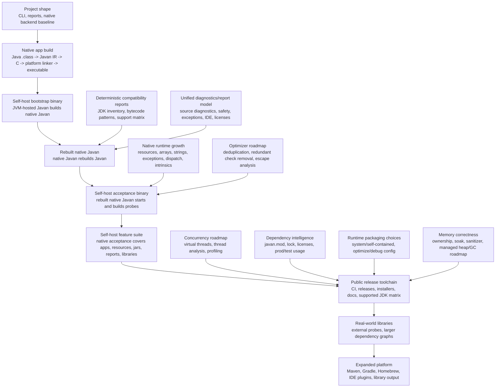

# Javan Roadmap Progress

Last updated: 2026-07-20

This page tracks verified progress toward a standalone native Javan release toolchain.
"Done" means implemented, tested, and release-gated for the stated scope, not full Java
support for the broad umbrella feature. "Partial" means production behavior exists for
the named subset, with unsupported reachable shapes rejected clearly.

## Roadmap Dashboard

Status words are exact. No colors, no mood lighting.

| Status | Meaning |
| --- | --- |
| Done | Implemented, tested, and release-gated for the stated scope. |
| Partial | Useful subset exists; unsupported reachable shapes fail clearly. |
| In progress | Production work is underway, but the release gate is not complete. |
| Planned | Wanted, specified, and not claimed as supported yet. |
| Blocked | Waiting on remote platform/tool validation or an external prerequisite. |
| Dismissed | Deliberately outside the native-support goal, except for narrower future variants. |

## Current Stats

| Measure | Current value | Meaning |
| --- | ---: | --- |
| Self-check reachable classes | 248 | Current branch verification of `java -cp target/classes javan.Main check target/classes --main javan.Main` on current Javan classes. |
| Self-check reachable methods | 2,974 | Same current-branch self-check. |
| Self-check diagnostics | 0 | Current Javan source shape is clean for reachable native self-build analysis. |
| Scenario ledger done | 300/300 | Named compiler-owned support scenarios with explicit pass/reject status. |
| Scenario ledger left | 0 | No named support scenario rows remain outside `pass`/`rejected`. |
| Exact supported JDK callables | 1435/267886 (0.5%) | Lower-bound callable-member coverage on the scanned JDK 25.0.1 image for members that already match the exact native support registry on the current branch baseline. |
| Exact explicit rejected JDK callables | 174596 | Deterministic callable-member rejects currently counted exactly from forbidden APIs, verifier-backed monitor/concurrency members, deliberate unsupported owner families, and the current exact member-level unsupported registries. |
| Exact done JDK callables | 176031/267886 (65.7%) | Lower-bound supported-plus-explicitly-rejected callable-member accounting on the scanned JDK 25.0.1 image for the current branch baseline. |
| Exact unknown JDK callables | 91855 | Callable members on the scanned JDK 25.0.1 image not yet counted as supported or explicitly rejected. |
| Exact supported JDK callables left | 266451 | Callables on the scanned JDK 25.0.1 image that are not yet in the exact supported callable ledger. |
| Flow-qualified rejected JDK call shapes | 0 | Separate diagnostic-shape ledger exists now; the current self-check profile has no such diagnostics. |
| Full first-JDK release gate | 0.0% | Inventory and exact supported callable counts exist, but supported/rejected/unknown accounting for the first release-gated JDK is still incomplete. |
| CI package target rows | 2 | Linux x64 and Linux aarch64 are configured; macOS aarch64 is verified by the required local host gate. |
| Remote release validation | 2/2 completed | Linux x64 and Linux aarch64 pass remotely; macOS aarch64 remains covered by the required local host gate. |
| Native network positive support | 79 runtime rows | Address objects, `InetAddress.getByAddress(byte[])`, `InetAddress.getByAddress(String,byte[])`, `InetAddress.getAddress()`, address-backed TCP client socket construction, explicit local-bind client constructors, explicit unconnected `Socket()` lifecycle plus `Socket.connect(SocketAddress)` state transition, blocking TCP client/server socket state, socket bound/closed state, socket input/output shutdown state, backlog-aware and explicit-bind-address `ServerSocket` constructor families, explicit unbound `ServerSocket()` lifecycle plus `ServerSocket.bind(SocketAddress)` state transition, bound/closed server-socket state, `ServerSocket.getInetAddress()` over default and explicit bind paths, `Socket.getLocalAddress()`, socket local/remote `InetSocketAddress` wrappers, `ServerSocket.getLocalSocketAddress()`, `Socket.getChannel() == null`, `ServerSocket.getChannel() == null`, socket-derived stream I/O, kernel-backed socket option round-trips for `Socket.getTcpNoDelay()/setTcpNoDelay(boolean)`, `Socket.getKeepAlive()/setKeepAlive(boolean)`, `Socket.getReuseAddress()/setReuseAddress(boolean)`, `Socket.getReceiveBufferSize()/setReceiveBufferSize(int)`, `Socket.getSendBufferSize()/setSendBufferSize(int)`, `Socket.getSoTimeout()/setSoTimeout(int)`, `Socket.getSoLinger()/setSoLinger(boolean,int)`, `Socket.getOOBInline()/setOOBInline(boolean)`, `Socket.getTrafficClass()/setTrafficClass(int)`, `ServerSocket.getReuseAddress()/setReuseAddress(boolean)`, `ServerSocket.getReceiveBufferSize()/setReceiveBufferSize(int)`, and `ServerSocket.getSoTimeout()/setSoTimeout(int)`, plus explicit native timeout boundaries for socket reads and `ServerSocket.accept()`, deterministic raw loopback HTTP responder slices over `ServerSocket`/`Socket` for `GET /hello -> 200 pong`, unmatched-route `404`, POST request-body handling via `Content-Length`, sequential two-connection service lifetime, method-plus-path dispatch across GET and POST routes, multi-class route-handler dispatch through interface-based handlers, request-header matching, response-header emission, and a multi-class request/response object model over router and service classes, plus plain HTTP client GET with string body, plain HTTP client POST with headers plus byte-array response handling, plain HTTP client PUT with byte-array request/response handling, and one-context `HttpExchange.getRequestMethod()` POST dispatch, `HttpServer.getAddress()` local endpoint parity, `HttpExchange.getLocalAddress()`/`getRemoteAddress()` endpoint parity, `HttpExchange.getResponseCode()` state parity, `HttpExchange.getProtocol()` plain HTTP/1.1 protocol parity, malformed request-target percent-escape rejection with HTTP 400, malformed Content-Length/conflicting framing and unsupported transfer encoding rejection with HTTP 400, `URI.getQuery()` request-target parity, `URI.getRawPath()` and `URI.getRawQuery()` request-target parity for the proven plain shape, case-insensitive `HttpExchange.getRequestHeaders().getFirst(String)` lookup, `HttpExchange.getResponseHeaders().set(String,String)` wire emission, ordered duplicate request/response header values through `Headers.get(String)`/`add(String,String)`, unmatched one-context request targets returning 404, multiple registered contexts selecting the longest matching handler, sequential requests served until `HttpServer.stop()`, concurrent request dispatch through rooted native workers with stop-time draining, configured virtual-thread executor dispatch through `HttpServer.setExecutor(Executor)` for the proven executor family, `Headers.keySet()` and `Headers.values()` live mutation, `Headers.entrySet()` live `Map.Entry.setValue(...)` and removal, and `Headers.putAll(Map)` response-header replacement/addition parity are verified; chunked decoding and TLS are still not claimed. |
| Native network rejection probes | 3 CLI probes | Unsupported socket/server-side HTTP shapes still fail clearly with runtime-module reports. |

M334 adds `Headers.containsKey(Object)` presence checks to the verified HTTP header surface;
M335 adds covariant `Headers.remove(Object)` and M336 adds `Headers.clear()`; M337 adds
unique-key `Headers.size()` and `Headers.isEmpty()`; M338 adds covariant mutable-list
`Headers.put(String,List<String>)`; M339 adds `Headers.containsValue(Object)`; M340 adds
`Headers.putAll(Map)` over the existing rooted Map representation; M341 adds
`HttpServer.getAddress()` over the existing server-socket local endpoint; the native
network positive count is now 66 runtime rows. M342 adds
`HttpExchange.getLocalAddress()` and `getRemoteAddress()` over the accepted socket;
the native network positive count is now 68 runtime rows. M343 adds
`HttpExchange.getResponseCode()` over the managed response state; the native network
positive count is now 69 runtime rows. M344 adds `HttpExchange.getProtocol()` for the
proven plain HTTP/1.1 path; the native network positive count is now 70 runtime rows.
M345 adds malformed request-target percent-escape rejection with a deterministic HTTP
400 response; the native network positive count is now 71 runtime rows.

Release accounting rule: a JDK or feature area is not "done" until
`supported + explicitly rejected + dismissed = total known variants`, with `unknown = 0`.

## Coverage Snapshot

| Measure | Done | Total | % | Meaning |
| --- | ---: | ---: | ---: | --- |
| Scenario rows fully passing | 300 | 300 | 100.0% | Named deterministic compiler-owned support scenarios implemented and tested. |
| Scenario rows implemented or scoped | 300 | 300 | 100.0% | Rows with working behavior or an explicit scoped subset. |
| Roadmap rows fully done | 28 | 38 | 73.7% | Big product rows release-gated for their stated scope. |
| Roadmap rows with implementation evidence | 31 | 38 | 81.6% | Rows marked `Done`, `Partial`, `In progress`, or `Blocked`. |
| Remote release rows proven | 2 | 2 | 100.0% | Configured Linux x64 and Linux aarch64 package rows passed on remote CI; macOS aarch64 is local-only. |

## Active JDK Surface

Current active inventory: `JDK 25`

| JDK inventory item | Count | Native support claim today |
| --- | ---: | --- |
| modules | 84 | inventoried, not fully support-accounted |
| classes | 32,482 | inventoried, not fully support-accounted |
| fields | 118,632 | inventoried, not fully support-accounted |
| constructors | 35,209 | inventoried, not fully support-accounted |
| methods | 232,677 | inventoried, not fully support-accounted |

This inventory is complete for the scanned image. Exact supported callable-member
accounting now exists as a lower-bound progress signal, but full native
supported/rejected/unknown accounting is not complete yet.

## Recent Milestones

Historical milestone notes stay compiler-owned and generic. External compatibility
movement is tracked separately in `doc/status/real-project-readiness.md`.

| Milestone | Status | Verified result |
| --- | --- | --- |
| M345: malformed request-target escape policy | Done locally | Added pre-routing validation for incomplete and non-hex percent escapes, returning a deterministic HTTP 400 response and closing the connection before context dispatch; valid escapes and existing `%00` rejection remain unchanged. Failing-first public parity captured JVM 400 versus native handler dispatch; the malformed-target public test, full focused HTTP parity, clean compile, and packaged macOS platform-smoke/sanitizer gate pass. Chunked/invalid framing beyond this escape policy, routing lifecycle, mutable `Map` views/operations, custom executors, and TLS remain open. |
| M346: malformed HTTP framing policy | Done locally | Added deterministic HTTP 400 rejection before handler dispatch for malformed header names, invalid or conflicting `Content-Length`, and non-identity `Transfer-Encoding`; rooted header state is released on every rejection path. Failing-first raw-socket parity captured JVM and native 400 responses; the framing test, focused HTTP parity, clean compile, and packaged macOS platform-smoke/sanitizer gate pass. Chunked decoding, routing lifecycle, mutable `Map` views/operations, broader executor policies, and TLS remain open. |
| M347: configured HTTP executor dispatch | Done locally | Added exact `HttpServer.setExecutor(Executor)` support for the existing virtual-thread-per-task executor family. Accepted requests now run through managed virtual threads with explicit server/handler/exchange GC roots and stop-time active-request draining; arbitrary executor families remain rejected by the runtime boundary. The public JVM/native HTTP parity test proves handler execution on a virtual thread, the focused network/support/lowering suite passes, and the packaged macOS platform-smoke/sanitizer gate passes. Broader executor policies, chunked decoding, routing lifecycle, mutable `Map` views/operations, and TLS remain open. |
| M348: HTTP header read views | Done locally | Added `Headers.keySet()` and `Headers.values()` snapshots over the canonical case-insensitive header representation, preserving unique-key order and list-valued collection contents for the proven response-header path. The public response-header JVM/native parity test, support/lowering suite, clean compile, and packaged macOS platform-smoke/sanitizer gate pass. Live mutable views, `entrySet()`, chunked decoding, richer routing lifecycle, and TLS remain open. |
| M349: HTTP header entry-set parity | Done locally | Added `Headers.entrySet()` snapshots backed by managed `Map.Entry` objects, preserving unique case-insensitive keys and list-valued entries. The public response-header JVM/native parity test exposed and fixed missing GC marking for map-entry key/value references; support/lowering tests, focused HTTP parity, clean compile, and packaged macOS platform-smoke/sanitizer gate pass. Live mutable views, chunked decoding, richer routing lifecycle, and TLS remain open. |
| M350: live HTTP header key view | Done locally | `Headers.keySet()` now returns a backing view whose size, contains, iterator reads, remove, and clear operations reflect and mutate the canonical case-insensitive header list. The public response-header parity test proves removal through a lower-cased key updates the original map; support/lowering tests, focused HTTP parity, clean compile, and packaged macOS platform-smoke/sanitizer gate pass. Live values/entry views, chunked decoding, richer routing lifecycle, and TLS remain open. |
| M351: live HTTP header values view | Done locally | `Headers.values()` now returns a backing collection view whose size, contains, iterator reads, remove, and clear operations reflect and mutate the canonical header list by matching complete value lists. The public response-header parity test proves collection removal updates the original map; support/lowering tests, focused HTTP parity, clean compile, and packaged macOS platform-smoke/sanitizer gate pass. Chunked decoding, richer routing lifecycle, and TLS remain open. |
| M352: live HTTP header entry view | Done locally | `Headers.entrySet()` now returns a backing set view whose size, iteration, `Map.Entry.setValue(...)`, removal, and clear operations route through the canonical case-insensitive header list. Entries retain their header owner, key, and value references for GC, while immutable compiler-created entries remain protected from mutation. The public response-header parity test proves entry replacement and removal against the original map; support/lowering tests, focused HTTP parity, clean compile, and packaged macOS platform-smoke/sanitizer gate pass. Chunked decoding, richer routing lifecycle, and TLS remain open. |
| M344: HttpExchange protocol parity | Done locally | Added exact `HttpExchange.getProtocol()` support for the current plain HTTP/1.1 server path, isolated in a dedicated runtime source fragment after the generated C source crossed Java’s string-constant limit. Failing-first public parity captured the unsupported network diagnostic; the protocol-aware endpoint test, full focused HTTP parity, clean compile, and packaged macOS platform-smoke/sanitizer gate pass. Broader protocol variants, routing lifecycle, mutable `Map` views/operations, malformed URI escape policy, custom executors, and TLS remain open. |
| M343: HttpExchange response-code parity | Done locally | Added exact `HttpExchange.getResponseCode()` support over the managed native response-code field. Failing-first public parity captured the unsupported network diagnostic; the response-code/body public test, full focused HTTP parity, clean compile, and packaged macOS platform-smoke/sanitizer gate pass. Broader routing lifecycle, mutable `Map` views/operations, malformed URI escape policy, custom executors, and TLS remain open. |
| M342: HttpExchange endpoint address parity | Done locally | Added exact `HttpExchange.getLocalAddress()` and `getRemoteAddress()` support backed by existing native socket address accessors. Failing-first public parity captured the unsupported network diagnostic; the endpoint-header/public response test, full focused HTTP parity, clean compile, and packaged macOS platform-smoke/sanitizer gate pass. Broader routing lifecycle, mutable `Map` views/operations, malformed URI escape policy, custom executors, and TLS remain open. |
| M341: HttpServer local endpoint parity | Done locally | Added exact `HttpServer.getAddress()` support backed by the native server socket’s local `InetSocketAddress`. Failing-first public parity captured the unsupported network diagnostic; the response-header/server-address public test, full focused HTTP parity, clean compile, and packaged macOS platform-smoke/sanitizer gate pass. Broader routing lifecycle, mutable `Map` views/operations, malformed URI escape policy, custom executors, and TLS remain open. |
| M340: HttpExchange header bulk replacement parity | Done locally | Added exact `Headers.putAll(Map)` support using rooted native Map iteration and the canonical case-insensitive header replacement path. Failing-first public parity captured the unsupported network diagnostic; the response-header bulk replacement/addition and wire test, full focused HTTP parity, clean compile, and packaged macOS platform-smoke/sanitizer gate pass. Remaining mutable `Map` views/operations, malformed URI escape policy, custom executors, and TLS remain open. |
| M339: HttpExchange header value-presence parity | Done locally | Added exact `Headers.containsValue(Object)` support over case-insensitive header keys and ordered value-list equality. Failing-first public parity captured the unsupported network diagnostic; the response-header value-presence/wire test, full focused HTTP parity, clean compile, and packaged macOS self-host/sanitizer smoke pass with zero live heap/root residue. Remaining mutable `Map` operations, malformed URI escape policy, custom executors, and TLS remain open. |
| M338: HttpExchange header replacement parity | Done locally | Added exact covariant `Headers.put(String,List<String>)` support, replacing all case-insensitive values while returning the ordered previous list and preserving mutable-list response semantics. Failing-first public parity captured the unsupported network diagnostic; the response-header replacement/state/wire test, full focused HTTP parity, clean compile, and packaged macOS self-host/sanitizer smoke pass with zero live heap/root residue. Remaining mutable `Map` operations, malformed URI escape policy, custom executors, and TLS remain open. |
| M337: HttpExchange header cardinality parity | Done locally | Added exact `Headers.size()` and `Headers.isEmpty()` support, with duplicate values counted under one case-insensitive key like the JDK. Failing-first public parity captured the unsupported network diagnostic; the response-header cardinality/clear/wire test, full focused HTTP parity, and clean compile pass, and packaged macOS self-host/sanitizer smoke passes with zero live heap/root residue. Remaining mutable `Map` operations, malformed URI escape policy, custom executors, and TLS remain open. |
| M336: HttpExchange header clear parity | Done locally | Added exact `Headers.clear()` support over the managed response-header list. Failing-first public parity captured the unsupported network diagnostic; the response-header clear/wire test, full focused HTTP parity, and clean compile pass, and packaged macOS self-host/sanitizer smoke remains the package gate. Remaining mutable `Map` operations, malformed URI escape policy, custom executors, and TLS remain open. |
| M335: HttpExchange header removal parity | Done locally | Added exact covariant `Headers.remove(Object)` support over the canonical case-insensitive header representation, returning ordered removed values and deleting all matching entries before later response emission. Failing-first public parity captured the unsupported network diagnostic; the response-header removal/wire test, full focused HTTP parity, and clean compile pass, and packaged macOS self-host/sanitizer smoke remains the package gate. Full mutable `Map` semantics, malformed URI escape policy, custom executors, and TLS remain open. |
| M334: HttpExchange header presence parity | Done locally | Added exact `Headers.containsKey(Object)` support over the canonical case-insensitive request-header representation. Failing-first public parity captured the missing native lowering/declaration; the request-header presence test now matches JVM behavior for present and absent keys, full focused HTTP parity and clean compile pass, and packaged macOS self-host/sanitizer smoke remains the package gate. Full mutable `Map` semantics, malformed URI escape policy, custom executors, and TLS remain open. |
| M333: URI decoded path/query parity | Done locally | Added percent-decoding for supported non-null `%XX` bytes in `URI.getPath()` and `URI.getQuery()` while preserving encoded wire values through `getRawPath()` and `getRawQuery()`. Failing-first public HTTP parity captured the encoded-path/query mismatch (`500/bad` versus JVM `200/post`); the decoded/raw request-target test, full focused HTTP suite, clean compile, and packaged macOS self-host/sanitizer smoke all pass. Broader URI normalization and malformed/null-escape policy remain open. |
| M332: HttpServer concurrent request scheduling | Done locally | Added rooted native request workers for parsed HTTP exchanges, an active-request managed list for handler/exchange ownership, and stop-time draining so overlapping handlers run concurrently and `HttpServer.stop()` does not return before workers finish. Failing-first public entrypoint proof captured the serial `serial` response; two external loopback clients now both receive `concurrent`, all focused HTTP parity tests pass, clean compile passes, and packaged macOS self-host/sanitizer smoke completes without failure. Custom executors, worker-pool policy, and broader service lifecycle remain open. |
| M331: URI raw path/query parity | Done locally | Added `URI.getRawPath()` and `URI.getRawQuery()` lowering and runtime entrypoints, with public `HttpExchange.getRequestURI()` parity covering the current plain request-target shape. Compatibility regeneration, focused native-vs-JVM proof, and clean compile pass; packaged macOS smoke remains the package gate. Percent-decoded URI semantics and broader URI components remain open. |
| M330: HttpServer sequential service lifetime | Done locally | Added a shutdown-safe polling accept path and looped one-context/multi-context request dispatch so a server remains available for sequential connections until `HttpServer.stop()`. Failing-first public parity captured the one-request timeout; two sequential `HttpClient` requests now match JVM status/body output, focused HTTP parity, clean compile, and packaged macOS self-host/sanitizer smoke all pass. Concurrent connection scheduling, executor customization, and external service compatibility remain open. |
| M329: HttpServer multi-context routing parity | Done locally | Replaced the single context/handler slot with an owned managed path/handler pair list, appending multiple contexts and selecting the longest matching path boundary before dispatch. Failing-first public parity captured the overwrite bug (`/hello` became native 404 after registering `/api`); multiple registered contexts now match JVM status/body output, focused HTTP parity, clean compile, and packaged macOS self-host/sanitizer smoke all pass. Richer routing lifecycle and external service compatibility remain open. |
| M328: HttpServer unmatched-context routing parity | Done locally | Added one-context path-boundary matching before handler dispatch and deterministic native 404 response/connection close for unmatched request targets. Failing-first public parity captured the native 200/JVM 404 mismatch; the unmatched `/wrong` request now matches JVM status output, focused HTTP parity, clean compile, and packaged macOS self-host/sanitizer smoke all pass. Multi-context routing, richer path matching, and external service compatibility remain open. |
| M327: HttpExchange multi-value header parity | Done locally | Added exact `Headers.get(Object)` and `Headers.add(String,String)` support over the canonical ordered name/value representation. Failing-first public parity captured `JAVAN061`; duplicate request values preserve order through `get(String)`, duplicate response values preserve order through `add(String,String)` and wire emission, focused HTTP parity, clean compile, and packaged macOS self-host/sanitizer smoke all pass. Full mutable `Map` semantics and external service compatibility remain open. |
| M326: HttpExchange response-header wire parity | Done locally | Added exact `HttpExchange.getResponseHeaders()` plus `Headers.set(String,String)` support over the managed response pair list, and emitted configured response headers before the content-length framing. Failing-first public HTTP parity captured `JAVAN061`; a native `Socket` client now observes `X-mode: strict` and the response body exactly as the JVM does, focused HTTP parity, clean compile, and packaged macOS self-host/sanitizer smoke all pass. Mutable/multi-value header semantics and external service compatibility remain open. |
| M325: HttpExchange request-header lookup parity | Done locally | Added exact `HttpExchange.getRequestHeaders()` plus `Headers.getFirst(String)` support over the existing managed request name/value representation, with case-insensitive lookup and parser retention of received headers. Failing-first public HTTP parity captured `JAVAN061`; the lowercase lookup now matches the JVM for an `X-Mode` request header, focused HTTP parity, clean compile, and package-backed macOS self-host/sanitizer smoke all pass. Mutable headers, multi-value API semantics, response-header mutation, and external service compatibility remain open. |
| M324: HttpExchange request-query parity | Done locally | Added exact `URI.getQuery()Ljava/lang/String;` support over the parsed one-context request target, returning the query component without its delimiter. Failing-first public HTTP parity captured `JAVAN031`; the query-bearing POST handler now matches the JVM, focused HTTP parity, clean compile, and package-backed macOS self-host/sanitizer smoke all pass. Request headers, broader URI components, routing, and external service compatibility remain open. |
| M323: HttpExchange request-path parity | Done locally | Added exact `HttpExchange.getRequestURI()Ljava/net/URI;` and `URI.getPath()Ljava/lang/String;` support over the parsed request target, including managed URI construction and query stripping for the verified path slice. Failing-first verification captured `JAVAN061`; focused HTTP parity, clean compile, and package-backed macOS self-host/sanitizer smoke all pass. Broader URI components, routing, headers, and external service compatibility remain open. |
| M322: bounded HttpExchange body framing | Done locally | Extended the one-context `HttpExchange.getRequestBody()` bridge with `Content-Length` extraction, a bounded socket-input stream, and `InputStream.readAllBytes()` lowering for request bodies. Unbounded socket streams reject `readAllBytes()` deterministically; the public POST parity test now reads the complete one-byte body, and focused HTTP parity, clean compile, and package-backed macOS self-host/sanitizer smoke all pass. Chunked/invalid framing, broader body semantics, and external service compatibility remain open. |
| M321: HttpExchange request-body bridge | Done locally | Added exact `HttpExchange.getRequestBody()Ljava/io/InputStream;` support and routed it to the existing rooted native socket input stream. Failing-first verification captured `JAVAN061` before implementation; focused HTTP client/server parity plus clean compile passed, and `JAVAN_PACKAGE_TARGET=macos-aarch64 JAVAN_PACKAGE_SANITIZER_SCOPE=platform-smoke sh .github/scripts/verify-ci-package-smoke.sh` passed the package-backed macOS self-host/sanitizer gate. The proof is intentionally one-byte POST delivery; full body framing and `readAllBytes()` service semantics remain open. |
| M320: HttpExchange request-method parity | Done locally | Added exact `HttpExchange.getRequestMethod()Ljava/lang/String;` support, bounded native request-line parsing, managed exchange request-method propagation, and native/JVM parity for a one-context POST handler. Failing-first verification captured `JAVAN061` before implementation; focused HTTP client/server parity plus clean compile passed, and `JAVAN_PACKAGE_TARGET=macos-aarch64 JAVAN_PACKAGE_SANITIZER_SCOPE=platform-smoke sh .github/scripts/verify-ci-package-smoke.sh` passed the package-backed macOS self-host/sanitizer gate. Broader request-body/header/URI routing and external service compatibility remain open. |
| M319: Optional.or supplier slice | Done locally | Added exact support, callable accounting, reachability closure, direct-`Optional` lowering, and native/JVM parity for `java/util/Optional.or(Ljava/util/function/Supplier;)Ljava/util/Optional;` on the current closed-world supplier path. The exact support registry now counts the callable directly, reachability now admits the same directly lowerable inline `Supplier` producer shape already used by `Optional.orElseGet(...)`, and lowering now preserves `Optional.or(...)` semantics by returning the original non-empty receiver unchanged or the supplier-produced fallback `Optional` after a deterministic `javan_objects_require_non_null(...)` guard instead of collapsing the result through value-level fallback logic. Focused local verification on Friday, July 17, 2026 passed `mvn -q -Dmaven.clean.skip=true -Dtest='javan.compat.JdkCallSupportTest#optionalOrIsSupported+javan.compat.JdkCallableAccountingTest#marksOptionalOrAsSupported,javan.CoreBehaviorTest#reachabilityAcceptsOptionalOrDirectConcreteImplementation,javan.codegen.BytecodeToIRTest#lowersOptionalOrSupplierLambdaToOptionalHelpersAndDirectSupplierCall+javan.codegen.BytecodeToIRTest#lowersOptionalOrConcreteSupplierImplementationToOptionalHelpersAndDirectSupplierCall,javan.CliRuntimeTranslationIntegrationTest#optionalOrConcreteSupplierBuildsAndMatchesJvmOutput,javan.CliJdkSemanticsIntegrationTest#optionalOrWithStaticSupplierBuildsAndMatchesJvmOutput' test`, `mvn -q -Dmaven.clean.skip=true -Dtest='javan.codegen.BytecodeToIRTest#lowersOptionalMapStaticFunctionLambdaToOptionalHelpersAndDirectFunctionCall+javan.codegen.BytecodeToIRTest#lowersOptionalMapWithConcreteFunctionImplementationToOptionalHelpersAndDirectFunctionCall+javan.codegen.BytecodeToIRTest#lowersOptionalFilterStaticPredicateLambdaToOptionalHelpersAndDirectPredicateCall+javan.codegen.BytecodeToIRTest#lowersOptionalFilterWithConcretePredicateImplementationToOptionalHelpersAndDirectPredicateCall+javan.codegen.BytecodeToIRTest#lowersOptionalOrElseGetSupplierLambdaToOptionalHelpersAndDirectSupplierCall+javan.codegen.BytecodeToIRTest#lowersOptionalOrElseGetConcreteSupplierImplementationToOptionalHelpersAndDirectSupplierCall+javan.codegen.BytecodeToIRTest#lowersOptionalFlatMapStaticFunctionLambdaToOptionalHelpersAndDirectFunctionCall+javan.codegen.BytecodeToIRTest#lowersOptionalFlatMapWithConcreteFunctionImplementationToOptionalHelpersAndDirectFunctionCall+javan.codegen.BytecodeToIRTest#lowersOptionalOrSupplierLambdaToOptionalHelpersAndDirectSupplierCall+javan.codegen.BytecodeToIRTest#lowersOptionalOrConcreteSupplierImplementationToOptionalHelpersAndDirectSupplierCall,javan.CliRuntimeTranslationIntegrationTest#optionalMapConcreteImplementationBuildsAndMatchesJvmOutput+javan.CliRuntimeTranslationIntegrationTest#optionalFilterConcretePredicateBuildsAndMatchesJvmOutput+javan.CliRuntimeTranslationIntegrationTest#optionalOrElseGetInlineSupplierLambdaBuildsAndMatchesJvmOutput+javan.CliRuntimeTranslationIntegrationTest#optionalOrElseGetConcreteSupplierBuildsAndMatchesJvmOutput+javan.CliRuntimeTranslationIntegrationTest#optionalFlatMapConcreteImplementationBuildsAndMatchesJvmOutput+javan.CliRuntimeTranslationIntegrationTest#optionalOrConcreteSupplierBuildsAndMatchesJvmOutput,javan.CliJdkSemanticsIntegrationTest#optionalFilterWithStaticPredicateBuildsAndMatchesJvmOutput+javan.CliJdkSemanticsIntegrationTest#optionalMapWithStaticFunctionBuildsAndMatchesJvmOutput+javan.CliJdkSemanticsIntegrationTest#optionalMapWithCapturedLambdaBuildsAndMatchesJvmOutput+javan.CliJdkSemanticsIntegrationTest#optionalFlatMapWithStaticFunctionBuildsAndMatchesJvmOutput+javan.CliJdkSemanticsIntegrationTest#optionalOrWithStaticSupplierBuildsAndMatchesJvmOutput' test`, and `mvn -q -Dmaven.clean.skip=true compile test-compile`. This milestone moves exact supported methods from `713` to `714`, exact supported callables from `1436` to `1437`, exact done callables from `176032` to `176033`, exact unknown callables from `91854` to `91853`, and exact supported callables left from `266450` to `266449`, while exact supported classes stay at `487`, exact supported constructors stay at `723`, and the full first-JDK release gate remains `0.0%` because the member-by-member unknown ledger is still non-zero. Remote CI proof is pending on the branch head. |
| M318: Optional.flatMap function slice | Done locally | Added exact support, callable accounting, reachability closure, direct-`Optional` lowering, and native/JVM parity for `java/util/Optional.flatMap(Ljava/util/function/Function;)Ljava/util/Optional;` on the current closed-world function path. The exact support registry now counts the callable directly, reachability now admits the same directly lowerable inline `Function` lambda producer shape already used at the bytecode boundary for `Optional.map(...)`, `Optional.filter(...)` now admits directly lowerable inline predicate producers on the same deterministic closed-world rule, and lowering now preserves `Optional.flatMap(...)` semantics by returning the mapper-produced `Optional` directly after a deterministic `javan_objects_require_non_null(...)` guard instead of re-wrapping through `Optional.ofNullable(...)`. Focused local verification on Friday, July 17, 2026 passed `mvn -q -Dmaven.clean.skip=true -Dtest='javan.compat.JdkCallSupportTest#optionalFlatMapIsSupported+javan.compat.JdkCallableAccountingTest#marksOptionalFlatMapAsSupported,javan.CoreBehaviorTest#reachabilityAcceptsOptionalFlatMapDirectConcreteImplementation,javan.codegen.BytecodeToIRTest#lowersOptionalFlatMapStaticFunctionLambdaToOptionalHelpersAndDirectFunctionCall+javan.codegen.BytecodeToIRTest#lowersOptionalFlatMapWithConcreteFunctionImplementationToOptionalHelpersAndDirectFunctionCall,javan.CliRuntimeTranslationIntegrationTest#optionalFlatMapConcreteImplementationBuildsAndMatchesJvmOutput,javan.CliJdkSemanticsIntegrationTest#optionalFlatMapWithStaticFunctionBuildsAndMatchesJvmOutput' test`, `mvn -q -Dmaven.clean.skip=true -Dtest='javan.codegen.BytecodeToIRTest#lowersOptionalMapStaticFunctionLambdaToOptionalHelpersAndDirectFunctionCall+javan.codegen.BytecodeToIRTest#lowersOptionalMapWithConcreteFunctionImplementationToOptionalHelpersAndDirectFunctionCall+javan.codegen.BytecodeToIRTest#lowersOptionalFilterStaticPredicateLambdaToOptionalHelpersAndDirectPredicateCall+javan.codegen.BytecodeToIRTest#lowersOptionalFilterWithConcretePredicateImplementationToOptionalHelpersAndDirectPredicateCall+javan.codegen.BytecodeToIRTest#lowersOptionalOrElseGetSupplierLambdaToOptionalHelpersAndDirectSupplierCall+javan.codegen.BytecodeToIRTest#lowersOptionalOrElseGetConcreteSupplierImplementationToOptionalHelpersAndDirectSupplierCall+javan.codegen.BytecodeToIRTest#lowersOptionalFlatMapStaticFunctionLambdaToOptionalHelpersAndDirectFunctionCall+javan.codegen.BytecodeToIRTest#lowersOptionalFlatMapWithConcreteFunctionImplementationToOptionalHelpersAndDirectFunctionCall,javan.CliRuntimeTranslationIntegrationTest#optionalMapConcreteImplementationBuildsAndMatchesJvmOutput+javan.CliRuntimeTranslationIntegrationTest#optionalFilterConcretePredicateBuildsAndMatchesJvmOutput+javan.CliRuntimeTranslationIntegrationTest#optionalOrElseGetInlineSupplierLambdaBuildsAndMatchesJvmOutput+javan.CliRuntimeTranslationIntegrationTest#optionalOrElseGetConcreteSupplierBuildsAndMatchesJvmOutput+javan.CliRuntimeTranslationIntegrationTest#optionalFlatMapConcreteImplementationBuildsAndMatchesJvmOutput,javan.CliJdkSemanticsIntegrationTest#optionalFilterWithStaticPredicateBuildsAndMatchesJvmOutput+javan.CliJdkSemanticsIntegrationTest#optionalMapWithStaticFunctionBuildsAndMatchesJvmOutput+javan.CliJdkSemanticsIntegrationTest#optionalMapWithCapturedLambdaBuildsAndMatchesJvmOutput+javan.CliJdkSemanticsIntegrationTest#optionalFlatMapWithStaticFunctionBuildsAndMatchesJvmOutput' test`, and `mvn -q -Dmaven.clean.skip=true compile test-compile`. This milestone moves exact supported methods from `712` to `713`, exact supported callables from `1435` to `1436`, exact done callables from `176031` to `176032`, exact unknown callables from `91855` to `91854`, and exact supported callables left from `266451` to `266450`, while exact supported classes stay at `487`, exact supported constructors stay at `723`, and the full first-JDK release gate remains `0.0%` because the member-by-member unknown ledger is still non-zero. Remote CI proof is pending on the branch head. |
| M317: typed catch-null default-method bridge parity | Done locally | Expanded the current exact catch-null functional-interface bridge from the erased `Object -> Object` shape to the current single-reference-input, reference-return descriptor family, then proved both zero-capture method-reference materialization and closed-world concrete implementation dispatch on that typed slice. The exact recognizer now admits `apply(...)` default bridges that call a same-descriptor `applyWithException(...)`, catch `java/lang/Exception`, and return `null`, even when the concrete descriptor is reference-typed like `(Ljava/lang/String;)Ljava/lang/String;`. The exact runtime bridge helper inventory now collects typed `applyWithException(...)` concrete implementations from owners that actually lower through `javan_exact_catch_null_apply`, so typed concrete receivers and typed zero-capture materialized lambdas both execute through the same deterministic runtime path. Focused local verification on Friday, July 17, 2026 passed `mvn -q -Dtest='javan.compat.ExactMethodSupportTest#catchNullFunctionApplyAcceptsExactInterfaceShape+javan.compat.ExactMethodSupportTest#catchNullFunctionApplyAcceptsTypedReferenceInterfaceShape+javan.compat.ExactMethodSupportTest#catchNullFunctionApplyRejectsPrimitiveInputDescriptor,javan.CoreBehaviorTest#staticVerifierAcceptsReachableExactCatchNullFallibleApplyMethod+javan.CoreBehaviorTest#staticVerifierAcceptsReachableTypedExactCatchNullFallibleApplyMethod,javan.codegen.BytecodeToIRTest#lowersExactCatchNullFallibleApplyMethodToHelperCall+javan.codegen.BytecodeToIRTest#lowersTypedExactCatchNullFallibleApplyMethodToHelperCall,javan.CliJdkSemanticsIntegrationTest#defaultMethodFunctionalInterfaceMethodReferenceBuildsAndMatchesJvmOutput+javan.CliJdkSemanticsIntegrationTest#defaultMethodFunctionalInterfaceConcreteImplementationBuildsAndMatchesJvmOutput+javan.CliJdkSemanticsIntegrationTest#exactCatchNullFallibleApplyBuildsAndMatchesJvmOutput' test` and `mvn -q -Dmaven.clean.skip=true compile test-compile`. This milestone is production behavior plus parity proof for an existing compiler-owned exact bridge family, so exact supported-callable counts, exact done-callable counts, and exact unknown-callable counts stay unchanged from `M312`. Remote CI proof is pending on the branch head. |
| M316: BiConsumer.accept direct-call parity | Done locally | Closed the direct-dispatch proof gap for the already counted `java/util/function/BiConsumer.accept(Ljava/lang/Object;Ljava/lang/Object;)V` slice. Reachability now treats direct JDK `BiConsumer.accept(...)` calls as callback edges that require either a closed-world concrete bi-consumer implementation or a supported materialized bi-consumer lambda target instead of treating them as opaque JDK leaves. Direct concrete `BiConsumer.accept(...)` lowering is now covered explicitly in compiler-owned IR tests, and compiler-owned native/JVM parity now covers direct concrete plus direct lambda bi-consumer usage. Focused local verification on Friday, July 17, 2026 passed `mvn -q -Dmaven.clean.skip=true -Dtest='javan.CoreBehaviorTest#reachabilityAcceptsBiConsumerAcceptDirectConcreteImplementation+javan.CoreBehaviorTest#reachabilityAcceptsBiConsumerAcceptDirectLambda,javan.codegen.BytecodeToIRTest#lowersDirectBiConsumerAcceptConcreteImplementationToDirectCall,javan.CliRuntimeTranslationIntegrationTest#biConsumerAcceptDirectConcreteImplementationBuildsAndMatchesJvmOutput+javan.CliRuntimeTranslationIntegrationTest#biConsumerAcceptDirectZeroCaptureLambdaBuildsAndMatchesJvmOutput' test` and `mvn -q -Dmaven.clean.skip=true compile test-compile`. This milestone is proof-only for an already supported callable, so exact supported-callable counts, exact done-callable counts, and exact unknown-callable counts stay unchanged from `M312`. Remote CI proof is pending on the branch head. |
| M315: Consumer.accept direct-call parity | Done locally | Closed the direct-dispatch proof gap for the already counted `java/util/function/Consumer.accept(Ljava/lang/Object;)V` slice. Reachability now treats direct JDK `Consumer.accept(...)` calls as callback edges that require either a closed-world concrete consumer implementation or a supported materialized consumer lambda target, instead of treating them as opaque JDK leaves. The direct concrete consumer call path is now covered explicitly in compiler-owned IR tests and native/JVM parity tests, while the direct materialized-consumer path remains covered by the existing materialized-lambda lowering proof. Focused local verification on Friday, July 17, 2026 passed `mvn -q -Dmaven.clean.skip=true -Dtest='javan.CoreBehaviorTest#reachabilityAcceptsConsumerAcceptDirectConcreteImplementation+javan.CoreBehaviorTest#reachabilityAcceptsConsumerAcceptDirectLambda,javan.codegen.BytecodeToIRTest#lowersDirectConsumerAcceptConcreteImplementationToDirectCall,javan.CliRuntimeTranslationIntegrationTest#consumerAcceptDirectConcreteImplementationBuildsAndMatchesJvmOutput+javan.CliRuntimeTranslationIntegrationTest#consumerAcceptDirectZeroCaptureLambdaBuildsAndMatchesJvmOutput' test` and `mvn -q -Dmaven.clean.skip=true compile test-compile`. This milestone is proof-only for an already supported callable, so exact supported-callable counts, exact done-callable counts, and exact unknown-callable counts stay unchanged from `M312`. Remote CI proof is pending on the branch head. |
| M314: Predicate.test direct-call parity | Done locally | Closed the direct-dispatch proof gap for the already counted `java/util/function/Predicate.test(Ljava/lang/Object;)Z` slice. Lowering now handles direct inline predicate lambdas at `invokeinterface Predicate.test(...)` call sites instead of only through wrapper APIs like `Optional.filter(...)` or collection `removeIf(...)`, while direct concrete predicate implementations continue on the normal interface-dispatch path. Reachability proof now explicitly covers both direct concrete and direct lambda predicate dispatch, and compiler-owned native/JVM parity now covers those same two direct-call shapes. Focused local verification on Friday, July 17, 2026 passed `mvn -q -Dmaven.clean.skip=true -Dtest='javan.CoreBehaviorTest#reachabilityAcceptsPredicateTestDirectConcreteImplementation+javan.CoreBehaviorTest#reachabilityAcceptsPredicateTestDirectLambda,javan.codegen.BytecodeToIRTest#lowersDirectPredicateTestMaterializedLambdaToDirectLambdaCall+javan.codegen.BytecodeToIRTest#lowersDirectPredicateTestConcreteImplementationToDirectCall,javan.CliRuntimeTranslationIntegrationTest#predicateTestDirectConcreteImplementationBuildsAndMatchesJvmOutput+javan.CliRuntimeTranslationIntegrationTest#predicateTestDirectZeroCaptureLambdaBuildsAndMatchesJvmOutput' test` and `mvn -q -Dmaven.clean.skip=true compile test-compile`. This milestone is proof-only for an already supported callable, so exact supported-callable counts, exact done-callable counts, and exact unknown-callable counts stay unchanged from `M312`. Remote CI proof is pending on the branch head. |
| M313: Supplier.get direct-call parity | Done locally | Closed the direct-dispatch proof gap for the already counted `java/util/function/Supplier.get()Ljava/lang/Object;` slice. Reachability now rejects unsupported direct supplier dispatch with the same deterministic closed-world or materialized-lambda requirement used for adjacent callback shapes, lowering now handles direct inline supplier lambdas at `invokeinterface Supplier.get()` call sites instead of requiring wrapper APIs like `Optional.orElseGet(...)`, and compiler-owned native/JVM parity now covers direct concrete `Supplier` implementations plus direct lambda usage. Focused local verification on Friday, July 17, 2026 passed `mvn -q -Dmaven.clean.skip=true -Dtest='javan.CoreBehaviorTest#reachabilityAcceptsSupplierGetDirectConcreteImplementation+javan.CoreBehaviorTest#reachabilityAcceptsSupplierGetDirectLambda,javan.codegen.BytecodeToIRTest#lowersDirectSupplierGetMaterializedLambdaToDirectLambdaCall+javan.codegen.BytecodeToIRTest#lowersDirectSupplierGetConcreteImplementationToDirectCall,javan.CliRuntimeTranslationIntegrationTest#supplierGetConcreteImplementationBuildsAndMatchesJvmOutput+javan.CliRuntimeTranslationIntegrationTest#supplierGetZeroCaptureLambdaBuildsAndMatchesJvmOutput' test` and `mvn -q -Dmaven.clean.skip=true compile test-compile`. This milestone is proof-only for an already supported callable, so exact supported-callable counts, exact done-callable counts, and exact unknown-callable counts stay unchanged from `M312`. Remote CI proof is pending on the branch head. |
| M312: Function.apply direct-call slice | Done locally | Added exact support, callable accounting, reachability closure, direct-interface lowering, and native/JVM parity for `java/util/function/Function.apply(Ljava/lang/Object;)Ljava/lang/Object;` on the current closed-world direct-dispatch slice. The compiler now treats the exact direct JDK `Function.apply(...)` interface call as a supported member, keeps deterministic reachability failure when no concrete implementation class or materialized lambda target exists, lowers direct closed-world concrete implementations through the normal interface-call bridge, and handles direct inline `Function` lambda receivers without forcing them through `Optional.map(...)` or `Map.computeIfAbsent(...)` wrappers. Focused local verification on Friday, July 17, 2026 passed `mvn -q -Dmaven.clean.skip=true -Dtest='javan.compat.JdkCallSupportTest#functionApplyIsSupported,javan.compat.JdkCallableAccountingTest#marksFunctionApplyAsSupported,javan.CoreBehaviorTest#reachabilityAcceptsFunctionApplyDirectConcreteImplementation+javan.CoreBehaviorTest#reachabilityAcceptsFunctionApplyDirectLambda,javan.codegen.BytecodeToIRTest#lowersDirectFunctionApplyMaterializedLambdaToDirectLambdaCall+javan.codegen.BytecodeToIRTest#lowersDirectFunctionApplyConcreteImplementationToDirectCall,javan.CliRuntimeTranslationIntegrationTest#functionApplyConcreteImplementationBuildsAndMatchesJvmOutput+javan.CliRuntimeTranslationIntegrationTest#functionApplyZeroCaptureLambdaBuildsAndMatchesJvmOutput' test`, `mvn -q -Dmaven.clean.skip=true compile test-compile`, `mvn -q -Dmaven.clean.skip=true -Dtest='javan.compat.CompatibilityReportsTest' test`, `java -cp target/classes javan.Main compat target/classes --main javan.Main`, and `java -cp target/classes javan.Main check target/classes --main javan.Main`. The refreshed compat report confirmed `supportRows: 300`, `passRows: 300`, `accountedRows: 300`, `487` exact supported classes, `723` exact supported constructors, `712` exact supported methods, `1435` exact supported callables, `174596` exact explicit rejected callables, `176031` exact done callables, and `91855` exact unknown callables on the current `267886`-callable denominator. This milestone moved exact supported classes from `486` to `487`, exact supported methods from `711` to `712`, exact supported callables from `1434` to `1435`, exact explicit rejected callables from `174597` to `174596`, and exact supported callables left from `266452` to `266451`, while exact done callables, exact unknown callables, and scenario rows stayed flat at `176031`, `91855`, and `300`. Remote CI proof is pending on the branch head. |
| M311: Objects.requireNonNullElseGet supplier slice | Done locally | Added exact support, lowering alignment, callable accounting, support-matrix stability, reachability closure, and native/JVM parity for `java/util/Objects.requireNonNullElseGet(Ljava/lang/Object;Ljava/util/function/Supplier;)Ljava/lang/Object;` on the current closed-world supplier path. The lowering now keeps the existing `Objects.requireNonNullElse(...)` branch shape, but routes the null path through either a direct zero-capture supplier lambda target or a closed-world concrete `Supplier.get()Ljava/lang/Object;` implementation, then immediately reuses the existing null-guard runtime helper on the produced fallback value. Reachability now accepts this exact `Objects.requireNonNullElseGet(...)` callback surface only when the Supplier target is either a supported inline supplier lambda or a closed-world reachable supplier implementation class, so unsupported callback widening still fails clearly. Focused local verification on Friday, July 17, 2026 passed `mvn -q -Dmaven.clean.skip=true -Dtest='javan.ReleasePackagingSurfaceTest,javan.WorkflowPolicySurfaceTest,javan.codegen.BytecodeToIRTest#lowersOptionalIfPresentMaterializedConsumerLambdaToOptionalHelpersAndVoidHelperCall' test`, `mvn -q -Dmaven.clean.skip=true -Dtest='javan.ReleasePackagingSurfaceTest,javan.WorkflowPolicySurfaceTest,javan.codegen.BytecodeToIRTest#lowersOptionalIfPresentMaterializedConsumerLambdaToOptionalHelpersAndVoidHelperCall,javan.compat.JdkCallSupportTest,javan.compat.JdkCallableAccountingTest,javan.CoreBehaviorTest' test`, `mvn -q -Dmaven.clean.skip=true -Dtest='javan.CoreBehaviorTest#reachabilityAcceptsObjectsRequireNonNullElseGetDirectSupplierLambda,javan.compat.JdkCallSupportTest#objectsRequireNonNullElseGetIsSupported,javan.compat.JdkCallableAccountingTest#marksObjectsRequireNonNullElseGetAsSupported,javan.codegen.BytecodeToIRTest#lowersObjectsRequireNonNullElseGetSupplierLambdaToBranchAndDirectSupplierCall+javan.codegen.BytecodeToIRTest#lowersObjectsRequireNonNullElseGetConcreteSupplierToBranchAndDirectSupplierCall,javan.CliJdkSemanticsIntegrationTest#objectsRequireNonNullElseGetReturnsFallbackBuildsAndMatchesJvmOutput+javan.CliJdkSemanticsIntegrationTest#objectsRequireNonNullElseGetReturnsPrimaryValueBuildsAndMatchesJvmOutput,javan.CliRuntimeTranslationIntegrationTest#objectsRequireNonNullElseGetInlineSupplierLambdaReturnsPrimaryValue+javan.CliRuntimeTranslationIntegrationTest#objectsRequireNonNullElseGetInlineSupplierLambdaReturnsFallbackValue+javan.CliRuntimeTranslationIntegrationTest#objectsRequireNonNullElseGetConcreteSupplierReturnsPrimaryValue+javan.CliRuntimeTranslationIntegrationTest#objectsRequireNonNullElseGetConcreteSupplierReturnsFallbackValue' test`, `mvn -q -Dmaven.clean.skip=true compile test-compile`, `java -cp target/classes javan.Main compat target/classes --main javan.Main`, `java -cp target/classes javan.Main compat . --main javan.Main`, and `java -cp target/classes javan.Main check target/classes --main javan.Main`. The refreshed compat report confirmed `supportRows: 300`, `passRows: 300`, `accountedRows: 300`, `486` exact supported classes, `723` exact supported constructors, `711` exact supported methods, `1434` exact supported callables, `176031` exact done callables, and `91855` exact unknown callables on the current `267886`-callable denominator. This milestone moved exact supported methods from `710` to `711`, exact supported callables from `1433` to `1434`, exact done callables from `176030` to `176031`, exact unknown callables from `91856` to `91855`, and exact supported callables left from `266453` to `266452`, while the supported-class count, supported-constructor count, and scenario rows stayed flat at `486`, `723`, and `300`. Remote CI proof is pending on the branch head. |
| M309: Optional.ifPresent consumer slice | Done locally | Added exact support, lowering alignment, callable accounting, support-matrix coverage, reachability closure, and native/JVM parity for `java/util/Optional.ifPresent(Ljava/util/function/Consumer;)V` on the current closed-world consumer path. The lowering now routes `Optional.ifPresent(...)` through the same deterministic `javan_optional_or_else(...)` presence test already used for adjacent Optional helpers, then dispatches the consumer through the existing concrete-implementation or materialized-consumer-lambda bridge without widening into unsupported callback shapes. Reachability now accepts either a closed-world `Consumer.accept(Ljava/lang/Object;)V` implementation class or a supported materialized `Consumer` lambda target for this exact Optional callback surface. Focused local verification on Friday, July 17, 2026 passed `mvn -q -Dmaven.clean.skip=true -Dtest='javan.compat.JdkCallSupportTest#optionalIfPresentIsSupported+javan.compat.JdkCallableAccountingTest#marksOptionalIfPresentAsSupported+javan.CoreBehaviorTest#reachabilityAcceptsOptionalIfPresentMaterializedConsumerLambda+javan.codegen.BytecodeToIRTest#lowersOptionalIfPresentMaterializedConsumerLambdaToOptionalHelpersAndVoidHelperCall+javan.codegen.BytecodeToIRTest#lowersOptionalIfPresentConcreteConsumerImplementationToOptionalHelpersAndDirectAcceptCall+javan.CliRuntimeTranslationIntegrationTest#optionalIfPresentMaterializedConsumerLambdaBuildsAndMatchesJvmOutput+javan.CliRuntimeTranslationIntegrationTest#optionalIfPresentConcreteConsumerBuildsAndMatchesJvmOutput+javan.CliJdkSemanticsIntegrationTest#optionalIfPresentWithStaticConsumerMethodBuildsAndMatchesJvmOutput+javan.compat.CompatibilityReportsTest' test`, `mvn -q -Dmaven.clean.skip=true -DskipTests compile test-compile`, `java -cp target/classes javan.Main compat target/classes --main javan.Main`, and `java -cp target/classes javan.Main compat . --main javan.Main`. The refreshed compat report confirmed `supportRows: 300`, `passRows: 300`, `accountedRows: 300`, `486` exact supported classes, `723` exact supported constructors, `710` exact supported methods, `1433` exact supported callables, `176030` exact done callables, and `91856` exact unknown callables on the current `267886`-callable denominator. This milestone moved exact supported methods from `709` to `710`, exact supported callables from `1432` to `1433`, exact done callables from `176029` to `176030`, exact unknown callables from `91857` to `91856`, exact supported callables left from `266454` to `266453`, and scenario rows from `299` to `300`, while the supported-class count and supported-constructor count stayed flat at `486` and `723`. Remote CI proof is pending on the branch head. |
| M308: Optional.orElseGet supplier slice | Done locally | Added exact support, lowering alignment, callable accounting, support-matrix coverage, reachability closure, and native/JVM parity for `java/util/Optional.orElseGet(Ljava/util/function/Supplier;)Ljava/lang/Object;` plus `java/util/function/Supplier.get()Ljava/lang/Object;` on the current closed-world supplier path. The lowering now handles both the current direct zero-capture supplier lambda shape and concrete reachable `Supplier` implementations, while reachability accepts those same bounded shapes without dragging unsupported compiler-internal `java.util.function.Predicate` or `Optional.filter(...)` calls into Javan's own self-check graph. Focused local verification on Friday, July 17, 2026 passed `mvn -q -Dmaven.clean.skip=true -Dtest='javan.CoreBehaviorTest#reachabilityAcceptsOptionalOrElseGetDirectSupplierLambda,javan.compat.JdkCallSupportTest#optionalOrElseGetIsSupported+javan.compat.JdkCallSupportTest#supplierGetIsSupported,javan.compat.JdkCallableAccountingTest#marksSupplierGetAsSupported+javan.compat.JdkCallableAccountingTest#marksOptionalOrElseGetAsSupported,javan.codegen.BytecodeToIRTest#lowersOptionalOrElseGetSupplierLambdaToOptionalHelpersAndDirectSupplierCall+javan.codegen.BytecodeToIRTest#lowersOptionalOrElseGetConcreteSupplierImplementationToOptionalHelpersAndDirectSupplierCall,javan.CliRuntimeTranslationIntegrationTest#optionalOrElseGetInlineSupplierLambdaBuildsAndMatchesJvmOutput+javan.CliRuntimeTranslationIntegrationTest#optionalOrElseGetConcreteSupplierBuildsAndMatchesJvmOutput' test`, `mvn -q -Dmaven.clean.skip=true -Dtest='javan.WorkflowPolicySurfaceTest,javan.CiParallelWorkflowSurfaceTest,javan.ReleasePackagingSurfaceTest' test`, and `java -cp target/classes javan.Main compat target/classes --main javan.Main`. The refreshed compat report confirmed `supportRows: 299`, `passRows: 299`, `accountedRows: 299`, `486` exact supported classes, `723` exact supported constructors, `709` exact supported methods, `1432` exact supported callables, `176029` exact done callables, and `91857` exact unknown callables on the current `267886`-callable denominator. This milestone moved exact supported classes from `485` to `486`, exact supported methods from `707` to `709`, exact supported callables from `1430` to `1432`, exact done callables from `176027` to `176029`, exact unknown callables from `91859` to `91857`, and exact supported callables left from `266456` to `266454`, while the supported-constructor count and scenario rows stayed flat at `723` and `299`. Remote CI proof is pending on the branch head. |
| M307: Optional.filter concrete predicate parity | Done locally | Widened the already supported `java/util/Optional.filter(Ljava/util/function/Predicate;)Ljava/util/Optional;` slice from direct lambda-only lowering to the current closed-world concrete `Predicate` implementation path. Reachability now treats the hidden callback edge exactly like other closed-world predicate dispatch points, and lowering now routes non-lambda `Optional.filter(...)` through the same `javan_optional_or_else(...)` / `javan_optional_empty()` control flow already used for lambda predicates while delegating the predicate call through the existing direct or dispatched `Predicate.test(Ljava/lang/Object;)Z` bridge. Focused local verification on Friday, July 17, 2026 passed `mvn -q -Dtest='javan.codegen.BytecodeToIRTest#lowersOptionalFilterWithConcretePredicateImplementationToOptionalHelpersAndDirectPredicateCall,javan.CliRuntimeTranslationIntegrationTest#optionalFilterConcretePredicateBuildsAndMatchesJvmOutput' test`. This milestone fixes a previously rejected reachable supported-shape within an already counted callable, so exact supported-callable counts stayed flat at `1430/233177 (0.6%)`, exact done counts stayed flat at `142641/233177 (61.1%)`, and the full first-JDK release gate remains `0.0%` because broader member-by-member accounting is still incomplete. Remote CI proof is pending on the branch head. |
| M299: Map.computeIfAbsent direct-owner parity | Done locally | Extended the already supported `Map.computeIfAbsent(Ljava/lang/Object;Ljava/util/function/Function;)Ljava/lang/Object;` lambda-lowering slice to the current non-concurrent direct owners `HashMap`, `LinkedHashMap`, and `TreeMap`, then added the missing support-matrix ledger row for that feature. The compiler now routes direct-owner `invokevirtual` calls through the same deterministic inline-`Function` lowering already used on the interface path, so the current exact same-method `LambdaMetafactory` function shapes work the same way whether the receiver is typed as `Map` or as one of those concrete owners. Focused local verification on Friday, July 17, 2026 passed `mvn -q -Dmaven.clean.skip=true -Djavan.coverage.check.skip=true -Dtest='javan.compat.JdkCallSupportTest#hashMapComputeIfAbsentIsSupported+javan.compat.JdkCallSupportTest#linkedHashMapComputeIfAbsentIsSupported+javan.compat.JdkCallSupportTest#treeMapComputeIfAbsentIsSupported,javan.compat.JdkCallableAccountingTest#marksHashMapComputeIfAbsentAsSupported+javan.compat.JdkCallableAccountingTest#marksLinkedHashMapComputeIfAbsentAsSupported+javan.compat.JdkCallableAccountingTest#marksTreeMapComputeIfAbsentAsSupported,javan.codegen.BytecodeToIRTest#lowersHashMapComputeIfAbsentWithDirectFunctionLambdaToMapHelpersAndFunctionCall,javan.CliRuntimeTranslationIntegrationTest#hashMapComputeIfAbsentCapturedLambdaBuildsAndMatchesJvmOutput+javan.CliRuntimeTranslationIntegrationTest#linkedHashMapComputeIfAbsentCapturedLambdaBuildsAndMatchesJvmOutput+javan.CliRuntimeTranslationIntegrationTest#treeMapComputeIfAbsentCapturedLambdaBuildsAndMatchesJvmOutput,javan.compat.CompatibilityReportsTest' test`, `mvn -q -Dmaven.clean.skip=true -Dtest='javan.WorkflowPolicySurfaceTest,javan.CiParallelWorkflowSurfaceTest' test`, and `mvn -q -Dmaven.repo.local=\"$repo\" -Dtest='!Cli*IntegrationTest,!CliExternalProbeAcceptanceIntegrationTest' -Djavan.coverage.check.skip=true verify`. A fresh compile plus compat regeneration under the current local JDK 25.0.1 gate confirmed `supportRows: 299`, `passRows: 299`, `accountedRows: 299`, `485` exact supported classes, `723` exact supported constructors, `707` exact supported methods, `1430` exact supported callables, `142641` exact done callables, and `90536` unknown callables on the current `233177`-callable denominator. This milestone moved exact supported methods from `705` to `707`, exact supported callables from `1428` to `1430`, exact done callables from `142639` to `142641`, exact unknown callables from `90538` to `90536`, exact supported callables left from `231749` to `231747`, and scenario rows from `298` to `299`, while the supported-class count and supported-constructor count stayed flat at `485` and `723`. Remote CI proof is pending on the branch head. |
| M297: Map.compute remap slice | Done locally | Added exact support, lowering alignment, callable accounting, support-matrix coverage, reachability closure, and native/JVM parity for `java/util/Map.compute(Ljava/lang/Object;Ljava/util/function/BiFunction;)Ljava/lang/Object;` plus the current direct-owner forms on `HashMap`, `LinkedHashMap`, and `TreeMap`. The lowering reuses the existing `javan_map_get(...)`, `javan_map_contains_key(...)`, `javan_map_put(...)`, and `javan_map_remove(...)` runtime helpers together with the current closed-world `BiFunction.apply(...)` bridge: the current value is loaded exactly once, key presence is tracked independently so present-null entries stay distinguishable from absent keys, non-null remap results overwrite the entry, null remap results remove an existing entry, and missing keys with null remap results stay absent without accidental mutation. Focused local verification on Friday, July 17, 2026 passed `mvn -q -Dmaven.clean.skip=true -Djavan.coverage.check.skip=true -Dtest='javan.compat.JdkCallSupportTest#mapComputeIsSupported+javan.compat.JdkCallSupportTest#hashMapComputeIsSupported+javan.compat.JdkCallSupportTest#biFunctionApplyIsSupported,javan.compat.JdkCallableAccountingTest#marksMapComputeAsSupported+javan.compat.JdkCallableAccountingTest#marksHashMapComputeAsSupported+javan.compat.JdkCallableAccountingTest#marksBiFunctionApplyAsSupported,javan.codegen.BytecodeToIRTest#lowersMapComputeWithConcreteBiFunctionToMapHelpersAndDirectApplyCall+javan.codegen.BytecodeToIRTest#lowersHashMapComputeWithConcreteBiFunctionToSameMapHelpers,javan.CliRuntimeTranslationIntegrationTest#mapComputeConcreteImplementationBuildsAndMatchesJvmOutput+javan.CliRuntimeTranslationIntegrationTest#mapComputeMissingKeyBuildsAndMatchesJvmOutput+javan.CliRuntimeTranslationIntegrationTest#mapComputeNullExistingValueBuildsAndMatchesJvmOutput+javan.CliRuntimeTranslationIntegrationTest#mapComputeNullRemapRemovesExistingEntryBuildsAndMatchesJvmOutput+javan.CliRuntimeTranslationIntegrationTest#mapComputeNullRemapLeavesMissingKeyAbsentBuildsAndMatchesJvmOutput,javan.compat.CompatibilityReportsTest' test`, and the local verify-core gate then passed with `mvn -q -Dmaven.repo.local=\"$repo\" -Dtest='!Cli*IntegrationTest,!CliExternalProbeAcceptanceIntegrationTest' -Djavan.coverage.check.skip=true verify` after excluding generated fixture `.javan/**` trees from `testResources` and removing stale external-artifact identities from historical roadmap text. A fresh compile plus compat regeneration confirmed `supportRows: 298`, `passRows: 298`, `accountedRows: 298`, `485` exact supported classes, `723` exact supported constructors, `705` exact supported methods, `1428` exact supported callables, `176026` exact done callables, and `91860` unknown callables. This milestone moved exact supported methods from `702` to `705`, exact supported callables from `1425` to `1428`, exact done callables from `176023` to `176026`, exact unknown callables from `91863` to `91860`, exact supported callables left from `266461` to `266458`, and scenario rows from `297` to `298`, while the supported-class count, supported-constructor count, and explicit rejected callable count stayed flat at `485`, `723`, and `174598`. Remote matrix proof is still pending on the branch head. |
| M296: Map.merge remap slice | Done locally | Added exact support, lowering alignment, callable accounting, support-matrix coverage, reachability closure, and native/JVM parity for `java/util/Map.merge(Ljava/lang/Object;Ljava/lang/Object;Ljava/util/function/BiFunction;)Ljava/lang/Object;` plus the current direct-owner forms on `HashMap`, `LinkedHashMap`, and `TreeMap`. The lowering reuses the existing `javan_map_get(...)`, `javan_map_put(...)`, and `javan_map_remove(...)` runtime helpers together with the current closed-world `BiFunction.apply(...)` bridge: non-null merge values are required up front, missing-or-null current entries store the provided merge value without invoking the callback, present non-null entries remap through a concrete `BiFunction` or supported materialized lambda target, non-null remap results overwrite the entry, and null remap results remove the entry. Focused local verification on Friday, July 17, 2026 passed `mvn -q -Dmaven.clean.skip=true -Djavan.coverage.check.skip=true -Dtest='javan.compat.JdkCallSupportTest#mapMergeIsSupported+javan.compat.JdkCallSupportTest#hashMapMergeIsSupported+javan.compat.JdkCallSupportTest#biFunctionApplyIsSupported,javan.compat.JdkCallableAccountingTest#marksMapMergeAsSupported+javan.compat.JdkCallableAccountingTest#marksHashMapMergeAsSupported+javan.compat.JdkCallableAccountingTest#marksBiFunctionApplyAsSupported,javan.codegen.BytecodeToIRTest#lowersMapMergeWithConcreteBiFunctionToMapHelpersAndDirectApplyCall+javan.codegen.BytecodeToIRTest#lowersHashMapMergeWithConcreteBiFunctionToSameMapHelpers,javan.CliRuntimeTranslationIntegrationTest#mapMergeConcreteImplementationBuildsAndMatchesJvmOutput+javan.CliRuntimeTranslationIntegrationTest#mapMergeMissingKeyBuildsAndMatchesJvmOutput+javan.CliRuntimeTranslationIntegrationTest#mapMergeNullRemapRemovesEntryBuildsAndMatchesJvmOutput,javan.compat.CompatibilityReportsTest' test`, then a compat regeneration pass confirmed `supportRows: 297`, `passRows: 297`, `accountedRows: 297`, `485` exact supported classes, `723` exact supported constructors, `702` exact supported methods, `1425` exact supported callables, `176023` exact done callables, and `91863` unknown callables. This milestone moved exact supported methods from `699` to `702`, exact supported callables from `1422` to `1425`, exact done callables from `176020` to `176023`, exact unknown callables from `91866` to `91863`, exact supported callables left from `266464` to `266461`, and scenario rows from `296` to `297`, while the supported-class count, supported-constructor count, and explicit rejected callable count stayed flat at `485`, `723`, and `174598`. A broader `mvn -q -Dmaven.clean.skip=true -DskipTests compile test-compile` pass was blocked in that earlier workspace state by an unrelated generated test-resource copy issue under the external-artifact fixture tree, and a full `mvn verify` pass was also blocked in that same earlier state by the unrelated long-running `CliPrintStreamIntegrationTest#printStreamPrintIntBuildsAndMatchesJvmOutput` child-process hang, so this milestone stayed local-proofed rather than fully release-gated at the time. |
| M295: Map.computeIfPresent remap slice | Done locally | Added exact support, lowering alignment, callable accounting, support-matrix coverage, reachability closure, and native/JVM parity for `java/util/Map.computeIfPresent(Ljava/lang/Object;Ljava/util/function/BiFunction;)Ljava/lang/Object;` plus the current direct-owner forms on `HashMap`, `LinkedHashMap`, `TreeMap`, and `ConcurrentHashMap`. The lowering now reuses the existing `javan_map_get(...)`, `javan_map_put(...)`, and `javan_map_remove(...)` runtime helpers together with the new closed-world `BiFunction.apply(...)` bridge, so present non-null values remap through a concrete or materialized `BiFunction`, non-null remap results overwrite the existing entry, null remap results remove the entry, and missing keys return `null` without invoking the callback. Focused local verification on Friday, July 17, 2026 passed `mvn -q -Dmaven.clean.skip=true -Djavan.coverage.check.skip=true -Dtest='javan.compat.JdkCallSupportTest#mapComputeIfPresentIsSupported+javan.compat.JdkCallSupportTest#hashMapComputeIfPresentIsSupported+javan.compat.JdkCallSupportTest#biFunctionApplyIsSupported,javan.compat.JdkCallableAccountingTest#marksMapComputeIfPresentAsSupported+javan.compat.JdkCallableAccountingTest#marksHashMapComputeIfPresentAsSupported+javan.compat.JdkCallableAccountingTest#marksBiFunctionApplyAsSupported,javan.codegen.BytecodeToIRTest#lowersMapComputeIfPresentWithConcreteBiFunctionToMapHelpersAndDirectApplyCall+javan.codegen.BytecodeToIRTest#lowersHashMapComputeIfPresentWithConcreteBiFunctionToSameMapHelpers,javan.CliRuntimeTranslationIntegrationTest#mapComputeIfPresentConcreteImplementationBuildsAndMatchesJvmOutput+javan.CliRuntimeTranslationIntegrationTest#mapComputeIfPresentLambdaBuildsAndMatchesJvmOutput+javan.CliRuntimeTranslationIntegrationTest#mapComputeIfPresentMissingKeyBuildsAndMatchesJvmOutput+javan.CliRuntimeTranslationIntegrationTest#mapComputeIfPresentNullRemapRemovesEntryBuildsAndMatchesJvmOutput,javan.compat.CompatibilityReportsTest' test`, then a compat regeneration pass confirmed `supportRows: 296`, `passRows: 296`, `accountedRows: 296`, `485` exact supported classes, `723` exact supported constructors, `699` exact supported methods, `1422` exact supported callables, `176020` exact done callables, and `91866` unknown callables. This milestone moved exact supported methods from `695` to `699`, exact supported callables from `1418` to `1422`, exact done callables from `176016` to `176020`, exact unknown callables from `91870` to `91866`, exact supported callables left from `266468` to `266464`, and scenario rows from `295` to `296`, while the supported-class count, supported-constructor count, and explicit rejected callable count stayed flat at `485`, `723`, and `174598`. A broader `mvn -q -Dmaven.clean.skip=true -DskipTests compile test-compile` pass was blocked in that earlier workspace state by an unrelated generated test-resource copy issue under the external-artifact fixture tree, and a full `mvn verify` pass was also blocked in that same earlier state by the unrelated long-running `CliPrintStreamIntegrationTest#printStreamPrintIntBuildsAndMatchesJvmOutput` child-process hang, so this milestone stayed local-proofed rather than fully release-gated at the time. |
| M294: BiFunction.apply object-return bridge | Done locally | Added exact support, callable accounting, support-matrix coverage, reachability closure, generated C helper coverage, and native/JVM parity for `java/util/function/BiFunction.apply(Ljava/lang/Object;Ljava/lang/Object;)Ljava/lang/Object;`. The compiler now recognizes two-argument object-return LambdaMetafactory shapes, emits a dedicated `javan_materialized_lambda_apply_object2(...)` helper for zero-capture materialized object lambdas, and explicitly pulls closed-world `BiFunction.apply(...)` implementation targets into reachability instead of treating direct JDK interface dispatch as an opaque leaf. Focused local verification on Friday, July 17, 2026 passed `mvn -q -Dmaven.clean.skip=true -DskipTests compile test-compile`, `mvn -q -Dmaven.clean.skip=true -Djavan.coverage.check.skip=true -Dtest='javan.compat.JdkCallSupportTest#biFunctionApplyIsSupported,javan.compat.JdkCallableAccountingTest#marksBiFunctionApplyAsSupported,javan.codegen.BytecodeToIRTest#lowersZeroCaptureMaterializedBiFunctionBuildAndInvokeToRuntimeHelpers+javan.codegen.BytecodeToIRTest#lowersBiFunctionApplyWithConcreteImplementationToDirectCall,javan.CliRuntimeTranslationIntegrationTest#biFunctionApplyConcreteImplementationBuildsAndMatchesJvmOutput+javan.CliRuntimeTranslationIntegrationTest#biFunctionApplyZeroCaptureLambdaBuildsAndMatchesJvmOutput,javan.compat.CompatibilityReportsTest' test`, and `java -cp target/classes javan.Main compat .`. The compat regeneration pass confirmed `supportRows: 295`, `passRows: 295`, `accountedRows: 295`, `485` exact supported classes, `723` exact supported constructors, `695` exact supported methods, `1418` exact supported callables, `176016` exact done callables, and `91870` unknown callables. This milestone moved exact supported classes from `484` to `485`, exact supported methods from `694` to `695`, exact supported callables from `1417` to `1418`, exact explicit rejected callables from `174599` to `174598`, exact supported callables left from `266469` to `266468`, and scenario rows from `294` to `295`, while the supported-constructor count, exact done callables, and exact unknown callables stayed flat at `723`, `176016`, and `91870`. A full `mvn verify` pass is still blocked by the unrelated long-running `CliPrintStreamIntegrationTest#printStreamPrintIntBuildsAndMatchesJvmOutput` child-process hang, so this milestone is local-proofed rather than fully release-gated. |
| M293: Collection.removeIf / Predicate.test bootstrap | Done locally | Added exact support, lowering alignment, callable accounting, support-matrix coverage, reachability closure, runtime-module reporting, and native/JVM parity for `java/util/Collection.removeIf(Ljava/util/function/Predicate;)Z`, the current direct-owner `ArrayList`/`HashSet`/`LinkedHashSet` remove-if surface, and `java/util/function/Predicate.test(Ljava/lang/Object;)Z` over the current closed-world predicate path. The compiler now lowers concrete-predicate `removeIf(...)` calls into a deterministic iterator loop over `javan_list_iterator(...)`, `javan_iterator_has_next(...)`, `javan_iterator_next(...)`, and `javan_list_iterator_remove(...)`, while inline Predicate lambdas at the call site lower through a dedicated predicate-lambda fast path using the existing `invokePredicateLambdaExpression(...)` helper instead of pretending they are materialized runtime objects. Reachability now admits either a closed-world Predicate implementation class or a supported inline Predicate lambda at the `removeIf(...)` call site, and direct `Predicate.test(...)` interface calls are admitted for reachable closed-world Predicate implementations. Focused local verification on Friday, July 17, 2026 passed `mvn -q -Dmaven.clean.skip=true -DskipTests compile test-compile`, `mvn -q -Dmaven.clean.skip=true -Djavan.coverage.check.skip=true -Dtest='javan.compat.JdkCallSupportTest#collectionRemoveIfIsSupported+javan.compat.JdkCallSupportTest#arrayListRemoveIfIsSupported+javan.compat.JdkCallSupportTest#predicateTestIsSupported+javan.compat.JdkCallSupportTest#collectionRemoveIfRequiresCollectionsRuntimeModule+javan.compat.JdkCallSupportTest#predicateTestRequiresCollectionsRuntimeModule,javan.compat.JdkCallableAccountingTest#marksCollectionRemoveIfAsSupported+javan.compat.JdkCallableAccountingTest#marksArrayListRemoveIfAsSupported+javan.compat.JdkCallableAccountingTest#marksPredicateTestAsSupported,javan.codegen.BytecodeToIRTest#lowersCollectionRemoveIfWithConcretePredicateToLoopAndDirectTestCall,javan.CliRuntimeTranslationIntegrationTest#collectionRemoveIfLambdaBuildsAndMatchesJvmOutput+javan.CliRuntimeTranslationIntegrationTest#collectionRemoveIfConcretePredicateBuildsAndMatchesJvmOutput+javan.CliRuntimeTranslationIntegrationTest#predicateTestConcreteImplementationBuildsAndMatchesJvmOutput,javan.compat.CompatibilityReportsTest' test`, and `java -cp target/classes javan.Main compat .`. The compat regeneration pass confirmed `supportRows: 294`, `passRows: 294`, `accountedRows: 294`, `484` exact supported classes, `723` exact supported constructors, `694` exact supported methods, `1417` exact supported callables, `176016` exact done callables, and `91870` unknown callables. This milestone moved exact supported classes from `483` to `484`, exact supported methods from `691` to `694`, exact supported callables from `1414` to `1417`, exact done callables from `176014` to `176016`, exact unknown callables from `91872` to `91870`, exact supported callables left from `266472` to `266469`, and scenario rows from `292` to `294`, while the supported-constructor count stayed flat at `723`. A full `mvn verify` pass on the same workspace state was interrupted after an unrelated long-running blocker in `CliPrintStreamIntegrationTest#printStreamPrintIntBuildsAndMatchesJvmOutput`, where Surefire was waiting for a spawned child process well beyond the normal slice verification window; this milestone therefore remains local-proofed rather than fully release-gated. |
| M292: Map.replace slice | Done locally | Added exact support, lowering alignment, runtime helper coverage, callable accounting, support-matrix coverage, and native/JVM parity for `java/util/Map.replace(Ljava/lang/Object;Ljava/lang/Object;)Ljava/lang/Object;` plus `java/util/Map.replace(Ljava/lang/Object;Ljava/lang/Object;Ljava/lang/Object;)Z`, along with the current concrete-owner forms on `HashMap`, `LinkedHashMap`, `TreeMap`, and `ConcurrentHashMap`. The runtime now exposes deterministic `javan_map_replace(...)` and `javan_map_replace_entry(...)` helpers over the existing mutable map storage model, so replacement only succeeds for already-present keys, returns the previous value for the two-argument overload, preserves the old value on mismatch for the three-argument overload, and does not pretend value replacement is a structural modification. Focused local verification on Friday, July 17, 2026 passed `mvn -q -Dmaven.clean.skip=true -DskipTests compile test-compile` and `mvn -q -Dmaven.clean.skip=true -Djavan.coverage.check.skip=true -Dtest='javan.compat.JdkCallSupportTest#mapReplaceIsSupported+javan.compat.JdkCallSupportTest#mapReplaceKeyValueIsSupported,javan.compat.JdkCallableAccountingTest#marksMapReplaceAsSupported+javan.compat.JdkCallableAccountingTest#marksMapReplaceKeyValueAsSupported,javan.codegen.BytecodeToIRTest#lowersMapReplaceToRuntimeCall+javan.codegen.BytecodeToIRTest#lowersHashMapReplaceToRuntimeCall+javan.codegen.BytecodeToIRTest#lowersMapReplaceKeyValueToRuntimeCall+javan.codegen.BytecodeToIRTest#lowersHashMapReplaceKeyValueToRuntimeCall,javan.CliRuntimeTranslationIntegrationTest#hashMapReplaceExistingKeyBuildsAndMatchesJvmOutput+javan.CliRuntimeTranslationIntegrationTest#hashMapReplaceMissingKeyBuildsAndMatchesJvmOutput+javan.CliRuntimeTranslationIntegrationTest#hashMapReplaceKeyValueMatchingBuildsAndMatchesJvmOutput+javan.CliRuntimeTranslationIntegrationTest#hashMapReplaceKeyValueMismatchBuildsAndMatchesJvmOutput,javan.compat.CompatibilityReportsTest' test`, then `java -cp target/classes javan.Main compat .`. The compat regeneration pass confirmed `supportRows: 292`, `passRows: 292`, `accountedRows: 292`, `483` exact supported classes, `723` exact supported constructors, `691` exact supported methods, `1414` exact supported callables, `176014` exact done callables, and `91872` unknown callables. This milestone moved exact supported methods from `683` to `691`, exact supported callables from `1406` to `1414`, exact done callables from `176006` to `176014`, exact unknown callables from `91880` to `91872`, exact supported callables left from `266480` to `266472`, and scenario rows from `290` to `292`, while the supported-class and supported-constructor counts stayed flat at `483` and `723`. |
| M291: Map.forEach / BiConsumer.accept bootstrap | Done locally | Added exact support, lowering alignment, callable accounting, support-matrix coverage, reachability closure, verifier admission, and native/JVM parity for `java/util/Map.forEach(Ljava/util/function/BiConsumer;)V` on the current linked-hash-map and map-entry runtime path, plus the paired `java/util/function/BiConsumer.accept(Ljava/lang/Object;Ljava/lang/Object;)V` callable surface. The lowering materializes the map entry set once, routes it through the existing iterator helpers, extracts entry keys and values with the existing map-entry accessors, and reuses closed-world concrete `BiConsumer` dispatch or a dedicated two-argument materialized-lambda helper instead of inventing a second callback ABI. Reachability now explicitly pulls `BiConsumer.accept(Object,Object)` application targets into the closed world when a reachable `Map.forEach(...)` call is present, and verifier admission now accepts the same object-capture materialized-lambda slice for `BiConsumer` that already existed for `Consumer`. Focused local verification on Friday, July 17, 2026 passed `mvn -q -Dmaven.clean.skip=true -DskipTests compile test-compile`, `mvn -q -Dmaven.clean.skip=true -Djavan.coverage.check.skip=true -Dtest='javan.compat.JdkCallSupportTest,javan.compat.CompatibilityReportsTest,javan.codegen.BytecodeToIRTest#lowersMapForEachWithMaterializedBiConsumerLambdaToLoopAndVoidHelperCall+javan.codegen.BytecodeToIRTest#lowersMapForEachWithConcreteBiConsumerToLoopAndDirectAcceptCall+javan.codegen.BytecodeToIRTest#lowersMaterializedBiConsumerAcceptToVoid2HelperCall,javan.CliRuntimeTranslationIntegrationTest#mapForEachLambdaBuildsAndMatchesJvmOutput' test`, and `java -cp target/classes javan.Main compat .`. The compat regeneration pass confirmed `supportRows: 290`, `passRows: 290`, `accountedRows: 290`, `483` exact supported classes, `723` exact supported constructors, `683` exact supported methods, `1406` exact supported callables, `176006` exact done callables, and `91880` unknown callables. This milestone moved exact supported classes from `482` to `483`, exact supported methods from `681` to `683`, exact supported callables from `1404` to `1406`, exact done callables from `176005` to `176006`, exact unknown callables from `91881` to `91880`, exact supported callables left from `266482` to `266480`, and scenario rows from `289` to `290`, while the supported-constructor count stayed flat at `723`. |
| M290: Iterable.forEach surface | Done locally | Added exact support, lowering alignment, callable accounting, support-matrix coverage, reachability closure, and native/JVM parity for `java/lang/Iterable.forEach(Ljava/util/function/Consumer;)V` on the current mutable-list iterable runtime path. The lowering routes the iterable receiver through the existing `javan_list_iterator(...)` helper, materializes that iterator once into a local, expands the default JDK method into the same deterministic IR loop already used by the `Iterator.forEachRemaining(...)` slice, and reuses the supported `Consumer.accept(Object)` surface through either a materialized-consumer lambda dispatch or a closed-world concrete `Consumer` implementation target. Reachability now explicitly pulls those `Consumer.accept` application targets into the closed world when a reachable `Iterable.forEach(...)` call is present, which closes the native codegen gap where the lowered loop could otherwise call a concrete consumer symbol that analysis had never emitted. Focused local verification on Friday, July 17, 2026 passed `mvn -q -Dmaven.clean.skip=true -Djavan.coverage.check.skip=true -Dtest='javan.compat.JdkCallSupportTest#iterableForEachIsSupported+javan.compat.JdkCallSupportTest#iterableForEachRequiresCollectionsRuntimeModule,javan.compat.JdkCallableAccountingTest#marksIterableForEachAsSupported,javan.codegen.BytecodeToIRTest#lowersIteratorForEachRemainingWithMaterializedConsumerLambdaToLoopAndVoidHelperCall+javan.codegen.BytecodeToIRTest#lowersIteratorForEachRemainingWithConcreteConsumerToLoopAndDirectAcceptCall+javan.codegen.BytecodeToIRTest#lowersIterableForEachWithMaterializedConsumerLambdaToLoopAndVoidHelperCall+javan.codegen.BytecodeToIRTest#lowersIterableForEachWithConcreteConsumerToLoopAndDirectAcceptCall,javan.CliRuntimeTranslationIntegrationTest#iteratorForEachRemainingLambdaBuildsAndMatchesJvmOutput+javan.CliRuntimeTranslationIntegrationTest#iteratorForEachRemainingConcreteConsumerBuildsAndMatchesJvmOutput+javan.CliRuntimeTranslationIntegrationTest#iterableForEachLambdaBuildsAndMatchesJvmOutput+javan.CliRuntimeTranslationIntegrationTest#iterableForEachConcreteConsumerBuildsAndMatchesJvmOutput,javan.compat.CompatibilityReportsTest' test`, and `java -cp target/classes javan.Main compat . --main javan.Main`. The compat regeneration pass confirmed `supportRows: 289`, `passRows: 289`, `accountedRows: 289`, `482` exact supported classes, `723` exact supported constructors, `681` exact supported methods, `1404` exact supported callables, `176005` exact done callables, and `91881` unknown callables. Because the scanned JDK inventory declares `forEach(Consumer)` directly on `Iterable`, this milestone moved exact supported methods from `680` to `681`, exact supported callables from `1403` to `1404`, exact done callables from `176004` to `176005`, exact unknown callables from `91882` to `91881`, exact supported callables left from `266483` to `266482`, and scenario rows from `288` to `289`, while the supported-class count stayed flat at `482`. |
| M289: Iterator.forEachRemaining surface | Done locally | Added exact support, lowering alignment, callable accounting, support-matrix coverage, reachability closure, and native/JVM parity for `java/util/Iterator.forEachRemaining(Ljava/util/function/Consumer;)V` on the current mutable-list iterator runtime path. The lowering expands the default JDK method into a deterministic IR loop over the existing `javan_iterator_has_next(...)` and `javan_iterator_next(...)` helpers, then reuses the current supported `Consumer.accept(Object)` surface through either a materialized-consumer lambda dispatch or a closed-world concrete `Consumer` implementation target. Reachability now explicitly pulls those `Consumer.accept` application targets into the closed world when a reachable `Iterator.forEachRemaining(...)` call is present, which closes the native codegen gap where the lowered loop could previously call a concrete consumer symbol that analysis had never emitted. Focused local verification on Friday, July 17, 2026 passed `mvn -q -Dmaven.clean.skip=true -DskipTests compile test-compile`, `mvn -q -Dmaven.clean.skip=true -Djavan.coverage.check.skip=true -Dtest='javan.compat.JdkCallSupportTest,javan.compat.JdkCallableAccountingTest,javan.codegen.BytecodeToIRTest#lowersIteratorForEachRemainingWithMaterializedConsumerLambdaToLoopAndVoidHelperCall+lowersIteratorForEachRemainingWithConcreteConsumerToLoopAndDirectAcceptCall,javan.CliRuntimeTranslationIntegrationTest#iteratorForEachRemainingLambdaBuildsAndMatchesJvmOutput+iteratorForEachRemainingConcreteConsumerBuildsAndMatchesJvmOutput,javan.compat.CompatibilityReportsTest' test`, and `java -cp target/classes javan.Main compat . --main javan.Main`. The compat regeneration pass confirmed `supportRows: 288`, `passRows: 288`, `accountedRows: 288`, `482` exact supported classes, `723` exact supported constructors, `680` exact supported methods, `1403` exact supported callables, `176004` exact done callables, and `91882` unknown callables. Because the scanned JDK inventory declares `forEachRemaining(Consumer)` directly on `Iterator`, this milestone moved exact supported methods from `679` to `680`, exact supported callables from `1402` to `1403`, exact done callables from `176003` to `176004`, exact unknown callables from `91883` to `91882`, exact supported callables left from `266484` to `266483`, and scenario rows from `287` to `288`, while the supported-class count stayed flat at `482`. |
| M288: Iterator.remove surface | Done locally | Added exact support, lowering alignment, callable accounting, support-matrix coverage, and native/JVM parity for `java/util/Iterator.remove()V` on the current mutable-list iterator runtime path. The implementation deliberately reuses the already verified `javan_list_iterator_remove(...)` state machine introduced by the ListIterator slice instead of inventing a second iterator-removal mechanism: interface-typed iterator bytecode now routes through the same last-returned-element tracking, concurrent-modification checks, cursor rewinding, and invalid-state panic path already used by `ListIterator.remove()`. Focused local verification on Friday, July 17, 2026 passed `mvn -q -Dmaven.clean.skip=true -DskipTests compile test-compile`, `mvn -q -Dmaven.clean.skip=true -Djavan.coverage.check.skip=true -Dtest='javan.compat.JdkCallSupportTest,javan.compat.JdkCallableAccountingTest,javan.codegen.BytecodeToIRTest#lowersIteratorRemoveToRuntimeCall+lowersListIteratorRemoveToRuntimeCall,javan.CliRuntimeTranslationIntegrationTest#iteratorRemoveBuildsAndMatchesJvmOutput+listIteratorRemoveBuildsAndMatchesJvmOutput,javan.CliJdkSemanticsIntegrationTest#iteratorRemoveRejectsBeforeNextAtRuntime,javan.compat.CompatibilityReportsTest' test`, and `java -cp target/classes javan.Main compat . --main javan.Main`. The compat regeneration pass confirmed `supportRows: 287`, `passRows: 287`, `accountedRows: 287`, `482` exact supported classes, `723` exact supported constructors, `679` exact supported methods, `1402` exact supported callables, `176003` exact done callables, and `91883` unknown callables. Because the scanned JDK inventory declares `remove()V` directly on `Iterator`, this milestone moved exact supported methods from `678` to `679`, exact supported callables from `1401` to `1402`, exact done callables from `176002` to `176003`, exact unknown callables from `91884` to `91883`, exact supported callables left from `266485` to `266484`, and scenario rows from `286` to `287`, while the supported-class count stayed flat at `482`. |
| M287: ListIterator core surface | Done locally | Added exact support, owner-specific lowering alignment, callable accounting, support-matrix coverage, runtime helper coverage, and native/JVM parity for the current `ListIterator` core slice: direct-owner `java/util/AbstractList.listIterator()Ljava/util/ListIterator;`, direct-owner and interface `listIterator(I)Ljava/util/ListIterator;`, plus `java/util/ListIterator.hasPrevious()Z`, `previous()Ljava/lang/Object;`, `nextIndex()I`, `previousIndex()I`, `remove()V`, `set(Ljava/lang/Object;)V`, and `add(Ljava/lang/Object;)V`. The runtime now exposes deterministic list-iterator state helpers over the existing mutable-list storage model, including checked index bootstrap, bidirectional cursor movement, last-returned-element tracking for `remove` and `set`, structural-modification checks, and explicit invalid-state panics instead of widening into unsupported iterator semantics. Focused local verification on Friday, July 17, 2026 passed `mvn -q -Dmaven.clean.skip=true -DskipTests compile test-compile`, `mvn -q -Dmaven.clean.skip=true -Djavan.coverage.check.skip=true -Dtest='javan.compat.JdkCallSupportTest,javan.compat.JdkCallableAccountingTest,javan.codegen.BytecodeToIRTest#lowersArrayListListIteratorToRuntimeCall+lowersAbstractListListIteratorToRuntimeCall+lowersAbstractListListIteratorAtToRuntimeCall+lowersListListIteratorAtToRuntimeCall+lowersListIteratorHasPreviousToRuntimeCall+lowersListIteratorPreviousToRuntimeCall+lowersListIteratorNextIndexToRuntimeCall+lowersListIteratorPreviousIndexToRuntimeCall+lowersListIteratorRemoveToRuntimeCall+lowersListIteratorSetToRuntimeCall+lowersListIteratorAddToRuntimeCall,javan.CliRuntimeTranslationIntegrationTest#abstractListDirectOwnerListIteratorBuildsAndMatchesJvmOutput+listListIteratorAtBuildsAndMatchesJvmOutput+listIteratorPreviousBuildsAndMatchesJvmOutput+listIteratorIndexesBuildsAndMatchesJvmOutput+listIteratorSetBuildsAndMatchesJvmOutput+listIteratorAddBuildsAndMatchesJvmOutput+listIteratorRemoveBuildsAndMatchesJvmOutput,javan.compat.CompatibilityReportsTest' test`, and `java -cp target/classes javan.Main compat . --main javan.Main`. The compat regeneration pass confirmed `supportRows: 286`, `passRows: 286`, `accountedRows: 286`, `482` exact supported classes, `723` exact supported constructors, `678` exact supported methods, `1401` exact supported callables, `176002` exact done callables, and `91884` unknown callables. Because the scanned JDK inventory declares one additional class with supported callables plus fifteen newly counted callable members across `AbstractList`, `List`, `ArrayList`, and `ListIterator`, this milestone moved exact supported classes from `481` to `482`, exact supported methods from `663` to `678`, exact supported callables from `1386` to `1401`, exact done callables from `175987` to `176002`, exact unknown callables from `91899` to `91884`, exact supported callables left from `266500` to `266485`, and scenario rows from `279` to `286`. |
| M286: AbstractList direct-owner search and traversal surface | Done locally | Added exact support, owner-specific lowering alignment, callable accounting, support-matrix coverage, and native/JVM parity for the remaining directly declared `java/util/AbstractList` search and traversal members that `javac` can emit with the `AbstractList` owner: `add(Ljava/lang/Object;)Z`, `indexOf(Ljava/lang/Object;)I`, `lastIndexOf(Ljava/lang/Object;)I`, `clear()V`, and `iterator()Ljava/util/Iterator;`. The runtime helpers already existed through the shared mutable-list surface as `javan_collection_add(...)`, `javan_list_index_of(...)`, `javan_list_last_index_of(...)`, `javan_list_clear(...)`, and `javan_list_iterator(...)`; this milestone closes the owner-specific support and proof gap so direct-owner `AbstractList` bytecode routes through those deterministic helpers instead of being rejected after verification. Focused local verification on Friday, July 17, 2026 passed `mvn -q -Dmaven.clean.skip=true -DskipTests compile test-compile`, `mvn -q -Dmaven.clean.skip=true -Djavan.coverage.check.skip=true -Dtest='javan.compat.JdkCallSupportTest,javan.compat.JdkCallableAccountingTest,javan.codegen.BytecodeToIRTest,javan.CliRuntimeTranslationIntegrationTest#abstractListDirectOwnerAddBuildsAndMatchesJvmOutput+abstractListDirectOwnerIndexOfBuildsAndMatchesJvmOutput+abstractListDirectOwnerLastIndexOfBuildsAndMatchesJvmOutput+abstractListDirectOwnerClearBuildsAndMatchesJvmOutput+abstractListDirectOwnerIteratorBuildsAndMatchesJvmOutput,javan.compat.CompatibilityReportsTest' test`, and `java -cp target/classes javan.Main compat target/classes --main javan.Main`. The compat regeneration pass confirmed `supportRows: 279`, `passRows: 279`, `accountedRows: 279`, `481` exact supported classes, `723` exact supported constructors, `663` exact supported methods, `1386` exact supported callables, `175987` exact done callables, and `91899` unknown callables. Because the scanned JDK inventory declares these five owner-specific methods directly on `AbstractList`, the exact callable ledger moved by `+5` supported methods/callables while the class count stayed flat. This moved exact supported methods from `658` to `663`, exact supported callables from `1381` to `1386`, exact done callables from `175982` to `175987`, exact unknown callables from `91904` to `91899`, exact supported callables left from `266505` to `266500`, and scenario rows from `274` to `279`. |
| M285: self-host native rebuild chain hardening | Done locally | The native self-host chain now survives its own current literal-heavy classfile surface instead of stalling or panicking mid-rebuild. `scripts/build.sh` now reuses `target/classes` correctly when `JAVAN_BUILD_REUSE_TARGET=true`, literal classification inside `BytecodeToIRInvokeSupport` no longer misroutes non-literal opcodes during self-host, raw-string equality no longer falls through allocation-lookup paths first inside runtime-owned map/set lookups, C string emission avoids the worst per-character allocation churn in codegen, and classfile literal decoding for `iconst_*`, `lconst_*`, `fconst_*`, and `dconst_*` now uses the explicit path already proven to survive native self-host. Focused local verification on Friday, July 17, 2026 passed `mvn -q -Dmaven.clean.skip=true -Djavan.coverage.check.skip=true -Dtest='javan.WorkflowPolicySurfaceTest,javan.CiParallelWorkflowSurfaceTest' test`, `mvn -q -Dmaven.clean.skip=true -Djavan.coverage.check.skip=true -Dtest='javan.classfile.ClassFileReaderTest,javan.CliPackagingIntegrationTest#nativeBuiltJavanBuildsPlainBooleanLiteralProgram,javan.CliPackagingIntegrationTest#nativeBuiltJavanBuildsPlainLongLiteralProgram' test`, `java -cp target/classes javan.Main check target/classes --main javan.Main`, `target/.javan/bin/javan-bootstrap-long-literal build target/classes --main javan.Main --output javan-bootstrap-rebuilt-fresh2`, `target/.javan/bin/javan-bootstrap-rebuilt-fresh2 build target/classes --main javan.Main --output javan-bootstrap-verified-fresh2`, and `target/.javan/bin/javan-bootstrap-verified-fresh2 --version`. The current verified self-check reports `reachable classes: 248`, `reachable methods: 2919`, and `diagnostics: 0`. |
| M284: AbstractList direct-owner indexed core surface | Done locally | Added exact support, owner-specific lowering alignment, callable accounting, support-matrix coverage, native/JVM parity, and deterministic out-of-bounds rejection proof for normal `javac` bytecode that uses `java/util/AbstractList` as the invokevirtual owner: `add(ILjava/lang/Object;)V`, `addAll(ILjava/util/Collection;)Z`, `get(I)Ljava/lang/Object;`, `remove(I)Ljava/lang/Object;`, and `set(ILjava/lang/Object;)Ljava/lang/Object;`, plus the same owner-specific `size()I` lowering proof even though `size()` is inherited and not counted as a declared `AbstractList` inventory member. The backend now routes these direct-owner `AbstractList` calls through the same deterministic mutable-list helpers already used for `List` and `ArrayList`, instead of rejecting them after verification. Focused local verification on Friday, July 17, 2026 passed `mvn -q -Dmaven.clean.skip=true -DskipTests compile test-compile`, `mvn -q -Dmaven.clean.skip=true -Djavan.coverage.check.skip=true -Dtest='javan.compat.JdkCallSupportTest,javan.compat.JdkCallableAccountingTest,javan.codegen.BytecodeToIRTest,javan.compat.CompatibilityReportsTest,javan.CliRuntimeTranslationIntegrationTest#abstractListDirectOwnerIndexedSurfaceBuildsAndMatchesJvmOutput,javan.CliJdkSemanticsIntegrationTest#abstractListDirectOwnerAddAllAtRejectsOutOfBoundsAtRuntime' test`, and `java -cp target/classes javan.Main compat target/classes --main javan.Main`. The compat regeneration pass confirmed `supportRows: 274`, `passRows: 274`, `accountedRows: 274`, `481` exact supported classes, `723` exact supported constructors, `658` exact supported methods, `1381` exact supported callables, `175982` exact done callables, and `91904` unknown callables. Because the scanned JDK inventory declares five of the proven owner-specific methods directly on `AbstractList` while `size()` is inherited, the exact callable ledger moved by `+5` supported methods/callables and `+1` supported class. This moved exact supported classes from `480` to `481`, exact supported methods from `653` to `658`, exact supported callables from `1376` to `1381`, exact done callables from `175977` to `175982`, exact unknown callables from `91909` to `91904`, exact supported callables left from `266510` to `266505`, and scenario rows from `273` to `274`. |
| M283: List and ArrayList indexed addAll surface | Done locally | Added exact support, direct-owner and interface lowering alignment, runtime helper coverage, callable accounting, support-matrix coverage, native/JVM parity, and deterministic out-of-bounds rejection proof for the indexed bulk-add slice: `java/util/List.addAll(ILjava/util/Collection;)Z` and direct-owner `java/util/ArrayList.addAll(ILjava/util/Collection;)Z`. The runtime now exposes deterministic `javan_arraylist_add_all_at(...)` over the existing mutable list storage model, so both interface-typed and direct-owner bytecode insert a collection at a checked index through the same owned helper instead of falling back to unsupported calls or widening the collection model. Focused local verification on Friday, July 17, 2026 passed `mvn -q -Dmaven.clean.skip=true -DskipTests compile test-compile`, `mvn -q -Dmaven.clean.skip=true -Djavan.coverage.check.skip=true -Dtest='javan.compat.JdkCallSupportTest,javan.compat.JdkCallableAccountingTest,javan.codegen.BytecodeToIRTest,javan.compat.CompatibilityReportsTest,javan.CliRuntimeTranslationIntegrationTest#listAddAllAtBuildsAndMatchesJvmOutput+arrayListDirectOwnerAddAllAtBuildsAndMatchesJvmOutput,javan.CliJdkSemanticsIntegrationTest#listAddAllAtRejectsOutOfBoundsAtRuntime+arrayListDirectOwnerAddAllAtRejectsOutOfBoundsAtRuntime' test`, and `java -cp target/classes javan.Main compat target/classes --main javan.Main`. The compat regeneration pass confirmed `supportRows: 273`, `passRows: 273`, `accountedRows: 273`, `723` exact supported constructors, `653` exact supported methods, `1376` exact supported callables, `175977` exact done callables, and `91909` unknown callables. Because the JDK inventory declares indexed bulk-add directly on both `List` and `ArrayList`, the exact callable ledger moved by `+2` supported methods/callables. This moved exact supported methods from `651` to `653`, exact supported callables from `1374` to `1376`, exact done callables from `175975` to `175977`, exact unknown callables from `91911` to `91909`, exact supported callables left from `266512` to `266510`, and scenario rows from `271` to `273`. |
| M282: List and ArrayList object removal surface | Done locally | Added exact support, direct-owner and interface lowering alignment, callable accounting, support-matrix coverage, and native/JVM parity for the current object-removal slice: `java/util/List.remove(Ljava/lang/Object;)Z` and direct-owner `java/util/ArrayList.remove(Ljava/lang/Object;)Z`. The underlying runtime helper already existed through the shared mutable list model as `javan_list_remove(...)`; this milestone closes the support-accounting and proof gap so interface-typed and direct-owner bytecode both lower through that owned helper and are counted as exact native support instead of staying invisible to the callable ledger. Focused local verification on Friday, July 17, 2026 passed `mvn -q -Dmaven.clean.skip=true -DskipTests compile test-compile`, `mvn -q -Dmaven.clean.skip=true -Djavan.coverage.check.skip=true -Dtest='javan.compat.JdkCallSupportTest,javan.compat.JdkCallableAccountingTest,javan.codegen.BytecodeToIRTest,javan.compat.CompatibilityReportsTest,javan.CliRuntimeTranslationIntegrationTest#listRemoveObjectBuildsAndMatchesJvmOutput+arrayListDirectOwnerRemoveObjectBuildsAndMatchesJvmOutput' test`, and `java -cp target/classes javan.Main compat target/classes --main javan.Main`. The compat regeneration pass confirmed `supportRows: 271`, `passRows: 271`, `accountedRows: 271`, `723` exact supported constructors, `651` exact supported methods, `1374` exact supported callables, `175975` exact done callables, and `91911` unknown callables. Because the JDK inventory declares object-removal directly on both `List` and `ArrayList`, the exact callable ledger moved by `+2` supported methods/callables. This moved exact supported methods from `649` to `651`, exact supported callables from `1372` to `1374`, exact done callables from `175973` to `175975`, exact unknown callables from `91913` to `91911`, exact supported callables left from `266514` to `266512`, and scenario rows from `269` to `271`. |
| M281: List and ArrayList search surface | Done locally | Added exact support, direct-owner and interface lowering alignment, callable accounting, support-matrix coverage, and native/JVM parity for the current list-search slice: `java/util/List.indexOf(Ljava/lang/Object;)I`, `java/util/List.lastIndexOf(Ljava/lang/Object;)I`, and direct-owner `java/util/ArrayList.indexOf(Ljava/lang/Object;)I` plus `java/util/ArrayList.lastIndexOf(Ljava/lang/Object;)I`. The runtime now exposes deterministic `javan_list_index_of(...)` and `javan_list_last_index_of(...)` helpers over the existing shared list storage model, so both interface-typed and direct-owner search bytecode lower through the same owned helpers instead of falling back to unsupported calls. Focused local verification on Friday, July 17, 2026 passed `mvn -q -Dmaven.clean.skip=true -DskipTests compile test-compile`, `mvn -q -Dmaven.clean.skip=true -Djavan.coverage.check.skip=true -Dtest='javan.compat.JdkCallSupportTest,javan.compat.JdkCallableAccountingTest,javan.codegen.BytecodeToIRTest,javan.compat.CompatibilityReportsTest,javan.CliRuntimeTranslationIntegrationTest#listIndexOfBuildsAndMatchesJvmOutput+listLastIndexOfBuildsAndMatchesJvmOutput+arrayListDirectOwnerIndexOfBuildsAndMatchesJvmOutput+arrayListDirectOwnerLastIndexOfBuildsAndMatchesJvmOutput' test`, and `java -cp target/classes javan.Main compat target/classes --main javan.Main`. The compat regeneration pass confirmed `supportRows: 269`, `passRows: 269`, `accountedRows: 269`, `723` exact supported constructors, `649` exact supported methods, `1372` exact supported callables, `175973` exact done callables, and `91913` unknown callables. Because the JDK inventory declares all four search methods directly on `List` or `ArrayList`, the exact callable ledger moved by `+4` supported methods/callables. This moved exact supported methods from `645` to `649`, exact supported callables from `1368` to `1372`, exact done callables from `175969` to `175973`, exact unknown callables from `91917` to `91913`, exact supported callables left from `266518` to `266514`, and scenario rows from `265` to `269`. |
| M280: List and ArrayList indexed removal | Done locally | Added exact support, direct-owner and interface lowering alignment, callable accounting, support-matrix coverage, native/JVM parity, and one deterministic negative runtime proof for the current indexed-removal slice: `java/util/List.remove(I)Ljava/lang/Object;` and direct-owner `java/util/ArrayList.remove(I)Ljava/lang/Object;`. The runtime now exposes deterministic `javan_arraylist_remove_at(...)` over the existing mutable list storage model, so both interface-typed and direct-owner indexed removal lower through the same owned helper instead of falling back to unsupported bytecode. Focused local verification on Friday, July 17, 2026 passed `mvn -q -Dmaven.clean.skip=true -DskipTests compile test-compile`, `mvn -q -Dmaven.clean.skip=true -Djavan.coverage.check.skip=true -Dtest='javan.compat.JdkCallSupportTest,javan.compat.JdkCallableAccountingTest,javan.codegen.BytecodeToIRTest,javan.compat.CompatibilityReportsTest,javan.CliRuntimeTranslationIntegrationTest#listRemoveAtBuildsAndMatchesJvmOutput+arrayListDirectOwnerRemoveAtBuildsAndMatchesJvmOutput,javan.CliJdkSemanticsIntegrationTest#arrayListDirectOwnerRemoveAtRejectsOutOfBoundsAtRuntime' test`, and `java -cp target/classes javan.Main compat target/classes --main javan.Main`. The compat regeneration pass confirmed `supportRows: 265`, `passRows: 265`, `accountedRows: 265`, `723` exact supported constructors, `645` exact supported methods, `1368` exact supported callables, `175969` exact done callables, and `91917` unknown callables. Because the JDK inventory declares indexed removal on both `List` and `ArrayList`, the exact callable ledger moved by `+2` supported methods/callables. This moved exact supported methods from `643` to `645`, exact supported callables from `1366` to `1368`, exact done callables from `175967` to `175969`, exact unknown callables from `91919` to `91917`, exact supported callables left from `266520` to `266518`, and scenario rows from `263` to `265`. |
| M279: ArrayList endpoint mutators | Done locally | Added exact support, direct-owner lowering alignment, callable accounting, support-matrix coverage, and native/JVM parity for the current `java/util/ArrayList` endpoint-mutator slice: `addLast(Ljava/lang/Object;)V` and `removeFirst()Ljava/lang/Object;`. The runtime now exposes deterministic `javan_arraylist_add_last(...)` and `javan_arraylist_remove_first(...)` helpers over the existing mutable list storage model, so direct-owner `ArrayList` bytecode lowers through owned endpoint mutation helpers instead of relying on interface-typed dispatch. Focused local verification on Friday, July 17, 2026 passed `mvn -q -Dmaven.clean.skip=true -DskipTests compile test-compile`, `mvn -q -Dmaven.clean.skip=true -Djavan.coverage.check.skip=true -Dtest='javan.compat.JdkCallSupportTest,javan.compat.JdkCallableAccountingTest,javan.codegen.BytecodeToIRTest,javan.compat.CompatibilityReportsTest,javan.CliRuntimeTranslationIntegrationTest#arrayListDirectOwnerAddLastBuildsAndMatchesJvmOutput+arrayListDirectOwnerRemoveFirstBuildsAndMatchesJvmOutput' test`, and `java -cp target/classes javan.Main compat target/classes --main javan.Main`. The compat regeneration pass confirmed `supportRows: 263`, `passRows: 263`, `accountedRows: 263`, `723` exact supported constructors, `643` exact supported methods, `1366` exact supported callables, `175967` exact done callables, and `91919` unknown callables. Because the JDK inventory declares both endpoint mutators directly on `ArrayList`, the exact callable ledger moved by `+2` supported methods/callables. This moved exact supported methods from `641` to `643`, exact supported callables from `1364` to `1366`, exact done callables from `175965` to `175967`, exact unknown callables from `91921` to `91919`, exact supported callables left from `266522` to `266520`, and scenario rows from `261` to `263`. |
| M278: ArrayList direct-owner indexed mutators | Done locally | Added exact support, direct-owner lowering alignment, callable accounting, support-matrix coverage, and native/JVM parity for the current `java/util/ArrayList` mutator-owner slice: `set(ILjava/lang/Object;)Ljava/lang/Object;`, `removeLast()Ljava/lang/Object;`, and `addFirst(Ljava/lang/Object;)V`. The underlying runtime helpers already existed through the shared list model, so this milestone closes the owner-specific mutation gap by making direct-owner `ArrayList` bytecode lower through the same deterministic `javan_arraylist_set(...)`, `javan_arraylist_remove_last(...)`, and `javan_arraylist_add_first(...)` helpers already used for `List`. Focused local verification on Friday, July 17, 2026 passed `mvn -q -Dmaven.clean.skip=true -DskipTests compile test-compile`, `mvn -q -Dmaven.clean.skip=true -Djavan.coverage.check.skip=true -Dtest='javan.compat.JdkCallSupportTest,javan.compat.JdkCallableAccountingTest,javan.codegen.BytecodeToIRTest,javan.compat.CompatibilityReportsTest,javan.CliRuntimeTranslationIntegrationTest#arrayListDirectOwnerSetBuildsAndMatchesJvmOutput+arrayListDirectOwnerRemoveLastBuildsAndMatchesJvmOutput+arrayListDirectOwnerAddFirstBuildsAndMatchesJvmOutput' test`, and `java -cp target/classes javan.Main compat target/classes --main javan.Main`. The compat regeneration pass confirmed `supportRows: 261`, `passRows: 261`, `accountedRows: 261`, `723` exact supported constructors, `641` exact supported methods, `1364` exact supported callables, `175965` exact done callables, and `91921` unknown callables. Because the JDK inventory declares these three mutators directly on `ArrayList`, the exact callable ledger moved by `+3` supported methods/callables. This moved exact supported methods from `638` to `641`, exact supported callables from `1361` to `1364`, exact done callables from `175962` to `175965`, exact unknown callables from `91924` to `91921`, exact supported callables left from `266525` to `266522`, and scenario rows from `258` to `261`. |
| M277: ArrayList direct-owner endpoint accessors | Done locally | Added exact support, direct-owner lowering alignment, callable accounting, support-matrix coverage, and native/JVM parity for `java/util/ArrayList.getFirst()Ljava/lang/Object;` and `java/util/ArrayList.getLast()Ljava/lang/Object;`. The underlying runtime helpers already existed through the shared list model, so this milestone closes the owner-specific access gap by making `ArrayList` bytecode lower through the same deterministic `javan_list_get_first(...)` and `javan_list_get_last(...)` helpers already used for `List`. Focused local verification on Friday, July 17, 2026 passed `mvn -q -Dmaven.clean.skip=true -DskipTests compile test-compile`, `mvn -q -Dmaven.clean.skip=true -Djavan.coverage.check.skip=true -Dtest='javan.compat.JdkCallSupportTest,javan.compat.JdkCallableAccountingTest,javan.codegen.BytecodeToIRTest,javan.compat.CompatibilityReportsTest,javan.CliRuntimeTranslationIntegrationTest#arrayListDirectOwnerGetFirstBuildsAndMatchesJvmOutput+arrayListDirectOwnerGetLastBuildsAndMatchesJvmOutput' test`, and `java -cp target/classes javan.Main compat target/classes --main javan.Main`. The compat regeneration pass confirmed `supportRows: 258`, `passRows: 258`, `accountedRows: 258`, `723` exact supported constructors, `638` exact supported methods, `1361` exact supported callables, `175962` exact done callables, and `91924` unknown callables. Because the JDK inventory declares `getFirst()` and `getLast()` directly on `ArrayList`, the exact callable ledger moved by `+2` supported methods/callables. This moved exact supported methods from `636` to `638`, exact supported callables from `1359` to `1361`, exact done callables from `175960` to `175962`, exact unknown callables from `91926` to `91924`, exact supported callables left from `266527` to `266525`, and scenario rows from `256` to `258`. |
| M276: ArrayList direct-owner read surface | Done locally | Added exact support, direct-owner lowering alignment, callable accounting, support-matrix coverage, and native/JVM parity for the current `java/util/ArrayList` read-surface slice: `size()`, `isEmpty()`, `contains(Object)`, `get(int)`, `iterator()`, and `toArray()`. The underlying runtime helpers already existed through the shared list model, so this milestone closes the direct-owner support gap by making the support registry, lowering path, and compiler-owned native parity agree on the same six declared JDK 25 members. Focused local verification on Friday, July 17, 2026 passed `mvn -q -Dmaven.clean.skip=true -DskipTests compile test-compile`, `mvn -q -Dmaven.clean.skip=true -Djavan.coverage.check.skip=true -Dtest='javan.compat.JdkCallSupportTest,javan.compat.JdkCallableAccountingTest,javan.codegen.BytecodeToIRTest,javan.compat.CompatibilityReportsTest,javan.CliRuntimeTranslationIntegrationTest#arrayListDirectOwnerReadSurfaceBuildsAndMatchesJvmOutput' test`, and `java -cp target/classes javan.Main compat target/classes --main javan.Main`. The compat regeneration pass confirmed `supportRows: 256`, `passRows: 256`, `accountedRows: 256`, `723` exact supported constructors, `636` exact supported methods, `1359` exact supported callables, `175960` exact done callables, and `91926` unknown callables. Because the JDK inventory declares these six read members directly on `ArrayList`, the exact callable ledger moved by `+6` supported methods/callables. This moved exact supported methods from `630` to `636`, exact supported callables from `1353` to `1359`, exact done callables from `175954` to `175960`, exact unknown callables from `91932` to `91926`, exact supported callables left from `266533` to `266527`, and scenario rows from `255` to `256`. |
| M275: collection bulk removal surfaces | Done locally | Added exact support, runtime dispatch, IR lowering, callable accounting, support-matrix coverage, native/JVM parity, same-backing collection behavior, collection-typed set-receiver semantics, and direct unmodifiable runtime failure coverage for `java/util/Collection.removeAll(Ljava/util/Collection;)Z`, `java/util/Collection.retainAll(Ljava/util/Collection;)Z`, `java/util/List.removeAll(Ljava/util/Collection;)Z`, `java/util/List.retainAll(Ljava/util/Collection;)Z`, `java/util/Set.removeAll(Ljava/util/Collection;)Z`, and `java/util/Set.retainAll(Ljava/util/Collection;)Z`, plus the direct-owner `ArrayList`, `HashSet`, and `LinkedHashSet` bytecode paths that `javac` emits when variables are typed concretely instead of as their interfaces. The runtime now exposes deterministic `javan_list_remove_all(...)` and `javan_list_retain_all(...)` helpers with explicit same-backing storage handling so self-backed collection probes clear or preserve contents exactly like the JVM instead of corrupting iteration state. Focused local verification on Friday, July 17, 2026 passed `mvn -q -Dmaven.clean.skip=true -DskipTests compile test-compile`, `mvn -q -Dmaven.clean.skip=true -Djavan.coverage.check.skip=true -Dtest='javan.compat.JdkCallSupportTest,javan.compat.JdkCallableAccountingTest,javan.codegen.BytecodeToIRTest,javan.compat.CompatibilityReportsTest,javan.CliRuntimeTranslationIntegrationTest#collectionRemoveAllBuildsAndMatchesJvmOutput+collectionRetainAllBuildsAndMatchesJvmOutput+listRemoveAllBuildsAndMatchesJvmOutput+listRetainAllBuildsAndMatchesJvmOutput+arrayListDirectOwnerRemoveAllBuildsAndMatchesJvmOutput+arrayListDirectOwnerRetainAllBuildsAndMatchesJvmOutput+setRemoveAllBuildsAndMatchesJvmOutput+setRetainAllBuildsAndMatchesJvmOutput+hashSetDirectOwnerRemoveAllBuildsAndMatchesJvmOutput+hashSetDirectOwnerRetainAllBuildsAndMatchesJvmOutput+linkedHashSetDirectOwnerRemoveAllBuildsAndMatchesJvmOutput+linkedHashSetDirectOwnerRetainAllBuildsAndMatchesJvmOutput+collectionRetainAllWithSetReceiverBuildsAndMatchesJvmOutput,javan.CliJdkSemanticsIntegrationTest#collectionRemoveAllUsesSetSemanticsForSetReceiverAtRuntime+collectionRetainAllUsesSetSemanticsForSetReceiverAtRuntime+collectionsUnmodifiableCollectionRejectsDirectRemoveAllAtRuntime+collectionsUnmodifiableCollectionRejectsDirectRetainAllAtRuntime' test`, and `java -cp target/classes javan.Main compat target/classes --main javan.Main`. The compat regeneration pass confirmed `supportRows: 255`, `passRows: 255`, `accountedRows: 255`, `723` exact supported constructors, `630` exact supported methods, `1353` exact supported callables, `175954` exact done callables, and `91932` unknown callables. Because the JDK inventory declares `removeAll(Collection)` and `retainAll(Collection)` directly on `Collection`, `List`, `Set`, and `ArrayList` while `HashSet` and `LinkedHashSet` inherit those members, the exact callable ledger moved by `+8` supported methods/callables even though all twelve bytecode proof surfaces are now accepted end-to-end. This moved exact supported methods from `622` to `630`, exact supported callables from `1345` to `1353`, exact done callables from `175946` to `175954`, exact unknown callables from `91940` to `91932`, exact supported callables left from `266541` to `266533`, and scenario rows from `243` to `255`. |
| M274: collection add dynamic receiver surface | Done locally | Added exact support, runtime dispatch, IR lowering, callable accounting, support-matrix coverage, native/JVM parity, and direct unmodifiable runtime failure coverage for `java/util/Collection.add(Ljava/lang/Object;)Z`. The runtime now routes generic `Collection.add(...)` through deterministic list-vs-set dispatch over the set-marker groundwork from M273, so collection-typed set receivers preserve dedupe and insertion-order behavior while list receivers still append normally. Focused local verification on Friday, July 17, 2026 passed `JdkCallSupportTest`, `JdkCallableAccountingTest`, `BytecodeToIRTest`, `CompatibilityReportsTest`, `CliRuntimeTranslationIntegrationTest#collectionAddBuildsAndMatchesJvmOutput`, `CliJdkSemanticsIntegrationTest#collectionAddUsesSetSemanticsForSetReceiverAtRuntime`, `CliJdkSemanticsIntegrationTest#collectionsUnmodifiableCollectionRejectsDirectAddAtRuntime`, `mvn -q -Dmaven.clean.skip=true -DskipTests compile test-compile`, `mvn -q -Dmaven.clean.skip=true -Djavan.coverage.check.skip=true -Dtest='javan.compat.JdkCallSupportTest,javan.compat.JdkCallableAccountingTest,javan.codegen.BytecodeToIRTest,javan.compat.CompatibilityReportsTest,javan.CliRuntimeTranslationIntegrationTest#collectionAddBuildsAndMatchesJvmOutput,javan.CliJdkSemanticsIntegrationTest#collectionAddUsesSetSemanticsForSetReceiverAtRuntime+javan.CliJdkSemanticsIntegrationTest#collectionsUnmodifiableCollectionRejectsDirectAddAtRuntime' test`, and `java -cp target/classes javan.Main compat target/classes --main javan.Main`. The compat regeneration pass confirmed `supportRows: 243`, `passRows: 243`, `accountedRows: 243`, `723` exact supported constructors, `622` exact supported methods, `1345` exact supported callables, `175946` exact done callables, and `91940` unknown callables. Because the JDK inventory declares `add(Object)` directly on `Collection` while `Set`, `HashSet`, `LinkedHashSet`, `List`, and `ArrayList` were already covered, the exact callable ledger moved by `+1` supported method/callable. This moved exact supported methods from `621` to `622`, exact supported callables from `1344` to `1345`, exact done callables from `175945` to `175946`, exact unknown callables from `91941` to `91940`, exact supported callables left from `266542` to `266541`, and scenario rows from `242` to `243`. |
| M273: collection and set addAll surface | Done locally | Added exact support, runtime dispatch, IR lowering, callable accounting, support-matrix coverage, native/JVM parity, and collection-typed set-receiver semantics for `java/util/Collection.addAll(Ljava/util/Collection;)Z` and `java/util/Set.addAll(Ljava/util/Collection;)Z`, plus the direct-owner `HashSet` / `LinkedHashSet` bytecode paths that `javac` emits when variables are typed concretely instead of as `Set`. The runtime now marks set-backed collection objects with a dedicated list view flag, routes generic `Collection.addAll(...)` through deterministic list-vs-set dispatch, and makes `javan_hashset_add_all(...)` return the observable boolean changed flag instead of silently discarding it. Focused local verification on Friday, July 17, 2026 passed `JdkCallSupportTest`, `JdkCallableAccountingTest`, `BytecodeToIRTest`, `CompatibilityReportsTest`, `CliRuntimeTranslationIntegrationTest#collectionAddAllBuildsAndMatchesJvmOutput`, `CliRuntimeTranslationIntegrationTest#setAddAllBuildsAndMatchesJvmOutput`, `CliRuntimeTranslationIntegrationTest#hashSetDirectOwnerAddAllBuildsAndMatchesJvmOutput`, `CliRuntimeTranslationIntegrationTest#linkedHashSetDirectOwnerAddAllBuildsAndMatchesJvmOutput`, `CliJdkSemanticsIntegrationTest#collectionAddAllUsesSetSemanticsForSetReceiverAtRuntime`, `mvn -q -Dmaven.clean.skip=true -DskipTests compile test-compile`, `mvn -q -Dmaven.clean.skip=true -Djavan.coverage.check.skip=true -Dtest='javan.compat.JdkCallSupportTest,javan.compat.JdkCallableAccountingTest,javan.codegen.BytecodeToIRTest,javan.compat.CompatibilityReportsTest,javan.CliRuntimeTranslationIntegrationTest#collectionAddAllBuildsAndMatchesJvmOutput+setAddAllBuildsAndMatchesJvmOutput+hashSetDirectOwnerAddAllBuildsAndMatchesJvmOutput+linkedHashSetDirectOwnerAddAllBuildsAndMatchesJvmOutput,javan.CliJdkSemanticsIntegrationTest#collectionAddAllUsesSetSemanticsForSetReceiverAtRuntime' test`, and `java -cp target/classes javan.Main compat target/classes --main javan.Main`. The compat regeneration pass confirmed `supportRows: 242`, `passRows: 242`, `accountedRows: 242`, `723` exact supported constructors, `621` exact supported methods, `1344` exact supported callables, `175945` exact done callables, and `91941` unknown callables. Because the JDK inventory declares `addAll(Collection)` directly on `Collection` and `Set` while `HashSet` and `LinkedHashSet` inherit the member, the exact callable ledger moved by `+2` supported methods/callables even though all four bytecode proof surfaces are now accepted end-to-end. This moved exact supported methods from `619` to `621`, exact supported callables from `1342` to `1344`, exact done callables from `175943` to `175945`, exact unknown callables from `91943` to `91941`, exact supported callables left from `266544` to `266542`, and scenario rows from `238` to `242`. |
| M272: set load-factor constructors | Done locally | Added exact support, IR lowering, callable accounting, support-matrix coverage, and native/JVM parity for `java/util/HashSet.<init>(IF)V` and `java/util/LinkedHashSet.<init>(IF)V` on the current list-backed set runtime surface. The runtime now exposes deterministic `javan_set_initialize_capacity_with_load_factor(...)` over already-allocated mutable set receivers, validating the public JDK load-factor failure surface while reusing the current set-capacity initialization path instead of widening into a broader backing model. Focused local verification on Friday, July 17, 2026 passed `JdkCallSupportTest`, `JdkCallableAccountingTest`, `BytecodeToIRTest`, `CompatibilityReportsTest`, `CliRuntimeTranslationIntegrationTest#hashSetLoadFactorConstructorBuildsAndMatchesJvmOutput`, `CliRuntimeTranslationIntegrationTest#linkedHashSetLoadFactorConstructorBuildsAndMatchesJvmOutput`, `CliJdkSemanticsIntegrationTest#hashSetLoadFactorConstructorRejectsZeroLoadFactorAtRuntime`, `CliJdkSemanticsIntegrationTest#linkedHashSetLoadFactorConstructorRejectsZeroLoadFactorAtRuntime`, `ExternalProbeIsolationTest`, `mvn -q -Dmaven.clean.skip=true -Djavan.coverage.check.skip=true -Dtest=javan.compat.JdkCallSupportTest,javan.compat.JdkCallableAccountingTest,javan.codegen.BytecodeToIRTest,javan.compat.CompatibilityReportsTest test`, `mvn -q -Dmaven.clean.skip=true -Djavan.coverage.check.skip=true -Dtest=javan.CliRuntimeTranslationIntegrationTest#hashSetLoadFactorConstructorBuildsAndMatchesJvmOutput+linkedHashSetLoadFactorConstructorBuildsAndMatchesJvmOutput,javan.CliJdkSemanticsIntegrationTest#hashSetLoadFactorConstructorRejectsZeroLoadFactorAtRuntime+linkedHashSetLoadFactorConstructorRejectsZeroLoadFactorAtRuntime test`, and `java -cp target/classes javan.Main compat target/classes --main javan.Main`. The compat regeneration pass confirmed `supportRows: 238`, `passRows: 238`, `accountedRows: 238`, `723` exact supported constructors, `619` exact supported methods, `1342` exact supported callables, `175943` exact done callables, and `91943` unknown callables. This moved exact supported constructors from `721` to `723`, exact supported callables from `1340` to `1342`, exact done callables from `175941` to `175943`, exact unknown callables from `91945` to `91943`, exact supported callables left from `266546` to `266544`, and scenario rows from `236` to `238`. |
| M271: set capacity constructors | Done locally | Added exact support, IR lowering, callable accounting, support-matrix coverage, and native/JVM parity for `java/util/HashSet.<init>(I)V` and `java/util/LinkedHashSet.<init>(I)V` on the current list-backed set runtime surface. The runtime now exposes deterministic `javan_set_initialize_capacity(...)` over already-allocated mutable set receivers, so constructor bytecode can preserve the public JDK negative-capacity failure surface without widening into a broader set backing model. Focused local verification on Friday, July 17, 2026 passed `JdkCallSupportTest`, `JdkCallableAccountingTest`, `BytecodeToIRTest`, `CompatibilityReportsTest`, `CliRuntimeTranslationIntegrationTest#hashSetCapacityConstructorBuildsAndMatchesJvmOutput`, `CliRuntimeTranslationIntegrationTest#linkedHashSetCapacityConstructorBuildsAndMatchesJvmOutput`, `CliJdkSemanticsIntegrationTest#hashSetCapacityConstructorRejectsNegativeCapacityAtRuntime`, `CliJdkSemanticsIntegrationTest#linkedHashSetCapacityConstructorRejectsNegativeCapacityAtRuntime`, `ExternalProbeIsolationTest`, `mvn -q -Dmaven.clean.skip=true -Djavan.coverage.check.skip=true -Dtest=javan.compat.JdkCallSupportTest,javan.compat.JdkCallableAccountingTest,javan.codegen.BytecodeToIRTest,javan.compat.CompatibilityReportsTest test`, `mvn -q -Dmaven.clean.skip=true -Djavan.coverage.check.skip=true -Dtest=javan.CliRuntimeTranslationIntegrationTest#hashSetCapacityConstructorBuildsAndMatchesJvmOutput+linkedHashSetCapacityConstructorBuildsAndMatchesJvmOutput,javan.CliJdkSemanticsIntegrationTest#hashSetCapacityConstructorRejectsNegativeCapacityAtRuntime+linkedHashSetCapacityConstructorRejectsNegativeCapacityAtRuntime test`, and `java -cp target/classes javan.Main compat target/classes --main javan.Main`. The compat regeneration pass confirmed `supportRows: 236`, `passRows: 236`, `accountedRows: 236`, `721` exact supported constructors, `619` exact supported methods, `1340` exact supported callables, `175941` exact done callables, and `91945` unknown callables. This moved exact supported constructors from `719` to `721`, exact supported callables from `1338` to `1340`, exact done callables from `175939` to `175941`, exact unknown callables from `91947` to `91945`, exact supported callables left from `266548` to `266546`, and scenario rows from `234` to `236`. |
| M270: mutable collection remove/clear | Done locally | Added exact support, IR lowering, callable accounting, support-matrix coverage, and native/JVM parity for `java/util/Collection.remove(Ljava/lang/Object;)Z`, `java/util/Collection.clear()V`, `java/util/Set.remove(Ljava/lang/Object;)Z`, and `java/util/Set.clear()V`, plus the direct-owner concrete mutation paths that `javac` emits for `HashSet` and `LinkedHashSet` variables typed concretely instead of as `Set`. The runtime now exposes deterministic `javan_list_remove(...)` and `javan_list_clear(...)` helpers over the current list-backed collection/set surface, so supported mutable collections remove one matching element, compact storage, clear retained slots, and bump modification counts without widening the runtime model. Focused local verification on Friday, July 17, 2026 passed `WorkflowPolicySurfaceTest`, `JdkCallSupportTest`, `JdkCallableAccountingTest`, `BytecodeToIRTest`, `CompatibilityReportsTest`, `CliRuntimeTranslationIntegrationTest#collectionRemoveBuildsAndMatchesJvmOutput`, `CliRuntimeTranslationIntegrationTest#collectionClearBuildsAndMatchesJvmOutput`, `CliRuntimeTranslationIntegrationTest#setRemoveBuildsAndMatchesJvmOutput`, `CliRuntimeTranslationIntegrationTest#setClearBuildsAndMatchesJvmOutput`, `CliRuntimeTranslationIntegrationTest#hashSetDirectOwnerRemoveBuildsAndMatchesJvmOutput`, `CliRuntimeTranslationIntegrationTest#hashSetDirectOwnerClearBuildsAndMatchesJvmOutput`, `CliRuntimeTranslationIntegrationTest#linkedHashSetDirectOwnerRemoveBuildsAndMatchesJvmOutput`, `CliRuntimeTranslationIntegrationTest#linkedHashSetDirectOwnerClearBuildsAndMatchesJvmOutput`, `mvn -q -Dmaven.clean.skip=true -Djavan.coverage.check.skip=true -Dtest=javan.codegen.BytecodeToIRTest,javan.compat.JdkCallSupportTest,javan.compat.JdkCallableAccountingTest,javan.compat.CompatibilityReportsTest test`, `mvn -q -Dmaven.clean.skip=true -Djavan.coverage.check.skip=true -Dtest=javan.WorkflowPolicySurfaceTest test`, `mvn -q -Dmaven.clean.skip=true -Djavan.coverage.check.skip=true -Dtest=javan.CliRuntimeTranslationIntegrationTest#collectionRemoveBuildsAndMatchesJvmOutput+collectionClearBuildsAndMatchesJvmOutput+setRemoveBuildsAndMatchesJvmOutput+setClearBuildsAndMatchesJvmOutput+hashSetDirectOwnerRemoveBuildsAndMatchesJvmOutput+hashSetDirectOwnerClearBuildsAndMatchesJvmOutput+linkedHashSetDirectOwnerRemoveBuildsAndMatchesJvmOutput+linkedHashSetDirectOwnerClearBuildsAndMatchesJvmOutput test`, and `java -cp target/classes javan.Main compat target/classes --main javan.Main`. The compat regeneration pass confirmed `supportRows: 234`, `passRows: 234`, `accountedRows: 234`, `719` exact supported constructors, `619` exact supported methods, `1338` exact supported callables, `175939` exact done callables, and `91947` unknown callables. Because the JDK inventory declares the mutable members directly on `Collection`, `Set`, and `HashSet` while `LinkedHashSet` inherits them, the exact callable ledger moved by `+6` supported methods/callables even though all eight bytecode proof surfaces are now accepted end-to-end. This moved exact supported methods from `613` to `619`, exact supported callables from `1332` to `1338`, exact done callables from `175933` to `175939`, exact unknown callables from `91953` to `91947`, exact supported callables left from `266554` to `266548`, and scenario rows from `226` to `234`. |
| M269: direct-owner set read surface | Done locally | Added exact support, runtime-module reporting, IR lowering proof, callable accounting coverage, support-matrix rows, and native/JVM parity for direct-owner `HashSet`/`LinkedHashSet` read calls that `javac` emits when variables are typed concretely instead of as `Set`: `contains`, `containsAll`, `size`, `isEmpty`, `iterator`, and `toArray`. The lowering/runtime path already existed under the shared set-owner branch; this slice opens the support gate for concrete owners and makes `runtimeModules(...)` classify `Set`, `HashSet`, and `LinkedHashSet` as `collections` instead of leaving the report surface blind. Focused local verification on Friday, July 17, 2026 passed `WorkflowPolicySurfaceTest`, `JdkCallSupportTest`, `JdkCallableAccountingTest`, `BytecodeToIRTest#lowersHashSetContainsToRuntimeCall`, `BytecodeToIRTest#lowersHashSetIteratorToRuntimeCall`, `BytecodeToIRTest#lowersLinkedHashSetContainsAllToRuntimeCall`, `BytecodeToIRTest#lowersLinkedHashSetToArrayToRuntimeCall`, `CliRuntimeTranslationIntegrationTest#hashSetDirectOwnerReadSurfaceBuildsAndMatchesJvmOutput`, `CliRuntimeTranslationIntegrationTest#linkedHashSetDirectOwnerReadSurfaceBuildsAndMatchesJvmOutput`, `CompatibilityReportsTest`, `mvn -q -Dmaven.clean.skip=true -DskipTests compile test-compile`, `mvn -q -Dmaven.clean.skip=true -Djavan.coverage.check.skip=true -Dtest='javan.WorkflowPolicySurfaceTest,javan.compat.JdkCallSupportTest,javan.compat.JdkCallableAccountingTest,javan.codegen.BytecodeToIRTest#lowersHashSetContainsToRuntimeCall+lowersHashSetIteratorToRuntimeCall+lowersLinkedHashSetContainsAllToRuntimeCall+lowersLinkedHashSetToArrayToRuntimeCall,javan.CliRuntimeTranslationIntegrationTest#hashSetDirectOwnerReadSurfaceBuildsAndMatchesJvmOutput+linkedHashSetDirectOwnerReadSurfaceBuildsAndMatchesJvmOutput,javan.compat.CompatibilityReportsTest' test`, and `java -cp target/classes javan.Main compat target/classes --main javan.Main`. The compat regeneration pass confirmed `supportRows: 226`, `passRows: 226`, `accountedRows: 226`, `719` exact supported constructors, `613` exact supported methods, `1332` exact supported callables, `175933` exact done callables, and `91953` unknown callables. Because the JDK inventory declares the concrete read members on `HashSet` and inherits them on `LinkedHashSet`, the exact callable ledger moved by `+5` supported methods/callables even though both concrete-owner bytecode surfaces are now accepted end-to-end. This moved exact supported methods from `608` to `613`, exact supported callables from `1327` to `1332`, exact done callables from `175928` to `175933`, exact unknown callables from `91958` to `91953`, exact supported callables left from `266559` to `266554`, and scenario rows from `224` to `226`. |
| M268: set static factories | Done locally | Added exact support, IR lowering, callable accounting, support-matrix coverage, positive native/JVM parity, and negative runtime validation for `java/util/HashSet.newHashSet(int)` and `java/util/LinkedHashSet.newLinkedHashSet(int)`. The new runtime helpers `javan_hashset_new_with_expected_elements(int)` and `javan_linkedhashset_new_with_expected_elements(int)` preserve the observable JDK behavior for negative element-count rejection and `HashMap.calculateHashMapCapacity(int)` normalization before allocating the current list-backed set runtime object. Focused local verification on Friday, July 17, 2026 passed `JdkCallSupportTest#hashSetNewHashSetIsSupported`, `JdkCallSupportTest#linkedHashSetNewLinkedHashSetIsSupported`, `JdkCallableAccountingTest#marksHashSetNewHashSetAsSupported`, `JdkCallableAccountingTest#marksLinkedHashSetNewLinkedHashSetAsSupported`, `BytecodeToIRTest#lowersHashSetNewHashSetStaticFactoryToRuntimeAllocation`, `BytecodeToIRTest#lowersLinkedHashSetNewLinkedHashSetStaticFactoryToRuntimeAllocation`, `CliRuntimeTranslationIntegrationTest#hashSetNewHashSetStaticFactoryBuildsAndMatchesJvmOutput`, `CliRuntimeTranslationIntegrationTest#linkedHashSetNewLinkedHashSetStaticFactoryBuildsAndMatchesJvmOutput`, `CliJdkSemanticsIntegrationTest#hashSetNewHashSetStaticFactoryRejectsNegativeElementsAtRuntime`, `CliJdkSemanticsIntegrationTest#linkedHashSetNewLinkedHashSetStaticFactoryRejectsNegativeElementsAtRuntime`, `CompatibilityReportsTest`, `mvn -q -Dmaven.clean.skip=true -DskipTests compile test-compile`, `mvn -q -Dmaven.clean.skip=true -Djavan.coverage.check.skip=true -Dtest='javan.compat.JdkCallSupportTest#hashSetNewHashSetIsSupported+javan.compat.JdkCallSupportTest#linkedHashSetNewLinkedHashSetIsSupported,javan.compat.JdkCallableAccountingTest#marksHashSetNewHashSetAsSupported+javan.compat.JdkCallableAccountingTest#marksLinkedHashSetNewLinkedHashSetAsSupported,javan.codegen.BytecodeToIRTest#lowersHashSetNewHashSetStaticFactoryToRuntimeAllocation+javan.codegen.BytecodeToIRTest#lowersLinkedHashSetNewLinkedHashSetStaticFactoryToRuntimeAllocation,javan.CliRuntimeTranslationIntegrationTest#hashSetNewHashSetStaticFactoryBuildsAndMatchesJvmOutput+javan.CliRuntimeTranslationIntegrationTest#linkedHashSetNewLinkedHashSetStaticFactoryBuildsAndMatchesJvmOutput,javan.CliJdkSemanticsIntegrationTest#hashSetNewHashSetStaticFactoryRejectsNegativeElementsAtRuntime+javan.CliJdkSemanticsIntegrationTest#linkedHashSetNewLinkedHashSetStaticFactoryRejectsNegativeElementsAtRuntime,javan.compat.CompatibilityReportsTest' test`, and `java -cp target/classes javan.Main compat target/classes --main javan.Main`. The compat regeneration pass confirmed `supportRows: 224`, `passRows: 224`, `accountedRows: 224`, `719` exact supported constructors, `608` exact supported methods, `1327` exact supported callables, `175928` exact done callables, and `91958` unknown callables. This moved exact supported methods from `606` to `608`, exact supported callables from `1325` to `1327`, exact done callables from `175926` to `175928`, exact unknown callables from `91960` to `91958`, exact supported callables left from `266561` to `266559`, and scenario rows from `222` to `224`. |
| M267: map static factories | Done locally | Added exact support, IR lowering, callable accounting, support-matrix coverage, positive native/JVM parity, and negative runtime validation for `java/util/HashMap.newHashMap(int)` and `java/util/LinkedHashMap.newLinkedHashMap(int)`. The new runtime helpers `javan_hashmap_new_with_expected_mappings(int)` and `javan_linkedhashmap_new_with_expected_mappings(int)` preserve the observable JDK behavior for negative mapping-count rejection and `HashMap.calculateHashMapCapacity(int)` normalization before allocating the current mutable-map runtime object. Focused local verification on Friday, July 17, 2026 passed `JdkCallSupportTest#hashMapNewHashMapIsSupported`, `JdkCallSupportTest#linkedHashMapNewLinkedHashMapIsSupported`, `JdkCallableAccountingTest#marksHashMapNewHashMapAsSupported`, `JdkCallableAccountingTest#marksLinkedHashMapNewLinkedHashMapAsSupported`, `BytecodeToIRTest#lowersHashMapNewHashMapStaticFactoryToRuntimeAllocation`, `BytecodeToIRTest#lowersLinkedHashMapNewLinkedHashMapStaticFactoryToRuntimeAllocation`, `CliRuntimeTranslationIntegrationTest#hashMapNewHashMapStaticFactoryBuildsAndMatchesJvmOutput`, `CliRuntimeTranslationIntegrationTest#linkedHashMapNewLinkedHashMapStaticFactoryBuildsAndMatchesJvmOutput`, `CliJdkSemanticsIntegrationTest#hashMapNewHashMapStaticFactoryRejectsNegativeMappingsAtRuntime`, `CliJdkSemanticsIntegrationTest#linkedHashMapNewLinkedHashMapStaticFactoryRejectsNegativeMappingsAtRuntime`, `CompatibilityReportsTest`, `mvn -DskipTests -Dmaven.clean.skip=true compile test-compile`, and `java -cp target/classes javan.Main compat target/classes --main javan.Main`. The compat regeneration pass confirmed `supportRows: 222`, `passRows: 222`, `accountedRows: 222`, `719` exact supported constructors, `606` exact supported methods, `1325` exact supported callables, `175926` exact done callables, and `91960` unknown callables. This moved exact supported methods from `604` to `606`, exact supported callables from `1323` to `1325`, exact done callables from `175924` to `175926`, exact unknown callables from `91962` to `91960`, exact supported callables left from `266563` to `266561`, and scenario rows from `220` to `222`. |
| M266: ConcurrentHashMap(Map) constructor | Done locally | Added exact support, IR lowering, callable accounting, support-matrix coverage, and native/runtime proof for `java/util/concurrent/ConcurrentHashMap.<init>(Ljava/util/Map;)V` on the current mutable-map runtime surface. This slice reuses the existing deterministic `javan_map_put_all` population helper, so the constructor now materializes contents from the source map without widening into the broader concurrent map API surface. Focused local verification on Friday, July 17, 2026 passed `JdkCallSupportTest#concurrentHashMapMapConstructorIsSupported`, `JdkCallableAccountingTest#marksConcurrentHashMapMapConstructorAsSupported`, `BytecodeToIRTest#lowersConcurrentHashMapMapConstructorToRuntimePopulation`, `CliJdkSemanticsIntegrationTest#concurrentHashMapMapConstructorBuildsAndMatchesJvmOutput`, `CompatibilityReportsTest`, `mvn -DskipTests -Dmaven.clean.skip=true compile test-compile`, and `java -cp target/classes javan.Main compat target/classes --main javan.Main`. The compat regeneration pass confirmed `supportRows: 220`, `passRows: 220`, `accountedRows: 220`, `719` exact supported constructors, `1323` exact supported callables, `175924` exact done callables, and `91962` unknown callables. This moved exact supported constructors from `718` to `719`, exact supported callables from `1322` to `1323`, exact done callables from `175923` to `175924`, exact unknown callables from `91963` to `91962`, exact supported callables left from `266564` to `266563`, and scenario rows from `219` to `220`. |
| M265: map constructor variants | Done locally | Added exact support, IR lowering, runtime helper coverage, callable accounting, support-matrix coverage, positive native/JVM parity, and negative runtime validation for `HashMap.<init>(int,float)`, `LinkedHashMap.<init>(int,float)`, `ConcurrentHashMap.<init>(int,float)`, and `ConcurrentHashMap.<init>(int,float,int)`. The new helpers `javan_map_initialize_capacity_with_load_factor` and `javan_map_initialize_capacity_with_load_factor_and_concurrency` preserve the existing mutable-map capacity path while enforcing the observable JDK constructor preconditions for positive load factor and positive concurrency level. Focused local verification on Friday, July 17, 2026 passed four support tests, four callable-accounting tests, four lowering tests, four JVM/native parity tests, four negative runtime validation tests, `CompatibilityReportsTest`, `mvn -DskipTests -Dmaven.clean.skip=true compile test-compile`, and `java -cp target/classes javan.Main compat target/classes --main javan.Main`. The compat regeneration pass confirmed `supportRows: 219`, `passRows: 219`, `accountedRows: 219`, `718` exact supported constructors, `1322` exact supported callables, `175923` exact done callables, and `91963` unknown callables. This moved exact supported constructors from `716` to `718`, exact supported callables from `1320` to `1322`, exact done callables from `175921` to `175923`, exact unknown callables from `91965` to `91963`, exact supported callables left from `266566` to `266564`, and scenario rows from `215` to `219`. |
| M264: map capacity constructors | Done locally | Added exact support, IR lowering, runtime helper coverage, callable accounting, support-matrix coverage, and native/runtime proof for one-argument capacity constructors on `java/util/HashMap`, `java/util/LinkedHashMap`, and `java/util/concurrent/ConcurrentHashMap`. The new `javan_map_initialize_capacity` helper validates non-negative capacity, preserves mutable-map invariants, and forwards the constructor hint into the existing native map-capacity path instead of discarding it. Focused local verification on Friday, July 17, 2026 passed three support tests, three callable-accounting tests, three lowering tests, three JVM/native parity tests, and `CompatibilityReportsTest`; `mvn -DskipTests -Dmaven.clean.skip=true compile` passed serially; and the compat regeneration pass confirmed `supportRows: 215`, `passRows: 215`, `accountedRows: 215`, `716` exact supported constructors, `1320` exact supported callables, `175921` exact done callables, and `91965` unknown callables. This moved exact supported constructors from `713` to `716`, exact supported callables from `1317` to `1320`, exact done callables from `175918` to `175921`, exact unknown callables from `91968` to `91965`, and exact supported callables left from `266569` to `266566`. |
| M263: Map.clear() slice | Done locally | Added exact support, IR lowering, runtime helper coverage, callable accounting, support-matrix coverage, and native/runtime proof for `java/util/Map.clear()V` plus the direct-owner forms on `HashMap`, `LinkedHashMap`, `TreeMap`, and `ConcurrentHashMap`. The new `javan_map_clear` helper clears mutable map storage in place, nulls retained key/value slots, increments the map modification count, and delegates through backed map views before returning. Focused local verification on Friday, July 17, 2026 passed `JdkCallSupportTest#mapClearIsSupported`, `JdkCallableAccountingTest#marksMapClearAsSupported`, `BytecodeToIRTest#lowersMapClearToRuntimeCall`, `CliRuntimeTranslationIntegrationTest#hashMapClearBuildsAndMatchesJvmOutput`, `CoreBehaviorTest#jdkCallSupportAcceptsMapClear`, `CoreBehaviorTest#jdkCallSupportAcceptsHashMapClear`, and `CompatibilityReportsTest`; `mvn -DskipTests -Dmaven.clean.skip=true compile` passed; and the compat regeneration pass confirmed `supportRows: 212`, `passRows: 212`, `accountedRows: 212`, `1317` exact supported callables, `175918` exact done callables, and `91968` unknown callables. This moved exact supported methods from `599` to `604`, exact supported callables from `1312` to `1317`, exact done callables from `175913` to `175918`, exact unknown callables from `91973` to `91968`, and exact supported callables left from `266574` to `266569`. |
| M262: Map.size() proof slice | Done locally | Closed the compiler-owned proof chain for `java/util/Map.size()I`, which was already implemented in the support registry, IR lowering, runtime, and native parity path. Added the missing explicit support/accounting coverage plus support-matrix/report coverage, then reran focused direct proof on Friday, July 17, 2026: targeted Maven verification passed `JdkCallSupportTest#mapSizeIsSupported`, `JdkCallableAccountingTest#marksMapSizeAsSupported`, the existing lowering proof `BytecodeToIRTest#lowersMapSizeToRuntimeCall`, the existing native parity probe `CliRuntimeTranslationIntegrationTest#hashMapSizeBuildsAndMatchesJvmOutput`, and `CompatibilityReportsTest`; a compat regeneration pass confirmed `supportRows: 211`, `passRows: 211`, and `accountedRows: 211`; and exact callable counts stayed flat at `1312` supported, `175913` done, and `91973` unknown because this is a proof-only slice over already-supported behavior. |
| M261: Map.isEmpty() proof slice | Done locally | Closed the compiler-owned proof chain for `java/util/Map.isEmpty()Z`, which was already implemented in the support registry, IR lowering, runtime, and native parity path. Added the missing explicit support/accounting coverage plus support-matrix/report coverage, then reran focused direct proof on Friday, July 17, 2026: targeted Maven verification passed `JdkCallSupportTest#mapIsEmptyIsSupported`, `JdkCallableAccountingTest#marksMapIsEmptyAsSupported`, `BytecodeToIRTest#lowersMapIsEmptyToRuntimeCall`, the existing native parity probe `CliRuntimeTranslationIntegrationTest#hashMapIsEmptyBuildsAndMatchesJvmOutput`, and `CompatibilityReportsTest`; a compat regeneration pass confirmed `supportRows: 210`, `passRows: 210`, and `accountedRows: 210`; and exact callable counts stayed flat at `1312` supported, `175913` done, and `91973` unknown because this is a proof-only slice over already-supported behavior. |
| M260: Map.values() proof slice | Done locally | Closed the compiler-owned proof chain for `java/util/Map.values()Ljava/util/Collection;`, which was already implemented in the support registry, IR lowering, runtime, and native parity path. Added explicit support/accounting coverage plus support-matrix/report coverage, then reran focused direct proof: main-source verification passed `mvn -DskipTests -Dmaven.clean.skip=true compile`; a compiled-class verifier proved `JdkCallSupport` and `JdkCallableAccounting` still mark `Map.values` as supported; a direct native smoke project proved JVM/native parity for `LinkedHashMap.values()` iteration order and element contents; and the compat summary regenerated with `supportRows: 209`. This is a proof-only milestone, so exact supported callable counts stay flat at `1312` supported, `175913` done, and `91973` unknown while scenario-ledger coverage rises from `208` to `209`. |
| M259: Map.putAll(Map) slice | Done locally | Added exact support, IR lowering, callable accounting, support-matrix coverage, and native/runtime proof for `java/util/Map.putAll(Ljava/util/Map;)V` on the current map runtime surface, plus the current concrete-owner forms on `HashMap`, `LinkedHashMap`, `TreeMap`, and `ConcurrentHashMap`. This slice reuses the existing `javan_map_put_all` population helper that already powered the map-copy constructor path, so normal `putAll(...)` calls now lower through the same deterministic mutable-map update logic instead of widening the runtime model. Main-source verification passed `mvn -DskipTests -Dmaven.clean.skip=true compile`; a compiled-class verifier proved `JdkCallSupport` and `JdkCallableAccounting` mark `Map.putAll` as supported; a direct native smoke project proved JVM/native parity for overwrite semantics, appended keys, and iteration order on a `LinkedHashMap`; and the classes-tree plus detached-classpath repo-root `javan.Main compat ...` passes regenerated fresh compatibility metrics serially. The repository test tree still contains unrelated dirty compile-breakers outside this slice, so proof again ran through direct compiled-class/native probes instead of `mvn test`. This moved support rows from `207` to `208`, exact supported methods from `595` to `599`, exact supported callables from `1308` to `1312`, exact done callables from `175909` to `175913`, exact unknown callables from `91977` to `91973`, and exact supported callables left from `266578` to `266574`. |
| M258: Map.containsValue(...) slice | Done locally | Added exact support, IR lowering, runtime helper coverage, callable accounting, support-matrix coverage, and native/runtime proof for `java/util/Map.containsValue(Ljava/lang/Object;)Z` plus the current concrete-owner forms on `HashMap`, `LinkedHashMap`, `TreeMap`, and `ConcurrentHashMap`. The new `javan_map_contains_value` helper walks the current logical map values with the existing deterministic equality path, so present, missing, and `null` value checks all stay inside the current runtime model without widening into unsupported external map families. Main-source verification passed `mvn -DskipTests -Dmaven.clean.skip=true compile`; a compiled-class verifier proved `JdkCallSupport` and `JdkCallableAccounting` mark `Map.containsValue` as supported; a direct native smoke project proved JVM/native parity for present-value, missing-value, and null-value checks; and the classes-tree plus detached-classpath repo-root `javan.Main compat ...` passes regenerated repository status docs serially. The repository test tree still contains unrelated dirty compile-breakers outside this slice, so proof again ran through direct compiled-class/native probes instead of `mvn test`. This moved support rows from `206` to `207`, exact supported methods from `590` to `595`, exact supported callables from `1303` to `1308`, exact done callables from `175904` to `175909`, exact unknown callables from `91982` to `91977`, and exact supported callables left from `266583` to `266578`. |
| M257: Map.ofEntries(varargs-array) slice | Done locally | Added exact support, IR lowering, runtime helper coverage, callable accounting, support-matrix coverage, and native/runtime proof for `java/util/Map.ofEntries([Ljava/util/Map$Entry;)Ljava/util/Map;` on the current immutable-entry surface. The new `javan_map_of_entries` helper consumes compiler-owned `Map.entry(...)` values from the generated varargs array, rejects null entry elements with a dedicated `null Map.ofEntries entry` panic, rejects duplicate keys with the existing deterministic `duplicate Map.of key` panic, and materializes an immutable map without widening the runtime model to arbitrary external `Map.Entry` implementations yet. Main-source verification passed `mvn -DskipTests -Dmaven.clean.skip=true compile`; a compiled-class verifier proved `JdkCallSupport` and `JdkCallableAccounting` mark `Map.ofEntries` as supported; direct native smoke projects proved positive JVM/native parity plus duplicate-key and null-entry runtime rejection; and the classes-tree plus detached-classpath repo-root `javan.Main compat ...` passes regenerated repository status docs serially. The repository test tree currently contains unrelated dirty compile-breakers outside this slice, so proof was run through direct compiled-class/native probes instead of `mvn test`. This moved support rows from `205` to `206`, exact supported methods from `589` to `590`, exact supported callables from `1302` to `1303`, exact done callables from `175903` to `175904`, exact unknown callables from `91983` to `91982`, and exact supported callables left from `266584` to `266583`. |
| M256: concrete-owner map keySet/entrySet slice | Done locally | Added exact support, callable accounting, support-matrix coverage, and native/runtime proof for direct concrete-owner `keySet()` and `entrySet()` calls on `HashMap`, `LinkedHashMap`, `TreeMap`, and `ConcurrentHashMap` over the existing map runtime surface. The lowering already routed these signatures through `javan_map_key_set` and `javan_map_entry_set`; this slice closes the exact support registry and direct-owner proof gap without widening the runtime model. Focused local verification passed filtered `mvn test` for `JdkCallSupportTest`, `JdkCallableAccountingTest`, `BytecodeToIRTest`, `CompatibilityReportsTest`, and the dedicated `CliRuntimeTranslationIntegrationTest` lane for direct `LinkedHashMap.keySet()` and `LinkedHashMap.entrySet()` parity; `ExternalProbeIsolationTest` stayed green; `mvn -DskipTests compile` passed; the classes-tree compat pass passed after rebuilding `target/classes`; and detached-classpath repo-root compat passed when rerun serially. This moved support rows from `203` to `205`, exact supported methods from `581` to `589`, exact supported callables from `1294` to `1302`, exact done callables from `175895` to `175903`, exact unknown callables from `91991` to `91983`, and exact supported callables left from `266592` to `266584`. |
| M255: Map.remove(key,value) conditional remove slice | Done locally | Added exact support, IR lowering, callable accounting, support-matrix coverage, and native/runtime proof for `java/util/Map.remove(Ljava/lang/Object;Ljava/lang/Object;)Z` on the current map runtime surface, backed by the new `javan_map_remove_entry` helper. Focused local verification passed filtered `mvn test` for `JdkCallSupportTest`, `JdkCallableAccountingTest`, `BytecodeToIRTest`, `CompatibilityReportsTest`, and the dedicated `CliRuntimeTranslationIntegrationTest` lane for matching-value removal, mismatched-value retention, present-null removal, and missing-null rejection semantics; `ExternalProbeIsolationTest` stayed green; `mvn -DskipTests compile` passed; detached-classpath repo-root compat passed; and the classes-tree compat pass passed serially after rerunning against a clean metadata cache. This moved support rows from `202` to `203`, exact supported methods from `578` to `581`, exact supported callables from `1291` to `1294`, exact done callables from `175892` to `175895`, exact unknown callables from `91994` to `91991`, and exact supported callables left from `266595` to `266592`. |
| M254: Map.remove(...) slice | Done locally | Added exact support, IR lowering, callable accounting, support-matrix coverage, and native/runtime proof for `java/util/Map.remove(Ljava/lang/Object;)Ljava/lang/Object;` on the current map runtime surface, along with the concrete `HashMap`, `LinkedHashMap`, `TreeMap`, and `ConcurrentHashMap` owner entries that lower through the existing `javan_map_remove` helper. Focused local verification passed filtered `mvn test` for `JdkCallSupportTest`, `JdkCallableAccountingTest`, `BytecodeToIRTest`, `CompatibilityReportsTest`, and the dedicated `CliRuntimeTranslationIntegrationTest` lane for `mapRemoveExistingKeyBuildsAndMatchesJvmOutput` and `mapRemoveMissingKeyBuildsAndMatchesJvmOutput`; then `javan.Main compat target/classes --main javan.Main` passed serially, and detached-classpath repo-root compat passed and regenerated the repository status docs after clearing the local metadata cache. This moved support rows from `201` to `202`, exact supported methods from `574` to `578`, exact supported callables from `1287` to `1291`, exact done callables from `175888` to `175892`, exact unknown callables from `91998` to `91994`, and exact supported callables left from `266599` to `266595`. |
| M253: HashMap(Map) / LinkedHashMap(Map) constructor slice | Done locally | Added exact support, IR lowering, runtime helper coverage, callable accounting, support-matrix coverage, and native/runtime proof for `java/util/HashMap.<init>(Ljava/util/Map;)V` and `java/util/LinkedHashMap.<init>(Ljava/util/Map;)V` on the current map runtime surface. The new `javan_map_put_all` helper populates a mutable destination map from the source map's current logical entry order without teaching the compiler anything about external projects. Focused local verification passed filtered `mvn test` for `JdkCallSupportTest`, `JdkCallableAccountingTest`, `BytecodeToIRTest`, `CompatibilityReportsTest`, and the dedicated `CliJdkSemanticsIntegrationTest` lane for `hashMapMapConstructorBuildsAndMatchesJvmOutput` and `linkedHashMapMapConstructorBuildsAndMatchesJvmOutput`; then `javan.Main compat target/classes --main javan.Main` passed serially, and detached-classpath repo-root compat passed and regenerated the repository status docs without the self-clean classpath race. This moved support rows from `199` to `201`, exact supported constructors from `709` to `713`, exact supported callables from `1283` to `1287`, exact done callables from `175884` to `175888`, exact unknown callables from `92002` to `91998`, and exact supported callables left from `266603` to `266599`. |
| M252: HashSet(Collection) / LinkedHashSet(Collection) constructor slice | Done locally | Added exact support, IR lowering, runtime helper coverage, callable accounting, support-matrix coverage, and native/runtime proof for `java/util/HashSet.<init>(Ljava/util/Collection;)V` and `java/util/LinkedHashSet.<init>(Ljava/util/Collection;)V` on the current list-backed set runtime surface. The new `javan_hashset_add_all` helper feeds the existing deduplicating `javan_set_add` path, so `HashSet` gets truthful membership semantics without inventing iteration-order promises and `LinkedHashSet` preserves insertion order through the same current runtime model. Focused local verification passed `mvn test` for `JdkCallSupportTest`, `JdkCallableAccountingTest`, `BytecodeToIRTest`, `CompatibilityReportsTest`, and the dedicated filtered `CliJdkSemanticsIntegrationTest` lane for `hashSetCollectionConstructorBuildsAndMatchesJvmOutput` and `linkedHashSetCollectionConstructorBuildsAndMatchesJvmOutput`; then `javan.Main compat /Users/yuna/projects/javan-project/javan --main javan.Main` and `javan.Main compat /Users/yuna/projects/javan-project/javan/target/classes --main javan.Main` both passed after rerunning the classes-tree compat pass serially. This moved support rows from `197` to `199`, exact supported constructors from `707` to `709`, exact supported callables from `1281` to `1283`, exact done callables from `175882` to `175884`, exact unknown callables from `92004` to `92002`, and exact supported callables left from `266605` to `266603`. |
| M251: collection/list/set containsAll slice | Done locally | Added exact support, IR lowering, runtime helper coverage, callable accounting, support-matrix coverage, and native/runtime proof for `java/util/Collection.containsAll(Ljava/util/Collection;)Z`, `java/util/List.containsAll(Ljava/util/Collection;)Z`, and `java/util/Set.containsAll(Ljava/util/Collection;)Z` on the current list-backed collection runtime surface. The new `javan_list_contains_all` helper checks every probed element against the existing deterministic equality path and stays honest about the current supported receiver family instead of pretending broader collection implementations already exist. Focused local verification passed `mvn test` for `JdkCallSupportTest`, `JdkCallableAccountingTest`, `BytecodeToIRTest`, `CompatibilityReportsTest`, and the dedicated filtered `CliJdkSemanticsIntegrationTest` lane for `collectionContainsAllBuildsAndMatchesJvmOutput`, `listContainsAllBuildsAndMatchesJvmOutput`, and `setContainsAllBuildsAndMatchesJvmOutput`; then `javan.Main compat /Users/yuna/projects/javan-project/javan --main javan.Main` and `javan.Main compat /Users/yuna/projects/javan-project/javan/target/classes --main javan.Main` both passed after rerunning the classes-tree compat pass serially. This moved support rows from `194` to `197`, exact supported methods from `571` to `574`, exact supported callables from `1278` to `1281`, exact done callables from `175879` to `175882`, exact unknown callables from `92007` to `92004`, and exact supported callables left from `266608` to `266605`. |
| M250: collection/list/set toArray snapshot slice | Done locally | Added exact support, IR lowering, runtime helper coverage, callable accounting, support-matrix coverage, and native/runtime proof for `java/util/Collection.toArray()[Ljava/lang/Object;`, `java/util/List.toArray()[Ljava/lang/Object;`, and `java/util/Set.toArray()[Ljava/lang/Object;` on the current collection runtime surface. The lowering now routes all three receiver families through `javan_list_to_array`, which allocates a new object array snapshot from the current list-backed collection/set storage so later source mutations do not rewrite the returned array. Focused local verification passed `mvn test` for `JdkCallSupportTest`, `JdkCallableAccountingTest`, `BytecodeToIRTest`, `CompatibilityReportsTest`, and the dedicated filtered `CliJdkSemanticsIntegrationTest` lane for `collectionToArrayReturnsSnapshotAndMatchesJvmOutput`, `listToArrayBuildsAndMatchesJvmOutput`, and `setToArrayBuildsAndMatchesJvmOutput`; then `javan.Main compat /Users/yuna/projects/javan-project/javan --main javan.Main` and `javan.Main compat /Users/yuna/projects/javan-project/javan/target/classes --main javan.Main` both passed after clearing the local metadata cache for the classes-tree run. This moved support rows from `191` to `194`, exact supported methods from `568` to `571`, exact supported callables from `1275` to `1278`, exact done callables from `175876` to `175879`, exact unknown callables from `92010` to `92007`, and exact supported callables left from `266611` to `266608`. |
| M249: collections unmodifiable-collection slice | Done locally | Added exact support, IR lowering, callable accounting, support-matrix coverage, and native/runtime proof for `java/util/Collections.unmodifiableCollection(Ljava/util/Collection;)Ljava/util/Collection;` on the current collection runtime surface. The lowering reuses the existing list-backed immutable view runtime because the supported `Collection` surface is currently represented by the same checked list object model, so `size()`, `isEmpty()`, `contains()`, and iteration-backed reads stay live against the backing collection while direct mutation through the wrapped view fails with the existing immutable-list panic. Focused local verification passed `test-compile`, focused `mvn test` for `JdkCallSupportTest`, `JdkCallableAccountingTest`, `BytecodeToIRTest`, `CompatibilityReportsTest`, and the dedicated filtered `CliJdkSemanticsIntegrationTest#collectionsUnmodifiableCollection*` lane, then `javan.Main compat . --main javan.Main` and `javan.Main compat target/classes --main javan.Main` passed after clearing the local metadata cache for the classes-tree run. This moved support rows from `190` to `191`, exact supported methods from `567` to `568`, exact supported callables from `1274` to `1275`, exact done callables from `175875` to `175876`, exact unknown callables from `92011` to `92010`, and exact supported callables left from `266612` to `266611`. |
| M248: collections unmodifiable-list slice | Done locally | Added exact support, IR lowering, runtime view coverage, callable accounting, support-matrix coverage, and native/runtime proof for `java/util/Collections.unmodifiableList(Ljava/util/List;)Ljava/util/List;` on the current list runtime surface. The runtime now returns an immutable list view backed by the original list object, so `size()`, `isEmpty()`, `get(int)`, and related read paths observe backing-list mutations while direct mutations through the unmodifiable view fail with the existing immutable-list panic. Focused local verification passed `test-compile`, focused `mvn test` for `JdkCallSupportTest`, `JdkCallableAccountingTest`, `BytecodeToIRTest`, `CompatibilityReportsTest`, and the dedicated filtered `CliJdkSemanticsIntegrationTest#collectionsUnmodifiableList*` lane, then `javan.Main compat . --main javan.Main` and `javan.Main compat target/classes --main javan.Main` passed after clearing the local metadata cache for the classes-tree run. This moved support rows from `189` to `190`, exact supported methods from `566` to `567`, exact supported callables from `1273` to `1274`, exact done callables from `175874` to `175875`, exact unknown callables from `92012` to `92011`, and exact supported callables left from `266613` to `266612`. |
| M247: collections unmodifiable-map slice | Done locally | Added exact support, IR lowering, runtime view coverage, callable accounting, support-matrix coverage, and native/runtime proof for `java/util/Collections.unmodifiableMap(Ljava/util/Map;)Ljava/util/Map;` on the current map runtime surface. The runtime now returns an immutable map view backed by the original map object, so `size()`, `isEmpty()`, `containsKey()`, `get()`, `keySet()`, `entrySet()`, and `values()` read through the current backing state while direct map mutations through the unmodifiable view fail with the existing immutable-map panic. Focused local verification passed `test-compile`, focused `mvn test` for `JdkCallSupportTest`, `JdkCallableAccountingTest`, `BytecodeToIRTest`, `CompatibilityReportsTest`, and the dedicated filtered `CliJdkSemanticsIntegrationTest#collectionsUnmodifiableMap*` lane, then `javan.Main compat . --main javan.Main` and `javan.Main compat target/classes --main javan.Main` passed after clearing the local metadata cache for the classes-tree run. This moved support rows from `188` to `189`, exact supported methods from `565` to `566`, exact supported callables from `1272` to `1273`, exact done callables from `175873` to `175874`, exact unknown callables from `92013` to `92012`, and exact supported callables left from `266614` to `266613`. |
| M246: map-entry slice | Done locally | Added exact support, IR lowering, runtime helper coverage, callable accounting, support-matrix coverage, and native/runtime proof for `java/util/Map.entry(Ljava/lang/Object;Ljava/lang/Object;)Ljava/util/Map$Entry;` on the current immutable-entry surface. The runtime now constructs compiler-owned `Map.Entry` objects with deterministic `getKey()`/`getValue()` behavior, rejects null key or value components with a clear panic message, and keeps `Map.entrySet()` allocation on the same internal entry representation. Focused local verification passed `test-compile`, focused `mvn test` for `JdkCallSupportTest`, `JdkCallableAccountingTest`, `BytecodeToIRTest`, `CompatibilityReportsTest`, `ExternalProbeIsolationTest`, and the dedicated filtered `CliJdkSemanticsIntegrationTest#mapEntry*` lane, then `javan.Main compat . --main javan.Main` and `javan.Main compat target/classes --main javan.Main` passed after clearing the local metadata cache. This moved support rows from `187` to `188`, exact supported methods from `564` to `565`, exact supported callables from `1271` to `1272`, exact done callables from `175872` to `175873`, exact unknown callables from `92014` to `92013`, and exact supported callables left from `266615` to `266614`. |
| M245: map-of decuple slice | Done locally | Added exact support, IR lowering, runtime helper coverage, callable accounting, support-matrix coverage, and native/runtime proof for `java/util/Map.of(Ljava/lang/Object;Ljava/lang/Object;Ljava/lang/Object;Ljava/lang/Object;Ljava/lang/Object;Ljava/lang/Object;Ljava/lang/Object;Ljava/lang/Object;Ljava/lang/Object;Ljava/lang/Object;Ljava/lang/Object;Ljava/lang/Object;Ljava/lang/Object;Ljava/lang/Object;Ljava/lang/Object;Ljava/lang/Object;Ljava/lang/Object;Ljava/lang/Object;Ljava/lang/Object;Ljava/lang/Object;)Ljava/util/Map;` on the current immutable-factory surface. The runtime now rejects null keys or values in each entry position and rejects every duplicate-key pair among the ten keys with deterministic panic messages while returning an immutable ten-entry map for the supported shape. Focused local verification passed `test-compile`, focused `mvn test` for `JdkCallSupportTest`, `JdkCallableAccountingTest`, `BytecodeToIRTest`, `CompatibilityReportsTest`, `ExternalProbeIsolationTest`, and the dedicated filtered `CliJdkSemanticsIntegrationTest#mapOfDecuple*` lane with `66` passing tests, then `javan.Main compat target/classes --main javan.Main` and `javan.Main compat . --main javan.Main` passed after clearing a stale local `target/.javan/metadata-jmod-cache` extraction entry. This moved support rows from `186` to `187`, exact supported methods from `563` to `564`, exact supported callables from `1270` to `1271`, exact done callables from `175871` to `175872`, exact unknown callables from `92015` to `92014`, and exact supported callables left from `266616` to `266615`. |
| M244: map-of nonuple slice | Done locally | Added exact support, IR lowering, runtime helper coverage, callable accounting, support-matrix coverage, and native/runtime proof for `java/util/Map.of(Ljava/lang/Object;Ljava/lang/Object;Ljava/lang/Object;Ljava/lang/Object;Ljava/lang/Object;Ljava/lang/Object;Ljava/lang/Object;Ljava/lang/Object;Ljava/lang/Object;Ljava/lang/Object;Ljava/lang/Object;Ljava/lang/Object;Ljava/lang/Object;Ljava/lang/Object;Ljava/lang/Object;Ljava/lang/Object;Ljava/lang/Object;Ljava/lang/Object;)Ljava/util/Map;` on the current immutable-factory surface. The runtime now rejects null keys or values in each entry position and rejects every duplicate-key pair among the nine keys with deterministic panic messages while returning an immutable nine-entry map for the supported shape. Focused local verification passed `test-compile`, focused `mvn test` for `JdkCallSupportTest`, `JdkCallableAccountingTest`, `BytecodeToIRTest`, `CompatibilityReportsTest`, `ExternalProbeIsolationTest`, and the dedicated filtered `CliJdkSemanticsIntegrationTest#mapOfNonuple*` lane with `55` passing tests, then `javan.Main compat target/classes --main javan.Main` and `javan.Main compat . --main javan.Main` passed. This moved support rows from `185` to `186`, exact supported methods from `562` to `563`, exact supported callables from `1269` to `1270`, exact done callables from `175870` to `175871`, exact unknown callables from `92016` to `92015`, and exact supported callables left from `266617` to `266616`. |
| M243: map-of octuple slice | Done locally | Added exact support, IR lowering, runtime helper coverage, callable accounting, support-matrix coverage, and native/runtime proof for `java/util/Map.of(Ljava/lang/Object;Ljava/lang/Object;Ljava/lang/Object;Ljava/lang/Object;Ljava/lang/Object;Ljava/lang/Object;Ljava/lang/Object;Ljava/lang/Object;Ljava/lang/Object;Ljava/lang/Object;Ljava/lang/Object;Ljava/lang/Object;Ljava/lang/Object;Ljava/lang/Object;Ljava/lang/Object;Ljava/lang/Object;)Ljava/util/Map;` on the current immutable-factory surface. The runtime now rejects null keys or values in each entry position and rejects every duplicate-key pair among the eight keys with deterministic panic messages while returning an immutable eight-entry map for the supported shape. Focused local verification passed `test-compile`, focused `mvn test` for `JdkCallSupportTest`, `JdkCallableAccountingTest`, `BytecodeToIRTest`, `CompatibilityReportsTest`, and the dedicated filtered `CliJdkSemanticsIntegrationTest#mapOfOctuple*` lane with `45` passing tests, then `javan.Main compat target/classes --main javan.Main` and `javan.Main compat . --main javan.Main` passed. This moved support rows from `184` to `185`, exact supported methods from `561` to `562`, exact supported callables from `1268` to `1269`, exact done callables from `175869` to `175870`, exact unknown callables from `92017` to `92016`, and exact supported callables left from `266618` to `266617`. |
| M242: map-of septuple slice | Done locally | Added exact support, IR lowering, runtime helper coverage, callable accounting, support-matrix coverage, and native/runtime proof for `java/util/Map.of(Ljava/lang/Object;Ljava/lang/Object;Ljava/lang/Object;Ljava/lang/Object;Ljava/lang/Object;Ljava/lang/Object;Ljava/lang/Object;Ljava/lang/Object;Ljava/lang/Object;Ljava/lang/Object;Ljava/lang/Object;Ljava/lang/Object;Ljava/lang/Object;Ljava/lang/Object;)Ljava/util/Map;` on the current immutable-factory surface. The runtime now rejects null keys or values in each entry position and rejects every duplicate-key pair among the seven keys with deterministic panic messages while returning an immutable seven-entry map for the supported shape. Focused local verification passed `test-compile`, focused `mvn test` for `JdkCallSupportTest`, `JdkCallableAccountingTest`, `BytecodeToIRTest`, `CompatibilityReportsTest`, and the dedicated filtered `CliJdkSemanticsIntegrationTest#mapOfSeptuple*` lane with `36` passing tests, then `javan.Main compat target/classes --main javan.Main` and `javan.Main compat . --main javan.Main` passed. This moved support rows from `183` to `184`, exact supported methods from `560` to `561`, exact supported callables from `1267` to `1268`, exact done callables from `175868` to `175869`, exact unknown callables from `92018` to `92017`, and exact supported callables left from `266619` to `266618`. |
| M241: map-of sextuple slice | Done locally | Added exact support, IR lowering, runtime helper coverage, callable accounting, support-matrix coverage, and native/runtime proof for `java/util/Map.of(Ljava/lang/Object;Ljava/lang/Object;Ljava/lang/Object;Ljava/lang/Object;Ljava/lang/Object;Ljava/lang/Object;Ljava/lang/Object;Ljava/lang/Object;Ljava/lang/Object;Ljava/lang/Object;Ljava/lang/Object;Ljava/lang/Object;)Ljava/util/Map;` on the current immutable-factory surface. The runtime now rejects null keys or values in each entry position and rejects every duplicate-key pair among the six keys with deterministic panic messages while returning an immutable six-entry map for the supported shape. Focused local verification passed `test-compile`, focused `mvn test` for `JdkCallSupportTest`, `JdkCallableAccountingTest`, `BytecodeToIRTest`, `CompatibilityReportsTest`, and dedicated `CliJdkSemanticsIntegrationTest` success plus duplicate/null runtime cases, then `javan.Main compat target/classes --main javan.Main` and `javan.Main compat . --main javan.Main` passed. This moved support rows from `182` to `183`, exact supported methods from `559` to `560`, exact supported callables from `1266` to `1267`, exact done callables from `175867` to `175868`, exact unknown callables from `92019` to `92018`, and exact supported callables left from `266620` to `266619`. |
| M240: map-of quintuple slice | Done locally | Added exact support, IR lowering, runtime helper coverage, callable accounting, support-matrix coverage, and native/runtime proof for `java/util/Map.of(Ljava/lang/Object;Ljava/lang/Object;Ljava/lang/Object;Ljava/lang/Object;Ljava/lang/Object;Ljava/lang/Object;Ljava/lang/Object;Ljava/lang/Object;Ljava/lang/Object;Ljava/lang/Object;)Ljava/util/Map;` on the current immutable-factory surface. The runtime now rejects null keys or values in each entry position and rejects every duplicate-key pair among the five keys with deterministic panic messages while returning an immutable five-entry map for the supported shape. Focused local verification passed `test-compile`, focused `mvn test` for `JdkCallSupportTest`, `JdkCallableAccountingTest`, `BytecodeToIRTest`, `CompatibilityReportsTest`, and dedicated `CliJdkSemanticsIntegrationTest` success plus duplicate/null runtime cases, then `javan.Main compat target/classes --main javan.Main` and `javan.Main compat . --main javan.Main` passed. This moved support rows from `181` to `182`, exact supported methods from `558` to `559`, exact supported callables from `1265` to `1266`, exact done callables from `175866` to `175867`, exact unknown callables from `92020` to `92019`, and exact supported callables left from `266621` to `266620`. |
| M239: map-of quadruple slice | Done locally | Added exact support, IR lowering, runtime helper coverage, callable accounting, support-matrix coverage, and native/runtime proof for `java/util/Map.of(Ljava/lang/Object;Ljava/lang/Object;Ljava/lang/Object;Ljava/lang/Object;Ljava/lang/Object;Ljava/lang/Object;Ljava/lang/Object;Ljava/lang/Object;)Ljava/util/Map;` on the current immutable-factory surface. The runtime now rejects null keys or values in each entry position and rejects every duplicate-key pair among the four keys with deterministic panic messages while returning an immutable four-entry map for the supported shape. Focused local verification passed `test-compile`, focused `mvn test` for `JdkCallSupportTest`, `JdkCallableAccountingTest`, `BytecodeToIRTest`, `CompatibilityReportsTest`, and dedicated `CliJdkSemanticsIntegrationTest` success plus duplicate/null runtime cases, then `javan.Main compat target/classes --main javan.Main` and `javan.Main compat . --main javan.Main` passed. This moved support rows from `180` to `181`, exact supported methods from `557` to `558`, exact supported callables from `1264` to `1265`, exact done callables from `175865` to `175866`, exact unknown callables from `92021` to `92020`, and exact supported callables left from `266622` to `266621`. |
| M238: map-of triple slice | Done locally | Added exact support, IR lowering, runtime helper coverage, callable accounting, support-matrix coverage, and native/runtime proof for `java/util/Map.of(Ljava/lang/Object;Ljava/lang/Object;Ljava/lang/Object;Ljava/lang/Object;Ljava/lang/Object;Ljava/lang/Object;)Ljava/util/Map;` on the current immutable-factory surface. The runtime now rejects null keys or values in each entry position and rejects every duplicate-key pair among the three keys with deterministic panic messages while returning an immutable three-entry map for the supported shape. Focused local verification passed `test-compile`, focused `mvn test` for `JdkCallSupportTest`, `JdkCallableAccountingTest`, `BytecodeToIRTest`, `CompatibilityReportsTest`, and dedicated `CliJdkSemanticsIntegrationTest` success plus duplicate/null runtime cases, then `javan.Main compat target/classes --main javan.Main` passed. This moved support rows from `179` to `180`, exact supported methods from `556` to `557`, exact supported callables from `1263` to `1264`, exact done callables from `175864` to `175865`, exact unknown callables from `92022` to `92021`, and exact supported callables left from `266623` to `266622`. |
| M237: map-of pair slice | Done locally | Added exact support, IR lowering, runtime helper coverage, callable accounting, support-matrix coverage, and native/runtime proof for `java/util/Map.of(Ljava/lang/Object;Ljava/lang/Object;Ljava/lang/Object;Ljava/lang/Object;)Ljava/util/Map;` on the current immutable-factory surface. The runtime now rejects null keys or values and duplicate keys with deterministic panic messages while returning an immutable two-entry map for the supported shape. Focused local verification passed `test-compile`, focused `mvn test` for `JdkCallSupportTest`, `JdkCallableAccountingTest`, `BytecodeToIRTest`, `CompatibilityReportsTest`, and dedicated `CliJdkSemanticsIntegrationTest` success plus duplicate/null runtime cases, then `javan.Main compat target/classes --main javan.Main` passed. This moved support rows from `178` to `179`, exact supported methods from `555` to `556`, exact supported callables from `1262` to `1263`, exact done callables from `175863` to `175864`, exact unknown callables from `92023` to `92022`, and exact supported callables left from `266624` to `266623`. |
| M236: set-of varargs array slice | Done locally | Added exact support, IR lowering, runtime helper coverage, callable accounting, support-matrix coverage, and native/runtime proof for `java/util/Set.of([Ljava/lang/Object;)Ljava/util/Set;`, which is the real javac varargs descriptor used for array-backed calls and fixed-arity calls beyond ten elements. The runtime now validates object-array input, rejects null elements, rejects duplicate elements through the set-add path, and produces an immutable set result without leaking external probe identities into the compiler-owned support line. Focused local verification passed `test-compile`, focused `mvn test` for `JdkCallSupportTest`, `JdkCallableAccountingTest`, `BytecodeToIRTest`, `CompatibilityReportsTest`, and dedicated `CliJdkSemanticsIntegrationTest` success/duplicate/null varargs-array scenarios, then `javan.Main compat target/classes --main javan.Main` passed. This moved support rows from `177` to `178`, exact supported methods from `554` to `555`, exact supported callables from `1261` to `1262`, exact done callables from `175862` to `175863`, exact unknown callables from `92024` to `92023`, and exact supported callables left from `266625` to `266624`. |
| M235: set-of decuple slice | Done locally | Added exact support, IR lowering, runtime helper coverage, callable accounting, support-matrix coverage, and native/runtime proof for `java/util/Set.of(Ljava/lang/Object;Ljava/lang/Object;Ljava/lang/Object;Ljava/lang/Object;Ljava/lang/Object;Ljava/lang/Object;Ljava/lang/Object;Ljava/lang/Object;Ljava/lang/Object;Ljava/lang/Object;)Ljava/util/Set;` on the current immutable-factory surface. The runtime now rejects null inputs and every duplicate pair among the ten elements with a clear deterministic panic, while compiler-owned support tests stay generic and the external-probe fence stays project-neutral. Focused local verification passed `test-compile`, focused `mvn test` for `JdkCallSupportTest`, `JdkCallableAccountingTest`, `BytecodeToIRTest`, representative `CliJdkSemanticsIntegrationTest` success/duplicate/null decuple scenarios, `CompatibilityReportsTest`, and `ExternalProbeIsolationTest`, then `javan.Main compat target/classes --main javan.Main` passed. This moved support rows from `176` to `177`, exact supported methods from `553` to `554`, exact supported callables from `1260` to `1261`, exact done callables from `175861` to `175862`, exact unknown callables from `92025` to `92024`, and exact supported callables left from `266626` to `266625`. |
| M233: set-of octuple slice | Done locally | Added exact support, IR lowering, runtime helper coverage, callable accounting, support-matrix coverage, and native/runtime proof for `java/util/Set.of(Ljava/lang/Object;Ljava/lang/Object;Ljava/lang/Object;Ljava/lang/Object;Ljava/lang/Object;Ljava/lang/Object;Ljava/lang/Object;Ljava/lang/Object;)Ljava/util/Set;` on the current immutable-factory surface. The runtime now rejects null inputs and every duplicate pair among the eight elements with a clear deterministic panic, and focused local verification passed `test-compile`, focused `surefire:test` for `JdkCallSupportTest`, `JdkCallableAccountingTest`, `BytecodeToIRTest`, and dedicated `CliJdkSemanticsIntegrationTest` scenarios for octuple success, octuple null reject in each position, and each duplicate-position reject, then `javan.Main compat target/classes --main javan.Main` passed. This moved support rows from `174` to `175`, exact supported methods from `551` to `552`, exact supported callables from `1258` to `1259`, exact done callables from `175859` to `175860`, exact unknown callables from `92027` to `92026`, and exact supported callables left from `266628` to `266627`. |
| M234: set-of nonuple slice | Done locally | Added exact support, IR lowering, runtime helper coverage, callable accounting, support-matrix coverage, and native/runtime proof for `java/util/Set.of(Ljava/lang/Object;Ljava/lang/Object;Ljava/lang/Object;Ljava/lang/Object;Ljava/lang/Object;Ljava/lang/Object;Ljava/lang/Object;Ljava/lang/Object;Ljava/lang/Object;)Ljava/util/Set;` on the current immutable-factory surface. The runtime now rejects null inputs and every duplicate pair among the nine elements with a clear deterministic panic, while the compiler-owned external-probe fence stayed project-neutral and green. Focused local verification passed `test-compile`, focused `surefire:test` for `JdkCallSupportTest`, `JdkCallableAccountingTest`, `BytecodeToIRTest`, dedicated `CliJdkSemanticsIntegrationTest` scenarios for nonuple success plus representative duplicate/null rejects, `CompatibilityReportsTest`, and `ExternalProbeIsolationTest`, then `javan.Main compat target/classes --main javan.Main` passed. This moved support rows from `175` to `176`, exact supported methods from `552` to `553`, exact supported callables from `1259` to `1260`, exact done callables from `175860` to `175861`, exact unknown callables from `92026` to `92025`, and exact supported callables left from `266627` to `266626`. |
| M232: set-of septuple slice | Done locally | Added exact support, IR lowering, runtime helper coverage, callable accounting, support-matrix coverage, and native/runtime proof for `java/util/Set.of(Ljava/lang/Object;Ljava/lang/Object;Ljava/lang/Object;Ljava/lang/Object;Ljava/lang/Object;Ljava/lang/Object;Ljava/lang/Object;)Ljava/util/Set;` on the current immutable-factory surface. The runtime now rejects null inputs and every duplicate pair among the seven elements with a clear deterministic panic, and focused local verification passed `test-compile`, focused `surefire:test` for `JdkCallSupportTest`, `JdkCallableAccountingTest`, `BytecodeToIRTest`, and dedicated `CliJdkSemanticsIntegrationTest` scenarios for septuple success, septuple null reject in each position, and each duplicate-position reject, then `javan.Main compat target/classes --main javan.Main` passed. This moved support rows from `173` to `174`, exact supported methods from `550` to `551`, exact supported callables from `1257` to `1258`, exact done callables from `175858` to `175859`, exact unknown callables from `92028` to `92027`, and exact supported callables left from `266629` to `266628`. |
| M231: set-of sextuple slice | Done locally | Added exact support, IR lowering, runtime helper coverage, callable accounting, support-matrix coverage, and native/runtime proof for `java/util/Set.of(Ljava/lang/Object;Ljava/lang/Object;Ljava/lang/Object;Ljava/lang/Object;Ljava/lang/Object;Ljava/lang/Object;)Ljava/util/Set;` on the current immutable-factory surface. The runtime now rejects null inputs and every duplicate pair among the six elements with a clear deterministic panic, and focused local verification passed `test-compile`, focused `surefire:test` for `JdkCallSupportTest`, `JdkCallableAccountingTest`, `BytecodeToIRTest`, and dedicated `CliJdkSemanticsIntegrationTest` scenarios for sextuple success, sextuple null reject in each position, and each duplicate-position reject, then `javan.Main compat target/classes --main javan.Main` passed. This moved support rows from `172` to `173`, exact supported methods from `549` to `550`, exact supported callables from `1256` to `1257`, exact done callables from `175857` to `175858`, exact unknown callables from `92029` to `92028`, and exact supported callables left from `266630` to `266629`. |
| M230: set-of quintuple slice | Done locally | Added exact support, IR lowering, runtime helper coverage, callable accounting, support-matrix coverage, and native/runtime proof for `java/util/Set.of(Ljava/lang/Object;Ljava/lang/Object;Ljava/lang/Object;Ljava/lang/Object;Ljava/lang/Object;)Ljava/util/Set;` on the current immutable-factory surface. The runtime now rejects null inputs and every duplicate pair among the five elements with a clear deterministic panic, and focused local verification passed `test-compile`, focused `surefire:test` for `JdkCallSupportTest`, `JdkCallableAccountingTest`, `BytecodeToIRTest`, and dedicated `CliJdkSemanticsIntegrationTest` scenarios for quintuple success, quintuple null reject in each position, and each duplicate-position reject, then `javan.Main compat target/classes --main javan.Main` passed. This moved support rows from `171` to `172`, exact supported methods from `548` to `549`, exact supported callables from `1255` to `1256`, exact done callables from `175856` to `175857`, exact unknown callables from `92030` to `92029`, and exact supported callables left from `266631` to `266630`. |
| M229: set-of quadruple slice | Done locally | Added exact support, IR lowering, runtime helper coverage, callable accounting, support-matrix coverage, and native/runtime proof for `java/util/Set.of(Ljava/lang/Object;Ljava/lang/Object;Ljava/lang/Object;Ljava/lang/Object;)Ljava/util/Set;` on the current immutable-factory surface. The runtime now rejects null inputs and every duplicate pair among the four elements with a clear deterministic panic, and focused local verification passed `test-compile`, focused `surefire:test` for `JdkCallSupportTest`, `JdkCallableAccountingTest`, `BytecodeToIRTest`, and dedicated `CliJdkSemanticsIntegrationTest` scenarios for quadruple success, quadruple null reject in each position, and each duplicate-position reject, then `javan.Main compat target/classes --main javan.Main` passed. This moved support rows from `170` to `171`, exact supported methods from `547` to `548`, exact supported callables from `1254` to `1255`, exact done callables from `175855` to `175856`, exact unknown callables from `92031` to `92030`, and exact supported callables left from `266632` to `266631`. |
| M228: set-of triple slice | Done locally | Added exact support, IR lowering, runtime helper coverage, callable accounting, support-matrix coverage, and native/runtime proof for `java/util/Set.of(Ljava/lang/Object;Ljava/lang/Object;Ljava/lang/Object;)Ljava/util/Set;` on the current immutable-factory surface. The runtime now rejects null inputs and any duplicate pair among the three elements with a clear deterministic panic, and focused local verification passed `test-compile`, focused `surefire:test` for `JdkCallSupportTest`, `JdkCallableAccountingTest`, `BytecodeToIRTest`, and dedicated `CliJdkSemanticsIntegrationTest` scenarios for triple success, triple null reject, and each duplicate-position reject, then `javan.Main compat target/classes --main javan.Main` passed. This moved support rows from `169` to `170`, exact supported methods from `546` to `547`, exact supported callables from `1253` to `1254`, exact done callables from `175854` to `175855`, exact unknown callables from `92032` to `92031`, and exact supported callables left from `266633` to `266632`. |
| M227: set-of pair slice | Done locally | Added exact support, IR lowering, runtime helper coverage, callable accounting, support-matrix coverage, and native/runtime proof for `java/util/Set.of(Ljava/lang/Object;Ljava/lang/Object;)Ljava/util/Set;`, while tightening the adjacent singleton `Set.of(Object)` path onto a dedicated null-rejecting immutable-factory helper without changing `Collections.singleton(...)` semantics. Focused local verification passed `test-compile`, focused `surefire:test` for `JdkCallSupportTest`, `JdkCallableAccountingTest`, `BytecodeToIRTest`, and dedicated `CliJdkSemanticsIntegrationTest` parity plus negative runtime cases for pair success, pair duplicate reject, pair null reject, and singleton null reject, then `javan.Main compat target/classes --main javan.Main` passed. This moved support rows from `168` to `169`, exact supported methods from `545` to `546`, exact supported callables from `1252` to `1253`, exact done callables from `175853` to `175854`, exact unknown callables from `92033` to `92032`, and exact supported callables left from `266634` to `266633`. |
| M226: external-probe root isolation cleanup | Done locally | Moved third-party compatibility smoke assets out of the compiler-owned test-project tree into a dedicated external probe boundary, renamed the shared metadata-driven build helper and artifact-prefetch helper to generic external-probe names, updated the acceptance harness and CI wiring to the new boundary, and tightened isolation tests so compiler-owned test projects cannot silently absorb external probe assets again. Focused local verification passed `test-compile`, `surefire:test` for `ExternalProbeIsolationTest` plus `CliExternalProbeAcceptanceIntegrationTest`, and `surefire:test` for `RuntimeFootprintReportsTest`. This milestone changes probe-boundary structure only; JDK callable counts stay flat at `1252` supported, `175853` done, and `92033` unknown. |
| M225: set-copy-of slice | Done locally | Added exact support, IR lowering, runtime helper coverage, callable accounting, support-matrix coverage, and native/JVM parity for `java/util/Set.copyOf(Ljava/util/Collection;)Ljava/util/Set;`. The implementation stays narrow and snapshots the current list-backed collection runtime into a new immutable deduplicated set through `javan_set_copy_of(...)` instead of widening into larger immutable-set factory families. Focused local verification passed `test-compile`, focused `surefire:test` for `JdkCallSupportTest`, `JdkCallableAccountingTest`, `BytecodeToIRTest`, one dedicated `CliJdkSemanticsIntegrationTest` parity probe, `CompatibilityReportsTest`, and then `javan.Main compat target/classes --main javan.Main` passed on fresh compiled classes. This moved support rows from `167` to `168`, exact supported methods from `544` to `545`, exact supported callables from `1251` to `1252`, exact done callables from `175852` to `175853`, exact unknown callables from `92034` to `92033`, and exact supported callables left from `266635` to `266634`. |
| M224: set-of empty slice | Done locally | Added exact support, IR lowering, callable accounting, support-matrix coverage, and native/JVM parity for `java/util/Set.of()Ljava/util/Set;`. The implementation stays narrow and reuses the existing `javan_set_empty()` helper instead of widening into larger immutable-set factory families. Focused local verification passed `test-compile + surefire:test` for `JdkCallSupportTest`, `JdkCallableAccountingTest`, `BytecodeToIRTest`, one dedicated `CliJdkSemanticsIntegrationTest` parity probe, and `CompatibilityReportsTest`, then `javan.Main compat target/classes --main javan.Main` passed. This moved support rows from `166` to `167`, exact supported methods from `543` to `544`, exact supported callables from `1250` to `1251`, exact done callables from `175851` to `175852`, exact unknown callables from `92035` to `92034`, and exact supported callables left from `266636` to `266635`. |
| M223: set-of singleton slice | Done locally | Added exact support, IR lowering, callable accounting, support-matrix coverage, and native/JVM parity for `java/util/Set.of(Ljava/lang/Object;)Ljava/util/Set;`. The implementation stays narrow and reuses the existing `javan_set_singleton(value)` helper instead of widening into larger immutable-set factory families. Focused local verification passed `test-compile + surefire:test` for `JdkCallSupportTest`, `JdkCallableAccountingTest`, `BytecodeToIRTest`, one dedicated `CliJdkSemanticsIntegrationTest` parity probe, and `CompatibilityReportsTest`, then `javan.Main compat target/classes --main javan.Main` passed. This moved support rows from `165` to `166`, exact supported methods from `542` to `543`, exact supported callables from `1249` to `1250`, exact done callables from `175850` to `175851`, exact unknown callables from `92036` to `92035`, and exact supported callables left from `266637` to `266636`. |
| M222: map-of singleton slice | Done locally | Added exact support, IR lowering, callable accounting, support-matrix coverage, and native/JVM parity for `java/util/Map.of(Ljava/lang/Object;Ljava/lang/Object;)Ljava/util/Map;`. The implementation stays narrow and reuses the existing `javan_map_singleton(key, value)` helper instead of widening into larger immutable-map factory families. Focused local verification passed `test-compile + surefire:test` for `JdkCallSupportTest`, `JdkCallableAccountingTest`, `BytecodeToIRTest`, one dedicated `CliJdkSemanticsIntegrationTest` parity probe, and `CompatibilityReportsTest`, then `javan.Main compat target/classes --main javan.Main` passed. This moved support rows from `164` to `165`, exact supported methods from `541` to `542`, exact supported callables from `1248` to `1249`, exact done callables from `175849` to `175850`, exact unknown callables from `92037` to `92036`, and exact supported callables left from `266638` to `266637`. |
| M221: collections unmodifiable-set proof slice | Done locally | Closed the compiler-owned proof chain for `java/util/Collections.unmodifiableSet(Ljava/util/Set;)Ljava/util/Set;`, which was already implemented in the support registry, IR lowering, and runtime. Added explicit support/accounting tests, one dedicated `CliJdkSemanticsIntegrationTest` parity probe that proves the returned unmodifiable set view reflects backing-set updates, and support-matrix/report coverage. This is a proof-only milestone, so exact supported callable counts do not change; it moved support rows from `163` to `164` while leaving exact supported methods at `541`, exact supported callables at `1248`, exact done callables at `175849`, exact unknown callables at `92037`, and exact supported callables left at `266638`. |
| M220: collections singleton-set slice | Done locally | Added exact support, IR lowering, runtime helper coverage, callable accounting, support-matrix coverage, and native/JVM parity for `java/util/Collections.singleton(Ljava/lang/Object;)Ljava/util/Set;`. The implementation stays narrow and adds `javan_set_singleton(value)` on top of the existing list-backed immutable set runtime instead of widening into broader `Set.of(...)` or mutable-set families. Focused local verification passed `test-compile + surefire:test` for `JdkCallSupportTest`, `JdkCallableAccountingTest`, `BytecodeToIRTest`, one dedicated `CliJdkSemanticsIntegrationTest` one-scenario parity probe, `CompatibilityReportsTest`, `ExternalProbeIsolationTest`, and the generic external-probe evidence declaration check, then `javan.Main compat target/classes --main javan.Main` passed. This moved support rows from `162` to `163`, exact supported methods from `540` to `541`, exact supported callables from `1247` to `1248`, exact done callables from `175848` to `175849`, exact unknown callables from `92038` to `92037`, and exact supported callables left from `266639` to `266638`. |
| M219: collections singleton-map slice | Done locally | Added exact support, IR lowering, runtime helper coverage, callable accounting, support-matrix coverage, and native/JVM parity for `java/util/Collections.singletonMap(Ljava/lang/Object;Ljava/lang/Object;)Ljava/util/Map;`. The implementation stays narrow and adds `javan_map_singleton(key, value)` on top of the existing map runtime instead of widening into broader immutable-map factory families. Focused local verification passed `test-compile + surefire:test` for `JdkCallSupportTest`, `JdkCallableAccountingTest`, `BytecodeToIRTest`, one dedicated `CliJdkSemanticsIntegrationTest` one-scenario parity probe, and `CompatibilityReportsTest`, then `javan.Main compat target/classes --main javan.Main` passed. This moved support rows from `161` to `162`, exact supported methods from `539` to `540`, exact supported callables from `1246` to `1247`, exact done callables from `175847` to `175848`, exact unknown callables from `92039` to `92038`, and exact supported callables left from `266640` to `266639`. |
| M218: collections singleton-list slice | Done locally | Added exact support, IR lowering, callable accounting, support-matrix coverage, and native/JVM parity for `java/util/Collections.singletonList(Ljava/lang/Object;)Ljava/util/List;`. The implementation stays narrow and aliases the call to the existing `javan_list_of(1, value)` helper instead of widening into broader `List.of(...)` or immutable-collection families beyond this exact callable. Focused local verification passed `test-compile + surefire:test` for `JdkCallSupportTest`, `JdkCallableAccountingTest`, `BytecodeToIRTest`, one dedicated `CliJdkSemanticsIntegrationTest` one-scenario parity probe, and `CompatibilityReportsTest`, then `javan.Main compat target/classes --main javan.Main` passed after rebuilding stale generated output state. This moved support rows from `160` to `161`, exact supported methods from `538` to `539`, exact supported callables from `1245` to `1246`, exact done callables from `175846` to `175847`, exact unknown callables from `92040` to `92039`, and exact supported callables left from `266641` to `266640`. |
| M217: collections empty-set slice | Done locally | Added exact support, IR lowering, runtime helper coverage, callable accounting, support-matrix coverage, and native/JVM parity for `java/util/Collections.emptySet()`. The implementation stays narrow and adds one dedicated `javan_set_empty()` helper on top of the existing list-backed set runtime instead of widening into broader `Set.of(...)` or mutable-set claims. Focused local verification passed `test-compile + surefire:test` for `JdkCallSupportTest`, `JdkCallableAccountingTest`, `BytecodeToIRTest`, one dedicated `CliJdkSemanticsIntegrationTest` one-scenario parity probe, and `CompatibilityReportsTest`, then `javan.Main compat target/classes --main javan.Main` passed again after rebuilding stale `target/.javan` metadata cache state. This moved support rows from `159` to `160`, exact supported methods from `537` to `538`, exact supported callables from `1244` to `1245`, exact done callables from `175845` to `175846`, exact unknown callables from `92041` to `92040`, and exact supported callables left from `266642` to `266641`. |
| M216: collections empty-list slice | Done | Added exact support, IR lowering, callable accounting, support-matrix coverage, and native/JVM parity for `java/util/Collections.emptyList()`. The implementation stays narrow and aliases the call to the existing immutable `javan_list_of(0)` runtime helper instead of widening the collection runtime surface. Focused verification passed `JdkCallSupportTest`, `JdkCallableAccountingTest`, `BytecodeToIRTest`, one dedicated `CliJdkSemanticsIntegrationTest` one-scenario parity probe, `CompatibilityReportsTest`, and `javan.Main compat target/classes --main javan.Main`, moving support rows from `158` to `159`, exact supported methods from `536` to `537`, exact supported callables from `1243` to `1244`, exact done callables from `175844` to `175845`, exact unknown callables from `92042` to `92041`, and exact supported callables left from `266643` to `266642`. |
| M215: atomic reference compare-and-set slice | Done locally | Added exact support, IR lowering, runtime helper coverage, and native/JVM parity for `java/util/concurrent/atomic/AtomicReference.compareAndSet(Ljava/lang/Object;Ljava/lang/Object;)Z` on the current managed-reference runtime model. The implementation intentionally stays narrow and uses reference identity semantics, not `.equals(...)`, so it does not widen into broader lock-free or multithreaded correctness claims. Focused local verification passed `JdkCallSupportTest`, `JdkCallableAccountingTest`, `BytecodeToIRTest`, two dedicated `CliJdkSemanticsIntegrationTest` one-scenario parity probes for CAS success and identity-based failure, and `javan.Main compat target/classes --main javan.Main`, moving exact supported methods from `535` to `536`, exact supported callables from `1242` to `1243`, exact explicit rejected callables from `174602` to `174601`, and exact supported callables left from `266644` to `266643` while exact done and exact unknown callables stayed flat because the method moved from the rejected bucket into the supported bucket. This slice is ready to commit on its own; remote CI proof still needs the branch push. |
| M214: atomic primitive setter slice | Done locally | Added exact support, IR lowering, runtime helper coverage, and native/JVM parity for `java/util/concurrent/atomic/AtomicBoolean.set(Z)V`, `java/util/concurrent/atomic/AtomicInteger.set(I)V`, and `java/util/concurrent/atomic/AtomicLong.set(J)V` without widening into compare-and-set or broader lock-free semantics. Focused local verification passed `JdkCallSupportTest`, `JdkCallableAccountingTest`, `BytecodeToIRTest`, three dedicated `CliJdkSemanticsIntegrationTest` one-scenario parity probes for boolean/int/long setter behavior, and `javan.Main compat target/classes --main javan.Main`, moving exact supported methods from `532` to `535`, exact supported callables from `1239` to `1242`, exact explicit rejected callables from `174605` to `174602`, and exact supported callables left from `266647` to `266644` while exact done and exact unknown callables stayed flat because the methods moved from the rejected bucket into the supported bucket. This slice is ready to commit on its own; remote CI proof still needs the branch push. |
| M213: objects null-predicate intrinsic slice | Done locally | Added exact intrinsic support, IR lowering, compiler-owned report coverage, and native/JVM parity for `java/util/Objects.isNull(Ljava/lang/Object;)Z` and `java/util/Objects.nonNull(Ljava/lang/Object;)Z` without widening into dishonest general object-equality or reflection claims. Focused local verification passed `JdkCallSupportTest`, `JdkCallableAccountingTest`, `BytecodeToIRTest`, `IntrinsicUsageReportsTest`, four dedicated `CliJdkSemanticsIntegrationTest` one-scenario parity probes for null/value combinations, and `javan.Main compat target/classes --main javan.Main`, moving exact supported callables from `1237` to `1239`, exact done callables from `175842` to `175844`, and exact unknown callables from `92044` to `92042`. This slice is ready to commit on its own; remote CI proof still needs the next push. |
| M212: objects utility intrinsic slice | Done locally | Added exact intrinsic support, IR lowering, runtime helpers, compiler-owned report coverage, and native/JVM parity for `java/util/Objects.requireNonNullElse(Ljava/lang/Object;Ljava/lang/Object;)Ljava/lang/Object;`, `java/util/Objects.toString(Ljava/lang/Object;)Ljava/lang/String;`, and `java/util/Objects.toString(Ljava/lang/Object;Ljava/lang/String;)Ljava/lang/String;` without widening into dishonest general `Objects.equals(...)` support. Focused local verification passed `JdkCallSupportTest`, `JdkCallableAccountingTest`, `BytecodeToIRTest`, `IntrinsicUsageReportsTest`, the dedicated `CliThreadRuntimeIntegrationTest#unsupportedJdkUtilityCallsFailClearly` negative path, four dedicated `CliJdkSemanticsIntegrationTest` native/JVM parity probes for the new overloads, and `javan.Main compat target/classes --main javan.Main`, moving exact supported callables from `1234` to `1237`, exact done callables from `175839` to `175842`, and exact unknown callables from `92047` to `92044`. This slice is ready to commit on its own; remote CI proof still needs the next push. |
| M211: internal XML and tooling reject accounting | Done locally | Exact callable accounting now also counts deliberate unsupported internal XML/parser/transform families plus JDK-internal terminal and debug-example tooling that remain outside the current first-release native roadmap: `com.sun.org.apache.xerces.internal.*`, `com.sun.org.apache.xml.internal.*`, `com.sun.org.apache.xalan.internal.*`, `jdk.internal.org.jline.*`, `jdk.internal.org.commonmark.*`, and `com.sun.tools.example.debug.*`. Focused local verification passed `JdkCallableAccountingTest` plus `CompatibilityReportsTest`, followed by `javan compat target/classes --main javan.Main`, moving exact explicit rejected callables from `162673` to `174605`, exact done callables from `163907` to `175839`, and exact unknown callables from `103979` to `92047`. This slice is ready to commit on its own; remote CI proof still needs the next push. |
| M210: self-build compat unblock slice | Done | `java -cp target/classes javan.Main compat target/classes --main javan.Main` now passes on the current branch for the first time in this blocker chain after clearing the reachable `String.hashCode()` gap plus the follow-on self-build blockers inside `VirtualThreadReports`, `CCodegen`, and `VirtualThreadInvokePatterns`. The verified slice adds exact `String.hashCode()` support with runtime/JVM parity for ASCII and supplementary-code-point cases, keeps object-array codegen fallback behavior on the generic support line, removes unsupported reachable `try/catch`, `String.isBlank()`, `String.regionMatches(...)`, `Character.isDigit(...)`, `lneg`, and `Optional.flatMap(...)` shapes from current self-build code paths, and proves the result with focused compiler-owned tests plus a clean compat pass against the current Javan classes. |
| M209: class simple-name introspection | Done | Added deterministic support for `Class.getSimpleName()` on the current runtime-class model without widening into general reflection. The runtime now renders ordinary class simple names, member-class leaf names, object-array display names, nested primitive-array display names, and `void` exactly as the JDK does for the verified slice. Compiler-owned tests prove support-registry admission, direct IR lowering, runtime-boundary behavior for reference classes, member arrays, nested primitive arrays, and `void`, native/JVM parity for the same class shapes, and the external-probe isolation fence remains green so real-project smoke stays outside the core JDK support line. |
| M208: class package-name introspection | Done | Added deterministic support for `Class.getPackageName()` on the current runtime-class model without widening into general reflection. The runtime now returns the declaring package for ordinary classes, the element-type package for arrays, and `java.lang` for primitive and `void` class objects, matching the JDK for the verified slice. Compiler-owned tests prove support-registry admission, direct IR lowering, runtime-boundary behavior for reference arrays plus primitive/void classes, and native/JVM parity for normal classes, arrays, primitives, and JDK member classes carried through arbitrary class literals. |
| M207: class type-name introspection | Done | Added deterministic support for `Class.getTypeName()` on the current runtime-class model without widening into general reflection. The runtime now renders ordinary class names, primitive names, member-class `$` names, object-array `[]` display names, nested primitive-array `[]` display names, and `void` exactly as the JDK does for the current slice. Compiler-owned tests prove support-registry admission, direct IR lowering, runtime-boundary conversion for reference and primitive arrays, and native/JVM parity for normal classes, object arrays, nested primitive arrays, and `Void.TYPE`. |
| M206: primitive class introspection | Done | Added deterministic support for the next narrow `Class` introspection slice without widening into general reflection: `Class.isPrimitive()`, legacy `Class.getComponentType()`, and `Void.TYPE` primitive-class literals now lower through the same runtime-class model as the earlier reflection-lite work. Compiler-owned tests prove exact support-registry entries, direct IR lowering, runtime boundary behavior for primitive/reference/void class objects, and native/JVM parity for `isPrimitive()`, `getComponentType()`, `Void.TYPE.getName()`, and `Void.TYPE.descriptorString()` while keeping external real-project smoke completely out of the core support line. |
| M205: class-array reflection-lite methods | Done | Added deterministic support for the current `Class` reflection-lite slice needed by ordinary array/class introspection without widening into general reflection: `Class.descriptorString()`, `Class.componentType()`, `Class.arrayType()`, wrapper `TYPE` fields for primitive class literals, array `ldc` class literals, and direct wrapper class literals now lower through dedicated runtime helpers with GC-safe class-object rooting. Compiler-owned support tests stay generic, external real-project smoke remains fenced behind dedicated acceptance/isolation tests, runtime boundary probes now prove descriptor/object-array/primitive-array/class-array semantics, and native/JVM parity now covers `descriptorString`, `componentType`, `arrayType`, and `Object.class.isAssignableFrom(int.class) == false` for the current slice. |
| M204: typed object-array runtime metadata | Done | Object-array allocations now carry exact array binary names through IR, generated C, runtime allocation metadata, and object-array copy helpers instead of collapsing every reference array to `Object[]`. Compiler-owned tests now prove exact lowering for `anewarray java/lang/String` and enum `values()` arrays, generated C emits typed object-array allocation calls, runtime boundary probes prove `getClass().getName()` and `Arrays.copyOf(...)` preserve `[Ljava.lang.String;`, and CLI parity proves direct `new String[]`, nested primitive reference arrays like `new int[1][]`, and native `String[] args` all keep their exact runtime class names. A separate existing branch failure remains in `CliJdkSemanticsIntegrationTest.charSequenceCharAtBuildsAndMatchesJvmOutput`, outside this milestone slice. |
| M203: external smoke behavior naming | Done | Renamed the dedicated third-party smoke probes from upstream-project-shaped labels to behavior-shaped labels so the probe harness, probe metadata, and generated smoke binaries no longer imply compiler support is keyed to any specific upstream project identity. The compiler-owned dependency regressions stayed generic, the real-probe ledger still maps each external smoke project back to a generic support test, and focused external-probe isolation plus acceptance tests are green. |
| M202: boxed primitive printable parity | Done | Added exact callable support, IR lowering, runtime printer support, and CLI parity for the remaining boxed primitive printable slice on `Boolean`, `Byte`, `Short`, and `Character`. Compiler-owned tests now prove instance `toString()` support for all four wrappers, generic runtime object printing through `PrintStream.println(Object)` for boxed values of all four types, native/JVM CLI parity for `value.toString()` plus direct boxed printing, and the external-probe identity fence stays green. |
| M201: numeric wrapper constant-desc bridge | Done | Added exact callable support, IR lowering, runtime printer support, and CLI parity for the direct numeric-wrapper `describeConstable()` / `resolveConstantDesc(...)` bridge slice on `Integer`, `Long`, `Float`, and `Double`. Compiler-owned tests now prove the exact method registry entries, direct lowering to `Optional.of(receiver)` and receiver-return bridge semantics, wrapper-object printing through the generic runtime object-printer, native/JVM parity for the full `describeConstable().orElseThrow()` plus typed/object-bridge flow, and the external-probe identity fence stays green. |
| M200: ldc positive parity proof | Done | Added explicit compiler-owned positive evidence that supported plain `ldc` literals really lower the four value kinds javan claims to handle on that opcode. Reader-side regressions now prove dedicated `ldc` string, int, float, and class decoding with the right constant-pool tags and decoded metadata, matching native-lowering regressions for all four cases. The adjacent `ldc_w` int/float fixture indices were also corrected so the literal-proof surface stays internally consistent while the external-probe isolation fence remains green. |
| M199: ldc2_w positive parity proof | Done | Added explicit compiler-owned positive evidence that supported `ldc2_w` literals really lower the two value kinds javan claims to handle. Reader-side regressions now prove dedicated `ldc2_w` long and double decoding with the right constant-pool tags and decoded metadata, matching native-lowering regressions for both cases, while the external-probe isolation fence stays green. |
| M198: external-probe directory neutrality | Done | Tightened the external compatibility-smoke boundary so compiler-owned tests still stay project-neutral even when a real-probe metadata name differs from its on-disk directory. The acceptance harness now copies probe projects from the catalog-provided directory path instead of assuming `project == directory`, the isolation fence no longer over-allows unrelated tests, and focused acceptance plus isolation regressions are green. |
| M197: ldc_w positive parity proof | Done | Added explicit compiler-owned positive evidence that the existing `ldc_w` implementation really lowers the supported literal kinds it claims to support. Reader-side regressions now prove `ldc_w` string, int, float, and class literal decoding with the right constant-pool tags and decoded metadata, matching native-lowering regressions for all four cases, while the external-probe isolation fence stays green. |
| M196: methodhandle literal explicit rejection | Done | `ldc` and `ldc_w` now reject reachable `CONSTANT_MethodHandle` literals with a dedicated deterministic diagnostic instead of collapsing into the generic missing-metadata lane. Compiler-owned regressions prove reader-side tag-15 provenance for both opcodes, the native lowering reject path for both opcodes, and the external-probe isolation fence stays green. |
| M195: methodtype literal explicit rejection | Done | `ldc` and `ldc_w` now reject reachable `CONSTANT_MethodType` literals with a dedicated deterministic diagnostic instead of collapsing into the generic missing-metadata lane. Compiler-owned regressions prove reader-side tag-16 provenance for both opcodes, the native lowering reject path for both opcodes, and the external-probe isolation fence stays green. |
| M194: constant-dynamic literal provenance | Done | `Instruction` now preserves constant-pool tag provenance for `ldc`, `ldc_w`, and `ldc2_w`, so native lowering can distinguish true malformed decoded metadata from reachable `CONSTANT_Dynamic` literals. Compiler-owned regressions now prove deterministic rejection for `CONSTANT_Dynamic` through all three `ldc*` opcodes, preserve reader-side tag provenance, cover the previously missing malformed `ldc_w` path, and keep the external-probe isolation fence green. |
| M193: unsupported-literal diagnostic cleanup | Done | Malformed literal bytecode now fails through one deterministic literal-specific diagnostic path instead of falling back to the generic unsupported-opcode branch. Compiler-owned negative regressions now cover one assumption per test for malformed `bipush`, `sipush`, `lconst_*`, `fconst_*`, `dconst_*`, `ldc`, and `ldc2_w`, while the external-probe isolation fence stays green. |
| M192: wide-literal metadata parity | Done | Normalized classfile metadata for `lconst_0/1`, `fconst_0/1/2`, and `dconst_0/1`, then collapsed `BytecodeToIR` onto the same shared literal path instead of keeping a second opcode decoder for long/float/double constants. Direct reader and IR regressions now prove every small built-in wide literal shape explicitly. |
| M191: signed-boundary literal coverage | Done | Added explicit boundary proof for signed small-int decoding at both the classfile reader and IR lowering boundaries: `bipush -128`, `bipush 127`, `sipush -32768`, and `sipush 32767` now have direct deterministic coverage instead of being inferred from interior values alone. The existing `Character.valueOf(char)` and socket-output integer-write paths remain green on the shared normalized-literal lowering path. |
| M190: bytecode-to-ir small-int parity | Done | Collapsed `iconst_m1..iconst_5`, `bipush`, and `sipush` lowering onto the normalized classfile integer metadata instead of keeping a second ad hoc decoder inside `BytecodeToIR`. Focused IR lowering coverage for direct `iconst`, `bipush`, and `sipush` returns plus the existing `Character.valueOf(char)` and socket-output integer-write paths are green, preserving deterministic unsupported handling when malformed operands do not decode to `intValue()`. |
| M189: classfile integer-literal normalization | Done | Normalized decoded `intValue()` metadata for `iconst_m1..iconst_5`, `bipush`, and `sipush` in the classfile reader, then simplified `Thread.ofVirtual().inheritInheritableThreadLocals(boolean)` helper-wrapper matching to consume the normalized literal metadata instead of re-decoding raw operand bytes. Focused classfile-reader coverage, compiler-owned wrapper-pattern coverage, verifier acceptance/rejection coverage, and the external-probe isolation/acceptance fence are green for this slice. |
| M188: exact boolean-constant wrapper shapes | Done | Hardened `Thread.ofVirtual().inheritInheritableThreadLocals(boolean)` helper-wrapper admission so exact boolean constants now include `iconst_0`/`iconst_1`, `bipush 0/1`, `sipush 0/1`, and `ldc` integer `0/1`, while non-boolean integer constants still reject deterministically. Compiler-owned wrapper-pattern coverage, verifier acceptance/rejection coverage, and the external-probe isolation/acceptance fence are green for this slice. |
| M187: strict boolean-shape wrapper accounting | Done | Tightened `Thread.ofVirtual().inheritInheritableThreadLocals(boolean)` helper-wrapper admission so only exact boolean (`Z`) parameter pass-through remains supported. Crafted one-slot `int`-shaped helper descriptors now reject deterministically in compiler-owned wrapper-pattern and verifier coverage, while the supported boolean helper-wrapper CLI parity and the external-probe isolation/acceptance fence stay green. |
| M186: virtual-thread helper-wrapper inheritance parity | Done | Extended the exact static helper-wrapper slice so `Thread.ofVirtual().inheritInheritableThreadLocals(boolean)` now stays supported when returned through static builder/factory helper methods before `start(...)` or `factory().newThread(...)`. Wrapper-pattern recognition, verifier admission, IR lowering, native/JVM CLI parity, and the external-probe isolation/acceptance fence are green for the current host-thread-backed runtime slice. |
| M185: virtual-thread inheritable-locals toggle | Done | Added deterministic support for `Thread.Builder.inheritInheritableThreadLocals(boolean)` and `Thread.Builder.OfVirtual.inheritInheritableThreadLocals(boolean)` on the current virtual-thread builder/factory slice. The support registry, verifier, IR lowering, runtime builder/factory snapshot, and per-thread start path now preserve explicit `true` and suppress inheritance on explicit `false`, and compiler-owned registry, lowering, verifier, CLI native/JVM parity, and external-probe isolation tests are green. |
| M183: virtual-thread profiling status parity | Done | `virtual-threads.json/.md` now mirror the real runtime-profiling state instead of hardcoding profiling as absent forever. `check` shows `profilingSupported=true` with `profilingCollected=false` when profiling hooks are linked, `run` refreshes the same report to `profilingCollected=true` after native collection, malformed profiling-report input falls back safely without crashing, and focused compiler-owned unit plus CLI integration tests are green. |
| M182: fixed-delay cancel-true periodic parity | Done | Added compiler-owned native/JVM parity for interrupting cancellation on `scheduleWithFixedDelay(...)` futures through both concrete `ScheduledThreadPoolExecutor` and `ScheduledExecutorService` interface receivers. The current scheduler runtime now proves that fixed-delay tasks receive the interrupt signal when cancelled with `cancel(true)`, stop after the active firing, and report the same cancelled/done/run-count state as the JVM. |
| M181: scheduled-executor-service periodic future cancellation parity | Done | Added compiler-owned native/JVM parity for periodic future cancellation when the scheduler is held through a `ScheduledExecutorService` interface receiver. The current runtime now proves `cancel(false)` for fixed-rate and fixed-delay plus `cancel(true)` for fixed-rate through the interface-typed path, matching the already-verified concrete scheduler semantics without widening the runtime claim beyond the current host-thread-backed slice. |
| M180: periodic scheduled-future cancel-true interrupt parity | Done | Added compiler-owned native/JVM parity for interrupting cancellation on periodic scheduler futures. The current scheduler runtime now proves that `scheduleAtFixedRate(...)` tasks receive the interrupt signal when cancelled with `cancel(true)`, stop after the active firing, and report the same cancelled/done/run-count state as the JVM. |
| M179: periodic scheduled-future cancel-false parity | Done | Added compiler-owned native/JVM parity for `cancel(false)` on periodic scheduler futures. The current scheduler runtime now proves that both `scheduleAtFixedRate(...)` and `scheduleWithFixedDelay(...)` stop after the first completed firing once the future is cancelled without interrupt, and the proof uses deterministic `AtomicInteger` run counts instead of timing-only guesses. |
| M178: future cancel-false semantics | Done | Corrected thread-backed `Future.cancel(false)` semantics across the current executor and scheduler slice. Cancel-now marks the future as cancelled even without interrupting the running task, cancelled-before-run tasks now skip execution cleanly, delayed scheduled tasks no longer fire after `cancel(false)`, and compiler-owned native/JVM parity now covers both a running executor task and a delayed scheduled task. |
| M177: scheduled-executor interface-alias parity | Done | Added compiler-owned verifier, lowering, and native/JVM parity proof for the current `Future.cancel(boolean)/isDone()/isCancelled()` support when scheduler-returned handles flow through `ScheduledExecutorService`-typed receivers instead of concrete `ScheduledThreadPoolExecutor` locals. This milestone intentionally widens proof, not the support claim itself, and keeps the support line generic and external-project-free. |
| M176: scheduled-future state queries | Done | Added deterministic support for `Future.isDone()` and `Future.isCancelled()` on the current thread-backed future handles returned by `ScheduledThreadPoolExecutor.schedule(...)`, `scheduleAtFixedRate(...)`, `scheduleWithFixedDelay(...)`, and the equivalent `ScheduledExecutorService` entrypoints. Verifier admission now traces the scheduler receiver plus runnable producer shape directly, IR lowering keeps scheduler-returned handles in the dedicated thread-future path, report accounting includes the new future-state subjects, and focused compiler-owned verifier, lowering, reporting, and native/JVM parity tests are green. |
| M175: virtual-thread future state queries | Done | Added deterministic support for `Future.isDone()` and `Future.isCancelled()` on the current thread-backed future handles returned by `ExecutorService.submit(Runnable)` on the current thread-per-task executor slice. The runtime now tracks cancellation state explicitly, verifier admission stays restricted to supported future producers, lowering routes the new queries through dedicated runtime helpers, and focused compiler-owned verifier, lowering, reporting, and native/JVM parity tests are green. |
| M174: virtual-thread executor termination lifecycle | Done | Added real virtual-thread executor support for `ExecutorService.awaitTermination(long, TimeUnit)` and `ExecutorService.shutdownNow()` on the current thread-per-task runtime, reusing the executor-owned thread list instead of widening the broader scheduler claim. The verifier now admits the receiver shape, lowering routes both calls through dedicated virtual-executor runtime helpers, the runtime waits for live thread completion and interrupts live tasks on `shutdownNow()`, and focused compiler-owned verifier plus native/JVM parity tests are green. |
| M173: virtual-thread unsupported-shape accounting cleanup | Done | `virtual-threads.json/.md` now count executor-side unsupported virtual-thread shapes with the same subject families already used by the compatibility ledger: `Executors.newVirtualThreadPerTaskExecutor()`, `Executors.newThreadPerTaskExecutor(ThreadFactory)`, `Executor.execute(Runnable)`, `ExecutorService.submit(Runnable)`, `ExecutorService.close()`, and `Future.cancel(boolean)` are split into reachable vs unreachable counts beside the existing builder/factory subjects. Focused report and compatibility tests prove the counts without changing the underlying runtime support claim. |
| M172: virtual-thread inheritable-threadlocal parity proofs | Done | Added compiler-owned native/JVM parity proof for inheritable-thread-local visibility across the currently admitted virtual-thread entrypoints: direct `Thread.startVirtualThread(Runnable)`, direct `Thread.ofVirtual().start(Runnable)`, direct `Thread.ofVirtual().factory().newThread(Runnable)`, and `Executors.newVirtualThreadPerTaskExecutor()` plus `ExecutorService.submit(Runnable)` on the current host-thread-backed runtime slice. This milestone widens verified behavior without pretending broader scheduler/carrier semantics already exist. |
| M171: inheritable-threadlocal base inheritance | Done | Added deterministic support for `InheritableThreadLocal.<init>()`, `get()`, `set(Object)`, and `remove()` on the generic thread-runtime slice, including IR lowering, distinct runtime typing, child-thread inheritance during `Thread.start()`, compatibility accounting, verifier admission, and compiler-owned native/JVM parity without coupling the support line to external project identities. |
| M170: duration-backed thread join | Done | Added deterministic support for `Thread.join(Duration)` on the generic platform-thread slice, reusing the managed `Duration` subset through `Duration.toMillis()` and the existing interrupt-aware join runtime path. Support-registry coverage, verifier-backed blocking-wait reporting, IR lowering with preserved prefix-stack behavior, compatibility accounting, and compiler-owned native/JVM parity are now verified without coupling the support line to external project identities. |
| M169: duration-backed thread sleep | Done | Added deterministic support for `Thread.sleep(Duration)` on the generic platform-thread slice, reusing the managed `Duration` subset through `Duration.toMillis()` and the existing interrupt-aware sleep runtime path. Support-registry coverage, IR lowering, compatibility accounting, and compiler-owned native/JVM parity are now verified without inventing broader `java.time` support. |
| M168: platform-thread ids | Done | Added deterministic support for `Thread.getId()` and `Thread.threadId()` on the generic platform-thread slice, including support-registry coverage, IR lowering, runtime-backed monotonic thread ids across current-thread bootstrap and constructed threads, compatibility accounting, runtime-file surface assertions, and compiler-owned native/JVM parity coverage built on invariant outputs instead of host-specific raw id values. |
| M167: named platform-thread constructors | Done | Added deterministic support for `Thread(String)` and `Thread(Runnable,String)` on the generic platform-thread slice, including support-registry coverage, IR lowering, reachability-preserving runnable-target inference for named runnable constructors, compatibility accounting, and compiler-owned native/JVM parity plus clear null-name runtime rejection on the current panic-based exception surface. |
| M166: thread name setter bridge | Done | Added deterministic support for `Thread.setName(String)` on the generic platform-thread slice, including IR lowering, runtime-backed name mutation, explicit null-name runtime rejection, compatibility accounting, and compiler-owned native/JVM parity coverage for positive rename behavior plus a clear negative runtime test for the current panic-based null path. |
| M165: thread priority properties | Done | Added deterministic support for `Thread.getPriority()` and `Thread.setPriority(int)` on the generic platform-thread slice, including constructor-time priority inheritance from the creating thread, runtime range validation, IR lowering, compatibility accounting, and native/JVM parity coverage on compiler-owned tests. |
| M164: thread scheduler hints | Done | Added deterministic support for `Thread.yield()` and `Thread.onSpinWait()` on the generic platform-thread slice. Support-registry, IR lowering, runtime scheduler/cpu-hint helpers, compatibility accounting, and native/JVM parity are now covered by compiler-owned tests without introducing external-project coupling or new object-model claims. |
| M162: embedded-output isolation + Windows linger portability | Done | Parent-project class-output discovery now ignores embedded `src/test/resources/**/.javan/classes` fixture trees, so repo-root `check`, `compat`, and native `build` against explicit `target/classes` no longer absorb colliding generated test-project outputs. The generated Windows runtime also now normalizes `SO_LINGER` through a signed wide temporary, removing the MinGW `-Wtype-limits` failure in `windows-runtime-smoke`. Local proofs cover discovery, CLI regression, repo-root self-check, repo-root compat, repo-root native self-build, and native binary smoke; remote branch run `29479048069` also passed the narrow `windows-runtime-smoke` row. |
| M163: timed thread wait overloads | Done | Added deterministic support for `Thread.sleep(long,int)`, `Thread.join(long)`, and `Thread.join(long,int)` on the generic platform-thread slice. Support-registry, verifier catch-shape admission, IR lowering, runtime wait semantics, blocking-wait reporting, compatibility accounting, and native/JVM parity are now covered by compiler-owned tests without coupling the support line to external probe identities. |
| M161: scheduled-executor fixed-delay bridge | Done | Added deterministic support for `ScheduledThreadPoolExecutor.scheduleWithFixedDelay(...)` and `ScheduledExecutorService.scheduleWithFixedDelay(...)` on the current scheduler runtime slice. Support-registry, reachability, verifier-adjacent dispatch inference, IR lowering, compatibility accounting, and native/JVM parity are now covered with compiler-owned tests, and shutdown-before-first-fire now matches JVM behavior for fixed-delay tasks without pulling external probe identities into the core support line. |
| M160: explicit socket lifecycle bridge | Done | Added deterministic support for unconnected `Socket()` plus explicit `Socket.connect(SocketAddress)` and unbound `ServerSocket()` plus explicit `ServerSocket.bind(SocketAddress)` lifecycle transitions, including focused support-registry, verifier, IR-lowering, compatibility-accounting, runtime-module reporting, and native/JVM parity coverage on generic compiler-owned probes. |
| M159: socket channel null bridge | Done | Added deterministic support for `Socket.getChannel()` and `ServerSocket.getChannel()` as null-returning channel parity on the current constructor/runtime slice, with focused support, IR-lowering, compatibility-accounting, and native/JVM parity tests. |
| M158: inetaddress named-byte-address bridge | Done | Added deterministic support for `InetAddress.getByAddress(String,byte[])` with separate host-name vs canonical-host-name runtime storage, focused support/IR/accounting coverage, native/JVM parity for named loopback, named non-loopback, null-name fallback, IPv6 named loopback, and clear illegal-length rejection. |
| M157: inetaddress byte-address bridge | Done | Added deterministic support for `InetAddress.getByAddress(byte[])` and `InetAddress.getAddress()` across the current runtime, IR lowering, support accounting, and native parity tests for IPv4/IPv6 loopback plus illegal-length rejection. |
| M156: socket client local-bind constructors | Done | Added deterministic support for `Socket(String,int,InetAddress,int)` and `Socket(InetAddress,int,InetAddress,int)` over the current TCP runtime, including null-local-address handling for the host constructor. Focused support-registry, IR-lowering, compatibility-accounting, and native loopback parity tests are green for the constructor slice. |
| M155: socket buffer-size bridge | Done | Added deterministic kernel-backed `Socket.getReceiveBufferSize()/setReceiveBufferSize(int)`, `Socket.getSendBufferSize()/setSendBufferSize(int)`, and `ServerSocket.getReceiveBufferSize()/setReceiveBufferSize(int)` support on the current TCP runtime, with focused support/accounting/verifier/IR coverage and native/JVM parity proving the round-trip against the host socket stack. |
| M154: socket reuse-address bridge | Done | Added deterministic kernel-backed `Socket.getReuseAddress()/setReuseAddress(boolean)` support on the current TCP runtime, with focused support/accounting/verifier/IR coverage and native/JVM parity proving the connected-loopback round-trip against the host socket stack. |
| M153: socket timeout bridge | Done | Added deterministic timeout support on the current TCP runtime: `Socket.getSoTimeout()/setSoTimeout(int)` and `ServerSocket.getSoTimeout()/setSoTimeout(int)` now lower through dedicated runtime state, native round-trip parity covers both timeout knobs, socket reads respect the configured timeout, and `ServerSocket.accept()` now enforces the same boundary with a clear runtime timeout panic instead of hanging. Focused callable-accounting, verifier, IR-lowering, runtime, and CLI tests are green for this timeout slice. |
| M152: inetaddress array literal-host bridge | Done | Added deterministic `InetAddress.getAllByName(String)` support for the current native socket model: `localhost`, IPv4 text literals, and IPv6 text literals now lower through a dedicated one-element array runtime helper built on the existing scoped address-resolution path. Focused callable-accounting, verifier, IR-lowering, dependency-bytecode, and CLI native/JVM parity tests are green, including the runtime-boundary proof that DNS hostnames still fail clearly at runtime. |
| M150: socket option round-trip bridge | Done | Added deterministic kernel-backed socket-option support on the current TCP runtime: `Socket.getTcpNoDelay()/setTcpNoDelay(boolean)`, `Socket.getKeepAlive()/setKeepAlive(boolean)`, and `ServerSocket.getReuseAddress()/setReuseAddress(boolean)`. Focused callable-accounting, runtime-file, IR-lowering, compile sanity, and native/JVM parity tests are green for this option subset. |
| M149: socket endpoint accessor bridge | Done | Added deterministic endpoint accessor support on the current TCP runtime: `Socket.getLocalAddress()` now returns the bound local `InetAddress`, `Socket.getLocalSocketAddress()` and `Socket.getRemoteSocketAddress()` now materialize `InetSocketAddress` objects over the tracked native endpoints, and `ServerSocket.getLocalSocketAddress()` now exposes the bound server endpoint the same way. Focused callable-accounting, IR-lowering, compile sanity, and native loopback parity tests are green for these accessors. |
| M148: server socket local-address bridge | Done | Added deterministic `ServerSocket.getInetAddress()` support on top of the widened bind path, so Java code can observe the bound local address for the default loopback constructor and explicit IPv6 bind-address constructor alike. Focused callable-accounting, IR-lowering, and native loopback parity tests are green for both scenarios. |
| M147: server socket constructor family bridge | Done | Widened the native TCP server path from the single `ServerSocket(int)` constructor to the coherent constructor family used by ordinary loopback services: `ServerSocket(int,int)` now respects backlog input with deterministic defaulting, and `ServerSocket(int,int,InetAddress)` now binds explicit IPv4 and IPv6 loopback/literal addresses through the same native runtime path. Focused callable-accounting, IR-lowering, and native loopback acceptance tests are green for backlog-only, IPv4 bind-address, and IPv6 bind-address scenarios. |
| M146: external-probe metadata decoupling | Done | Removed the last CI hardcoding of external probe coordinates from the external-compatibility lane. The dedicated metadata-driven artifact-prefetch script now owns probe discovery, focused acceptance tests prove deduplicated artifact discovery plus clear failure on incomplete metadata, and compiler-owned support lanes stay independent of external project identities. |
| M145: ipv6 client socket loopback bridge | Done | Broadened the native socket runtime from IPv4-only client connect/name extraction to family-aware IPv4 or IPv6 handling for explicit client endpoints, while keeping `localhost` and `ServerSocket(int)` behavior stable. Focused native/JVM parity now covers `Socket(String,int)` against an `::1` loopback server, `Socket(InetAddress,int)` against an IPv6 loopback `InetAddress`, the widened `InetAddress.getByName(String)` IPv6 literal slice, and the existing DNS-host rejection path. The full `CliNetworkIntegrationTest` suite is green after the runtime widening, so the HTTP client path that reuses the socket helper also stayed intact. |
| M144: inetaddress literal-host bridge | Done | Added deterministic `InetAddress.getByName(String)` support for the current native socket model: `localhost`, IPv4 text literals, and IPv6 text literals now lower through a dedicated runtime helper, with focused support/accounting/lowering tests, CLI native/JVM parity for `127.0.0.1`, `localhost`, `::1`, and `2001:db8::1`, a dependency-bytecode positive proof, and an explicit runtime-boundary proof that DNS hostnames still fail clearly at runtime. This is a scoped address-resolution slice, not general hostname resolution or DNS support. |
| M143: atomic reference object bootstrap | Done | Added deterministic support for the object-holder `AtomicReference` subset: `AtomicReference.<init>()`, `AtomicReference.<init>(Object)`, `AtomicReference.get()`, and `AtomicReference.set(Object)` now lower through dedicated runtime state with managed-reference validation and GC child marking. Focused compat, accounting, IR, `javan check`, and native/JVM parity tests prove the slice without coupling it to any external library identity. External compatibility smoke moved to the next scoped network-resolution frontier; the concrete app-level trace stays in `doc/status/real-project-readiness.md`. |
| M142: byte/short boxing bridge | Done | Added deterministic `Byte.valueOf(byte)` / `Byte.byteValue()` and `Short.valueOf(short)` / `Short.shortValue()` support across the registry, verifier, wrapper `instanceof` admission, IR lowering, runtime headers, runtime object model, numeric helper paths, equality, and generic native/JVM parity tests. This support line stays synthetic and compiler-owned. External compatibility smoke moved past the former wrapper-boxing blocker and now fails deeper in externally tracked object-holder and network-resolution frontiers. |
| M141: temporal/sql lambda widening | Done | Widened the exact unsupported temporal/sql conversion-lambda recognizer for the real `getstatic java/time/LocalDate.MIN -> java/sql/Date.valueOf(LocalDate)` shape and the exact `Long.longValue() -> toTimestampMs(J) -> new java/sql/Timestamp(long)` helper shape, with focused recognizer and IR-lowering tests proving both variants. External compatibility smoke now clears the former temporal/sql helper blockers and fails deeper in externally tracked wrapper-boxing and network-resolution frontiers. |
| M140: char boxing bridge | Done | Added deterministic `Character.valueOf(char)` lowering/runtime support, `Character.charValue()` unboxing, and wrapper `instanceof Character` admission on the generic support line, with focused compat, IR, runtime-file, and CLI native/JVM parity coverage. This slice is compiler-owned and external-identity-free; the external compatibility frontier remained unchanged for that run. |
| M139: primitive-array instanceof support | Done | Added deterministic builtin `instanceof` lowering/runtime support for all primitive array targets (`[I`, `[J`, `[F`, `[D`, `[B`, `[Z`, `[S`, `[C`) with focused compat, IR, and CLI parity coverage. The support-line tests are synthetic and external-identity-free for this slice, while external compatibility smoke moved beyond the former primitive-array blocker into a deeper generic functional-array frontier. |
| M138: temporal epoch-millis lambda bridge | Done | Generalized the existing explicit unsupported temporal-conversion lambda bridge so static lambda-shaped helpers that box epoch millis into `Long` are lowered deterministically instead of tripping verifier noise on upstream `java.time` calls. The support line proves the shape generically for `ZonedDateTime.toInstant().toEpochMilli()` and `OffsetDateTime.toInstant().toEpochMilli()` without naming external project semantics. External compatibility smoke moved beyond the former epoch-millis blocker into deeper temporal/sql and primitive-array frontiers. |
| M137: consumer dispatch bootstrap | Done | Added the first materialized `java/util/function/Consumer.accept(Ljava/lang/Object;)V` slice for object-input, object-capture lambdas: verifier/reachability now admit the supported `LambdaMetafactory` shape, IR lowering materializes captured `Consumer` lambdas with owned runtime capture storage, C codegen dispatches them through a dedicated void-apply helper, and focused support-line tests prove the mechanism without coupling it to external example projects. External compatibility smoke moved beyond the former object-capture dispatch blocker and exposed the next unsupported JDK frontier. |
| M136: enum lookup and temporal helper bridge | Done | Added exact support, lowering, generated helpers, and focused native/JVM parity coverage for the current catch-null enum lookup bytecode shape, the current catch-null object-SAM bridge shape, recoverable nested panic scope support needed by that bridge, builtin object-array and collection/map `instanceof` admission used by the same generic helper family, the current temporal helper loop/fallback shape, the current string-to-temporal registration helper shapes that feed it, current calendar/throwable-string helper shapes, and the current linear unsupported temporal/sql conversion-lambda subset returning unsupported temporal/sql/date/calendar targets. These helper/conversion methods are still compiled as explicit unsupported-runtime bridges rather than fake `java.time`/`Calendar`/`java.sql` support. Focused verifier/lowering/runtime/CLI parity tests are green, and external compatibility smoke moved to the next broader functional-interface dispatch frontier. |
| M135: class-and-entry bridge | Done | Added `ldc` class-literal transport plus exact support/lowering/runtime coverage for `Object.equals(Object)`, `Object.getClass()`, `Class.isInstance(Object)`, `Class.cast(Object)`, `Class.isEnum()`, `Class.isArray()`, `Class.isAssignableFrom(Class)`, `Class.getName()`, `Collections.emptyMap()`, `Map.entrySet()`, `Map.Entry.getKey()`, `Map.Entry.getValue()`, and `Set.iterator()`, proved the slice with focused reader/accounting tests plus five CLI native/JVM parity probes, and confirmed that external compatibility smoke moved beyond the previous class/introspection blocker into deeper bootstrap and formatter/exception frontiers. |
| M134: functional bridge bootstrap | Done | Added typed bootstrap-argument decoding for `invokedynamic`, admitted the exact `LambdaMetafactory` `Function`/`Predicate` subset in verification/reachability/lowering, lowered `Optional.filter(Predicate)`, `Optional.map(Function)`, and `Map.computeIfAbsent(Object,Function)` for the exact same-method/captured lambda shapes covered by the generic support line, proved the slice with focused classfile/accounting/lowering tests plus `CliJdkSemanticsIntegrationTest` native/JVM parity cases, and confirmed that external compatibility smoke moved beyond the previous functional bootstrap blocker into a deeper custom-SAM frontier. |
| M133: atomic-boolean bootstrap | Done | Added exact support for `AtomicBoolean.<init>()`, `AtomicBoolean.<init>(boolean)`, and `AtomicBoolean.get()` in the support registry, IR lowering, and native runtime, proved the slice with focused compat/accounting/lowering/CLI tests, and confirmed that external compatibility smoke moved from the former atomic-boolean blocker into a deeper reachable `invokedynamic` frontier. |
| M130: executor submit and future cancel bootstrap | Done | Added exact support for `ExecutorService.submit(Runnable)` and `Future.cancel(boolean)` on the current thread-per-task executor slice, wired reachability so submitted `Runnable.run()` targets stay closed-world visible, lowered the new calls to native runtime support, and proved the behavior with focused pattern, verifier, reachability, IR, and CLI/native tests. |
| M129: scheduled-executor carrier bootstrap | Done | Focused CLI/native proofs cover `ScheduledThreadPoolExecutor.<init>(int)`, `ScheduledThreadPoolExecutor.<init>(int,ThreadFactory,RejectedExecutionHandler)`, generated-object runtime attachment for a scheduled-executor subclass with owned counters and lifecycle state, same-method static virtual-thread builder/factory bootstrap, and `AtomicLong(long|get|incrementAndGet|decrementAndGet)`. The former monolithic CLI suite is now split into `CliCommandIntegrationTest`, `CliSharedStateIntegrationTest`, `CliThreadRuntimeIntegrationTest`, `CliNetworkIntegrationTest`, `CliPackagingIntegrationTest`, `CliExternalProbeAcceptanceIntegrationTest`, `CliStringBuilderIntegrationTest`, `CliRuntimeReportingIntegrationTest`, `CliPathFilesIntegrationTest`, `CliRuntimeFeatureIntegrationTest`, `CliCoreSemanticsIntegrationTest`, `CliStringApiIntegrationTest`, `CliPrintStreamIntegrationTest`, `CliJdkSemanticsIntegrationTest`, `CliRuntimeTranslationIntegrationTest`, and `CliDependencyProjectIntegrationTest`, while the reduced core `CliIntegrationTest` is down to `1736` lines and `57` test methods. The stitched Maven gate is green as one serialized run across `17` CLI classes: `545` tests, `0` failures, `0` errors, `0` skipped. |
| M128: constructor helpers | Done | Forward-ported `Collections.unmodifiableSet(Set)` live-view lowering/runtime support, `Thread.setDaemon(boolean)` / `Thread.isDaemon()`, and `ThreadPoolExecutor.CallerRunsPolicy()` construction onto the current main-based branch with focused codegen and CLI proofs. |
| M50: exact explicit rejection expansion v1 | Done | Added exact `String` regex/formatter/text-normalization rejects. |
| M51: exact explicit rejection expansion v2 | Done | Added exact `String` binary/charset/code-point rejects, moving explicit rejects to `5078`, done to `6110`, unknown to `261776`. |
| M52: exact explicit rejection expansion v3 | Done | Added exact `StringBuilder` char-sequence/string-buffer/code-point/stream/repeat rejects, moving explicit rejects to `5102`, done to `6134`, unknown to `261752`. |
| M53: exact explicit rejection expansion v4 | Done | Added exact `StringBuffer` char-sequence/string-buffer/code-point/stream/repeat rejects, moving explicit rejects to `5128`, done to `6160`, unknown to `261726`. |
| M54: exact explicit rejection expansion v5 | Done | Added exact `AbstractStringBuilder` bridge/code-point/stream/repeat rejects, moving explicit rejects to `5145`, done to `6177`, unknown to `261709`. |
| M55: exact explicit rejection expansion v6 | Done | Added internal `StringLatin1`, `StringUTF16`, `StringConcatHelper`, plus `StringCoding` owner-family rejects including nested helper classes, moving explicit rejects to `5398`, done to `6430`, unknown to `261456`. |
| M56: exact explicit rejection expansion v7 | Done | Added internal `CharacterData*` owner-family rejects, moving explicit rejects to `5660`, done to `6692`, unknown to `261194`. |
| M57: exact explicit rejection expansion v8 | Done | Added internal `ConditionalSpecialCasing` and `String$CaseInsensitiveComparator` owner rejects, moving explicit rejects to `5679`, done to `6711`, unknown to `261175`. |
| M58: exact explicit rejection expansion v9 | Done | Added internal `ConditionalSpecialCasing$Entry` owner rejects, moving explicit rejects to `5685`, done to `6717`, unknown to `261169`. |
| M59: exact explicit rejection expansion v10 | Done | Added `java.util.regex.Pattern*` and `java.util.regex.Matcher*` owner-family rejects, moving explicit rejects to `6031`, done to `7063`, unknown to `260823`. |
| M60: exact explicit rejection expansion v11 | Done | Added the remaining `java.util.regex.*` owner-family rejects, moving explicit rejects to `6145`, done to `7177`, unknown to `260709`. |
| M61: exact explicit rejection expansion v12 | Done | Added the full `java.util.function.*` owner namespace, moving explicit rejects to `6261`, done to `7293`, unknown to `260593`. |
| M62: exact explicit rejection expansion v13 | Done | Added the full `java.lang.module.*` owner namespace, moving explicit rejects to `6518`, done to `7550`, unknown to `260336`. |
| M63: exact explicit rejection expansion v14 | Done | Added the full `java.util.stream.*` owner namespace, moving explicit rejects to `9355`, done to `10387`, unknown to `257499`. |
| M64: exact explicit rejection expansion v15 | Done | Added the full `java.text.*` owner namespace, moving explicit rejects to `10342`, done to `11374`, unknown to `256512`. |
| M65: exact explicit rejection expansion v16 | Done | Added the full `java.util.zip.*` owner namespace, moving explicit rejects to `10820`, done to `11852`, unknown to `256034`. |
| M66: exact explicit rejection expansion v17 | Done | Added the full `java.time.format.*` owner namespace, moving explicit rejects to `11253`, done to `12285`, unknown to `255601`. |
| M67: exact explicit rejection expansion v18 | Done | Added the full `java.math.*` owner namespace, moving explicit rejects to `11739`, done to `12771`, unknown to `255115`. |
| M68: exact explicit rejection expansion v19 | Done | Added the full `java.nio.charset.*` owner namespace, moving explicit rejects to `11868`, done to `12900`, unknown to `254986`. |
| M69: exact explicit rejection expansion v20 | Done | Added the full `java.util.concurrent.atomic.*` owner namespace, moving explicit rejects to `12285`, done to `13317`, unknown to `254569`. |
| M70: exact explicit rejection expansion v21 | Done | Added the full `java.lang.foreign.*` owner namespace, moving explicit rejects to `12632`, done to `13664`, unknown to `254222`. |
| M71: exact explicit rejection expansion v22 | Done | Added the full `java.lang.invoke.*` owner namespace except the `StringConcatFactory*` bootstrap carve-out and invoke-package platform-throwable owners, moving explicit rejects to `15860`, done to `16892`, unknown to `250994`. |
| M72: exact explicit rejection expansion v23 | Done | Added the full `java.lang.classfile.*` owner namespace except platform-throwable owners, moving explicit rejects to `17164`, done to `18196`, unknown to `249690`. |
| M73: exact explicit rejection expansion v24 | Done | Added the full `java.security.*` owner namespace except `java.security.cert.*` and platform-throwable owners, moving explicit rejects to `18271`, done to `19303`, unknown to `248583`. |
| M74: exact explicit rejection expansion v25 | Done | Added the full `java.time.chrono.*` owner namespace, moving explicit rejects to `19147`, done to `20179`, unknown to `247707`. |
| M75: exact explicit rejection expansion v26 | Done | Added the full `java.security.cert.*` owner namespace except platform-throwable owners, moving explicit rejects to `19546`, done to `20578`, unknown to `247308`. |
| M76: exact explicit rejection expansion v27 | Done | Added the full `java.util.logging.*` owner namespace, moving explicit rejects to `19948`, done to `20980`, unknown to `246906`. |
| M77: exact explicit rejection expansion v28 | Done | Added the full `java.beans.*` owner namespace except platform-throwable owners, moving explicit rejects to `20844`, done to `21876`, unknown to `246010`. |
| M78: exact explicit rejection expansion v29 | Done | Added the full `java.util.concurrent.locks.*` owner namespace, moving explicit rejects to `21215`, done to `22247`, unknown to `245639`. |
| M79: inetaddress socket constructor bridge | Done | Added exact support for `java/net/Socket.<init>(InetAddress,int)`, moving exact supported callables to `1033`, done to `22248`, and unknown to `245638`, with native loopback proof for the current `InetAddress.getHostAddress() -> socket host-string connect` bridge used by `InetAddress.getLoopbackAddress()`. |

## Honest Targets Today

| Project shape | Status | What works now | Main blockers left |
| --- | --- | --- | --- |
| Local standalone `javan` CLI surface | Done | CLI command surface, project detection, reports, native build path. | Remote release artifacts still need validation. |
| Small deterministic native apps | Partial | Supported bytecode/JDK subset can lower to C and link host-native binaries, including the current raw loopback HTTP responder proofs for GET, 404 fallback, POST-body handling, sequential two-connection lifetime, method-plus-path dispatch, multi-class route handlers, request-header matching, response-header emission, and a request/response object model over router and service classes plus the plain HTTP client loopback slices for GET/string, POST+headers/byte[], and PUT byte[]. | Full Java/JDK surface, threads, broader HTTP, TLS, full exception semantics. |
| Native libraries | Partial | C ABI, static/shared package layout, C/Rust/Go/Python bindings for primitives, `String`, `byte[]`, result/error ABI. | Rich object ABI, versioned package polish, cross-OS validation. |
| JVM jar output baseline | Done | `javan build --jar` preserves normal class/resource output and manifest main-class metadata beside native outputs. | Broader package polish. |
| Resources as artifacts | Partial | Resources are copied, packaged, reported, embedded into generated native runtime tables, and the current Java-facing native resource slice supports `Class.getResourceAsStream(String)`, `ClassLoader.getSystemResourceAsStream(String)`, `ClassLoader.getSystemClassLoader()`, and instance `ClassLoader.getResourceAsStream(String)` plus `InputStream.readAllBytes()` / `read()` / `read(byte[])` / `read(byte[],int,int)` / `close()` on the returned embedded resource stream. | Broader `ClassLoader.getResource*`, URL-returning resource APIs, and resource lookup ABI for library consumers. |
| Self-build | Partial | Native Javan can rebuild Javan locally, the rebuilt binary starts cleanly with `--version`, and self-check is warning-free. | Remote package/release gate on every supported OS/ARCH. |
| Dependency/license reports | Partial | Classpath usage, local `javan.mod`, local Maven cache, lock, and license evidence. | Transitive/network resolution, GitHub packages, mirrors/auth, policy gates. |

## Critical Path

1. `Platform threads`: `Thread()`, `Thread(Runnable)`, `Thread(String)`, `Thread(Runnable,String)`, `Thread.yield()`, `Thread.onSpinWait()`, `Thread.getPriority()`, `Thread.setPriority(int)`, `Thread.getName()`, `Thread.setName(String)`, `Thread.getId()`, `Thread.threadId()`, `Thread.sleep(Duration)`, and `Thread.join(Duration)` with explicit null-name runtime rejection on the current panic-based exception surface, interrupted `Thread.sleep(long)` / `Thread.sleep(long,int)`, and `Thread.join()` / `Thread.join(long)` / `Thread.join(long,int)` now
   support the entry-interrupted single-thread same-method catch slice, direct
   `Thread.currentThread().start()`, direct `Thread.currentThread().join()`, and
   exact duplicate `Thread.start()` on the same local now fail at build time
   instead of reaching runtime panics, and live thread roots now flow through an
   explicit runtime registry instead of a current-thread special case. Verifier
   thread diagnostics now also write dedicated `threads.json` / `threads.md`
   artifacts and surface through unified `report.json` / `report.md` summaries.
   Current-thread identity, root-frame stacks, and native resource stacks are
   now host-thread-local with explicit `javan_thread_detach_current()` runtime
   cleanup, and runtime probes prove distinct host threads no longer alias one
   process-global current-thread slot. Shared allocation, object-registry,
   thread-root, and GC entry paths now also run behind a recursive runtime lock,
   and hostile runtime probes prove two host threads can attach, collect, and
   detach without leaking registered roots. `Thread.start()` now also bootstraps
   a real host thread, installs the started Java `Thread` object as that host
   thread's current-thread identity, and now returns before worker completion
   while `Thread.join()` waits through explicit completion signaling instead of
   fake inline execution or host-thread-handle leaks. Panic targets,
   source-context stacks, and last-error buffers are now also thread-local, and
   runtime probes prove recovered worker-thread diagnostics do not leak back
   into the main thread. Parent and started-worker runtime probes now also
   allocate and collect concurrently without losing current-thread roots or
   leaking active worker roots after `join()`, and the same parent/worker slice
   now also survives safepoint-triggered GC under `JAVAN_GC_SAFEPOINT_INTERVAL=1`.
   Recovered worker panic/last-error state is now also proven through the real
   `Thread.start()` path without leaking root-frame residue or diagnostics back
   into the main thread. Thread-root-registry growth beyond the initial capacity
   and blocked worker local-root preservation under parent-side collection are
   now both covered by deterministic runtime probes. Reachable direct
   `Thread.sleep(long)` and non-self `Thread.join()` sites now also surface as
   dedicated blocking-wait warnings in CLI output plus `threads.json` /
   `threads.md`, and the same report now counts reachable `Thread.start()`
   sites, reachable methods that start threads, reachable methods that block,
   per-method thread-activity entries, plus direct sleep/join wait shapes
   instead of flattening them into a single generic warning bucket. Those
   method entries now also surface lifecycle-risk, synchronization-risk, and
   concurrency-runtime-risk counts from the existing verifier diagnostics, plus
   a conservative `unknownBlockingMethods` aggregate derived from unsupported
   synchronization and concurrency-runtime shapes, plus an
   `unsupportedThreadTaskMethods` aggregate for methods still blocked by
   lifecycle/synchronization/concurrency-runtime gaps. The next thread-specific
   gate is virtual-thread scheduler/carrier runtime plus the remaining broader
   builder-object flows and profiling coverage, rather than more host-thread
   bootstrap groundwork.
2. `Virtual threads`: `Thread.startVirtualThread(Runnable)` plus the direct
   and exact single-local-alias `Thread.ofVirtual().start(Runnable)` entrypoint
   now lower through the host-thread runtime slice. `Thread.ofVirtual().unstarted(Runnable)`
   plus its exact single-local-alias builder form now also compile natively and
   preserve runnable targets for a later `Thread.start()`. Supported
   `Thread.ofVirtual().name(...)` builder flows now also compile natively for
   both `name(String)` and `name(String,long)`, including exact single-local-alias
   forms, discarded standalone `Thread.ofVirtual()` / `Thread.ofVirtual().name(...)`
   / `Thread.ofVirtual().factory()` expressions, discarded-return builder mutations
   on the same local builder alias,
   same-method prebuilt `Runnable` local aliases for `start(...)`,
   `unstarted(...)`, and `factory().newThread(...)`, reusable builder-name
   counters, deterministic factory snapshot naming, exact static helper
   wrappers around supported builder/factory flows including direct parameter
   pass-through into `name(String)` / `name(String,long)`, and later `Thread.start()`
   / `ThreadFactory.newThread(Runnable)` creation from the same runtime-backed
   builder or factory state. Exact same-method `Object` local alias round-trips
   back into supported builder/factory/executor terminal calls via `checkcast`
   now also compile natively. The same verified builder flows now also work when
   the call site is typed as the bridge owner `Thread.Builder` rather than only
   `Thread.Builder.OfVirtual`, and `Thread.getName()` returns deterministic
   runtime-backed thread names for the current supported slice.
   Returned/current thread objects now report truthful `Thread.isVirtual()`
   state, reachable task roots now flow through the existing thread-start
   ancestry analysis, supported executor APIs compile natively, base
   `ThreadLocal` storage works for the current host-thread-backed slice, and
   `LockSupport.park()/parkNanos(long)/parkUntil(long)/unpark(Thread)` now lower through the same runtime.
   Runtime-backed builder/factory/executor observation through
   `println(Object)`, `toString()`, `hashCode()`, `equals()`, and
   `getClass().getName()` now also compiles natively for the current supported
   slice. Broader introspection beyond the current class-name path still fails
   clearly instead of pretending to work.
   `virtual-threads.*` now also split unsupported builder and executor
   diagnostics into reachable vs unreachable counts so the remaining gap is
   explicit. Native `javan run` now also collects runtime-backed thread
   profiling counters into `runtime-profiling.*` for the current
   host-thread-backed slice. Collected `runtime-profiling.*` now also exposes
   root-registry ownership facts through `registeredThreadRoots`,
   `activeWorkerThreadRoots`, and `currentThreadRootPresent`. The next
   virtual-thread-specific gate is remaining
   builder/factory/executor introspection plus scheduler/carrier and
   blocking-I/O-aware runtime behavior plus broader profiling coverage.
3. `GC` / `Managed heap`: thread-root runtime probes now use atomic coordination,
   time-bounded process capture, and release-gated report-parser edge coverage, so
   `mvn verify` no longer wedges in the GC/thread-root slice. Runtime probes now also
   prove both foreign host-thread attach and bootstrap-main-thread root-frame publication
   survive concurrent GC, and foreign host-thread `ThreadLocal` values survive a
   concurrent collection and detach without leaving extra live thread objects. The same
   `ThreadLocal` retention path is now also proven for both foreign host threads and the
   real `Thread.start()` worker lifecycle when the retained value is a nested runtime
   object graph (`ThreadLocal -> Optional/Map/List -> managed String`) that must survive
   concurrent GC and then disappear cleanly after detach or join. Started-worker runtime
   probes now also pin exact live-allocation baselines for three mutation cases under
   concurrent GC on the real `Thread.start()` path: single-write nested object-graph
   retention, overwrite of the same `ThreadLocal` entry without retaining the previous
   graph, and explicit `ThreadLocal.remove(...)` cleanup without retaining the removed
   graph before `join()`. The same started-worker slice now also proves sibling
   `ThreadLocal` identity is preserved under concurrent GC: removing one local no
   longer aliases or deletes a different local on the same worker, and the retained
   nested object graph stays alive until `join()`. The same retained-sibling
   guarantee is now also proven on foreign attached host threads through detach, so
   the current verified `ThreadLocal` identity slice is no longer worker-only. The
   same runtime now also proves cross-thread isolation for one shared `ThreadLocal`
   key instance: a started worker can store and later remove its own value without
   overwriting or deleting the main thread's distinct retained object graph for the
   same `ThreadLocal`. Heavy native/CLI
   integration classes are now serialized behind a shared JUnit resource lock so
   `mvn verify` stays release-stable instead of timing out under native-build
   saturation. The POSIX runtime now also widens `ThreadLocal` get/set/remove to
   hold the recursive runtime lock across the real storage read/write/remove path,
   not just the profiling counters, so GC can no longer legally scan a half-mutated
   `thread_locals` map on the current verified platform slice. Started-worker probes
   now also prove active `ThreadLocal` mutation under repeated parent-side
   safepoint-triggered GC: repeated overwrite keeps the final retained graph alive,
   and repeated set/remove churn on one local does not corrupt a sibling retained
   graph on the other local. Foreign attached host-thread probes now prove the same
   active-mutation shapes under repeated safepoint-triggered GC: repeated overwrite
   keeps the final retained graph alive, repeated set/remove churn on one local does
   not corrupt a sibling retained graph on the other local, and active `thread_locals`
   map growth past the initial capacity boundary survives repeated safepoint GC and
   detach cleanup on the current POSIX slice. The generated Windows runtime path no
   longer uses a fake depth-only lock for shared heap state: it now emits a real
   process-wide recursive `CRITICAL_SECTION` runtime lock behind `INIT_ONCE`, with
   deterministic source-level assertions covering both Windows and pthread branches.
   The same generated runtime is now also proven to cross-compile into a Windows PE
   binary under local MinGW smoke coverage, the repo now carries a dedicated
   Windows CI smoke job that compiles and executes a real generated-runtime
   probe on a Windows host, runs current-thread detach-cleanup heap probes, and
   now includes dual-path host-thread `ThreadLocal` retention, nested
   object-graph retention, sibling-remove-retains-sibling, overwrite-under-
   repeated-safepoint, repeated remove+retention, and map-growth probes with
   `_beginthreadex`/`Sleep` on Windows and `pthread`/`usleep` on POSIX. The
   Windows process path now also fails explicitly instead of leaking POSIX
   `fork()/waitpid()/kill()` assumptions into the Windows build path, and the
   host-thread distinct-current-thread, concurrent attach/collect/detach, and
   root-frame-publication probes now also have real Windows wait/handle paths
   and are part of the Windows smoke selector beside the earlier started-worker
   nested-object-graph retention, overwrite, remove, sibling-remove,
   repeated-safepoint sibling-remove, repeated parent-side overwrite, repeated
   parent-side remove+retention, cross-thread key-isolation, blocked-worker
   local-root preservation under parent collection, reachable-worker
   nested-object-graph cleanup coverage, and the first platform-thread
   lifecycle bookkeeping probes for current-thread inventory, pre-start target
   retention, finished-thread reclamation, completed-thread target release, and
   completed-worker thread-local cleanup. The next heap gate is now real
   Windows CI results plus whichever follow-on runtime-root semantics we choose
   next, rather than more local wait-path portability work in this worker
   cluster, so self-build and network/service lifetimes do not depend on
   single-thread assumptions, mutation-settled timing, or unexecuted platform
   branches.
4. `HTTP` / `HTTPS/TLS/certificates`: extend from the current plain blocking loopback
   slices to broader client/server coverage and then TLS.
5. `Remote release validation`: keep the same package/self-host/sanitizer gates green on
   the configured Linux release rows; macOS aarch64 remains covered by the local host gate.

## Feature Status

| Feature | Status | Evidence now | Next release gate |
| --- | --- | --- | --- |
| Local CLI binary behavior | Done | Standalone command builds/checks/reports from class output. Test subprocess capture now uses a dedicated bounded harness with descendant-tree shutdown and post-exit drain preservation instead of common-pool `readAllBytes()` drains, in-process CLI calls run behind a shared preemptive timeout harness, and the heavyweight CLI integration classes now run in a single lane instead of fake-concurrent native-build contention. | Package validation per OS/ARCH and long-suite sharding/pacing cleanup. |
| Plain source/classes detection | Done | Plain classes/source can be auto-detected without Maven or Gradle. | Larger public showcase projects. |
| Maven output detection | Partial | `target/classes` and multimodule scanning. | Maven plugin calls installed binary after normal build. |
| Gradle output detection | Partial | `build/classes` scanning for Java/Kotlin class outputs. | Gradle plugin calls installed binary after normal build. |
| Self build | Done | Native Javan rebuilds Javan locally, packaged Javan rebuilds Javan on the Linux release rows, and the required local macOS aarch64 package gate passes. | Broader unsupported JDK/runtime surface remains outside this row. |
| GC | Partial | Single-thread safe-point mark/sweep subset. | Complete heap model and thread roots. |
| Managed heap | Partial | Generated objects, arrays, strings, containers, local/static roots, concurrent thread-root publication, and `ThreadLocal`-anchored nested runtime object graphs now survive and clean up across the current verified GC slices, including started-worker single-write, overwrite, remove, sibling-entry identity baselines under concurrent GC, foreign-host-thread retained-sibling survival through detach, repeated safepoint-triggered sibling retention, cross-thread isolation for one shared `ThreadLocal` key instance, POSIX-side locked `ThreadLocal` mutation/read paths during GC, started-worker overwrite/remove churn under repeated parent safepoint GC, foreign-host-thread overwrite/remove churn under repeated parent safepoint GC, active `thread_locals` map growth under repeated safepoint GC, generated Windows runtime-lock parity for shared heap-state code paths, a dedicated Windows-host compile+execute smoke path in CI for the generated runtime, Windows-safe current-thread detach-cleanup heap probes in that CI slice, dual-path Windows/POSIX host-thread probes for distinct current-thread identity, concurrent attach/collect/detach root cleanup, root-frame publication under concurrent GC, `ThreadLocal` value retention, nested object-graph retention, sibling-remove-retains-sibling mutation under concurrent GC, repeated-safepoint overwrite mutation, repeated remove+retention mutation, repeated-safepoint map growth, and started-worker nested-object-graph retention, overwrite, remove, sibling-remove, repeated-safepoint sibling-remove, repeated parent-side overwrite, repeated parent-side remove+retention, cross-thread key-isolation, and reachable-worker nested-object-graph cleanup probes with portable Windows wait paths or platform-neutral coverage. | All Java heap shapes, full string object model, verified Windows CI evidence, and broader runtime-root semantics on Windows. |
| Leak checks | Done | Counter-backed generated-app, native-library, binding, and self-host sanitizer/soak gates pass for the frozen release matrix: remote Linux x64/aarch64 plus the required local macOS aarch64 host gate, with narrow Windows runtime smoke. | Broader Java heap shapes and deferred platform rows remain outside this release scope. |
| Exceptions | Partial | Source-focused panics and scoped catch support. | Full Java exception semantics and optimized debug mapping. |
| Virtual threads | Partial | `Thread.startVirtualThread(Runnable)`, direct and exact single-local-alias `Thread.ofVirtual().start(Runnable)`, direct and exact single-local-alias `Thread.ofVirtual().unstarted(Runnable)`, supported `Thread.ofVirtual().name(...)` flows for both `name(String)` and `name(String,long)`, supported `Thread.ofVirtual().inheritInheritableThreadLocals(boolean)` flows for explicit `true` and `false` into both direct `start(...)` and `factory().newThread(...)`, discarded standalone `Thread.ofVirtual()` / `Thread.ofVirtual().name(...)` / `Thread.ofVirtual().factory()` expressions, discarded-return builder mutations on the same local builder alias, same-method prebuilt `Runnable` local aliases for `start(...)`, `unstarted(...)`, and `factory().newThread(...)`, exact same-method `Object` local alias round-trips back into supported builder/factory/executor terminal calls via `checkcast`, runtime-backed builder/factory/executor `println(Object)`, `toString()`, `hashCode()`, `equals()`, and `getClass().getName()`, reusable builder-name counters, deterministic factory snapshot naming, exact static helper wrappers around supported builder/factory flows including direct parameter pass-through into `name(String)` / `name(String,long)` and exact-boolean-only pass-through into `inheritInheritableThreadLocals(boolean)` for builder-start and factory-newThread helper paths, plus exact boolean literal helper wrappers using normalized classfile integer metadata for `iconst_0`/`iconst_1`, `bipush 0/1`, `sipush 0/1`, and `ldc` integer `0/1`, and shared normalized literal metadata now also feeds IR lowering for `iconst_m1..iconst_5`, `bipush`, `sipush`, `lconst_0/1`, `fconst_0/1/2`, and `dconst_0/1` instead of separate bytecode-specific decoders, with explicit signed-boundary proof for `bipush -128/127` and `sipush -32768/32767`, direct and exact single-local-alias `Thread.ofVirtual().factory().newThread(Runnable)`, supported `Executors.newVirtualThreadPerTaskExecutor()`, supported `Executors.newThreadPerTaskExecutor(ThreadFactory)`, supported `Executor.execute(Runnable)`, supported `ExecutorService.submit(Runnable)`, supported `ExecutorService.shutdown()/awaitTermination(long,TimeUnit)/shutdownNow()/close()`, supported `Future.cancel(boolean)/isDone()/isCancelled()` on the current thread-backed future handle including non-interrupting `cancel(false)`, cancelled-before-run suppression, periodic fixed-rate/fixed-delay stop-after-cancel parity, interrupting fixed-rate/fixed-delay cancel parity for the active firing, and the same periodic cancellation parity through `ScheduledExecutorService` interface receivers, truthful `Thread.isVirtual()` state, deterministic `Thread.getName()` for the supported slice, base `ThreadLocal` storage, compiler-owned parity proof for base `InheritableThreadLocal` inheritance across direct `startVirtualThread`, direct builder `start`, direct factory `newThread`, and virtual-thread-per-task executor `submit`, plus explicit parity for builder-controlled inheritance enable/disable across direct builder `start` and direct factory `newThread`, `LockSupport.park()/parkNanos(long)/parkUntil(long)/unpark(Thread)`, reachable virtual-thread task-root ancestry analysis, reachable vs unreachable unsupported builder/executor counts in `virtual-threads.*`, and truthful `virtual-threads.*` profiling-ready versus profiling-collected status derived from `runtime-profiling.*` are implemented and verified for the current host-thread-backed slice. Broader scheduler/carrier APIs and richer runtime semantics still fail clearly. | Scheduler, carriers, blocking-I/O awareness, and broader profiling coverage. |
| Platform threads | Partial | `Thread()`, `Thread(Runnable)`, `Thread(String)`, and `Thread(Runnable,String)` construction, `Thread.isAlive()`, `Thread.setDaemon(boolean)`, `Thread.isDaemon()`, `Thread.getPriority()`, `Thread.setPriority(int)`, `Thread.getName()`, `Thread.setName(String)`, `Thread.getId()`, `Thread.threadId()`, `Thread.sleep(Duration)`, and `Thread.join(Duration)` with explicit null-name runtime rejection on the current panic-based exception surface, empty-thread and runnable-target `Thread.start()` / `Thread.join()`, `Thread.currentThread()`, `Thread.yield()`, `Thread.onSpinWait()`, `Thread.interrupt()`, `Thread.isInterrupted()`, `Thread.interrupted()`, uninterrupted `Thread.sleep(long)`, entry-interrupted `Thread.sleep(long)` / `Thread.join()` with same-method `InterruptedException` catch, timed `Thread.join(long)` / `Thread.join(long,int)` / `Thread.join(Duration)` blocking waits, `ThreadLocal` storage, base `InheritableThreadLocal` construction/get/set/remove plus parent-to-child inheritance during `Thread.start()`, `LockSupport.park()/parkNanos(long)/parkUntil(long)/unpark(Thread)`, idempotent current-thread bootstrap, strict current-thread root-presence accounting, current-thread GC pressure survival, active `Thread.start()` root-frame ownership, explicit live thread-root registry for current-thread and started-thread lifetimes, pre-start `Thread.target` retention through GC, `Thread.target` GC traversal during `start()`, completed-thread target release after `join()` or post-completion collection, heap-thread lifecycle inventory counters, finished non-current thread reclamation after collection, clear runtime rejection for duplicate `Thread.start()` and `Thread.join(currentThread)`, deterministic build-time rejection for direct or exact local-alias current-thread start/join plus exact duplicate-start-on-same-local patterns, dedicated verifier-driven `threads.json` / `threads.md` plus unified summary surfacing, dedicated blocking-wait warnings for reachable direct `Thread.sleep(long)`, `Thread.join()`, `Thread.join(Duration)`, and `LockSupport` park sites, reachable methods that start threads, reachable lifecycle methods, reachable methods that block, per-method thread-activity report entries, per-method lifecycle-risk, synchronization-risk, and concurrency-runtime-risk counts, a conservative unknown-blocking-method aggregate derived from unsupported synchronization/concurrency-runtime shapes, an unsupported-thread-task-method aggregate for methods still blocked by lifecycle/synchronization/concurrency-runtime gaps, direct sleep/join wait-shape counts in the thread report, call-graph-backed task-root suppression for nested helper methods and starter-to-worker task ancestry so worker runnables do not double-count as separate roots when already anchored by the starter method, conservative per-method task classification (`BLOCKING_WAIT`, `PINNING_RISK`, `CPU_BOUND`, `TINY_CPU_TASK`, `IO_BOUND`, `MIXED`, `UNKNOWN`) backed only by cheap bytecode facts (`estimatedInstructions`, `allocationSites`, `ioCallSites`, `hasLoop`) and existing diagnostics, separate `virtual-threads.*` status reports, separate `runtime-profiling.*` reports with explicit `disabled` / `ready` / `collected` states plus run-collected thread lifecycle and park/thread-local/executor counters and root-registry ownership facts (`registeredThreadRoots`, `activeWorkerThreadRoots`, `currentThreadRootPresent`), host-thread-local current-thread identity, host-thread-local root/native-resource frame stacks, explicit `javan_thread_detach_current()` cleanup, recursive runtime locking over shared allocation/object-registry/thread-root/GC entry paths, hostile runtime probes proving distinct host threads no longer alias a single process-global current-thread slot and can attach/collect/detach without leaking roots, real parallel host-thread bootstrap for `Thread.start()` with explicit completion signaling for `Thread.join()`, thread-local panic/source-context/last-error runtime state so recovered worker diagnostics do not leak into unrelated host threads or back into the main thread through the actual `Thread.start()` path, concurrent parent/started-worker allocation-plus-GC stress that preserves current-thread roots and leaves no leaked active worker roots after `join()`, the same started-worker slice surviving safepoint-triggered GC with `JAVAN_GC_SAFEPOINT_INTERVAL=1`, thread-root-registry growth beyond the initial capacity, and blocked worker local-root preservation under parent-side collection. Broader thread semantics still fail clearly instead of pretending to work. | Virtual-thread scheduler/broader builder runtime support, then broader profiling coverage and broader virtual-thread runtime behavior. |
| Sockets | Partial | `InetAddress.getLoopbackAddress()`, `InetAddress.getByName(String)`, and `InetAddress.getAllByName(String)` for `localhost`, IPv4 text literals, and IPv6 text literals, `InetAddress.getHostAddress()`, `InetSocketAddress(String|InetAddress,int)`, `getPort()`, `getHostString()`, `getAddress()`, deterministic `toString()`, blocking `Socket(String,int)` connect for IPv4 and explicit IPv6 loopback/literal targets, `Socket(InetAddress,int)` for IPv4 and explicit IPv6 loopback/literal targets, `Socket.isConnected()`, `Socket.isClosed()`, `Socket.getPort()`, `Socket.getLocalPort()`, `Socket.getInetAddress()`, `Socket.getReuseAddress()/setReuseAddress(boolean)`, `Socket.getReceiveBufferSize()/setReceiveBufferSize(int)`, `Socket.getSendBufferSize()/setSendBufferSize(int)`, `Socket.getSoTimeout()/setSoTimeout(int)`, `Socket.getInputStream()`, `Socket.getOutputStream()`, `InputStream.read()/read(byte[])/read(byte[],int,int)/close`, `OutputStream.write(int)/write(byte[])/write(byte[],int,int)/flush/close`, `Socket.close()`, `ServerSocket(int)` bind/listen, `ServerSocket.getLocalPort()`, `ServerSocket.getReceiveBufferSize()/setReceiveBufferSize(int)`, `ServerSocket.getSoTimeout()/setSoTimeout(int)`, `ServerSocket.accept()`, and `ServerSocket.close()` now lower to the native runtime for the verified loopback TCP slice, including stored local stream variables and explicit read/accept timeout boundaries. Non-socket `InputStream`/`OutputStream` receivers fail clearly with `JAVAN062`; broader hostnames, DNS, IPv6 server bind/listen, and richer socket options still fall outside the current runtime model. | Broader hostname resolution, richer socket options, IPv6 server sockets, and the HTTP/TLS layers above TCP. |
| HTTP | Partial | Native plain HTTP client GET with `HttpClient.newHttpClient()`, `HttpRequest.newBuilder(URI).GET().build()`, `BodyHandlers.ofString()`, `send(...)`, `statusCode()`, and `body()` is verified against a JVM-hosted loopback server. Native client POST with `Builder.header(...)`, `BodyPublishers.ofString(...)`, `Builder.POST(...)`, and `BodyHandlers.ofByteArray()` is also verified against a JVM-hosted loopback server, including header propagation, request body delivery, and byte-array response handling. Native client PUT with `BodyPublishers.ofByteArray(...)`, `Builder.PUT(...)`, and `BodyHandlers.ofByteArray()` is verified against a JVM-hosted loopback server. Deterministic raw loopback responder slices over `ServerSocket`/`Socket`, `InputStream.read(byte[],int,int)`, and `OutputStream.write(byte[])` are also verified for `GET /hello -> 200 pong`, unmatched-route `404`, POST request-body handling via `Content-Length`, sequential two-connection service lifetime, method-plus-path dispatch across GET and POST routes, multi-class route-handler dispatch through interface-based handlers, request-header matching, response-header emission, a request/response object model over router and service classes, and one-context `HttpServer` exchange state plus live `Headers.keySet()`, `Headers.values()`, and `Headers.entrySet()` views including entry replacement/removal/clear. Reports expose `network,http`. Unsupported richer client/server shapes still fail clearly. | HTTP server lifecycle beyond the verified context slice, more body publishers/handlers, redirects, async, additional methods, chunked decoding, and the TLS layer above it. |
| HTTPS/TLS/certificates | Planned | Certificate/trust-store work is tracked. | TLS runtime and trust-store model after HTTP. |
| Unsupported network diagnostics | Done | Unsupported reachable socket/server-side HTTP shapes still fail with stable diagnostics and write `network/socket/http` runtime-feature reports. | Keep narrowing remaining unsupported network families as positive support lands. |
| Resources | Partial | Artifact copy/package/report. | Runtime Java resource lookup APIs. |
| Native library C ABI | Partial | Static/shared package layout, primitive/`String`/`byte[]` ABI, result/error ABI, and ownership tests. | Rich object ABI, versioned ABI polish, and cross-target release gate. |
| Rust library bindings | Partial | Generated Rust FFI wrapper over the current C ABI and result/error/free helpers. | CI-required compile/smoke on every release target and richer object ABI. |
| Go library bindings | Partial | Generated cgo wrapper over the current C ABI and result/error/free helpers. | CI-required compile/smoke on every release target and richer object ABI. |
| Python library bindings | Partial | Generated `ctypes` wrapper over the current C ABI and result/error/free helpers. | CI-required smoke on every release target and richer object ABI. |
| Go/Rust backends | Planned | Research track only. | Separate translator/backend design; not on first useful release path. |
| Self-contained packaging | Planned | Runtime-footprint reports exist. | Bundled runtime packages and size/perf presets. |
| Containers | Done | All eight published image tags have multi-architecture manifests, released Linux assets drive image verification, and the default image showcase passes with zero diagnostics. | Future image footprint/optimization work is outside this release row. |
| Linux libc-free syscall runtime | Planned | Footprint track exists. | Linux raw syscall runtime slice. |
| macOS | Partial | Host-native macOS aarch64 path works locally. | Deferred macOS x64 row plus notarized release. |
| Linux | Done | Remote Linux x64 and aarch64 package rows pass the release matrix, including package-backed self-host, sanitizer, acceptance, checksum, and extracted-package proof. | Additional libc-free syscall/runtime work remains a separate planned track. |
| Windows | In progress | Generated GC/runtime lock code now emits a real Windows `CRITICAL_SECTION` + `INIT_ONCE` path, `RuntimeFilesTest` now cross-compiles the generated runtime plus a trivial probe into a Windows PE binary when MinGW is available, Linux workflow rows now install `mingw-w64` so that smoke can run remotely, CI now includes a dedicated Windows-host runtime smoke job for lock/process/source assertions, generated-runtime compile+execute, current-thread detach-cleanup heap probes, dual-path host-thread distinct-current-thread, concurrent attach/collect/detach, root-frame-publication, `ThreadLocal` value-retention, nested-object-graph-retention, sibling-remove mutation, repeated-safepoint overwrite mutation, repeated remove+retention mutation, and map-growth mutation probes, plus platform-thread lifecycle bookkeeping for current-thread inventory, pre-start target retention, finished-thread reclamation, completed-thread target release, completed-worker thread-local cleanup, started-worker nested-object-graph retention, overwrite, remove, sibling-remove, repeated-safepoint sibling-remove, repeated parent-side overwrite, repeated parent-side remove+retention, cross-thread key-isolation, blocked-worker local-root preservation under parent collection, and reachable-worker nested-object-graph cleanup probes, and the remaining POSIX-only process path now fails clearly on Windows with an explicit unsupported result instead of leaking `fork()/waitpid()/kill()` into the build path. | Verified Windows CI results, broader runtime-root GC parity on Windows, and broader native Windows process/runtime coverage beyond the current explicit rejection. |
| JDK 17 | Planned | Not a release-gated row yet. | Inventory/probe/support accounting row. |
| JDK 21 | Planned | First LTS support target. | Inventory/probe/support accounting row. |
| JDK 25 | Partial | Active inventory and support matrix gate. | Unknown JDK API variants reduced to zero by support/reject accounting. |
| Homebrew | Partial | Release workflow now generates and verifies a pinned Linux-only `javan.rb` formula from the two Linux package archives with release URLs, SHA-256 checksums, and `--version` / `doctor` smoke tests. | Tap publication, macOS package support, bottle strategy, and released-formula install proof. |
| IDE diagnostics | Planned | Machine-readable reports exist. | Javac wrapper/LSP-compatible diagnostics export. |
| Dependency reports | Partial | Local classpath, local Maven cache, lock, license evidence. | Transitive resolver, GitHub packages, mirrors/auth, prod/test proof. |
| Closed-world reflection | Planned | Native output currently rejects `Class.forName` and `java.lang.reflect.*`; existing non-reflective `Class` metadata operations are limited. | Automatic constant/finite reflection, selective metadata, closed-world fallbacks, and finite invocation thunks per roadmap. |
| Dynamic class loading | Dismissed | Arbitrary runtime class loading is incompatible with static native output. | Runtime-defined classes and custom loaders remain out of scope; closed-world metadata does not change this. |
| JNI/native method loading | Dismissed | Javan native-library output is the supported interop path. | None for first release. |
| External library probe A | Partial | External compatibility smoke only; the pinned probe builds natively and is exercised by the required external-probe acceptance gate plus focused CLI integration. It is not part of the compiler-owned JDK support line. See `doc/status/real-project-readiness.md` for the named probe ledger. | Broader dependency graph and quieter unreachable-dependency diagnostics. |
| External service probe set | Partial | External compatibility smoke only; the pinned helper probes build natively and are exercised by the required external-probe acceptance gate plus focused CLI integration. They are not part of the compiler-owned JDK support line. See `doc/status/real-project-readiness.md` for the named probe ledger. | Larger service example without reflection-heavy paths builds and runs native. |

## Real App Readiness

| Target app shape | Status | Blocking work before it is honest native support |
| --- | --- | --- |
| Tiny CLI/library | Partial | Expand supported JDK subset and remote package gates. |
| File/resource-heavy CLI | Partial | Runtime resource lookup APIs and broader `Files.*` coverage. |
| HTTP service | Partial | Native runtime now proves a one-context blocking `HttpServer` slice: bind, register one `HttpHandler`, parse a bounded request line and preserve `HttpExchange.getRequestMethod()`, emit status/body, and stop, alongside the existing plain `HttpClient` and raw loopback responder slices. | Broader routing, request-body/header/URI semantics, long-lived service/thread ownership, resources, and TLS. |
| HTTPS service | Planned | HTTP plus TLS, certificate validation, trust-store configuration. |
| External service app | Planned | Larger external dependency graph gate, sockets/HTTP, resources, thread model, reflection/dev-console exclusion. |
| External library/app | Planned | Real external library acceptance instead of mini probe only. |
| General Java app | Planned | Full support accounting for reachable JDK/API/bytecode variants or clear rejection. |

## External Service Native Path

The larger external service target is wanted, not dismissed. Current external smoke probes are
intentionally small. They prove selected third-party code can be linked when its dependency is
provided, but they do not start the full service. See `doc/status/real-project-readiness.md` for
the named probe inventory.

Exit gates for the larger external service target:

1. Build the reference service example without the dev console/reflection-heavy path.
2. Resolve and report production dependencies separately from test dependencies.
3. Run plain HTTP without TLS first: sockets, request parsing, response writing, resources.
4. Add TLS/certificates after the plain HTTP gate is deterministic.
5. Run the native binary under leak/sanitizer/counter stress.
6. Add the larger external service app as a release-gated support row, not a local optional probe.

```mermaid
flowchart TD
  A["Project shape<br/>CLI, reports, native backend baseline"] --> B["Native app build<br/>Java .class -> Javan IR -> C -> platform linker -> executable"]
  B --> C["Self-host bootstrap binary<br/>JVM-hosted Javan builds native Javan"]
  C --> D["Rebuilt native Javan<br/>native Javan rebuilds Javan"]
  D --> E["Self-host acceptance binary<br/>rebuilt native Javan starts and builds probes"]
  E --> F["Self-host feature suite<br/>native acceptance covers apps, resources, jars, reports, libraries"]
  F --> G["Public release toolchain<br/>CI, releases, installers, docs, supported JDK matrix"]
  G --> H["Real-world libraries<br/>external probes, larger dependency graphs"]
  H --> I["Expanded platform<br/>Maven, Gradle, Homebrew, IDE plugins, library output"]

  R1["Deterministic compatibility reports<br/>JDK inventory, bytecode patterns, support matrix"]
  R2["Unified diagnostics/report model<br/>source diagnostics, safety, exceptions, IDE, licenses"]
  R3["Native runtime growth<br/>resources, arrays, strings, exceptions, dispatch, intrinsics"]
  R4["Optimizer roadmap<br/>deduplication, redundant check removal, escape analysis"]
  R5["Concurrency roadmap<br/>virtual threads, thread analysis, profiling"]
  R6["Dependency intelligence<br/>javan.mod, lock, licenses, prod/test usage"]
  R7["Runtime packaging choices<br/>system/self-contained, optimize/debug config"]
  R8["Memory correctness<br/>ownership, soak, sanitizer, managed heap/GC roadmap"]

  R1 --> D
  R2 --> D
  R3 --> E
  R4 --> E
  R5 --> G
  R6 --> G
  R7 --> G
  R8 --> G

```

## Status Table

| Area | Status | Evidence / next check |
| --- | --- | --- |
| CLI and project detection baseline | Done | Existing CLI can run commands such as `version`, `inspect`, and `build` from the current project shape. |
| Native backend baseline | Done | JVM-hosted Javan can lower supported class files to IR, generate C, call the platform linker, and produce a native executable for a primitive app. |
| Self-host bootstrap binary | Done | JVM-hosted Javan can build a native Javan bootstrap binary. |
| Native bootstrap startup | Done | The native bootstrap binary can print version/toolchain information. |
| Rebuilt native Javan | Done | A native Javan binary can rebuild Javan itself from class files. |
| Self-host acceptance binary | Done | The rebuilt native Javan starts and is used for release acceptance. |
| Calm command surface | Partial | `javan build` defaults to native app output, `--jar` keeps JVM jar output, `--library` builds native library packages, ordinary non-option app arguments pass after an explicit target, option-shaped arguments pass after `--`, and `--kind` stays as an advanced compatibility surface. Open gates remain for attached execution, project-root cwd/discovery, command-aware parsing/help, compiler-derived runtime inputs, incremental native reuse, build-plugin configuration, and broader artifact layout. |
| Binary-first distribution | In progress | Core artifact is the standalone `javan` executable beside existing Java tools. Maven, Gradle, Homebrew, and IDE integration are thin consumers of the same binary. The JDK-like SDK wrapper is no longer a first-release target. |
| Maven/Gradle class-output discovery | Partial | Javan now uses shared production class-output discovery and can find nested Maven `target/classes` and Gradle `build/classes/java/main` or Kotlin class outputs after the normal build. Explicit relative `--classes` paths resolve against the CLI working directory. |
| Unified report output | Done | `check`, `build`, `compat`, and `report` refresh `.javan/reports/report.md` and `.javan/reports/report.json` for current report families. `javan report` remains the explicit reader/refresh command. More diagnostic families and IDE-compatible source diagnostics are tracked separately. |
| Human-readable runtime panics | Partial | Generated uncaught `athrow` sites now parse `LineNumberTable`/`SourceFile`, lower to source-mapped `javan_panic_at(...)`, source-line-backed generated runtime helper panics inherit an allocation-free source-context stack, apps print Java-facing code/where/why/fix diagnostics with a source-line `Code:` block when Java source is available, library exports record compact `javan_last_error()` text plus borrowed structured `javan_last_error_*` fields, and `.javan/reports/exceptions.json`, `.javan/reports/exceptions.md`, and `.javan/reports/debug-map.json` are written with source-line fields. Open gates remain for exact expression/range highlighting, reachable call paths, expression-level helper blame, `--debug-native`, and full Java exception semantics. |
| Coverage hard-gate cleanup | Done | JaCoCo now merges child `java ... javan.Main` runs, the stale `javan/codegen/BytecodeToIR*` exclusion is gone, and the real bundle gate currently passes at `97.0556%` line / `90.0050%` branch with `mvn -q verify`. `BytecodeToIR` remains inside the same bundle gate, `JdkCallSupport` stays release-covered, and the latest cleanup first closed the remaining branch debt in the `Thread.ofVirtual().factory().newThread(...)` slice by adding deterministic verifier/reachability/lowering cases for named-factory aliases, slot aliases, malformed receiver producers, missing `dup`, runnable-parameter fallback, missing class metadata, and thread-subclass rejection, then extended the same exact-flow coverage discipline to the new `Thread.ofVirtual().unstarted(...)` slice with direct, alias, named-builder, fallback, subject, and lowering assertions until the hard branch gate passed again. The latest pass then factored the duplicated virtual-thread invoke-shape helpers into a shared utility with direct deterministic tests, added discarded-return builder-mutation coverage, same-method prebuilt `Runnable` local-alias coverage, nested-alias coverage, and parameter-alias rejection coverage until the bundle gate cleared again. The newest pass then added discarded standalone `Thread.ofVirtual()` / `name(...)` / `factory()` verification plus lowering coverage, tightened the verifier so generic builder parameters still reject cleanly, expanded wrapper-shape branch tests in `VirtualThreadInvokePatternsTest`, and added explicit truncated/unsupported modified-UTF-8 cursor cases to close the remaining hard-gate branch deficit without inventing fake runtime behavior. The latest slice then admitted exact same-method `Object` alias round-trips back into supported builder/factory/executor terminal calls via `checkcast`, kept builder/factory printing and other observation paths rejected, and added explicit transparent-producer, malformed non-load receiver, and target-inference rejection tests to recover the branch gate. JUnit parallel execution remains enabled in the current deterministic split: `RuntimeFilesTest` runs concurrently, cheap CLI command/report/toolchain coverage lives in `CliCommandIntegrationTest`, repo-shared-state coverage stays in serial `CliSharedStateIntegrationTest`, and the temp-project native CLI matrix runs concurrently in `CliIntegrationTest` under the fixed four-worker cap. The earlier cleanup slices removed the self-host-breaking String `switch` regression from `BytecodeToIR`, restored the no-side-effects rejection path in `lowerJdkCollectionStaticCall`, deleted dead branch residue from unused iterator helpers plus manual `EntryPoint` duplicate checks, admitted owner-specific `HashMap`/`LinkedHashMap`/`TreeMap` collection calls in `JdkCallSupport`, removed the dead `pushField` static-field default path, added isolated tests for enum `getstatic` lowering plus `java/io/File` special-field descriptor rejection, hardened `invokedynamic` string-concat rejection paths, added direct `Duration.toMillis()` lowering coverage, fixed malformed concat descriptor handling without introducing self-host-breaking exception handlers in compiler code, added guarded-branch mismatch and expressionless merge rejection tests, added guarded multi-merge-jump fallback coverage plus the asymmetric expressionless-target merge rejection, fully covered the `unconditionalJumpBefore(...)` control-shape helper, and added guarded fallback coverage for mismatched value-target offsets, target-block control transfer, target-prefix rebuild, and `tableswitch`-in-prefix control flow. `hasOnlyTargetBranches(...)` is now fully covered. Remaining residue is explicit and currently defensive: `lowerBranchValueSelection` and `lowerGuardedValueSelection` each retain only the `targetValue.expression().isEmpty()` branch, but the current lowering model has no expression-bearing counterpart for the only empty-expression stack kinds (`PRINT_STREAM` and `ERROR_PRINT_STREAM`), so those counters are structurally unreachable through public lowering entrypoints. `branchCondition` still retains the default unsupported-opcode throw path plus its associated range edges, but all public callers gate that helper with `isConditionalBranch(...)`, so that path is likewise defensive rather than missing feature work. |
| Dependency and license reports | Partial | `javan check`, native `build`, and `compat` now write `.javan/reports/dependencies.*` and `.javan/reports/licenses.*` from the resolved classpath, classify present/missing and used/unused dependencies by reachable dependency classes, detect Maven packed coordinates, detect POM/license-file license evidence, attribute `javan.mod` local path and local Maven-cache classpath entries, and report unknown licenses without guessing. Open gates remain for direct/transitive truth, full prod/test reachability, mirrors, auth, provenance, policy blocking, and IDE surfacing. |
| `javan.mod` and `javan.lock` | Partial | Local jar/classes dependencies and direct local Maven-cache coordinates can be declared with `require main/test/tool <path-or-coordinate>`. Main dependencies are available before plain `javac`; test/tool dependencies are recorded but do not enter native app classpath. `javan.lock` records deterministic dependency metadata with scope, status, artifact kind, size, path, and `fnv64` content checksum. Missing local dependencies and missing local-cache coordinates fail clearly. Open gates remain for transitive resolution, network mirrors, auth, stronger checksums, and lock verification mode. |
| Resource files in native builds | Partial | Resources are supported as artifacts: jars include them, native app/library builds preserve them beside artifacts, stale generated resources are removed, resource reports are written, generated native runtimes embed read-only resource tables, and the current Java-facing slice supports `Class.getResourceAsStream(String)`, `ClassLoader.getSystemResourceAsStream(String)`, `ClassLoader.getSystemClassLoader()`, and instance `ClassLoader.getResourceAsStream(String)` with embedded-stream reads. Open gates remain for broader `ClassLoader.getResource*` / URL APIs and resource lookup ABI for native libraries. |
| Jar output beside native library output | Partial | Jar, native app, and native library outputs are distinct supported outputs; library bindings live in language-specific folders while jar output remains first-class. Open gates remain for richer package manifests and cross-target library release details. |
| Memory/runtime correctness | Partial | Runtime reports now state allocation ownership, partial safe-point mark/sweep for generated objects, object arrays, primitive arrays, runtime-owned strings, runtime containers, and owned container storage, heap metadata/accounting, type descriptors, static roots, local/parameter root frames, CFG-aware local root liveness, direct object-return roots, generated expression temporary root frames, panic-expression temporary roots, statement/label safe points, scoped allocator-path GC retry, deterministic allocation failure, export-wrapper byte-array roots, rooted native-library `String`/byte-array return exports, recovered native-library panic structured last-error ABI, ABI v2 C `javan_try_*` wrappers with owned `JavanResult` diagnostics, Rust/Go/Python result-level wrappers over the C `JavanResult` ABI, retained native-library `String`/byte-array input ownership, repeated native-library export/free sanitizer stress, null `String` ABI input, empty and negative `byte[]` ABI input, heap-limited `string-growth-limit` reclamation, source-container rooting for list/map copy and view helpers, `List.of` vararg element rooting, owned-buffer reference validation for `ArrayList`/`HashMap`/`StringBuilder`, deterministic `StringBuilder.setLength` overflow rejection, runtime UTF-8 string helper source rooting for substring, replace, char-array construction, copy, concat, StringBuilder append, path helper, array-copy helper, directory-stream helper, export-copy allocation paths, explicit live thread-root registry ownership, active `Thread.start()` root-frame ownership, `Thread.target` GC traversal under heap pressure, heap-thread lifecycle inventory counters, and finished non-current thread reclamation after collection, map-growth publish-after-allocation safety, HashMap backing-array realloc publish-before-GC safety, `realloc` heap-limit growth accounting, hostile receiver/array-load/object-compare/field-load/chained-field-load/chained-call/runtime-string/nested-container/catch/live-root panic allocation stress, deterministic denial probes for string/list/map/path/read-file/directory-stream/process/array-copy/catch families, non-ASCII UTF-16-sensitive string operation rejection in check and native lowering, panic-time root cleanup, panic-time `FILE*`/`DIR*` cleanup, explicit process-result stdout/stderr free ownership, registry growth partial-allocation cleanup, counter-backed generated-app no-leak soak, counter-backed C ABI library export/free no-leak smoke, retained ABI input ownership, required CI/release Rust/Go/Python binding ownership smoke, and sanitizer failure-signature rejection. Acceptance includes `memory-soak`, `static-root-inventory`, `string-static-root`, `root-frame-stack`, `local-root-liveness-gc`, `cfg-local-root-liveness-gc`, `gc-generated-object-graph`, `object-registry-gc`, `protected-object-return`, `operand-call-temporary-roots`, `large-arrays`, `primitive-array-gc`, `string-growth-limit`, `runtime-container-live-roots`, `runtime-list-reclaim`, `runtime-map-reclaim`, `runtime-map-realloc-gc`, `runtime-optional-reclaim`, `runtime-iterator-reclaim`, `runtime-stringbuilder-reclaim`, `runtime-list-of-array-gc`, `runtime-list-of-varargs-gc`, `runtime-list-copy-gc`, `runtime-map-copy-gc`, `runtime-map-values-gc`, `runtime-realloc-growth-fit`, `operand-call-receiver-temporary-root`, `operand-array-load-temporary-root`, `operand-object-compare-temporary-root`, `operand-field-load-temporary-root`, `operand-chained-field-load-temporary-root`, `operand-chained-call-receiver-temporary-root`, `runtime-string-temporary-root`, `runtime-string-substring-source-root`, `runtime-string-replace-source-root`, `runtime-string-from-chars-source-root`, `runtime-string-char-array-copy-gc`, `runtime-stringbuilder-append-source-root`, `runtime-nested-container-reclaim`, `runtime-directory-stream-source-root`, `runtime-directory-stream-result-allocation-limit-panic`, `runtime-directory-stream-child-allocation-limit-panic`, `runtime-process-run-output-allocation-limit-panic`, `runtime-read-string-allocation-limit-panic`, `runtime-read-all-bytes-allocation-limit-panic`, `exception-catch-heap-pressure`, `exception-default-message-null`, `exception-default-panic`, `panic-string-concat-temporary-root`, `heap-limit-live-root-panic`, `allocation-path-gc`, `native-library`, `negative-array-length`, `allocation-limit-panic`, `string-allocation-limit-panic`, `exception-catch-allocation-limit-panic`, `runtime-list-allocation-limit-panic`, `runtime-map-allocation-limit-panic`, `runtime-path-allocation-limit-panic`, and `array-copy-allocation-limit-panic`; direct C runtime-boundary tests cover list-varargs/list-realloc/map-realloc/stringbuilder-realloc/path/export/array-copy/directory-stream/helper counter checks plus live thread-root-registry and thread-lifecycle inventory/reclaim checks outside generated Java; full managed heap coverage, full string object/UTF-16 ownership, remaining hostile all-shape allocation stress, full Java exception semantics, real parallel thread roots, and Windows/release-footprint sanitizer gates remain open. |
| Boxed primitive wrapper GC | Partial | `Boolean`, `Integer`, `Long`, `Float`, and `Double` value-of/unbox allocations are now tagged as collectible managed heap objects. Acceptance and sanitizer gates run `boxed-boolean-gc`, `boxed-integer-gc`, `boxed-long-gc`, `boxed-float-gc`, and `boxed-double-gc` with heap limits, `JAVAN_GC_STRESS=1`, and `JAVAN_GC_SAFEPOINT_INTERVAL=1`. This does not claim wrapper cache identity, the full boxed-wrapper API, or full Java heap completion. |
| FileTime runtime object | Partial | `Files.getLastModifiedTime(Path, LinkOption...)` and `FileTime.toMillis()` lower to native `stat`, allocate a managed `FileTime` leaf object, and run `runtime-filetime-gc` under heap limit, `JAVAN_GC_STRESS=1`, and `JAVAN_GC_SAFEPOINT_INTERVAL=1`. This does not claim the rest of `FileTime`, `Instant`, or generic file attribute APIs. |
| Duration runtime object | Partial | `Duration.ofMillis(long)`, `Duration.ofSeconds(long)`, and `Duration.toMillis()` lower to a managed leaf runtime object. Acceptance and sanitizer gates run `runtime-duration-millis-gc` and `runtime-duration-seconds-gc` with heap limits, `JAVAN_GC_STRESS=1`, and `JAVAN_GC_SAFEPOINT_INTERVAL=1`. This does not claim the rest of `java.time`, parsing, arithmetic, formatting, or `Instant`. |
| Exact native substitution contracts | Done | `javan.util.ProcessRunner.run(Path,List)` has one named substitution contract used by reachability, IR lowering, static verification, and runtime reports. The Java fallback body is ignored only when unreachable; reachable ProcessBuilder/Process fallback code still fails clearly. This removes fake ProcessBuilder support and helped reduce self-host diagnostics from 28 to 0. |
| Clean self-host native check profile | Done | `javan check target/classes --main javan.Main` now passes with `diagnostics: 0`. Remaining JVM-host-only implementation conveniences are exact internal contracts ignored only when unreachable: `ClassFileReader.read(InputStream,Path)`, `ClassMetadataReader.read(InputStream,Path)`, `JavanHome.property(Properties)`, `ToolchainMetadataException(String,Throwable)`, and `Cli.run(...)`. `BytecodeSupport` no longer uses `TreeSet`/`Set.add`; it returns read-only opcode lists backed by deterministic sorted opcode arrays. Reachable uses of host-only methods still fail clearly. |
| Counter-backed generated-app no-leak soak | Partial | `.github/scripts/sanitizer-smoke.sh` can wrap the generated app entrypoint when `JAVAN_SANITIZER_COUNTER_CHECK=true`, run final `javan_gc_collect()`, validate heap metadata, assert final live allocations/bytes, assert peak live bytes, and require minimum total/GC/collected allocation counters. It now writes `.javan/reports/sanitizer-proof.json` and `.javan/reports/sanitizer-proof.md` with actual live allocation, live byte, peak byte, total allocation, GC collection, and collected allocation counters. `.github/scripts/sanitizer-suite.sh` asserts the `memory-soak` proof for zero final live heap, peak live bytes capped at 32768, minimum allocation/collection counters, and no sanitizer failure signatures, then runs `javan report` and asserts the unified report exposes the sanitizer-proof family and the same zero-live-heap counters. Scope remains single-threaded and limited to currently collectible allocation shapes. |
| Counter-backed C ABI and binding no-leak smoke | Partial | `.github/scripts/sanitizer-library-smoke.sh` now builds static and shared native-library artifacts, runs a sanitizer counter probe for primitive, `String`, `byte[]`, retained-input, null string input, empty byte-array input, structured last-error, C `javan_try_*` result success/error/free, and last-error clear semantics, frees successful Javan-owned export outputs with `javan_free`, frees owned `JavanResult` diagnostics with `javan_result_free`, runs final `javan_gc_collect()`, validates heap metadata, requires zero final live allocations/bytes, caps peak live bytes, and requires minimum total/GC/collected counters. It writes sanitizer proof reports with actual live heap, peak heap, root-frame depth, frame-root count, and GC counters; the suite asserts the native-library proof for zero final live heap/root residue and no sanitizer failure signatures, then runs `javan report` and asserts the unified report exposes the sanitizer-proof family plus zero-live-heap and zero-open-root counters. A separate failure probe covers null and negative byte-array inputs with final heap/root cleanup. Generated Rust, Go, and Python bindings include explicit free helpers, borrowed structured last-error accessors, and result-level wrappers that copy diagnostics before freeing `JavanResult` and copy `String`/`byte[]` outputs before freeing Javan-owned memory. Local smoke runs language package ownership when the relevant tool exists; CI and release install Go `1.26.4` and Rust `1.96.0`, then run the sanitizer suite with `JAVAN_SANITIZER_REQUIRED=true`, which makes missing Python/Rust/Go binding proof fail. |
| Runtime feature selection | Partial | Native builds now write runtime-footprint reports with host target, actual target, footprint statuses, and OS/ARCH coverage rows. `javan.toml` disabled modules are enforced for reachable runtime families and unused disabled modules report as omitted. CI is configured for `linux-x64` and `linux-aarch64` host-native checks plus one narrow Windows runtime smoke row; the required local host gate covers macOS aarch64, while `macos-x64` stays deferred until the active matrix is stable. Open gates remain for self-contained packaging, `runtime.optimize`, debug/profiling selection, broader Windows runtime coverage, and real cross-linking. |
| Maven and Gradle integrations | Planned | Build plugins must call the installed/downloaded Javan binary after the normal Java build and consume the same reports. |
| JDK-like wrapper / SDK distribution | Planned | Not a first-release target. Javan remains a standalone binary beside `javac`; optional SDK-style wrapping can be revisited only if plugins/IDE reports are not enough. |
| Supported JDK accounting | In progress | Compatibility docs and support matrix exist; `compatibility-summary.*`, `support-matrix.*`, and `javan report` expose the current compiler-owned scenario ledger (`300` rows, `300` pass, `0` target), an exact supported JDK callable ledger for the current JDK 25.0.1 baseline (`486` classes with at least one supported callable, `723` supported constructors, `711` supported methods, `1434 / 267886` callables, `0.5%`), and an exact callable accounting baseline widened by deterministic verifier-backed rejects plus deliberate unsupported owner families: `174597` explicit rejected callables, `176031 / 267886` done callables (`65.7%`), and `91855` unknown callables. The newest support-row and exact supported-callable slice is `Objects.requireNonNullElseGet(...)` on the current closed-world supplier path, using either a concrete `Supplier` implementation class or a supported inline supplier lambda target. External example probes stay acceptance-backed smoke only in `real-project-readiness.md` and do not define JDK support rows. Remaining work is broader exact supported coverage plus eventual `unknown = 0` for a release-gated JDK. |
| Self-host warning debt | Done | The self-host native check profile is warning-free for current classes. Reachable normal enum `valueOf(String)` call sites now lower natively; only unsupported synthetic/direct helper-entry shapes still reject as `JAVAN015`, and reachable record `ObjectMethods` bootstrap still rejects as `JAVAN030`, so unsupported reachable code remains guarded. |
| Real-world external probes | Partial | Local native acceptance proves the pinned external artifacts against auto-discovered defaults and checksum verification, CI/release fetches probe artifacts from per-probe metadata instead of hardcoded coordinates, requires the exact native probe stdout, and keeps the current helper probes at `diagnostics: 0`. These are compatibility proofs only; the underlying support claims must remain covered by compiler-owned tests with generic dependency jars or projects that do not mention the external project names. Broader real-app slices remain outside the current helper proof. |
| CI, release, and installer readiness | In progress | CI and release packaging now define Linux x64 and Linux aarch64 host-native rows; each CI row now runs a self-host package smoke that extracts the archive, builds/runs `example` with packaged `bin/javan`, asserts the showcase unified report, clears stale `target/.javan`, runs packaged `check` and `report` on Javan's own class files, uses the packaged binary to build a second native Javan smoke binary that must start with the package version, and runs a package-backed self-host sanitizer proof with nonzero allocation/GC counters plus zero final heap/root residue. JUnit parallel execution is enabled by default in repo config and CI, the workflow matrices expose parallel shards where safe, `JAVAN_COVERAGE_SOFT_TARGET` stays at `0.09` as signal-only rather than a hard blocker, remote macOS jobs are disabled, and repository surface tests lock the release matrix and package smoke. Release publication generates and verifies a pinned Linux-only Homebrew formula from the two Linux package archives before uploading release assets. Package-backed acceptance and sanitizer/leak suites pass locally on macOS aarch64 and remain the local host gate. Remaining work is broader Windows/runtime porting beyond the narrow smoke row, macOS package support, and Homebrew tap/released install proof. |

## Self-Hosted Milestone Definition

The production milestone is not "Javan exists as a Java program." It is Javan building
Javan through Javan's own native backend:

1. A native Javan bootstrap binary is produced by Javan's own native backend.
2. That native Javan can build and run multiple supported Java test projects.
3. That native Javan can rebuild Javan itself from class files.
4. The rebuilt binary passes the same acceptance gates.
5. The path uses Javan's own bytecode -> IR -> C/native backend.

The core self-host chain is now locally verified. Internal release scripts still use
temporary bootstrap artifact names, but the release output is a single `javan` binary.
The self-host gate covers native app probes, resource distribution, native-library C ABI
smoke, negative test projects, jar output, and `javan report` under the rebuilt binary.

## Near-Term Milestones

| Milestone | Status | Exit criteria |
| --- | --- | --- |
| M1: self-host primitive app | Done | Native Javan creates and runs supported app binaries. |
| M2: self-host Javan rebuild | Done | Native Javan rebuilds Javan, and the rebuilt binary starts. |
| M3: self-host feature suite | Done | Rebuilt native Javan covers native app probes, resource distribution, jar output, unified reports, native-library C ABI smoke, and negative test projects. The package-backed Linux x64/aarch64 rows and required local macOS aarch64 host gate are green; the narrow Windows runtime smoke is also green. |
| M4: clean user commands | Partial | Default commands auto-detect project type, main class, output name, target, resources, and dependencies. Plugins remain planned. |
| M5: release packaging gate | Done | The release/package gate is proven for its frozen scope: Maven, acceptance, sanitizer, host-target native build, extracted-package showcase/report proof, stale-report-resistant packaged self-check/report proof, package-built Javan jar proof, package-built native Javan smoke, package-backed self-host sanitizer proof, and the narrow Windows-host generated-runtime smoke all pass. Release metadata generates and verifies the pinned Linux-only Homebrew formula from both Linux package archives. The required macOS aarch64 package gate passes locally; remote macOS publication remains intentionally disabled. |
| M6: real-probe gates | Partial | The pinned published external probes now build natively with exact stdout verification, focused CLI integration tests, required CI acceptance, and metadata-driven CI artifact prefetch so the workflow no longer hardcodes project coordinates. They remain external smoke only and do not define compiler-owned support rows. Remaining work is quieter unreachable-dependency diagnostics plus broader real-app coverage. |
| M7: network rejection gates | Done | Unsupported socket and server-side HTTP shapes fail with stable diagnostics and runtime-module reports instead of silently lowering. |
| M8: network reporting | Done | Reachable network code appears in runtime-feature and unified reports as `network`, `socket`, or `http` even before positive support lands. |
| M9: TCP sockets | Partial | Native TCP client/server loopback probes, scoped `InetAddress.getByName(String)`, `InetAddress.getAllByName(String)`, `InetAddress.getByAddress(byte[])`, `InetAddress.getByAddress(String,byte[])`, and `InetAddress.getAddress()` literal/localhost/loopback conversion support, explicit local-bind client constructors, explicit unconnected `Socket()` plus `Socket.connect(SocketAddress)` lifecycle support, backlog-aware server constructors, explicit IPv4/IPv6 bind-address server constructors, explicit unbound `ServerSocket()` plus `ServerSocket.bind(SocketAddress)` lifecycle support, socket/server bound and closed state, socket input/output shutdown state, server/socket local-address and socket-address accessors, `Socket.getChannel() == null`, `ServerSocket.getChannel() == null`, kernel-backed socket option round-trips for `TCP_NODELAY`, `KEEPALIVE`, socket-side `REUSEADDR`, socket-side `SO_RCVBUF`, socket-side `SO_SNDBUF`, socket-side `SO_LINGER`, socket-side `SO_OOBINLINE`, socket-side `IP_TOS`/traffic-class, server-side `REUSEADDR`, server-side `SO_RCVBUF`, and `SO_TIMEOUT`, explicit socket-read and `ServerSocket.accept()` timeout boundaries, and socket-derived stream I/O pass; broader hostnames, additional socket options, and broader IPv6 server coverage remain. |
| M10: plain HTTP | Partial | Native HTTP GET against loopback passes for the current `HttpClient` + `BodyHandlers.ofString()` slice. Native loopback POST with headers, `BodyPublishers.ofString()`, and `BodyHandlers.ofByteArray()` also passes. Native loopback PUT with `BodyPublishers.ofByteArray()` and `BodyHandlers.ofByteArray()` also passes. Deterministic raw loopback responder slices over `ServerSocket`/`Socket` now also serve `GET /hello -> 200 pong`, unmatched-route `404`, POST request-body handling via `Content-Length`, sequential two-connection service lifetime, method-plus-path dispatch across GET and POST routes, multi-class route-handler dispatch through interface-based handlers, request-header matching, response-header emission, and a request/response object model over router and service classes. Compiler-owned public-entrypoint tests now also prove one-context `HttpServer` bind/context/start/request/response/stop parity, actual POST `HttpExchange.getRequestMethod()` dispatch, decoded and raw URI request-target parity, and concurrent request dispatch with stop-time draining through overlapping external loopback clients. Broader client/server semantics, chunked transfer decoding, and TLS remain. |
| M11: external service slice | In progress | Real helper probes still pass, and the current external service frontier has moved deeper into native runtime behavior: scheduled-executor subclass constructor bytecode and runtime ownership, `ExecutorService.submit(Runnable)`, `Future.cancel(boolean)`, `schedule(...)`, `scheduleAtFixedRate(...)`, `awaitTermination(...)`, `shutdownNow()`, the first materialized object-capture `Consumer.accept(Object)` dispatch slice, scoped `InetAddress.getByName(String)` plus `InetAddress.getAllByName(String)` support for `localhost` and IPv4/IPv6 literals, and compiler-owned one-context `HttpServer` bind/context/start/request/response/stop plus actual POST `HttpExchange.getRequestMethod()`, `URI.getQuery()`, decoded/raw URI access, case-insensitive `HttpExchange.getRequestHeaders().getFirst(String)`, `HttpExchange.getResponseHeaders().set(String,String)` wire emission, ordered duplicate values through `Headers.get(Object)`/`add(String,String)`, mutable response-header bulk replacement/addition through `Headers.putAll(Map)`, unmatched-context 404 routing, multiple registered context selection, sequential requests until `HttpServer.stop()`, and concurrent request dispatch with stop-time draining now verify/build through native-vs-JVM or public-entrypoint and package-backed macOS proof. The broader external HTTP service graph without dev console/reflection-heavy paths remains outside the real-probe gate; the pinned standard `HttpServer` probe still fails clearly with `JAVAN061`, so richer routing lifecycle, resources, remaining mutable `Map` views/operations, chunked decoding, and broader request semantics remain open. |
| M12: HTTPS/TLS/certificates | Planned | TLS, certificate validation, and trust-store policy are implemented after plain HTTP is deterministic. |
| M13R: remote release-matrix self-host sanitizer proof | Done | The package-backed self-host sanitizer proof passes on the required local macOS aarch64 host gate and on remote Linux x64/aarch64 release rows, with zero final heap/root residue and nonzero allocation/GC counters. The native stage2 self-host rebuild completes under the guard, repository tests lock the release/package workflow surface, and the narrow Windows runtime smoke is green. macOS x64 remains explicitly deferred and remote macOS publication is disabled by contract. |
| M15: exact supported JDK callable ledger | Done | Compatibility reports, `javan report`, and status docs surface exact supported JDK callable classes, constructors, methods, total callables, and lower-bound callable coverage for the scanned JDK image. Full rejected/unknown JDK accounting remains a later milestone. |
| M17: reachable JDK member ledger v1 | Done | `intrinsics.*` and `javan report` now split reachable JDK call sites into intrinsic, runtime-registry, supported-direct, and unsupported buckets; supported runtime calls like `List.of`/`List.getFirst` are classified consistently from the exact registry; `check` still rejects reachable unsupported JDK calls while preserving the ledger reports. |
| M18: rejected/unknown JDK accounting baseline | Done | Compatibility reports, `javan report`, and status docs now surface exact callable accounting beside the supported ledger: supported callables, explicit rejected callables from deterministic forbidden-API rules, done callables, and unknown callables for the scanned JDK image, while keeping the strict release gate incomplete until unknown reaches zero and rejected-member coverage is broader. |
| M19: explicit rejected JDK registry expansion v1 | Done | Exact callable accounting now also counts verifier-backed member rejects that are deterministic at member granularity: `Object.wait/notify/notifyAll` and unsupported `Executors.newSingleThreadExecutor/newCachedThreadPool`. Focused tests cover the classifier and compatibility report output, and `javan compat target/classes --main javan.Main` plus `javan check target/classes --main javan.Main` both pass on the updated compiler. |
| M20: flow-qualified rejected JDK accounting groundwork | Done | Compatibility reports and `javan report` now expose a separate flow-qualified rejected JDK shape ledger, distinct from the exact member denominator, for deterministic verifier families: current-thread lifecycle, generic thread-builder receiver shape, virtual-thread factory shape, and executor receiver shape. This slice was verified against a clean detached branch worktree with `mvn -q verify`, `javan compat target/classes --main javan.Main`, and `javan check target/classes --main javan.Main`. |
| M21: deliberate owner-family rejection accounting v2 | Done | Exact callable accounting now also counts deliberate unsupported owner families that fit the native profile and already fail deterministically in the branch tests: `jdk.jfr.*` and `sun.misc.Unsafe`. Clean detached branch verification passed `mvn -q verify`, `javan compat target/classes --main javan.Main`, and `javan check target/classes --main javan.Main`, moving exact explicit rejected callables from `1391` to `5035` and exact done callables from `2354` to `5998`. |
| M22: exact supported callable expansion v1 | Done | The first exact supported-call expansion slice is now integrated and verified: `String.valueOf(int)`, `Paths.get(String,String...)`, and boolean `Arrays.copyOf(boolean[],int)` all compile through the native pipeline, with report/ledger tests updated to the new totals. Clean detached branch verification passed `mvn -q verify`, `javan compat target/classes --main javan.Main`, and `javan check target/classes --main javan.Main`, moving exact supported callables from `963` to `966`, exact done callables from `5998` to `6001`, and exact unknown callables from `261888` to `261885`. |
| M23: exact supported callable expansion v2 | Done | The second exact supported-call expansion slice is now integrated and verified: floating `Math.abs(float)` and `Math.abs(double)` both lower through dedicated runtime calls, compile through the native pipeline, and are reflected in report/ledger tests. Clean detached branch verification passed focused intrinsic tests, `mvn -q verify`, `javan compat target/classes --main javan.Main`, and `javan check target/classes --main javan.Main`, moving exact supported callables from `966` to `968`, exact done callables from `6001` to `6003`, and exact unknown callables from `261885` to `261883`. |
| M24: desktop/UI owner-family accounting and external-probe fence cleanup | Done | Exact callable accounting now also counts deliberate unsupported desktop/UI owner families `java.awt.*` and `javax.swing.*`, the resource-runtime self-host blocker from `String.format(...)` inside `RuntimeSourceResourceSection` is removed, and external real-project smoke directories now use project-neutral labels so upstream identities stay confined to probe metadata/source instead of looking compiler-owned. Focused verification passed for `JdkCallableAccountingTest` (203), `CompatibilityReportsTest` (10), `ExternalProbeIsolationTest` (17), `CliExternalProbeAcceptanceIntegrationTest` (13), `CliDependencyProjectIntegrationTest` (41), and `CliResourceRuntimeIntegrationTest` (8), followed by `javan compat target/classes --main javan.Main`, moving exact supported callables from `1196` to `1234`, exact explicit rejected callables from `21186` to `47802`, exact done callables from `22382` to `49036`, and exact unknown callables from `245504` to `218850`. |
| M31: tooling/internal owner-family accounting v1 | Done | Exact callable accounting now also counts deliberate unsupported tooling, incubator, desktop-internal, and serviceability families that sit outside the current first-release native roadmap: `jdk.incubator.vector.*`, `jdk.graal.compiler.*`, `jdk.vm.ci.*`, `jdk.jpackage.internal.*`, `jdk.internal.classfile.impl.*`, `com.sun.tools.javac.*`, `com.sun.tools.jdi.*`, `com.apple.laf.*`, `com.sun.media.sound.*`, `sun.font.*`, `sun.lwawt.*`, `sun.jvm.hotspot.*`, and `sun.util.resources.cldr.ext.*`. Focused verification passed `JdkCallableAccountingTest` and `CompatibilityReportsTest`, followed by `javan compat target/classes --main javan.Main`, moving exact explicit rejected callables from `47802` to `136507`, exact done callables from `49036` to `137741`, and exact unknown callables from `218850` to `130145` while keeping the first-JDK release gate honestly at `0.0%` because unknown is still not zero. |
| M32: desktop/tooling owner-family accounting v2 | Done locally | Exact callable accounting now also counts deliberate unsupported desktop/tooling families that remain outside the current first-release native roadmap: `sun.awt.*`, `jdk.javadoc.internal.doclets.*`, `jdk.jshell.*`, `jdk.internal.jshell.*`, `com.sun.org.apache.bcel.internal.generic.*`, and `com.sun.org.apache.bcel.internal.classfile.*`. Focused local verification passed `JdkCallableAccountingTest`, followed by `javan compat target/classes --main javan.Main`, moving exact explicit rejected callables from `136507` to `148044`, exact done callables from `137741` to `149278`, and exact unknown callables from `130145` to `118608`. This slice is intentionally being held locally until the current remote CI run for commit `198a762` settles, to avoid cancelling the active branch proof mid-run. |
| M24: exact supported callable expansion v3 | In progress | The next exact supported-call expansion slice is implemented locally and verified on focused tests plus local self-check: primitive `String.valueOf(long|float|double|boolean|char)` now lowers through the existing runtime helpers and is reflected in local compatibility reports. Local verification moved exact supported callables from `968` to `973`, exact done callables from `6003` to `6008`, and exact unknown callables from `261883` to `261878`. This slice is queued behind the active M13R remote CI run so it does not cancel the release-matrix proof. |
| M25: exact supported callable expansion v4 | In progress | The next local exact supported-call expansion slice is implemented and focused-tested: `PrintStream.print(char|boolean|int|long|float|double)` and `PrintStream.println(char)` now lower through existing string conversion helpers and print-object plumbing. Local verification plus compatibility refresh moved exact supported callables from `973` to `980`, exact done callables from `6008` to `6015`, and exact unknown callables from `261878` to `261871`. This slice is still queued locally behind the active M13R remote CI run so the release-matrix proof is not cancelled again. |
| M26: exact supported callable expansion v5 | In progress | The next local exact supported-call expansion slice is implemented and focused-tested: `StringBuilder.append(float|double)` now lowers through the existing real-format helper family, preserves native output parity, and reuses the same runtime string-builder ownership path already proven by the memory/runtime probes. Local verification plus compatibility refresh moved exact supported callables from `980` to `982`, exact done callables from `6015` to `6017`, and exact unknown callables from `261871` to `261869`. This slice remains local until the active remote CI matrix proves the branch head clean. |
| M27: try-finally scenario closure | In progress | The last named support-matrix target row is now implemented and focused-tested for the current exception model: direct explicit same-method throw plus catch-all finally rethrow now verifies statically, lowers through the native exception-handler jump path, and matches JVM output for nested `try { try { throw ... } finally { ... } } catch (...) { ... }` in one method. This closes the scenario ledger from `107/108` to `108/108`, while broader callee-thrown finally semantics remain outside the current explicit-throw exception surface. This slice remains local until the active remote CI matrix proves the branch head clean. |
| M28: exact supported callable expansion v6 | In progress | The next exact supported-call expansion slice is implemented and locally verified: `String.startsWith(String,int)` now lowers through a dedicated offset-aware runtime helper, matches JVM output for in-range, end-of-string, and negative-offset cases, and raises exact support accounting from `982` to `983`, exact done callables from `6017` to `6018`, and exact unknown callables down from `261869` to `261868`. This slice is intentionally paired with extra lowering/runtime/native tests because the active remote `linux-x64` row is still failing on the JaCoCo gate rather than on functional behavior. |
| M29: exact supported callable expansion v7 | In progress | The next exact supported-call expansion slice is implemented and locally verified: `PrintStream.print(Object)` and `PrintStream.println()` now lower through the native print-object path, object-backed `PrintStream` receivers use the object-aware runtime helper, and native `print(Object)` now preserves JVM `null` output semantics instead of emitting an empty string. Local verification passed focused lowering/runtime/native tests plus a full `mvn -q verify`, and exact support accounting moved from `983` to `985`, exact done callables from `6018` to `6020`, and exact unknown callables from `261868` down to `261866`. Remote CI proof is still pending on the branch head. |
| M30: exact supported callable expansion v8 | In progress | The next exact supported-call expansion slice is implemented and locally verified: `String.lastIndexOf(String)` and `String.lastIndexOf(String,int)` now lower through new reverse substring-search runtime helpers, including the empty-needle/from-index edge semantics verified against the JVM. Local verification passed focused lowering/native parity tests, a full `mvn -q verify`, plus local `javan check` and `javan compat`, and exact support accounting moved from `985` to `987`, exact done callables from `6020` to `6022`, and exact unknown callables from `261866` down to `261864`. Remote CI proof is still pending on the branch head. |
| M31: exact supported callable expansion v9 | In progress | The next exact supported-call expansion slice is implemented and locally verified: `StringBuilder.<init>(int)` now lowers through a real in-place native reserve call on the already allocated builder object instead of replacing object identity, matches JVM output for capacity-backed append flows, and fails clearly at runtime for negative capacity. Local verification passed focused lowering/native parity tests, a full `mvn -q verify`, plus local `javan check` and `javan compat`, and exact support accounting moved from `987` to `988`, exact done callables from `6022` to `6023`, and exact unknown callables from `261864` down to `261863`. Remote CI proof is still pending on the branch head. |
| M32: exact supported callable expansion v10 | In progress | The next exact supported-call expansion slice is implemented and locally verified: `StringBuilder.charAt(int)`, `StringBuilder.substring(int)`, and `StringBuilder.substring(int,int)` now lower through dedicated string-builder readback helpers, preserve JVM output for happy-path native builds, and fail clearly for out-of-bounds `charAt` at runtime. Local verification passed focused lowering/native parity tests, a full `mvn -q verify`, plus local `javan check` and `javan compat`, and exact support accounting moved from `988` to `991`, exact done callables from `6023` to `6026`, and exact unknown callables from `261863` down to `261860`. Remote CI proof is still pending on the branch head. |
| M33: exact supported callable expansion v11 | In progress | The next exact supported-call expansion slice is implemented and locally verified: `StringBuilder.indexOf(String)`, `StringBuilder.indexOf(String,int)`, `StringBuilder.lastIndexOf(String)`, and `StringBuilder.lastIndexOf(String,int)` now lower through the already verified native string-search helpers, preserve JVM output for happy-path native builds, and fail clearly for null-string needles at runtime. Local verification passed focused lowering/native parity tests, a full `mvn -q verify`, plus local `javan check` and `javan compat`, and exact support accounting moved from `991` to `995`, exact done callables from `6026` to `6030`, and exact unknown callables from `261860` down to `261856`. Remote CI proof is still pending on the branch head. |
| M34: exact supported callable expansion v12 | In progress | The next exact supported-call expansion slice is implemented and locally verified: `StringBuilder.subSequence(int,int)` now lowers through the existing string-builder substring path and `StringBuilder.compareTo(StringBuilder)` now lowers through a dedicated native lexicographic builder comparison helper. Local verification passed focused lowering/native parity tests, a full `mvn -q verify`, plus local `javan check` and `javan compat`, and exact support accounting moved from `995` to `997`, exact done callables from `6030` to `6032`, and exact unknown callables from `261856` down to `261854`. Remote CI proof is still pending on the branch head. |
| M35: exact supported callable expansion v13 | In progress | The next exact supported-call expansion slice is implemented and locally verified: `StringBuilder.delete(int,int)`, `StringBuilder.deleteCharAt(int)`, and `StringBuilder.reverse()` now lower through dedicated native builder-mutation helpers, preserve JVM output for happy-path native builds, clamp `delete(..., end)` at builder length like the JDK, and fail clearly for out-of-bounds `deleteCharAt` at runtime. Local verification passed focused lowering/native parity tests, a full `mvn -q verify`, plus local `javan check` and `javan compat`, and exact support accounting moved from `997` to `1000`, exact done callables from `6032` to `6035`, and exact unknown callables from `261854` down to `261851`. Remote CI proof is still pending on the branch head. |
| M36: exact supported callable expansion v14 | In progress | The next exact supported-call expansion slice is implemented and locally verified: `StringBuilder.insert(int,String)`, `StringBuilder.insert(int,char)`, and `StringBuilder.replace(int,int,String)` now lower through dedicated native insert/replace helpers, preserve JVM output for happy-path native builds, clamp `replace(..., end, ...)` at builder length like the JDK, and fail clearly for out-of-bounds insert at runtime. Local verification passed focused lowering/native parity tests, a full `mvn -q verify`, plus local `javan check` and `javan compat`, and exact support accounting moved from `1000` to `1003`, exact done callables from `6035` to `6038`, and exact unknown callables from `261851` down to `261848`. Remote CI proof is still pending on the branch head. |
| M37: exact supported callable expansion v15 | In progress | The next exact supported-call expansion slice is implemented and locally verified: `StringBuilder.ensureCapacity(int)`, `StringBuilder.trimToSize()`, and `StringBuilder.setCharAt(int,char)` now lower through dedicated native builder-capacity and mutation helpers, preserve JVM output for happy-path native builds, and fail clearly for out-of-bounds `setCharAt` at runtime. Local verification passed focused lowering/native parity tests, a full `mvn -q verify`, plus local `javan check` and `javan compat`, and exact support accounting moved from `1003` to `1006`, exact done callables from `6038` to `6041`, and exact unknown callables from `261848` down to `261845`. Remote CI proof is still pending on the branch head. |
| M38: exact supported callable expansion v16 | In progress | The next exact supported-call expansion slice is implemented and locally verified: `StringBuilder.insert(int,boolean)`, `StringBuilder.insert(int,int)`, and `StringBuilder.insert(int,long)` now lower through dedicated native primitive-insert helpers, preserve JVM output for happy-path native builds, and reuse the existing clear out-of-bounds insert runtime path. Local verification passed failing-first focused lowering/native parity tests, a full `mvn -q verify`, plus local `javan check` and `javan compat`, and exact support accounting moved from `1006` to `1009`, exact done callables from `6041` to `6044`, exact unknown callables from `261845` down to `261842`, and local JaCoCo branch coverage rose to `90.037106%`, which directly addresses the current Linux CI gate failure at `89.998143%`. Remote CI proof is still pending on the branch head. |
| M39: exact supported callable expansion v17 | In progress | The next exact supported-call expansion slice is implemented and locally verified: `StringBuilder.insert(int,float)` and `StringBuilder.insert(int,double)` now lower through dedicated native floating-insert helpers that reuse the existing real-format runtime path already proven by `StringBuilder.append(float|double)`. Local verification passed failing-first focused lowering/native parity tests, a full `mvn -q verify`, plus local `javan check` and `javan compat`, and exact support accounting moved from `1009` to `1011`, exact done callables from `6044` to `6046`, exact unknown callables from `261842` down to `261840`, and local JaCoCo coverage now reads `97.241155%` lines and `90.044494%` branches. Remote CI proof is still pending on the branch head. |
| M40: exact supported callable expansion v18 | In progress | The next exact supported-call expansion slice is implemented and locally verified: `StringBuilder.append(char[])` and `StringBuilder.append(char[],int,int)` now lower through dedicated native char-array append helpers that reuse the existing UTF-16-to-UTF-8 string conversion path already proven by `String.<init>(char[],int,int)`. Local verification passed failing-first focused lowering/native parity tests, a full `mvn -q verify`, plus local `javan check` and `javan compat`, and exact support accounting moved from `1011` to `1013`, exact done callables from `6046` to `6048`, exact unknown callables from `261840` down to `261838`, and local JaCoCo coverage now reads `97.236643%` lines and `90.048184%` branches. Remote CI proof is still pending on the branch head. |
| M41: exact supported callable expansion v19 | In progress | The next exact supported-call expansion slice is implemented and locally verified: `StringBuilder.insert(int,char[])` and `StringBuilder.insert(int,char[],int,int)` now lower through dedicated native char-array insert helpers that reuse the existing UTF-16-to-UTF-8 string conversion path already proven by `String.<init>(char[],int,int)` and the existing builder insert-bytes path. Local verification passed failing-first focused lowering/native parity tests, a full `mvn -q verify`, plus local `javan check` and `javan compat`, and exact support accounting moved from `1013` to `1015`, exact done callables from `6048` to `6050`, exact unknown callables from `261838` down to `261836`, and local JaCoCo coverage now reads `97.242945%` lines and `90.055556%` branches. Remote CI proof is still pending on the branch head. |
| M42: exact supported callable expansion v20 | In progress | The next exact supported-call expansion slice is implemented and locally verified: `StringBuilder.capacity()` now lowers through a dedicated native capacity readback helper, and the runtime now tracks logical Java capacity rather than raw buffer bytes so default builders report `16`, string-constructed builders reserve `length + 16`, and `trimToSize()` still reports the contracted logical capacity. Local verification passed failing-first focused lowering/native parity tests, a full `mvn -q verify`, plus local `javan check` and `javan compat`, and exact support accounting moved from `1015` to `1016`, exact done callables from `6050` to `6051`, exact unknown callables from `261836` down to `261835`, and local JaCoCo coverage now reads `97.238286%` lines and `90.049981%` branches. Remote CI proof is still pending on the branch head. |
| M43: exact supported callable expansion v21 | In progress | The next exact supported-call expansion slice is implemented and locally verified: `String.repeat(int)` now lowers through a dedicated native repeat helper with explicit negative-count failure, zero-count empty-string behavior, and overflow protection for oversized repeats. Local verification passed focused lowering/native parity tests, a full `mvn -q verify`, plus local `javan check` and `javan compat`, and exact support accounting moved from `1016` to `1017`, exact done callables from `6051` to `6052`, exact unknown callables from `261835` down to `261834`, and local JaCoCo coverage now reads `97.245030%` lines and `90.046253%` branches. Remote CI proof is still pending on the branch head. |
| M44: exact supported callable expansion v22 | In progress | The next exact supported-call expansion slice is implemented and locally verified: `String.valueOf(char[])`, `String.valueOf(char[],int,int)`, `String.copyValueOf(char[])`, and `String.copyValueOf(char[],int,int)` now lower through the existing verified `javan_string_from_chars` runtime path used by `String.<init>(char[],int,int)`. Local verification passed focused lowering/native parity tests, a full `mvn -q verify`, plus local `javan check` and `javan compat`, and exact support accounting moved from `1017` to `1021`, exact done callables from `6052` to `6056`, exact unknown callables from `261834` down to `261830`, and local JaCoCo coverage now reads `97.244540%` lines and `90.059073%` branches. Remote CI proof is still pending on the branch head. |
| M45: exact supported callable expansion v23 | In progress | The next exact supported-call expansion slice is implemented and locally verified: `String.<init>(char[])`, `PrintStream.print(char[])`, and `PrintStream.println(char[])` now lower through the existing verified `javan_string_from_chars` runtime path. Local verification passed focused lowering/native parity tests, a full `mvn -q verify`, plus local `javan check` and `javan compat`, and exact support accounting moved from `1021` to `1024`, exact done callables from `6056` to `6059`, exact unknown callables from `261830` down to `261827`, and local JaCoCo coverage now reads `97.247360%` lines and `90.068241%` branches. Remote CI proof is still pending on the branch head. |
| M46: exact supported callable expansion v24 | In progress | The next exact supported-call expansion slice is implemented and locally verified: `String.<init>()` and `String.<init>(String)` now lower through the existing runtime string-copy path, with an explicit null guard on the copy constructor so null input still fails clearly instead of silently becoming a fake string. Local verification passed focused lowering/native parity tests, a full `mvn -q verify`, plus local `javan check` and `javan compat`, and exact support accounting moved from `1024` to `1026`, exact done callables from `6059` to `6061`, exact unknown callables from `261827` down to `261825`, and local JaCoCo coverage now reads `97.249139%` lines and `90.062684%` branches. Remote CI proof is still pending on the branch head. |
| M47: exact supported callable expansion v25 | In progress | The next exact supported-call expansion slice is implemented and locally verified: `String.valueOf(Object)` and `StringBuilder.insert(int,Object)` now lower through the existing printable-object runtime path rather than inventing a second object-string mechanism. Local verification passed focused lowering/native parity tests, a full `mvn -q verify`, plus local `javan check` and `javan compat`, and exact support accounting moved from `1026` to `1028`, exact done callables from `6061` to `6063`, exact unknown callables from `261825` down to `261823`, and local JaCoCo coverage now reads `97.250915%` lines and `90.081046%` branches. Remote CI proof is still pending on the branch head. |
| M48: exact supported callable expansion v26 | In progress | The next exact supported-call expansion slice is implemented and locally verified: `String.toString()` now lowers to a null-checked receiver return, and `String.concat(String)` now lowers to a null-checked direct concat expression instead of treating null as the string literal `null`. Local verification passed focused lowering/native parity tests, a full `mvn -q verify`, plus local `javan check` and `javan compat`, and exact support accounting moved from `1028` to `1030`, exact done callables from `6063` to `6065`, exact unknown callables from `261823` down to `261821`, and local JaCoCo coverage now reads `97.254164%` lines and `90.064397%` branches. Remote CI proof is still pending on the branch head. |
| M49: exact supported callable expansion v27 | In progress | The next exact supported-call expansion slice is implemented and locally verified: `String.<init>(StringBuilder)` now lowers to a null-checked builder snapshot through `javan_stringbuilder_to_string`, and `String.subSequence(int,int)` now lowers through the existing substring-range runtime path instead of widening support to fake generic `CharSequence` receivers. Local verification passed focused lowering/native parity tests, a full `mvn -q verify`, plus local `javan check` and `javan compat`, and exact support accounting moved from `1030` to `1032`, exact done callables from `6065` to `6067`, exact unknown callables from `261821` down to `261819`, and local JaCoCo coverage now reads `97.251302%` lines and `90.062511%` branches. Remote CI proof is still pending on the branch head. |
| M50: exact explicit rejection expansion v1 | In progress | The next exact callable-accounting slice is implemented and locally verified: the current unsupported `String` regex, formatting, case-mapping, and text-normalization family is now classified as exact explicit rejects instead of staying unknown. This includes `matches`, `replaceFirst`, `replaceAll`, both `split` overloads, `splitWithDelimiters`, both static `format` overloads, `formatted`, both `toLowerCase` overloads, both `toUpperCase` overloads, `strip`, `stripLeading`, `stripTrailing`, `isBlank`, `lines`, `indent`, `stripIndent`, and `translateEscapes`. Local verification passed focused callable-accounting tests, a full `mvn -q verify`, plus local `javan check` and `javan compat`, and exact explicit rejected callables moved from `5035` to `5056`, exact done callables from `6067` to `6088`, exact unknown callables from `261819` down to `261798`, while supported callables stayed `1032`. Local JaCoCo coverage now reads `97.260641%` lines and `90.080527%` branches. Remote CI proof is still pending on the branch head. |
| M51: exact explicit rejection expansion v2 | In progress | The next exact callable-accounting slice is implemented and locally verified: the current unsupported `String` binary/charset/code-point family is now classified as exact explicit rejects instead of staying unknown. This includes `String.<init>(StringBuffer)`, the public byte-array and charset constructors, `codePointAt`, `codePointBefore`, `codePointCount`, `offsetByCodePoints`, `getChars`, all public `getBytes` overloads, `chars`, `codePoints`, and `toCharArray`. Local verification passed focused callable-accounting tests, a full `mvn -q verify`, plus local `javan check` and `javan compat`, and exact explicit rejected callables moved from `5056` to `5078`, exact done callables from `6088` to `6110`, exact unknown callables from `261798` down to `261776`, while supported callables stayed `1032`. Local JaCoCo coverage now reads `97.264308%` lines and `90.123907%` branches. Remote CI proof is still pending on the branch head. |
